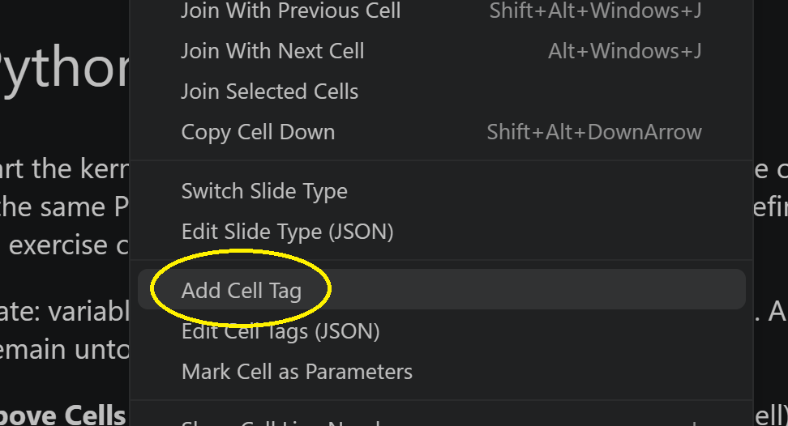
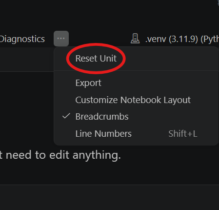

# Authoring a QDK Learning course

A course is a folder of Jupyter notebooks and a `course.json` manifest, placed under
`qdk-learning/courses/` in a VS Code workspace.

This is a proposal. The design is still moving, so some of it will change. The steps below work
today.

Every example comes from the
[sample course](source/vscode/test/suites/learning/test-workspace/qdk-learning/courses/circuit-diagrams-new)
in this repo.

## Getting started

1. Copy that folder into `qdk-learning/courses/`, and rename it.
2. Delete `.venv/`, `__pycache__/`, and any `*.workbook.ipynb` from the copy.
3. Change `id` and `title` in `course.json`.
4. Click the **Microsoft Quantum** icon in the Activity Bar and press **Start learning**.

**Start learning** writes `qdk-learning.json` at the root of your workspace folder, which marks it
as a learning workspace.

The **Learning** tree view opens on **Quantum Katas**, the Q# course built into the extension. Run
**QDK Learning: Switch Course** to reach yours, then pick a unit to open its notebook.

The course environment is built the first time you open the course, which takes several minutes.
Wait for it to finish before running any cells.

Each notebook is copied to a `*.workbook.ipynb` beside it. Learners work in the copy; your
original is never modified.

## Files

```
qdk-learning/courses/
├── circuit-diagrams-new/    the sample in this repo
└── my-course/               your renamed copy
    ├── course.json          course id, title, and units
    ├── README.md            course landing page
    ├── requirements.txt     installed into the course environment
    ├── _course_lib.py       exercise harness, shared by every unit
    ├── _check_env.py        environment check
    ├── 01-intro/
    │   ├── _unit.py         this unit's exercise registrations
    │   └── intro.ipynb
    └── 02-circuits/
        ├── _unit.py
        └── circuits.ipynb
```

- One notebook per unit folder. Folder names are arbitrary; the extension reads `course.json`.
- `.venv/`, `__pycache__/`, and `*.workbook.ipynb` are generated, and are recreated as needed.
- A `*.workbook.ipynb` is never overwritten once it exists, so a copied one leaves the learner
  with someone else's stale notebook.

## course.json

```json
{
  "schemaVersion": 1,
  "id": "circuit-diagrams",
  "title": "Generating Circuit Diagrams",
  "shortDescription": "Build and visualize quantum circuits with the QDK in Python notebooks.",
  "units": [
    { "id": "intro", "title": "Getting Started", "dir": "01-intro" },
    { "id": "circuits", "title": "Circuit Diagrams", "dir": "02-circuits" }
  ]
}
```

- `schemaVersion`: set to `1`.
- `id`: required. Unique across the courses a learner has installed. `katas` is taken by the
  built-in course.
- `title`: required.
- `shortDescription`: optional. Shown in the course list.
- `units`: each needs `id`, `title`, and `dir`.
- Progress is keyed on the course `id`, the unit `id`, and the exercise's function name. Rename
  `dir` and reword `title` freely; changing any of those three resets anyone partway through.
- Reload the window after editing `course.json`.

## Cell tags

Right-click a cell and choose **Add Cell Tag**.

<div align="center">
  
</div>

<div align="center">

| Tag | Cell type | The learner sees | The AI can fetch |
| --- | --- | --- | --- |
| untagged | any | yes | no |
| `exercise` | code | yes, and edits it | their attempt |
| `hint` | markdown | on request | yes |
| `solution` | code | on request | yes |
| `explanation` | markdown | on request | yes |

</div>

- Tagged cells attach to the nearest `exercise` cell above them, in any order.
- Any number of hints and solutions; one explanation per exercise.
- The markdown cell above an exercise titles it in the tree. The last heading wins, and a leading
  `Exercise:` is stripped.
- A rejected `exercise` cell takes everything tagged below it with it.
- Write each to stand alone. A model paraphrases them in chat, so "as shown above" won't work.

## Exercises

An exercise is a function name, registered in `_unit.py` and decorated in the notebook. That name
is also its id in the tree and in saved progress.

Register a checker in the unit's `_unit.py`:

```python
register_value_exercise("forty_two", expected=42)
```

Decorate a function of that name in a cell tagged `exercise`:

```python
from _unit import exercise


@exercise
def forty_two():
    # ========================================================================
    # YOUR TASK: change the expression below so forty_two() returns 42.
    # ========================================================================
    return qsharp.eval("0")  # <-- edit this expression
```

Running the cell calls the checker registered under `forty_two`, and marks the exercise complete
unless it raises.

- Make your checker raise on a wrong answer. One that prints an error and returns marks the
  exercise complete anyway.
- Don't rename the function. The harness tells learners to change it back, and anyone partway
  through loses their progress on it.

## `_course_lib.py`

The sample's exercise harness. Copy it as-is or write your own. It isn't part of the extension.

- `register_value_exercise(name, expected=...)`: returned value must equal `expected`.
- `register_exercise(name, validate, success_message=..., on_success=...)`: `validate` returns an
  HTML error string, or `None` if correct. `on_success` renders a widget or diagram.

## `_unit.py`

The sample keeps one per unit. It puts the course root on `sys.path`, re-exports what the notebook
needs, and registers the unit's exercises. Nothing in the extension reads it.

```python
"""Unit helpers — course-infrastructure imports for the notebook."""

import sys
from pathlib import Path

_course_root = str(Path(__file__).resolve().parent.parent)
if _course_root not in sys.path:
    sys.path.insert(0, _course_root)

# Re-export only the course meta-helpers — not the QDK product API.
from _check_env import check as check_env  # noqa: E402, F401
from _course_lib import (  # noqa: E402, F401
    exercise,
    register_value_exercise,
)

# Register this unit's exercises.
register_value_exercise("forty_two", expected=42)
```

- `parent.parent` assumes units sit one level below the course root.
- Wrap `register_exercise` in a helper when you check the same kind of thing repeatedly. The
  sample's `register_circuit_exercise` does this.

## Environment

- Put dependencies in `requirements.txt` at the course root. They install into `<course>/.venv`.
- List modules to verify in the manifest:
  `"environment": { "importChecks": ["qdk", "qdk.widgets"] }`.
- Learners need the Python and Jupyter extensions. The course prompts for them.
- Re-export `_check_env.check` from `_unit.py` and call it from each unit's first code cell:

```python
from _unit import check_env

check_env()
```

## Editing and re-testing

Edit your own notebook, never the `*.workbook.ipynb`. The workbook is generated once, so your
edits will not appear in it.

To pick them up, run **QDK Learning: Reset Unit** from the notebook's overflow menu. It rewrites
the workbook from yours and clears the unit's progress.

<div align="center">
  
</div>

## Checking your course

Save the notebook first. Tags reach disk only on save, and the course is scanned when the
**Learning** tree view opens.

Work through your course from the tree and confirm:

- every exercise appears in the tree
- hints and solutions are reachable from chat and the cell status bar
- a wrong answer does *not* mark the exercise complete
- the **Q#** output channel names anything that was skipped

