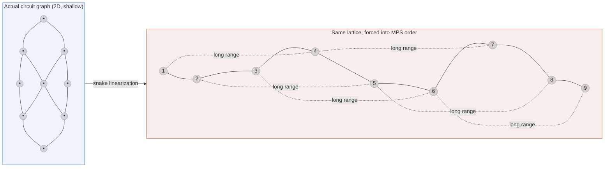
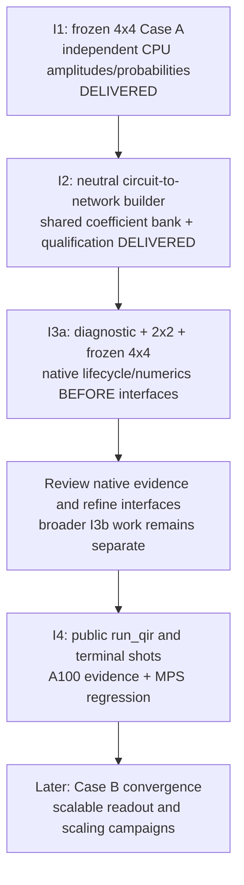

# Simulating the qdk-chemistry 2D Ising demo

This document records the general-contraction objective and its independently reviewed
iterations. **I1 has a retained 4x4 input and independent CPU state reference;
I2 builds and qualifies its neutral tensor network and coefficient bindings;
I3a's diagnostic and 2x2 cases pass natively; 4x4 awaits a larger-workspace retry;
the public A100 milestone is not implemented.**
It sits next to [`DEMO.md`](../mps_trotter_quench_demo/DEMO.md) the way a successor demo
sits next to the one it builds on, and it follows the same iteration discipline as
[`README.md`'s "Next Integration Iteration"](../../../source/simulators/src/execution/README.md#next-integration-iteration)
— this is the _next_ iteration after that one.

|                               |                                                                                                                                                                                       |
| ----------------------------- | ------------------------------------------------------------------------------------------------------------------------------------------------------------------------------------- |
| Reference case                | [`estimation_ising_2d.ipynb`](https://github.com/microsoft/qdk-chemistry/blob/ec194789d7021cb53f1b2a62f00d8632c4ce13f7/examples/estimation_ising_2d.ipynb), `microsoft/qdk-chemistry` |
| What that notebook does today | Fault-tolerant **resource estimation** of a Trotterized 2D Ising quench. It builds the circuit, it never simulates it.                                                                |
| What this document scopes     | Actually **classically simulating** that circuit (or a size-reduced version of it), to validate correctness and to explore how hard it can be made.                                   |
| Prior art this builds on      | [`DEMO.md`](../mps_trotter_quench_demo/DEMO.md) — 1D MPS execution, same execution layer, same public API shape                                                                       |
| Status                        | I1 input/reference and I2 builder qualification delivered below. I3a/I3b and I4 remain separate implementation/review units.                                                                                                |

## I3a bounded native numerical experiment

The approved order is **numerical end-to-end evidence before common
plan/optimizer/executor interfaces**. The reusable private cuTensorNet path is
implemented through the actual I2 builder and its immutable shared-buffer bank.
The diagnostic and 2x2 each passed two native A100 contractions, with byte-identical
repeated readbacks and amplitude/norm/probability errors below `1e-12`. The 4x4
case was rejected before contraction because its selected path required about
2.04 GiB of scratch, exceeding the original 64 MiB ceiling. Its retry is pending;
kernel tracing is deferred.

| Case | Circuit | Output | Numerical limit |
| --- | --- | --- | --- |
| Asymmetric diagnostic | 3 qubits, idle q1; Rx(0.7,q0), Rx(0.7,q2), Rzz(0.41,q0,q2), Rx(-0.3,q0), Rzz(0.41,q2,q0), Rx(0.29,q2) | 8 amplitudes | `1e-12` |
| 2x2 Case A | Open row-major grid; J=1, h=0.5, time=1, order 4, two subdivisions, identity preparation; 48 Rx + 40 Rzz | 16 amplitudes | `1e-12` |
| Frozen 4x4 Case A | Unchanged I1 input; 192 Rx + 240 Rzz | 65,536 amplitudes (1 MiB) | `1e-8` |

Every limit applies independently to maximum complex-amplitude absolute error,
probability total variation and squared-norm error. Values must be finite.
There is no global-phase alignment or amplitude normalization; probabilities
are normalized only after both vectors' squared norms pass.
Output order is q0 least significant/first tensor axis fastest.

`fixtures/i3a_numerical/` retains exact f64 gate-angle bits, the diagnostic and
2x2 CPU arrays, and hashes/provenance. Its 4x4 adapter references the existing I1
array without replacing it. `i3a_reference.py` reuses the released QDK sparse
engine and the existing recipe/conversion/reference machinery, independently of
the new contractor; the diagnostic also has the phase-sensitive I2 analytic
cross-check. Reproduce checks in the existing pinned reference environment:

```sh
.venv-ising-i1/bin/python samples/python_interop/ising2d_tensor_network_demo/i3a_reference.py verify \
  samples/python_interop/ising2d_tensor_network_demo/fixtures/i3a_numerical
.venv-ising-i1/bin/python -m pytest -q \
  samples/python_interop/ising2d_tensor_network_demo/test_i3a_reference.py
```

Each case optimizes once, exports owned metadata, closes source owners, imports
into a fresh network without search, prepares and contracts twice with overwrite
semantics and no intervening output clear. The separate
`--contraction-qualification` validator selector stops before larger cases on
failure. Search uses one sample/thread, seed 17, no reconfiguration, deferred
rank simplification or automatic slicing, and a 64 MiB optimizer constraint.
Separately, device-scratch limits are 64 MiB for diagnostic/2x2 and **3 GiB for
4x4**; the host-scratch limit remains 1 MiB for all cases,
allocating minima (256-byte device floor), disabling caches, and using no
autotuning or memory pool. Unique inputs/output are separately accounted;
there is **no total GPU-memory cap**. See the
[native numerical contract](../../../source/cutensornet/README.md#private-general-network-numerical-execution)
for ownership, cleanup and evidence requirements.

This includes one bounded frozen 4x4 run in I3a, not a broader I3b campaign.
Native source-build provenance, retained numerical readbacks, resource reports
and cleanup remain acceptance gates. The observed 4x4 budget rejection is retained
as a host regression through the production owner; the larger native ceiling
does not relax that guard. Nsight tracing and performance analysis are later work.
Common interfaces and I4 public `run_qir`/sampling stay paused.

## I1 retained input and CPU reference

The fixed case is **4x4, J=1, h=0.5, time=1, Trotter order 4, two subdivisions,
identity preparation**. The existing generator is the chemistry decoupling boundary;
neither the reference replay nor the future TN runtime needs chemistry once the input
is frozen. The oracle uses the released `qdk==1.32.3` CPU sparse engine, not a native
extension built from this worktree.

```text
1. Existing chemistry recipe -> one ordered Case A gate body
                                      |
2.                                    +-> measured Q# -> Base QIR
                                      |                   |
                                      |             future TN input
3.                                    +-> same Q# with pre-measurement DumpMachine
                                                          |
4.                                                 SparseStateSim
                                                          |
5.                                            bit conversion -> amplitudes/probabilities
```

`qsharp_source` emits both forms from the same gates; the diagnostic is inserted
at construction, immediately before `MResetEachZ`. There is no second circuit
implementation, QIR state-observation API, TN builder, or NVIDIA dependency.
The existing QDK `AggregateGatesPass` independently checks **every gate, angle,
operand and sequence position** in both the original chemistry QIR and measured
QIR against that body. A separate structural check admits only a single straight-line
entry block, initialization, the expected gates, and the terminal output sequence.

The pinned generator produces **192 Rx + 240 Rzz = 432 gates**. Its actual lattice
is **open in both directions, row-major `q = y*nx + x`, with 24 undirected bonds
of weight 1 and no DFS reordering**. The full adjacency and coloring are retained,
not inferred from a drawing. The measured Base compiler emits 16 `m__body` calls
(terminal resets are eliminated) and one result array ordered `q0` through `q15`.

The coefficient check uses the hand-derived fourth-order Suzuki composition:

$$
p = \frac{1}{4-4^{1/3}},\quad
S_4(\Delta) = S_2(p\Delta)^2 S_2((1-4p)\Delta) S_2(p\Delta)^2,\quad
\Delta = \tfrac12.
$$

Each symmetric `S2(s)` has half-field `Rx(h*s)` layers around the commuting
bond layer `Rzz(2*J*s)`. Adjacent field layers within a subdivision combine.
Tests check this layer order, all sites/bonds and positive/negative coefficients
at 2x2 and 4x4, rather than merely summing angles.

### Artifacts and numerical contract

All retained files are under [`fixtures/case_a_4x4/`](fixtures/case_a_4x4/):

| File                         | Meaning                                                                                                                   |
| ---------------------------- | ------------------------------------------------------------------------------------------------------------------------- |
| `unmeasured.ll`              | Original chemistry QIR; generation provenance, not the runtime input                                                      |
| `measured.qs`, `measured.ll` | Frozen measured Q# and verified Base-QIR execution input                                                                  |
| `reference.qs`               | Same gate body, with exactly one dump before terminal measurement                                                         |
| `amplitudes.npy`             | NumPy array of 65,536 little-endian complex-f64 amplitudes (`<c16`), 1 MiB payload plus header                            |
| `probabilities.npy`          | NumPy array of 65,536 little-endian f64 probabilities (`<f8`), 512 KiB payload plus header                                |
| `provenance.json`            | Parameters, actual lattice, package/native-binary and script hashes, source base commit, formats and artifact hashes      |
| `validation.json`            | Conversion accounting, norm, two-seed state repeatability, measured generation/reference time, and explicit I1-only scope |

The source base commit plus script hashes identify the source used during generation;
they do not claim the scripts were unchanged from that commit. Regeneration records a
new time/provenance report and refuses to overwrite an existing artifact directory.
NumPy's `.npy` headers embed shape, dtype and byte order without changing the
floating-point values. The repository's scoped binary Git attributes prevent
line-ending normalization from changing these files; their staged bytes are
hash-checked too.

Q# state dumps put `q0` at the most significant bit. The adapter reverses basis bits
to agree with the planned first-axis-fastest TN output:

$$
k = \sum_{q=0}^{15} b_q 2^q,\qquad
Z = \sum_k |\psi_k|^2,\qquad
p_k = |\psi_k|^2/Z.
$$

All values must be finite and `abs(Z-1) <= 1e-8` **before** normalization.
Analytic signed-Rx, Rzz phase, nonadjacent interference and asymmetric-qubit checks
use absolute error `1e-12`. Repeated reference executions and frozen-state replay
must agree to maximum complex-amplitude error and probability total-variation
distance `<= 1e-12`, without global-phase alignment. The recorded candidate limits
for later TN comparison are `1e-8` for both metrics; no TN comparison has run yet.

The retained squared-norm error is **6.66e-15**; the two pre-measurement states
(seeds 42 and 17) agree exactly on the recorded host. These seeds exercise reference
repeatability, not the later public-shot sampling contract. Sparse simulation has
its existing floating-point/pruning policy; this is not an exact-arithmetic oracle.
No post-reset state or shot histogram is substituted for the numerical reference.

### Reproduction

From the repository root, using Python 3.11 on the qualified aarch64 host:

```bash
python3.11 -m venv .venv-ising-i1
.venv-ising-i1/bin/python -m pip install -r samples/python_interop/ising2d_tensor_network_demo/requirements-reference.txt
.venv-ising-i1/bin/python samples/python_interop/ising2d_tensor_network_demo/reference.py verify \
  --input samples/python_interop/ising2d_tensor_network_demo/fixtures/case_a_4x4
.venv-ising-i1/bin/python -m pytest -q samples/python_interop/ising2d_tensor_network_demo/test_reference.py

# Optional regeneration into a NEW directory; never overwrite the frozen input.
.venv-ising-i1/bin/python samples/python_interop/ising2d_tensor_network_demo/reference.py generate \
  --output .venv-ising-i1/regenerated-case-a
```

To replay without chemistry, install only `qdk==1.32.3`, `pyqir==0.12.5` and
`numpy==2.3.5` in a separate environment, then run the same `verify` command.
This path rechecks hashes and conversion, recompiles the retained Q#, and recomputes
the state on CPU; it never imports chemistry. It is exercised in a chemistry-free
environment as part of I1. The full test suite additionally needs `pytest` and
chemistry for the two generator tests.

Read either array with `numpy.load(path, allow_pickle=False)`; its dtype and
shape are self-describing and checked by `verify`. The retained QIR is also admitted by the public CPU `run_qir` route;
that check establishes input/output shape only, not the amplitude oracle.

---

## I2 neutral network and shared coefficient buffers

I2 delivers `qdk_simulators::execution::CircuitTensorNetwork`, not a numerical
backend or new `run_qir` selector. The builder receives a resolved
`QuantumEvolutionRegion` plus its qubit count; it knows nothing about Ising
parameters or chemistry. `qdk_simulators` now depends on the unchanged,
shapes-only `tensornet` crate. MPS and vendor code are unchanged.

```text
1. Frozen measured.ll -> existing AdaptiveProfilePass
2. Existing native conversion -> PreparedAdaptiveProgram
3. AdaptiveExecution::ExecuteRegion -> neutral builder
4. TensorNetwork + immutable buffer bank + node-to-buffer bindings
5. ContractionQuery keeps every final qubit axis
   STOP: no contraction, measurements or samples
```

Initial zero states share `[1,0]`. Rx is a dense factor with axes
`[output,input]`; it creates a fresh wire index. Rzz is a diagonal factor with
axes `[current(q1),current(q2)]`, sharing those indices across the gate:

$$
R_x(\theta)=
\begin{pmatrix}
\cos(\theta/2)&-i\sin(\theta/2)\\
-i\sin(\theta/2)&\cos(\theta/2)
\end{pmatrix},
\qquad
D_{ZZ}(\theta)[a,b]=e^{-i\theta(-1)^{a+b}/2}.
$$

The owner exposes `network()`, `buffers()`, `node_buffer_ids()` and
`output_axes()`. Tensor node `v` uses
`buffers()[node_buffer_ids()[v]]`; the buffer length equals the node's
`Indices::element_count()`. All values follow `Indices::offset_of` and
`strides()`: column-major, first axis fastest. Final axes are ordered
`q0` through `q15`, with `k = sum(b[q] * 2^q)`, matching I1.
`query()` borrows the network; the owner contains no self-reference.

Repeated gates of the same kind and **exact f64 angle bits** share immutable
coefficient storage even when their wire identities differ. Different gate
kinds never alias merely because they have the same buffer length. There is
no approximate matching, mutable scratch-buffer reuse, gate fusion or
device-buffer allocation. The supported gates are I, Rx and Rzz; I is a
validated no-op. Invalid operands, repeated Rzz operands, nonfinite angles and
wire-count overflow return explicit errors. An empty region retains its
zero-state boundaries; zero qubits and no gates describe the scalar one.
Building a network does not allocate its dense amplitude output.

For the unchanged frozen input, qualification establishes:

| Surface | Result |
| --- | --- |
| Gate accounting | Every one of 192 Rx and 240 Rzz gates checked against the existing QDK QIR collector, including coefficients, operand order and wire versions |
| Network | 448 nodes: 16 initial boundaries and 432 gate factors; 208 distinct dimension-two indices |
| Buffer bank | 6 immutable buffers containing 22 complex-f64 values, **352 coefficient bytes**; excludes graph/binding storage and future device/workspace allocations |
| Query | 16 ordered final axes; 65,536 output elements; 160 legal hyperedges; no marginalized wires |
| Numerical qualification | Tiny built networks contracted by NumPy `einsum`, compared against signed/phase-sensitive analytic values with absolute error `1e-12`, no global-phase alignment |
| Coverage | 12 public Rust API tests and 20 Python qualification cases; buffer size, values, sharing, ownership, invalid inputs, nonadjacent/asymmetric cases and frozen-QIR construction |

The private `_tensor_network_build_probe` exports copies of actual builder
data for those tests. It uses the existing preparation/command APIs, admits
one leading region in one block, and stops before measurement without
fabricating outcomes. It is not a full-program validator; I1 separately
qualifies the frozen terminal suffix. Tiny numerical evaluation is bounded
to 12 distinct binary indices and uses NumPy, not a new CPU contractor.
The **full 4x4 network has not been contracted or compared numerically with
the CPU reference**. Those are I3b acceptance gates.

### I2 reproduction

From the repository root, using the existing development environment with
Maturin, PyQIR, NumPy and pytest (and `patchelf` for Linux wheel RPATH setup):

```bash
cargo fmt -p qdk_simulators -p qdk -- --check
cargo test -p qdk_simulators --no-default-features --test tensor_network
cargo test -p qdk_simulators --no-default-features --lib execution
cargo clippy -p qdk_simulators -p qdk --all-targets -- -D warnings

PATH="$PWD/source/qdk_package/.venv/bin:$PATH" \
VIRTUAL_ENV="$PWD/source/qdk_package/.venv" \
source/qdk_package/.venv/bin/python -m maturin develop --release \
  --manifest-path source/qdk_package/Cargo.toml
source/qdk_package/.venv/bin/python -m pytest -q \
  samples/python_interop/ising2d_tensor_network_demo/test_tensor_network.py

# Keep I1's pinned reference environment separate from the development build.
.venv-ising-i1/bin/python -m pytest -q \
  samples/python_interop/ising2d_tensor_network_demo/test_reference.py
```

No fixtures are regenerated or modified by I2. Host qualification needs no
GPU and does not establish an optimizer path, treewidth, contraction cost,
GPU buffer lifecycle, full-size numerical agreement or terminal-shot behavior.

## 1. The physical problem

The notebook simulates a 2D transverse-field Ising model on an `N×N` square lattice:

$$
H = \underbrace{J \sum_{\langle i,j \rangle} Z_i Z_j}_{\text{ZZ bonds, 2D grid}} \;+\; \underbrace{h \sum_i X_i}_{\text{transverse field}}
$$

Here $i$ and $j$ are site labels (flattened over the whole `N×N` lattice), not row/column
coordinates. $\langle i,j \rangle$ is the standard shorthand for "sum over nearest-neighbor pairs" —
an edge of the lattice graph, horizontal or vertical alike — and $i$ in the second sum ranges over
every site individually.

```text
      o───o───o───o     o = qubit
      │   │   │   │     ─ / │ = ZZ coupling (J)
      o───o───o───o     each o also feels a transverse field h·X
      │   │   │   │
      o───o───o───o     10×10 in the notebook → 100 qubits
      │   │   │   │
      o───o───o───o
```

The notebook's default point is `J=1.0, h=0.5` — deep in the ordered phase. The 2D square-lattice
quantum critical point is at **$h_c/J \approx 3.044$**. Sweeping `h` toward $h_c$ is the knob that makes
this genuinely hard: correlation length diverges, and entanglement generated per unit of simulated
time grows with it. That is the "critical fan" referred to in the objective below.

## 2. Why no existing QDK simulator reaches it

| Simulator                                                                                                         | Outcome                                   | Reason                                                                                                                                                              |
| ----------------------------------------------------------------------------------------------------------------- | ----------------------------------------- | ------------------------------------------------------------------------------------------------------------------------------------------------------------------- |
| Dense CPU/GPU statevector                                                                                         | ✗                                         | Caps at ~25 qubits (measured, [`DEMO.md` §2.2](../mps_trotter_quench_demo/DEMO.md#22-the-dense-wall-measured)). 100 qubits is `2^100` amplitudes regardless of `h`. |
| Sparse simulator                                                                                                  | ✗                                         | The transverse field is a generic non-Clifford rotation; the state densifies almost immediately.                                                                    |
| Clifford simulator                                                                                                | ✗                                         | `Rx(hΔt)`/`Rz(JΔt)` at generic angles are not Clifford gates, at any `h`.                                                                                           |
| cuTensorNet **MPS** (this repo's current backend, [`execution.rs`](../../../source/cutensornet/src/execution.rs)) | ⚠ possible but structurally disadvantaged | It is a 1D ansatz. A 2D lattice must be linearized (snake ordering) before it fits, which turns every "vertical" bond into a long-range MPS gate — see §3.          |

None of the shipped backends are disqualified _by criticality specifically_ — dense/sparse/Clifford
fail from qubit count and gate type alone, before `h` even matters. MPS is the only one where `h`
changes the answer, and only as a second-order effect on top of a first-order problem.

**The `type="gpu"` (wgpu) path is narrower than the CPU one, by a hardcoded constant.** Worth
stating precisely, because "we have an A100, so the GPU simulator should reach further" is the
natural assumption and it is wrong:

```rust
// source/simulators/src/gpu_full_state_simulator/shader_types.rs:14
pub const MAX_QUBIT_COUNT: i32 = 27; // 2^27 * 8 bytes per complex32 = 1 GB buffer limit
```

That is a compile-time ceiling of **27 qubits at single precision** (`complex32`), set by a buffer
binding limit rather than by device memory — so an A100 with 80 GB gets exactly the same 27 as any
laptop iGPU. The CPU statevector has no equivalent constant (it is RAM-bound, at double precision),
which makes wgpu strictly _narrower_ than CPU here, corroborating
[`DEMO.md` §"Terminology hazard"](../mps_trotter_quench_demo/DEMO.md). Against the target sizes:

| Lattice                | Qubits | wgpu `type="gpu"` (cap 27) | MPS / exact TN                      |
| ---------------------- | ------ | -------------------------- | ----------------------------------- |
| 4×4                    | 16     | Within width limit         | First TN qualification target       |
| 5×5                    | 25     | Within width limit         | Not qualified                       |
| 6×6                    | 36     | Beyond width limit         | Not qualified; full output is 1 TiB |
| 10×10 (notebook scale) | 100    | Beyond width limit         | Later, unqualified                  |

This is a _structural_ limit, not a resource one, so it is demonstrable by source citation on any
host — no GPU, and no Vulkan/ICD install, is needed to establish it. (Recorded because the
development host used for this work runs a headless NVIDIA driver with no Vulkan ICD, so
`type="gpu"` cannot be exercised there at all; installing the graphics userspace would only
reproduce the same 27, so it is deliberately not a prerequisite for any step below.)

## 3. Why this is a poor fit for MPS, and what fits instead



Every dashed edge above is a lattice bond that becomes long-range after
linearization. Such gates can increase bond dimensions across chain cuts,
depending on the evolving state. This structural disadvantage is not itself
an entanglement lower bound or a runtime measurement.

The frozen Case A recursively composes five second-order steps per subdivision,
then repeats twice. The actual retained input has **12 field layers and 10
commuting-bond layers, totaling 432 gates**. The earlier estimate of roughly
80 grouped blocks was not a measurement of this frozen circuit and is superseded
by its explicit schedule.

**What actually fits:** a **general/exact tensor-network contraction** of the true 2D circuit
graph — no forced linearization, no MPS bond-dimension truncation. For a circuit this shallow, cost
tracks the contraction treewidth of the real gate graph, not an artificially imposed 1D bond
dimension. This is not the same algorithm family as PEPS (which adds boundary-MPS truncation for
deep/ground-state problems); it's closer to the exact contraction technique used for shallow
random/structured circuits at scale. cuTensorNet ships the primitives for this (path
optimization + slicing + execution over arbitrary topology) but the QDK integration only calls its
MPS-specific `cutensornetStateFinalizeMPS` path today ([`library.rs`](../../../source/cutensornet/src/library.rs),
[`execution.rs`](../../../source/cutensornet/src/execution.rs)) — there is no PEPS-shaped ansatz to reach for either way; cuTensorNet
does not ship one.

## 4. Two circuit shapes, one target — convergence evidence

Independent of the contraction backend, the notebook's own Trotter builder gives us two circuits
that should agree, to within stated Trotter error, on the same physics:

|                             | Construction                                        | Shape                                                             |
| --------------------------- | --------------------------------------------------- | ----------------------------------------------------------------- |
| Case A (as in the notebook) | `order=4, num_divisions=2`                          | Frozen 4x4: 12 field layers + 10 commuting-bond layers, 432 gates |
| Case B ("standard")         | `order=1, num_divisions=N` (from `target_accuracy`) | Many simple repeated layers, structurally like the 1D demo        |

Both approximate the same $e^{-iHt}$ at $t=1$, but they are different finite
circuits. Their agreement as subdivision counts increase is convergence evidence,
not an independent backend oracle: shared implementation errors can affect both.
The first backend check compares Case A's identical circuit against the independent
CPU state above. Case B is a later comparison, not an I1 prerequisite.

## 5. Objective

Run **4x4 Case A through the real `run_qir` entry point on A100**, using generic
cuTensorNet path optimization and contraction, returning ordered terminal shots
and agreeing with the independent CPU numerical reference for the same circuit.
The bounded first readout is all 65,536 complex-f64 amplitudes, then probabilities
and samples. The 1 MiB output does not include contraction workspace.

Exact contraction means no MPS truncation of the finite Trotter circuit, not exact
Hamiltonian evolution or zero floating-point error. A 6x6 full amplitude output
alone needs 1 TiB; scalable readout is a separate decision. This adds a new consumer
and must preserve existing MPS behavior. A/B convergence and larger scaling/field
campaigns follow the first milestone.

## 6. Iteration plan

Each iteration is independently evidenced before the next begins, following the same discipline as
[`README.md`'s "Next Integration Iteration"](../../../source/simulators/src/execution/README.md#next-integration-iteration).



1. **I1: input and reference.** Delivered above. Keep the original generator,
   measured Base-QIR input, same-circuit pre-measurement CPU state and bit-order
   contract. This is not an A100 result.
2. **I2: neutral network/data builder.** Delivered above using
   `QuantumEvolutionRegion`, `UnitaryOperation`, `Index`, `Indices`,
   `TensorNetwork` and `ContractionQuery`. Coefficients remain in an immutable
   shared bank outside the shapes-only crate. Boundaries, bindings, axis order,
   connectivity and small analytic contractions are qualified. No optimizer
   or cost estimate is included.
3. **I3a then I3b: native contraction.** First qualify native path metadata
   on tiny asymmetric networks through the reusable
   [native topology/metadata owner](../../../source/cutensornet/README.md#private-general-network-metadata).
   Metadata qualification is accepted. Next, run the bounded diagnostic, 2x2
   and frozen 4x4 numerical experiment described above **before** defining common
   interfaces. Its private implementation is retained, not throw-away code.
   Use the resulting native evidence and earlier cross-tool analysis to refine
   those interfaces, then review before proceeding. Reuse the existing
   bindings/resource owners; do not substitute the MPS State API.
4. **I4: public integration.** Add only the needed shared batch/sampling and public
   wiring. Evidence must include the real A100 `run_qir` route, ordered terminal
   results, seeded repeatability, distributional correctness and MPS regression.
   Before public wiring, implement the [per-execution consumer guard](../../../source/simulators/src/execution/README.md#required-i4-consumer-guard):
   reject a second evolution region, including the same region ID revisited,
   and quantum evolution after measurement, before reinitializing from zero.
   Behavioral checks must cover these failures and successful fresh independent
   executions through the actual consumer/execution route. This guard is an
   explicit acceptance requirement, not functionality delivered by I2.
5. **Later comparisons/scaling.** Case B, scalable readout and larger campaigns
   follow the reviewed milestone. At fixed topology, changing `h` changes tensor
   values, not the graph of a shapes-only path optimizer.

## 7. Open questions / risks

- **Grouping is recorded, not assumed.** The frozen lattice's edge coloring and
  the actual Suzuki gate schedule are retained. Historical 10x10 group-count
  observations do not define the gate count or cost of this 4x4 input.
- **Topology is not cost evidence.** I2 qualifies the concrete circuit graph,
  not treewidth or a contraction path. Optimizer/path and workspace evidence
  belong to I3; shallow depth alone does not establish feasibility.
- **Feedforward is out of scope, and that's fine here.** The existing MPS consumer rejects
  mid-circuit measurement with feedforward ([`execution.rs`](../../../source/cutensornet/src/execution.rs), tested explicitly).
  The Trotter quench circuit has none — measurement happens once, at the end — so this limitation
  does not apply to this case and does not need to be solved as a prerequisite.
- **Gate coverage is already present for MPS.** `Rzz` was added in `791a64b5b`;
  it is not an I1 prerequisite to reimplement. The fixed input uses only `Rx`/`Rzz`.
  I2 now supplies separate general-TN Rx/Rzz factors; it does not reuse State API buffers.
- **No profile relaxation is needed.** The original chemistry QIR has no
  measurements and is tagged Adaptive, but the existing generator recompiles
  the measured Q# under `TargetProfile.Base`. I1 verifies that tag. Genuine
  feedforward, noise and broad MPS refactoring remain outside this milestone.

## 8. External validation

An informal Teams comment from a `qdk-chemistry` team member (2026-09-08), on the 1D
[`DEMO.md`](../mps_trotter_quench_demo/DEMO.md), independently confirmed two claims this document
relies on, and offers a path that changes iteration 1's plan of record:

> This is a good start - 1D has an analytical solution. 2D is canonically hard for MPS. Depending
> on the parameterization. If you take J=1 and h=3.03, that's the quantum critical point on a
> square lattice. Moving away from that will make the problem easier.
>
> Per the above - you don't need to stand up these circuits yourself. They're in QDK-chemistry. If
> you'd like a run through, let me know.

- **2D-is-hard-for-MPS (§3)** and the **critical point** (`h_c=3.03` at `J=1`, matching this
  document's cited $h_c/J \approx 3.044$) are now independently corroborated, not derived from this
  document's reasoning alone.
- **Circuit construction**: this does not change iteration 1's plan, which already called for
  using `qdk_chemistry`'s own builders rather than a hand-rolled generator (§6, item 1). It does
  mean the fastest path to an unblocked iteration 1 is likely a walkthrough with that team, rather
  than reverse-engineering the builder settings from the notebook alone.

## 9. cuTensorNet API reference for §6 item 3

**Historical onboarding notes below are not new work instructions.** The generic
Network/contraction bindings, loader symbols and lifecycle owners already exist.
What remains is topology/data binding, actual optimization/contraction and native
qualification, not re-porting these declarations. I1 does not change this surface.

The general-contraction consumer needs cuTensorNet's path optimization, slicing
and arbitrary-topology execution, not the MPS-specific `State` API. The reference
below was checked against NVIDIA's version-pinned docs (not the
"latest" docs, which as of this writing resolve to a much newer, unrelated cuQuantum release —
see the version-pinning note below).

**Version pinning.** [`version.rs`](../../../source/cutensornet/src/version.rs)'s `POLICY` pins
this crate to cuTensorNet **2.13.0** (`cutensornet_runtime: 21_300`) and CUDA runtime **12.9**
(`cuda_runtime: 12_090`) — a hard equality check, not a minimum. `DEMO.md`'s Appendix A.3 records
that the Rust bindings were generated from the `cuquantum-linux-x86_64-26.06.0.17_cuda12-archive`
archive, i.e. cuQuantum SDK release **26.06.0** is the one that bundles cuTensorNet 2.13.0. NVIDIA's
docs are versioned by the SDK release, not the individual library version, so the correct reference
is `docs.nvidia.com/cuda/cuquantum/26.06.0/cutensornet/...` — _not_
`docs.nvidia.com/cuda/cuquantum/latest/...`, whose version-switcher metadata resolves to `26.06.0`
plus several releases (this changes over time; check `nv-versions.json` if revisiting this later).

**Current source of truth.** See the
[`cutensornet-symbols.txt` manifest](../../../source/cutensornet/scripts/cutensornet-symbols.txt),
[`bindings/v2_13.rs`](../../../source/cutensornet/src/bindings/v2_13.rs) and
[`ContractionResources`](../../../source/cutensornet/src/library/simulation/contraction.rs).
Declarations and lifecycle tests alone do not establish numerical execution.

**Reference call set for a first working (non-autotuned) general contraction.**
Confirmed against NVIDIA's reference example for this exact version
([`tensornet_example.cu`](https://github.com/NVIDIA/cuQuantum/blob/v26.06.0/samples/cutensornet/tensornet_example.cu),
linked from the [26.06.0 contraction-serial doc](https://docs.nvidia.com/cuda/cuquantum/26.06.0/cutensornet/examples/contraction-serial.html)).
Note this version uses a simplified **"Network"**-centric naming (`cutensornetCreateNetwork`,
`cutensornetNetworkAppendTensor`, ...) — generic web search results for cuTensorNet turn up an
older, more verbose `NetworkDescriptor`-style naming from earlier SDK releases; that older naming
does not apply to our pinned 2.13.0/26.06.0 combination and should not be used as a reference here.

| #   | Symbol                                                             | Purpose                                                             |
| --- | ------------------------------------------------------------------ | ------------------------------------------------------------------- |
| 1   | `cutensornetCreateNetwork` / `cutensornetDestroyNetwork`           | Create/destroy the network topology descriptor                      |
| 2   | `cutensornetNetworkAppendTensor`                                   | Register each input tensor's modes/extents                          |
| 3   | `cutensornetNetworkSetOutputTensor`                                | Declare the output tensor's modes                                   |
| 4   | `cutensornetNetworkSetAttribute`                                   | Set compute type (`CUTENSORNET_NETWORK_COMPUTE_TYPE`)               |
| 5   | `cutensornetCreateContractionOptimizerConfig` / `Destroy...`       | Optimizer config object                                             |
| 6   | `cutensornetContractionOptimizerConfigSetAttribute`                | e.g. hyper-sample count                                             |
| 7   | `cutensornetCreateContractionOptimizerInfo` / `Destroy...`         | Holds the resulting path                                            |
| 8   | `cutensornetContractionOptimize`                                   | The actual path-finder call                                         |
| 9   | `cutensornetContractionOptimizerInfoGetAttribute`                  | Query num slices, FLOP count, etc.                                  |
| 10  | `cutensornetWorkspaceComputeContractionSizes`                      | Size the workspace (reuses our existing `WorkspaceDescriptor` type) |
| 11  | `cutensornetNetworkPrepareContraction`                             | Prepare for execution                                               |
| 12  | `cutensornetNetworkSetInputTensorMemory` / `SetOutputTensorMemory` | Bind device buffers                                                 |
| 13  | `cutensornetNetworkContract`                                       | Execute the contraction                                             |
| 14  | `cutensornetCreateSliceGroupFromIDRange` / `DestroySliceGroup`     | Needed even for "contract everything" in one call (or pass `NULL`)  |

These symbols are already declared/loaded; the list describes the native execution
work still to qualify, not a new-symbol count or an effort estimate.

**Exact signatures**, extracted directly from the version-pinned
[26.06.0 function reference](https://docs.nvidia.com/cuda/cuquantum/26.06.0/cutensornet/api/functions.html)
(each confirmed by exact mangled-name-length match, not substring search — the naming has several
near-collisions in this API, e.g. `cutensornetCreateNetwork` vs. the _different, older_
`cutensornetCreateNetworkDescriptor`, and `cutensornetContractionOptimize` vs.
`cutensornetContractionOptimizerConfigGetAttribute`; a plain substring search would silently pick
the wrong one for either pair):

```c
cutensornetStatus_t cutensornetCreateNetwork(
    const cutensornetHandle_t handle,
    cutensornetNetworkDescriptor_t *networkDesc);

cutensornetStatus_t cutensornetDestroyNetwork(
    cutensornetNetworkDescriptor_t networkDesc);

cutensornetStatus_t cutensornetNetworkAppendTensor(
    const cutensornetHandle_t handle,
    cutensornetNetworkDescriptor_t networkDesc,
    int32_t numModes,
    const int64_t extents[],
    const int32_t modeLabels[],
    const cutensornetTensorQualifiers_t *const qualifiers,
    cudaDataType_t dataType,
    int64_t *tensorId);

cutensornetStatus_t cutensornetNetworkSetOutputTensor(
    const cutensornetHandle_t handle,
    cutensornetNetworkDescriptor_t networkDesc,
    int32_t numModes,
    const int32_t modeLabels[],
    cudaDataType_t dataType);

cutensornetStatus_t cutensornetNetworkSetAttribute(
    const cutensornetHandle_t handle,
    cutensornetNetworkDescriptor_t networkDesc,
    cutensornetNetworkAttributes_t attr,
    const void *const buffer,
    size_t sizeInBytes);

cutensornetStatus_t cutensornetCreateContractionOptimizerConfig(
    const cutensornetHandle_t handle,
    cutensornetContractionOptimizerConfig_t *optimizerConfig);

cutensornetStatus_t cutensornetDestroyContractionOptimizerConfig(
    cutensornetContractionOptimizerConfig_t optimizerConfig);

cutensornetStatus_t cutensornetContractionOptimizerConfigSetAttribute(
    const cutensornetHandle_t handle,
    cutensornetContractionOptimizerConfig_t optimizerConfig,
    cutensornetContractionOptimizerConfigAttributes_t attr,
    const void *buffer,
    size_t sizeInBytes);

cutensornetStatus_t cutensornetCreateContractionOptimizerInfo(
    const cutensornetHandle_t handle,
    const cutensornetNetworkDescriptor_t networkDesc,
    cutensornetContractionOptimizerInfo_t *optimizerInfo);

cutensornetStatus_t cutensornetDestroyContractionOptimizerInfo(
    cutensornetContractionOptimizerInfo_t optimizerInfo);

cutensornetStatus_t cutensornetContractionOptimize(
    const cutensornetHandle_t handle,
    const cutensornetNetworkDescriptor_t networkDesc,
    const cutensornetContractionOptimizerConfig_t optimizerConfig,
    uint64_t workspaceSizeConstraint,
    cutensornetContractionOptimizerInfo_t optimizerInfo);

cutensornetStatus_t cutensornetContractionOptimizerInfoGetAttribute(
    const cutensornetHandle_t handle,
    const cutensornetContractionOptimizerInfo_t optimizerInfo,
    cutensornetContractionOptimizerInfoAttributes_t attr,
    void *buffer,
    size_t sizeInBytes);

cutensornetStatus_t cutensornetWorkspaceComputeContractionSizes(
    const cutensornetHandle_t handle,
    const cutensornetNetworkDescriptor_t networkDesc,
    const cutensornetContractionOptimizerInfo_t optimizerInfo,
    cutensornetWorkspaceDescriptor_t workDesc);

cutensornetStatus_t cutensornetNetworkPrepareContraction(
    const cutensornetHandle_t handle,
    cutensornetNetworkDescriptor_t networkDesc,
    const cutensornetWorkspaceDescriptor_t workDesc);

cutensornetStatus_t cutensornetNetworkSetInputTensorMemory(
    const cutensornetHandle_t handle,
    cutensornetNetworkDescriptor_t networkDesc,
    int64_t tensorId,
    const void *const buffer,
    const int64_t strides[]);

cutensornetStatus_t cutensornetNetworkSetOutputTensorMemory(
    const cutensornetHandle_t handle,
    cutensornetNetworkDescriptor_t networkDesc,
    void *const buffer,
    const int64_t strides[]);

cutensornetStatus_t cutensornetNetworkContract(
    const cutensornetHandle_t handle,
    cutensornetNetworkDescriptor_t networkDesc,
    int32_t accumulateOutput,
    const cutensornetWorkspaceDescriptor_t workDesc,
    const cutensornetSliceGroup_t sliceGroup,
    cudaStream_t stream);

cutensornetStatus_t cutensornetCreateSliceGroupFromIDRange(
    const cutensornetHandle_t handle,
    int64_t sliceIdStart,
    int64_t sliceIdStop,
    int64_t sliceIdStep,
    cutensornetSliceGroup_t *sliceGroup);

cutensornetStatus_t cutensornetDestroySliceGroup(
    cutensornetSliceGroup_t sliceGroup);
```

The originally required opaque handle types (already declared) follow the same
opaque-pointer ownership pattern as `cutensornetHandle_t` and
`cutensornetWorkspaceDescriptor_t`: `cutensornetNetworkDescriptor_t`,
`cutensornetContractionOptimizerConfig_t`, `cutensornetContractionOptimizerInfo_t`, plus
`cutensornetSliceGroup_t`. The three `*Attributes_t` enums (`cutensornetNetworkAttributes_t`,
`cutensornetContractionOptimizerConfigAttributes_t`, `cutensornetContractionOptimizerInfoAttributes_t`)
are plain C enums (`int`-sized), set/read via the generic `SetAttribute`/`GetAttribute` +
`void*`/`sizeInBytes` pattern already used by `cutensornetStateConfigure` today — no new marshaling
idiom needed. `cutensornetWorkspaceComputeContractionSizes` and `cutensornetNetworkPrepareContraction`
both reuse `cutensornetWorkspaceDescriptor_t`, already onboarded.

**Historical optional follow-ons, not I1 work or priced estimates:**
`cutensornetCreateNetworkAutotunePreference` / `NetworkAutotunePreferenceSetAttribute` /
`NetworkAutotuneContraction` / `DestroyNetworkAutotunePreference` (lets cuTENSOR pick the best
kernel per pairwise contraction — a real perf win once we're running the same topology repeatedly,
e.g. across shots or across an `h`-sweep); and `cutensornetContractionOptimizerInfoSetAttribute` +
`cutensornetNetworkSetOptimizerInfo` (import a precomputed path instead of re-optimizing every
call — useful once path caching matters).

**Explicitly out of scope for this effort**, recorded here only so it isn't rediscovered from
scratch later:

- **Gradient computation**: `cutensornetNetworkSetGradientTensorMemory` / `SetAdjointTensorMemory`,
  `cutensornetComputeGradientsBackward` (experimental), and
  `cutensornetExpectationComputeWithGradientsBackward` (a gradient-aware extension of the
  `Expectation` API we already have). Relevant only if/when we want variational (VQE-style)
  optimization rather than one-shot sampling — not needed for §5's objective.
- **Mixed-state / density-matrix simulation**: `CUTENSORNET_STATE_PURITY_MIXED`,
  `cutensornetCreateMarginalDiagonal` and related marginal-distribution APIs — for noise/channel
  modeling. Our objective is exact contraction of a pure-state circuit; not needed.
- **Two-site `ProjectionMPS` family** (`cutensornetStateProjectionMPS*`, new in 2.13.0) — local
  sweep-style MPS updates for DMRG-like workflows; orthogonal to exact contraction.
- **Direct Tensor SVD/decomposition control**: `cutensornetTensorSVDConfigSetAttribute` (algorithm
  choice: GESVD/GESVDJ/GESVDP/GESVDR) and `cutensornetTensorSVDInfoGetAttribute` — finer control
  over truncation than our current `StateFinalizeMPS` path exposes. Only relevant to the MPS
  backend, not the exact-contraction consumer.
- **`cutensornetWorkspacePurgeCache`** — minor cache-management utility.
- **Distributed/multi-GPU (MPI) execution** — relevant only once a single A100 is the bottleneck;
  no evidence yet (§6, item 5 hasn't run) that it is.

**Historical onboarding approach (delivered, retained for context):** The general
State/MPS bindings were originally onboarded through a separate, heavier exploratory worktree
(`cutensornet-rust-ffi`) whose job was to remove architectural uncertainty — dynamic loading, ABI
versioning, opaque-handle ownership/`Drop` safety — before the "execution" side (this worktree)
could integrate. That uncertainty is now resolved and proven (this worktree's `lib.rs`/
`bindings/v2_13.rs` are, if anything, ahead of that worktree's current state). Onboarding the
Network/contraction family reuses the exact same dynamic-loading, same ABI file
(`bindings/v2_13.rs`, unchanged header version), and the same `Create`/`Destroy`-handle lifecycle
pattern already established for `State`/`Sampler` — it is incremental work on a settled
foundation, the same shape as the `Rzz` gate addition, not a new architectural spike. GPU
validation is human-in-the-loop either way (neither worktree has direct A100 access); routing
through a second worktree's bundle/evidence-tarball handoff would add coordination overhead
without adding safety.

**Discipline to follow**, matched to what every prior addition to this crate
(`f1257acf1`..`791a64b5b`) actually did, not assumed:

- **Narrow, single-purpose commits** — bindings added in a separate commit from the Rust logic
  that consumes them (e.g. `991904397` "Add cuTensorNet sampler bindings" was bindings-only;
  `7a539a55c` "Port cuTensorNet sampler execution" was the logic, as its own commit).
- **Explicit validation in every commit message** — concrete test counts (e.g. "88 qdk_cutensornet
  tests, 127 qdk_simulators tests") plus workspace `clippy`/`rustfmt` clean, not just "tests pass."
- **Explicit non-goals per commit** (e.g. `c3d151b54`: "Non-goals: ... A100 execution") — bounds
  scope so partial progress isn't mistaken for done.
- **Frozen-surface count bumped in the same commit that adds symbols**, with the before/after
  count named in the message (e.g. "grows from 25 to 30").
- **Cross-platform compile, Linux/x86_64-gated native loading** —
  `#[cfg(all(target_os = "linux", target_arch = "x86_64"))]` around the actual dynamic-loading/FFI
  code so the crate still builds and unit-tests on every host; only the real native calls are
  host-restricted.
- **Hardware acceptance exists at two levels, and both matter.** Checked directly by running the
  suite: `source/cutensornet/tests/availability.rs:4` is a Rust integration test carrying
  `#[ignore = "requires the audited CUDA Runtime 12.9 and cuTensorNet 2.13 libraries"]`, which
  asserts the discovered runtime reports cuTensorNet `21_300` and CUDA `12_090`. It is skipped by
  default (`cargo test -p qdk_cutensornet` reports `1 ignored`) and only runs when explicitly
  requested via `--ignored` on a host with the audited libraries. Above that,
  `qdk_package/tests/test_cpu_simulator.py:160-161` gates real NVIDIA _execution_ behind the
  Python-level `QDK_NVIDIA_TESTS` environment variable, against the public `run_qir` entry point.
  So the crate's convention is: symbol resolution/version checks as an `#[ignore]`d Rust test,
  end-to-end GPU execution as a `QDK_NVIDIA_TESTS`-gated Python test. The new contraction-path
  hardware check should follow that split rather than inventing a third convention.
- **No prior-worktree port available this time.** Earlier additions (`991904397`, `7a539a55c`)
  explicitly ported already-written declarations from a specific commit in `cutensornet-rust-ffi`
  ("Port ... from eed6e1bbe"). Confirmed that worktree has no Network/contraction work at all (§9
  above), so these bindings are written fresh from the NVIDIA reference signatures, not ported.

The remaining I3a gate is the approved diagnostic/2x2/frozen-4x4 A100 numerical
sequence, with workspace/lifetime/readback/cleanup and kernel-activity evidence.
Numerical slicing and broader I3b work remain separate. Neither symbol resolution
nor a host fake replaces those numerical checks.
