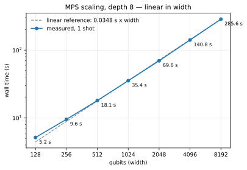
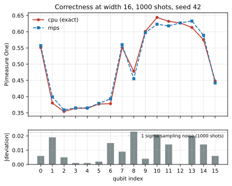
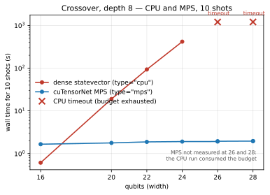
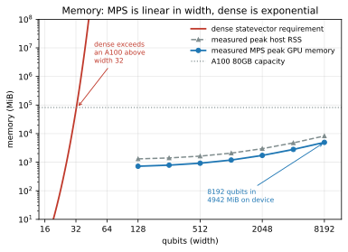
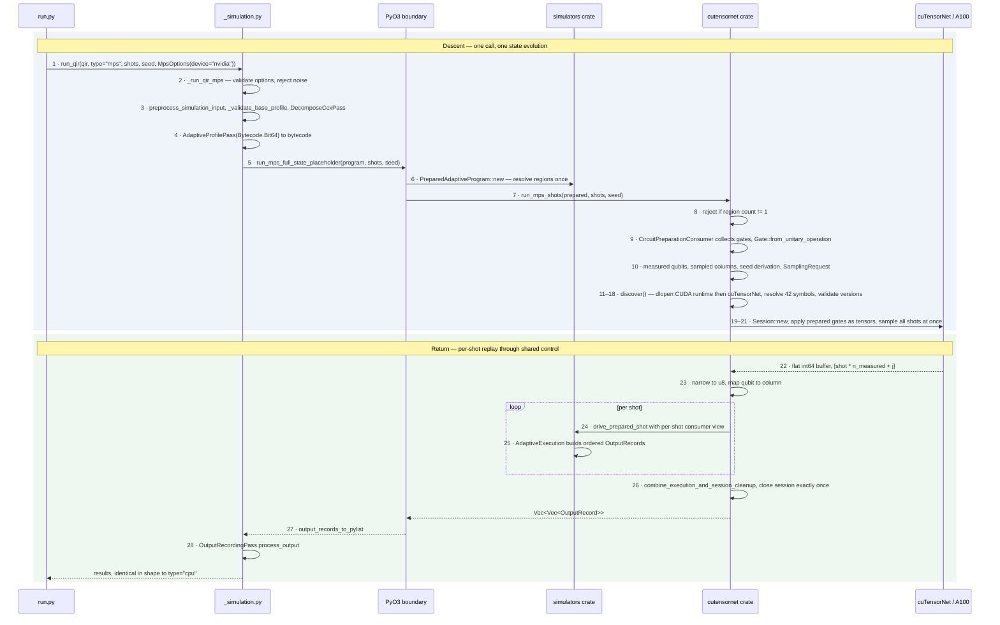

# MPS Trotter Quench Demo

This demo runs a quantum circuit that **no current QDK simulator can execute**, using
NVIDIA cuTensorNet matrix-product-state (MPS) simulation through the public
`qdk.simulation.run_qir` API.

It is a demonstration, not a shipped feature. See [Next steps](#7-next-steps-to-production-integration)
for what production integration still requires.

| | |
| --- | --- |
| Harness | [`run.py`](run.py) (this directory) |
| Public entry point | `run_qir(..., type="mps", mps_options=MpsOptions(device="nvidia"))` |
| Validated at | `5b124bde08635834e85f1fb66458fcf180db2b81` |
| Reference host | NVIDIA A100 80GB PCIe, Linux x86_64 |
| Largest measured | **8192 qubits in 285.6 s using 4942 MiB of GPU memory** |
| Dense ceiling on same host | **~25 qubits** |

> **Reading the citations.** Source references such as
> [`execution.rs:214`](../../../source/cutensornet/src/execution.rs#L214) link to the file at that
> line, relative to this document, so they resolve on any checkout or branch. Short names are used
> for readability; two crates matter, and the repository contains more than one file with some of
> these names:
>
> | Short name | Crate |
> | --- | --- |
> | `execution.rs`, `library.rs`, `lib.rs`, `version.rs`, `error.rs`, `library/…` | `source/cutensornet/src/` |
> | `adaptive.rs`, `immediate.rs`, `region.rs`, `execution/tests.rs` | `source/simulators/src/execution/` |
>
> Line numbers are accurate at the validated commit above and will drift as the code changes.

---

## TL;DR

**What this shows.** A depth-8 Trotterized Ising quench that no current QDK simulator can run:
`type="clifford"` is excluded at any width (non-Clifford rotations), `type="cpu"`/`type="gpu"` stop
at ~25 qubits (dense statevector), and the Q# sparse simulator stops near 36
([§2](#2-why-current-qdk-simulators-cannot-run-it)). MPS runs it at **8192 qubits in 285 s using
4.8 GiB of GPU memory** — 6% of an A100 — with both time and memory linear in width.

**What this brings.** Two things, at different levels of maturity.

*A reachable regime that was not reachable.* Wide, weakly entangled, non-Clifford circuits — the
class where MPS bond dimension stays bounded — become simulable at widths dense methods cannot
approach. This is **not** general acceleration: cost tracks entanglement rather than width, and at 24
qubits dense statevector is still roughly 3× faster on the same GPU ([§5.4](#54-crossover)). A
strongly entangling circuit will not scale like this one.

*A reusable execution core.* The backend is not a bolt-on. It plugs into a target-neutral driver
([`region.rs`](../../../source/simulators/src/execution/region.rs)) that separates host-side
classical control from target-side state evolution, and the same driver already runs QDK's existing
full-state and Clifford simulators through a compatibility adapter — legacy parity is asserted in
[`execution/tests.rs:872`](../../../source/simulators/src/execution/tests.rs#L872). cuTensorNet is
one `RegionConsumer` implementation rather than a special case; a CPU MPS provider would implement
the same contract, and adaptive execution needs no change to it
([§7](#7-next-steps-to-production-integration)).

*The bound on both claims.* Neither is a shipped feature. `type="mps"` is not yet on `origin/main`;
the execution layer is proven but **not yet adopted** by production dispatch, which still runs on the
legacy engine; and the cuTensorNet adapter is pinned to exactly one library version. What is durable
here is the design, plus evidence that the design carries a real workload at scale.

**Prerequisites.** Linux x86_64, NVIDIA GPU, cuTensorNet **exactly v2.13.0** with CUDA runtime
**exactly 12.9** ([Appendix A](#appendix-a--environment-setup) — the version check is strict), and a
QDK built with `python3.11 ./build.py --qdk --editable`.

**Run it** (99 s on an A100):

```bash
./source/qdk_package/.venv/bin/python \
  samples/python_interop/mps_trotter_quench_demo/run.py \
  --mode demo --output ~/mps-demo.json \
  --depth 8 --theta 0.30 --seed 42 \
  --correctness-width 16 --correctness-shots 1000 \
  --guard-width 128 --guard-shots 2 \
  --headline-width 1024 --headline-shots 1 2 \
  --timeout-seconds 300 --demo-time-budget-seconds 1800
```

**What success looks like.** Three lines carry the result:

```
phase-1-correctness | maximum per-qubit One-frequency deviation=0.023
phase-2-scale | headline-1-shot | width=1024 | mps | success | total=35.454s
complete | mode=demo | Phase 1 results-recorded | Phase 2 completed | total=98.971s
```

The first says MPS agrees with the exact simulator at a width both can run. The second says MPS ran
a width no current QDK simulator can. That pairing is the entire demo.

**If it fails**, the error tells you which layer: `OSError` means environment (library, version,
device); `ValueError` means program (profile, qubit count, unsupported gate). Check
`runs[].outcome` in the JSON — **the process can exit 0 with a failed measurement inside**
([§4.4](#44-reading-the-output)).

**Other sizes:** [§4.2](#42-configurations) has eight configurations from 12 s to 19 min.

---

**Contents**

1. [The circuit](#1-the-circuit)
2. [Why current QDK simulators cannot run it](#2-why-current-qdk-simulators-cannot-run-it)
3. [Why MPS can](#3-why-mps-can)
4. [Running the demo](#4-running-the-demo)
5. [Results](#5-results)
6. [Limitations](#6-limitations)
7. [Next steps to production integration](#7-next-steps-to-production-integration)

Appendices: [A Environment setup](#appendix-a--environment-setup) ·
[B Execution flow](#appendix-b--execution-flow) ·
[C Harness reference](#appendix-c--harness-reference) ·
[D Evidence provenance](#appendix-d--evidence-provenance) ·
[E Other NVIDIA GPUs](#appendix-e--other-nvidia-gpus) ·
[F Regenerating figures](#appendix-f--regenerating-figures) ·
[G Reusability of the shared execution layer](#appendix-g--reusability-of-the-shared-execution-layer)

---

## 1. The circuit

A Trotterized quench of the 1D transverse-field Ising model from a domain-wall product state.

**Initial state.** Qubits $0 \ldots W/2-1$ are left in $|0\rangle$; qubits $W/2 \ldots W-1$ are
flipped to $|1\rangle$:

$$|\psi_0\rangle = |0\rangle^{\otimes W/2} \otimes |1\rangle^{\otimes W/2}$$

**Evolution.** The state is evolved under

$$H = \sum_{i=0}^{W-2} Z_i Z_{i+1} + \sum_{i=0}^{W-1} X_i$$

using $d$ first-order Trotter layers with step $\theta$:

$$U(\theta) = \left[\prod_{i=0}^{W-2} e^{-i\frac{\theta}{2} Z_i Z_{i+1}}\right]\left[\prod_{i=0}^{W-1} e^{-i\frac{\theta}{2} X_i}\right]$$

Each $ZZ$ term is realised as `CNOT(i, i+1) · Rz(θ, i+1) · CNOT(i, i+1)`, and each $X$ term as
`Rx(θ, i)`. All qubits are then measured in the computational basis.

**Parameters and cost.**

| Parameter | Value | Flag |
| --- | --- | --- |
| Width $W$ | varies, 8 – 8192 | `--headline-width`, `--correctness-width` |
| Depth $d$ | 8 | `--depth` |
| Angle $\theta$ | 0.30 | `--theta` |
| Seed | 42 | `--seed` |
| Evolution gates | $d(4W-3)$ | — |

At $d=8$ this is $32W-24$ evolution gates: 4,072 at $W=128$, 32,744 at $W=1024$, 262,120 at
$W=8192$. The $W/2$ domain-wall `X` gates and the $W$ final measurements are additional. This
formula is not merely asserted — it was **confirmed by direct gate counting** at widths 8, 12, 16,
20, and 24 ([Appendix D](#known-harness-limitations)).

The circuit is defined once in Q# ([`run.py:49`](run.py#L49)) and emitted directly as Base-profile QIR
([`run.py:99`](run.py#L99)). The harness proves the two are equivalent before measuring anything
(see [§5.1](#51-qir-equivalence)).

**Two properties make this circuit a useful test.**

*Nearest-neighbour and shallow.* Entanglement across any cut is bounded by depth, not width —
this is what MPS exploits ([§3](#3-why-mps-can)).

*Analytically constrained.* $H$ is invariant under the global spin flip $\prod_i X_i$ (which maps
$Z \to -Z$, leaving $ZZ$ unchanged) and under reflection $i \to W-1-i$. The initial state is
invariant under the *composition* of the two. Therefore any correct result must satisfy

$$p_i = 1 - p_{W-1-i}$$

where $p_i$ is the probability of measuring One on qubit $i$. This is an **oracle-free correctness
check that holds at any width**, including widths where no exact simulator can reach.

---

## 2. Why current QDK simulators cannot run it

`run_qir` offers three simulation methods, and the Q# interpreter adds a fourth. Two are excluded
categorically and two exponentially.

| Method | Reached via | Can it run this circuit? |
| --- | --- | --- |
| Stabilizer | `run_qir(type="clifford")` | **No, at any width.** `Rz(0.30)` and `Rx(0.30)` are not Clifford gates. Excluded at $W=8$ as firmly as at $W=8192$. |
| Dense statevector | `run_qir(type="cpu")` | Only while $2^W$ amplitudes fit in time and memory. **Measured** below. |
| Dense statevector (wgpu) | `run_qir(type="gpu")` | Same exponential wall. Buffer-size limits typically make it *worse* than `"cpu"`, not better. |
| Sparse statevector | Q# interpreter (`qsharp.run`); **not reachable from `run_qir`** | **No.** Its amplitude-deferral optimization buys exactly one Trotter layer; the state then materializes and memory ends it near $W\approx36$, with an absolute $10^{-10}$ pruning threshold that silently discards real amplitude beyond that — see [§2.1](#21-why-the-sparse-simulator-does-not-help). **Measured** at $W=8,12,16$. |

> **Terminology hazard.** `type="gpu"` selects the **wgpu** full-state simulator, which runs on any
> compatible adapter and has nothing to do with NVIDIA cuTensorNet. NVIDIA MPS execution is reached
> only through `type="mps"`. The two are independent; do not substitute one for the other.
> This is a naming problem, not just a documentation one — see [T1.7](#tier-1--blocking).

### 2.1 Why the sparse simulator does not help

The sparse simulator stores only nonzero amplitudes, so it is worth asking why it is not the natural
fit — the initial domain wall $|0\ldots01\ldots1\rangle$ is a *single* basis state, which is the best
possible case for it.

The transverse-field half of each Trotter step applies $R_x(\theta)$ to **every** qubit
([`run.py:66-68`](run.py#L66-L68), `for q in qs { Rx(__THETA__, q); }`):

$$R_x(0.30)\,|b\rangle = \cos(0.15)\,|b\rangle - i\sin(0.15)\,|1-b\rangle,
\qquad \sin(0.15) \approx 0.149 \neq 0$$

Both branches carry weight, so one $R_x$ layer takes a single basis state to a superposition over
all $2^W$. `SparseStateSim` defends against this by *deferring*: `rx()` does not modify the state,
it accumulates the angle in an `rx_queue` ([`sparse_state_simulator.rs:1152-1164`](../../../source/simulators/src/sparse_state_simulator.rs#L1152-L1164)), holding the
rotation symbolically until a non-commuting gate forces a flush.

**Measured.** Materialized state size after each Trotter layer:

| $W$ | After layer 1 | After layer 2 | Layers 3–8 | $2^W$ |
| --- | --- | --- | --- | --- |
| 8 | 256 | 256 | 256 | 256 |
| 12 | 4,096 | 4,096 | 4,096 | 4,096 |
| 16 | 64,839 | 65,536 | 65,536 | 65,536 |

The deferral buys one layer and no more. Two details are worth recording because both are
counter-intuitive:

1. **The flush is gradual, not immediate.** The first `CNOT` of layer 2 materializes only **2**
   states, not $2^W$ — it flushes just its own control's queued $R_x$, leaving $W-1$ queued. It is
   the *sweep* of layer 2's `CNOT`s across every adjacent pair that drives full materialization.
   The end state is the same; the path is slower than it appears.
2. **The width-16 shortfall is amplitude pruning.** 64,839 is not a partial flush — it is
   $65{,}536 - 697$. Amplitudes are dropped below an absolute $10^{-10}$ threshold
   ([`nearly_zero.rs:13`](../../../source/simulators/src/sparse_state_simulator/nearly_zero.rs#L13)). A state with $k$ flipped qubits has magnitude
   $\cos^{W-k}(0.15)\sin^{k}(0.15)$, which falls under $10^{-10}$ at $k \ge 13$, and
   $\sum_{k=13}^{16}\binom{16}{k} = 560+120+16+1 = 697$ **exactly**. The same model predicts no
   pruning at $W=8$ or $12$, matching both measurements.

So the sparse simulator does **not** simply degenerate to dense — the pruning keeps strictly fewer
states than $2^W$. It is nonetheless unusable here, for two independent reasons:

| $W$ | Retained entries | ≈ RAM at 40 B/entry | Probability mass kept |
| --- | --- | --- | --- |
| 24 | $9.7\times10^{6}$ | 0.4 GB | 1.000000 |
| 32 | $2.4\times10^{8}$ | 9.5 GB | 1.000000 |
| 36 | $9.9\times10^{8}$ | 39.6 GB | 1.000000 |
| 40 | $3.5\times10^{9}$ | 141 GB | 1.000000 |
| 512 | $6.3\times10^{18}$ | — | **0.293** |
| 1024 | $1.6\times10^{15}$ | — | **0.000027** |
| ≥ 2048 | **0** | — | **0** |

*Rows above are a model of the $10^{-10}$ rule, validated exactly against the three measured widths;
values beyond $W=16$ are extrapolation, not measurement.*

- **Memory** ends it near $W \approx 36$ — better than `type="cpu"`'s ~25, still four orders of
  magnitude short of 8192.
- **Correctness** ends it sooner in spirit. The threshold is an *absolute* tolerance with no error
  control, so as $W$ grows it discards physically significant amplitude: at $W=512$ it keeps 29% of
  the probability mass, and past $W \approx 2048$ even the all-zeros amplitude
  ($\cos^{W}(0.15)$) falls below $10^{-10}$ and the state empties entirely.

That contrast is the point. Both MPS and the sparse simulator approximate by discarding small
quantities, but MPS truncates by *discarded weight* against a bond budget — a controlled,
reportable error — whereas the sparse threshold is a fixed absolute epsilon that silently deletes
real amplitude once the state spreads. MPS succeeds here because it exploits bounded
**entanglement** ([§3](#3-why-mps-can)), a structure this circuit genuinely has, rather than
amplitude sparsity, which it destroys in one layer.

> **Status: measured** at widths 8, 12, 16 via direct `get_state()` instrumentation
> ([`sparse_state_simulator.rs:114`](../../../source/simulators/src/sparse_state_simulator.rs#L114)), since `run_qir` cannot reach this simulator. The prediction
> originally recorded here — that the first layer-2 `CNOT` would materialize $2^W$ — was
> **falsified**; the conclusion survived, the mechanism did not. Larger widths remain modelled, not
> measured ([T2.7](#tier-2--usable-feature)).

### 2.2 The dense wall, measured

A dense statevector needs $2^W \times 16$ bytes. Measured behaviour of `type="cpu"` on the
reference host (232 GB RAM, 24 logical CPUs, 10 shots):

| Width | Dense state | Measured | Peak RSS | Outcome |
| --- | --- | --- | --- | --- |
| 16 | 1 MiB | 0.612 s | 0.25 GB | success |
| 20 | 16 MiB | 18.912 s | 0.54 GB | success |
| 22 | 64 MiB | 93.101 s | 1.48 GB | success |
| 24 | 256 MiB | 417.107 s | 12.81 GB | success |
| 26 | 1 GiB | >1200 s | 21.57 GB | **timeout** |
| 28 | 4 GiB | >1200 s | 85.99 GB | **timeout** |
| 32 | 64 GiB | ~1.6 h/shot (extrapolated) | — | not attempted |

Time grows about 4.7× per two qubits — slightly worse than the theoretical 4×, because gate count
also grows with width. The practical ceiling on this host is **~25 qubits**; the hard memory
ceiling is 32.

Note that widths 26 and 28 **timed out rather than running out of memory** — 86 GB of 232 GB was in
use when the 1200 s budget expired. The wall is wall-clock time first, memory second. Note also that
measured RSS greatly exceeds the bare statevector (12.81 GB against 256 MiB at width 24), so the
"dense state" column is a floor on the requirement, not an estimate of it.

Above that the numbers stop being engineering problems. The demo's default headline width of 1024
would require $2^{1024} \times 16$ bytes. For scale, $W=256$ already requires about $10^{78}$
bytes, within a couple of orders of magnitude of the number of atoms in the observable universe.

**Consequence for this demo:** every configuration in [§4.2](#42-configurations) except R6 contains
at least one measurement that no current QDK simulator can perform — measured for `"cpu"`,
categorical for `"clifford"`, and argued for the sparse simulator ([§2.1](#21-why-the-sparse-simulator-does-not-help)).
R6 is the deliberate exception — it is the control experiment that measures *where* they stop.

---

## 3. Why MPS can

An MPS represents a state as a chain of tensors linked by bonds of dimension $\chi$. Cost is
**linear in width and polynomial in bond dimension**: memory $O(W\chi^2)$, gate application
$O(W\chi^3)$ per layer. It is exact whenever $\chi$ is large enough to hold the true Schmidt rank
across every cut.

**Bond dimension is bounded by depth, not width.** Consider any cut between sites $k$ and $k+1$.
Only one gate crosses it per layer: the $ZZ$ on pair $(k, k+1)$. The operator
$e^{-i\frac{\theta}{2}ZZ} = \cos\frac{\theta}{2}\,I\otimes I - i\sin\frac{\theta}{2}\,Z\otimes Z$
has operator Schmidt rank 2, so it at most doubles the state's Schmidt rank. Single-qubit `Rx`
gates do not change it at all. After $d$ layers:

$$\chi \le 2^{d}$$

At $d=8$ that is $\chi \le 256$, **independent of $W$**. Doubling the width doubles the work;
it does not change the bond. This is exactly the linear scaling measured in
[§5.2](#52-scaling-ladder).

**Exactness.** MPS is exact when no truncation occurs — that is, when the realized bond never
exceeds the configured maximum and no cutoff discards weight. For this circuit at depth 8 that is
the expected regime, and the measured agreement with exact dense simulation at $W=16$
([§5.3](#53-correctness)) is consistent with it. Separately instrumented qualification runs observed
a realized bond of about 12 through width 1024, far below the $2^8$ bound, because $\theta=0.30$ is
small and each layer entangles weakly.

> **This demo cannot verify exactness from its own output.** The public `run_qir` API does not
> report realized bond dimension or discarded weight, so the harness cannot confirm that no
> truncation occurred. The argument above is theoretical plus the $W=16$ comparison. Surfacing
> these quantities is a [Next step](#7-next-steps-to-production-integration).

**Depth is the cost driver.** $\chi \le 2^d$ grows exponentially in depth. These measurements are
all at $d=8$ and **do not extrapolate to deeper circuits**. Raising `--depth` will not scale like
the numbers in this document.

---

## 4. Running the demo

### 4.1 Prerequisites

| Requirement | Value |
| --- | --- |
| OS / arch | Linux x86_64 (enforced at [`run.py:33`](run.py#L33)) |
| GPU | NVIDIA, CUDA 12 capable |
| Library | cuQuantum `libcutensornet.so.2` |
| Build | QDK built with `--qdk --editable` |
| Qubits | minimum 2 (single-qubit circuits are rejected) |

Full setup, including driver and cuQuantum installation, is in
[Appendix A](#appendix-a--environment-setup). Non-A100 GPUs: [Appendix E](#appendix-e--other-nvidia-gpus).

Verify the build before running anything:

```bash
./source/qdk_package/.venv/bin/python -c \
  'from qdk.simulation import MpsOptions, run_qir; print("mps_api_import=ok")'
```

### 4.2 Configurations

MPS evolution time is linear in width: $t \approx 0.0348 \times W$ seconds, fitted on the 512 and
8192 endpoints and accurate to within 3% at every intermediate width. Each isolated run adds about
1.2 s of process overhead. **Shots are nearly free** — at $W=16$, 1000 shots took 1.646 s and 10
shots took 1.659 s — because the state is evolved once and all shots are sampled from it.

| # | Configuration | A100 time | Largest width | Reachable by current QDK? |
| --- | --- | --- | --- | --- |
| R1 | Smoke test | ~12 s ᵉ | 32 | No — 64 GiB, ~1.6 h/shot |
| R2 | Quick | ~36 s ᵉ | 256 | No — $2^{256}$ amplitudes |
| **R3** | **Standard (recommended)** | **99 s ᵐ** | **1024** | No |
| R4 | One minute | ~66 s ᵉ | 512 | No |
| R5 | Deep scale | 286 s ᵐ | 4096 | No |
| R6 | The wall | ~14 min ᵐ | 24 | **Yes — that is the point** |
| R7 | Full ladder | ~19 min ᵐ | 8192 | No |
| R8 | Ceiling probe | ~19 min ᵉ | 16384 | No — and untested |

ᵐ measured 2026-09-04 at `5b124bde` · ᵉ estimated from the fitted model

**R3 is the demo.** It is the only single invocation carrying both halves of the argument:
CPU and MPS agreeing at width 16, then 1024 qubits in 35 s. It is also the configuration that
produced the measured output quoted in [§5](#5-results).

R6 is worth starting in a second terminal before presenting. Fourteen minutes of dense simulation
visibly degrading, while R3 finishes in 99 seconds, makes the comparison without narration.

### 4.3 Recommended invocation (R3)

From the repository root:

```bash
export QDK_CUTENSORNET_LIBRARY=/usr/lib/x86_64-linux-gnu/libcuquantum/12/libcutensornet.so.2

./source/qdk_package/.venv/bin/python \
  samples/python_interop/mps_trotter_quench_demo/run.py \
  --mode demo \
  --output ~/mps-demo.json \
  --depth 8 --theta 0.30 --seed 42 \
  --correctness-width 16 --correctness-shots 1000 \
  --guard-width 128 --guard-shots 2 \
  --headline-width 1024 --headline-shots 1 2 \
  --timeout-seconds 300 \
  --demo-time-budget-seconds 1800
```

`QDK_CUTENSORNET_LIBRARY` is required only when cuTensorNet is installed somewhere
`ctypes.util.find_library("cutensornet")` does not resolve; see
[Appendix A](#appendix-a--environment-setup).

Other configurations from the table:

```bash
# R4 — one minute: full correctness, smaller headline
--correctness-width 16 --correctness-shots 1000 --guard-width 128 --guard-shots 2 \
--headline-width 512 --headline-shots 1 2

# R5 — deep scale: skip the expensive CPU comparison
--correctness-width 8 --correctness-shots 100 --guard-width 128 --guard-shots 2 \
--headline-width 4096 --headline-shots 1 2

# R6 — the wall: one invocation per width, in a shell loop
for W in 16 20 22 24 26; do
  ... run.py --correctness-width "$W" --correctness-shots 10 \
      --correctness-fallback-shots 10 \
      --guard-width 16 --guard-shots 1 \
      --headline-width 16 --headline-shots 1 1 \
      --output "$HOME/mps-crossover-w$W.json" --timeout-seconds 1200
done
```

`--correctness-fallback-shots 10` in R6 is **required**, not optional — see
[Appendix C](#appendix-c--harness-reference).

### 4.4 Reading the output

Every line is `flush=True`, so piping through `tee` streams live. A successful R3 run prints:

```
preflight-qir-equivalence | exact_seeded_shot_match=true
phase-1-correctness | cpu | width=16 | cpu | success | total=20.582s per_shot=0.021s
phase-1-correctness | mps | width=16 | mps | success | total=1.646s per_shot=0.002s
phase-1-correctness | maximum per-qubit One-frequency deviation=0.023
phase-2-scale | headline-1-shot | width=1024 | mps | success | total=35.454s per_shot=35.454s
phase-2-scale | headline-2-shot | width=1024 | mps | success | total=34.945s per_shot=17.472s
phase-2-scale | 2-shot/1-shot total ratio=0.986 | consistent-with-shared-evolution
complete | mode=demo | Phase 1 results-recorded | Phase 2 completed | total=98.971s
```

**The process exit code is not sufficient to judge a run.** `main()` returns 0 (complete),
1 (equivalence failure), or 2 (MPS unavailable), but a per-measurement timeout can still be recorded
while the process exits 0. Always read `runs[].outcome` from the JSON:

```bash
python3 -c '
import json, sys
d = json.load(open(sys.argv[1]))
for r in d["runs"]:
    print(r["label"], r["width"], r["backend"], r["outcome"], r.get("total_wall_seconds"))
' ~/mps-demo.json
```

`outcome` is per-run: `success`, `error`, `timeout`, `process_exit`, `unavailable`, or
`not-run-demo-budget-exhausted`. Evidence is written atomically after **every** run, so a JSON file
remains valid and complete-so-far even if the process is killed.

---

## 5. Results

All measurements: A100 80GB PCIe, `5b124bde`, depth 8, $\theta=0.30$, seed 42.
Provenance in [Appendix D](#appendix-d--evidence-provenance).

### 5.1 QIR equivalence

Before any measurement, the harness compiles the Q# source, emits QIR directly, and runs both on
CPU with the same seed. It requires identical output records shot-by-shot. This held on **every one
of the ~13 sweep invocations** (`exact_seeded_shot_match=true`), establishing that the hand-emitted
QIR is the circuit the Q# source describes.

Each sweep invocation runs this check at **one width** (default 8), so on its own it left the
width-dependent index arithmetic in `generate_qir` unconfirmed at scale. **That gap has since been
closed.** The comparison was repeated out of band at widths 8, 12, 16, 20, and 24: seeded shots
matched exactly at every width, per-gate `x`/`cx`/`rz`/`rx` counts were identical, and the
$32W-24$ gate count was reproduced at all five points ([Appendix D](#known-harness-limitations)).

The agreement is also a stronger result than it looks, because the two programs are not near-copies.
Q# emits `__quantum__qis__m__body` with `__quantum__rt__array_record_output` and an
`__quantum__rt__initialize` call; the hand-emitted QIR uses `__quantum__qis__mz__body` with
`__quantum__rt__tuple_record_output` and no initialize. Two materially different lowerings producing
bit-identical seeded outcomes is a better test of the circuit than two similar ones — and it is why
the harness compares normalised bitstrings ([`run.py:192`](run.py#L192)) rather than raw results,
which genuinely differ in shape.

### 5.2 Scaling ladder



| Width | 1 shot | 2 shots | 2/1 ratio | ms/qubit | Peak GPU | Peak host RSS |
| --- | --- | --- | --- | --- | --- | --- |
| 128 | 5.163 s | 5.147 s | 0.997 | 40.3 | 722 MiB | 1.37 GB |
| 256 | 9.554 s | 9.380 s | 0.982 | 37.3 | 788 MiB | 1.48 GB |
| 512 | 18.062 s | 18.084 s | 1.001 | 35.3 | 922 MiB | 1.71 GB |
| 1024 | 35.391 s | 35.519 s | 1.004 | 34.6 | 1190 MiB | 2.18 GB |
| 2048 | 69.624 s | 69.563 s | 0.999 | 34.0 | 1726 MiB | 3.12 GB |
| 4096 | 140.757 s | 141.488 s | 1.005 | 34.4 | 2798 MiB | 4.98 GB |
| 8192 | 285.585 s | 284.755 s | 0.997 | 34.9 | 4942 MiB | 8.68 GB |

**Six consecutive doublings at 1.85, 1.89, 1.96, 1.97, 2.02, 2.03× — linear in width over a 64×
range**, with per-qubit cost settling to 34–35 ms above width 512. This is the behaviour predicted
in [§3](#3-why-mps-can). The slightly higher per-qubit cost at 128 and 256 is fixed overhead
(process start, QIR lowering, library discovery) that has not yet been amortized.

**The 2-shot/1-shot ratio is ~1.00 at every width.** A second shot costs nothing measurable,
confirming the state is evolved once and both shots are drawn from the same evolved state.

**No ceiling was found.** Every width succeeded. The ladder ended at 8192 because that was the
largest width scheduled, not because anything failed.

### 5.3 Correctness



At width 16 with 1000 shots, against the exact dense simulator:

| Metric | Value |
| --- | --- |
| Maximum per-qubit deviation | **0.023** |
| 1σ sampling noise at 1000 shots | 0.022 |
| Expected max over 16 qubits | ~0.05 |

The largest deviation is about 1σ, where roughly 2.2σ would be expected as the maximum across 16
independent comparisons. The agreement is well within sampling noise.

The MPS result independently satisfies the reflection/spin-flip symmetry $p_i = 1 - p_{W-1-i}$
derived in [§1](#1-the-circuit), with a maximum deviation of 0.017 across all 8 pairs — so it is
producing correct physics, not merely reproducing the CPU simulator's output.

> Deviation thresholds scale with shot count. At 1000 shots a max deviation above ~0.2 indicates a
> defect; at 100 shots the same threshold is ~0.5; at 10 shots per-qubit frequencies carry almost no
> information. Runs configured for timing only (R6) will show large deviations by construction.

### 5.4 Crossover



10 shots per measurement:

| Width | `type="cpu"` | `type="mps"` | Result |
| --- | --- | --- | --- |
| 16 | 0.612 s | 1.659 s | CPU faster, 2.7× |
| 20 | 18.912 s | 1.777 s | MPS faster, 10.6× |
| 22 | 93.101 s | 1.878 s | MPS faster, 49.6× |
| 24 | 417.107 s | 1.910 s | MPS faster, 218× |
| 26 | timeout >1200 s | 1.916 s / 1.945 s | CPU ceiling; MPS flat |
| 28 | timeout >1200 s | 1.960 s / 1.962 s | CPU ceiling; MPS flat |

The crossover lies **between widths 16 and 20**. CPU grows ~4.7× per two qubits while MPS stays
essentially flat (1.66 → 1.96 s from 16 to 28), because at these widths MPS cost is dominated by
fixed overhead.

Two qualifications, both important:

*Widths 26 and 28 are CPU ceiling evidence, not MPS failures.* In the main sweep the MPS
measurement at those widths never ran, because the CPU run consumed the entire per-invocation
budget first. They were measured separately afterwards, MPS-only, and are shown above as two
independent replicates each rather than an average. MPS completed all 10 shots at both widths and
stayed flat; nothing about those widths was ever an MPS limit.

*The crossover depends on shot count as well as width.* At width 16 with 10 shots CPU wins; with
1000 shots MPS wins by 12.5× (1.646 s vs 20.582 s). Because MPS amortises one evolution across all
shots, it wins whenever $t_{\text{MPS,fixed}} < t_{\text{CPU,per-shot}} \times \text{shots}$ —
about 27 shots at width 16. Quote both crossovers or neither.

*These ratios measure NVIDIA **and** MPS together, which is what selecting `type="mps"` actually
buys.* They are not a measurement of MPS as an algorithm, because two variables move at once: the
method changes from dense to MPS **and** execution moves from this host's CPU to an A100. The
distinction matters at the low end. Prior CUDA-Q measurements of the same depth-8 Trotter problem,
with both methods on the same A100, put statevector *ahead* of MPS at these widths — 0.31 s vs
1.05 s at $W=24$, 0.57 s vs 1.23 s at $W=28$ — with MPS taking the lead near $W \approx 30$ and
statevector exhausting 80 GB of device memory shortly after.

So the honest reading of the 218× is *"switching `type="cpu"` to `type="mps"` on this host is 218×
faster at 24 qubits"* — a real, user-visible speedup — rather than *"MPS is 218× faster than
statevector."* At 24 qubits the algorithm alone is behind; its advantage is that it does not stop at
25 qubits, or at 33. The ladder in [§5.2](#52-scaling-ladder), not this table, is where the
algorithmic claim rests.

> Those CUDA-Q figures come from a different stack (cuQuantum Python 26.3.2 / cuTensorNet 2.12.2,
> not this crate) and a different observable, and are quoted for direction only. They are not
> retained evidence for this demo.

### 5.5 Memory



**GPU memory is linear in width**, not flat. Across widths 256–8192 the measured peak is reproduced
to the MiB by

$$M_{\text{GPU}}(W) \approx 654\ \text{MiB} + 0.523\ \text{MiB} \times W$$

| Width | 128 | 256 | 512 | 1024 | 2048 | 4096 | 8192 |
| --- | --- | --- | --- | --- | --- | --- | --- |
| Measured | 722 | 788 | 922 | 1190 | 1726 | 2798 | 4942 |
| Model | 721 | 788 | 922 | 1190 | 1726 | 2798 | 4942 |

Width 128 originally measured 664 MiB against a model value of 721, and this document predicted the
cause: the sampler ran at 200 ms while that invocation lasts only about 5 s, so it most likely
missed the peak. **That prediction was tested and confirmed.** Re-measuring the same width with the
same metric at 50 ms raised the sample count from 58 to 231 and the observed peak to **722 MiB**,
against a model value of 721 — agreement to 1 MiB, with both width-128 worker processes
independently reaching 722 MiB. The 664 MiB figure was an undersampling artifact, not a departure
from the model, and the fit now reproduces every width in the sweep.

At 8192 qubits the peak is 4942 MiB, **6.0% of an 80 GB A100**.

> **What the metric is.** These figures are `nvidia-smi --query-compute-apps=used_gpu_memory`:
> whole-process framebuffer memory attributed to the GPU context, including the CUDA context and
> every device allocation the worker makes. It is not an MPS-state-only measurement. Reading the
> ~654 MiB intercept as CUDA-context overhead specifically is therefore a model, not something
> measured independently here.

> An earlier reading of this sweep reported a flat 606–922 MiB. That was a log-parsing defect that
> undercounted four-digit values, not a measurement. The corrected series above is authoritative.

The linear growth is much larger than the MPS itself: bond 12 over 8192 sites is only about 38 MB of
tensors ($8192 \times 12 \times 2 \times 12 \times 16$ bytes). The measured 0.523 MiB per qubit is
therefore dominated by per-site workspace rather than by the state. The harness does not expose the
allocator breakdown, so this is where the description stops.

**Host RSS is also linear, and larger than GPU memory**, at roughly
$1.25\ \text{GB} + 0.91\ \text{MB} \times W$ — 8.68 GB at width 8192 against 5.18 GB on the device.
This is expected rather than surprising: the QIR module and lowered bytecode hold
$32W - 24$ gates, so the host-side program representation grows with width independently of the
simulator. **Above roughly width 2048 the host, not the GPU, is the larger consumer** — relevant to
anyone sizing a machine for this workload, and a reason not to treat GPU capacity as the only limit.

**For this workload the constraint is time, not memory**, on either side.

For contrast, dense `type="cpu"` reached 21.6 GB RSS at width 26 and 86.0 GB (80.1 GiB) at width 28.
Both **timed out rather than exhausting memory** — the host has 232 GB — so these are lower bounds
on the dense requirement at those widths, not the requirement itself.

---

## 6. Limitations

| Limitation | Detail |
| --- | --- |
| **No correctness oracle above ~24 qubits** | Results at 512–8192 demonstrate *execution*, not *correctness*. No exact simulator reaches there. The symmetry check of [§1](#1-the-circuit) would close this but was not run at scale. |
| **The MPS engine itself has no exact-oracle test** | `n12_trotter_query_matches_qdk_sparse_exact_oracle` ([`cutensornet/src/library/simulation/circuit.rs:689`](../../../source/cutensornet/src/library/simulation/circuit.rs#L689)) checks the generated gate list against QDK's exact `SparseStateSim` to $10^{-12}$ — but it replays gates into the sparse simulator and **never touches cuTensorNet**. It validates the backend's *input*, not its evolution. Engine numerics rest solely on the statistical width-16 comparison in [§5.3](#53-correctness), which is not part of any test suite. Tracked as [T1.6](#tier-1--blocking). |
| **Exactness not verifiable from output** | Realized bond dimension and discarded weight are not exposed by `run_qir`. |
| **Depth 8 only** | $\chi \le 2^d$ is exponential in depth. None of these numbers extrapolate to deeper circuits. |
| **Base profile only** | Mid-circuit measurement followed by further evolution partitions into multiple regions and is rejected with `UnsupportedRegionCount` ([`cutensornet/src/execution.rs:156`](../../../source/cutensornet/src/execution.rs#L156)). |
| **No noise** | `type="mps"` with a noise config raises `ValueError` ([`_simulation.py:738`](../../../source/qdk_package/qdk/simulation/_simulation.py#L738)). |
| **Linux x86_64 + NVIDIA only** | Enforced at [`run.py:33`](run.py#L33). |
| **Single host** | All measurements come from one A100. Behaviour on other GPUs is untested ([Appendix E](#appendix-e--other-nvidia-gpus)). |
| **Stale public naming** | The native symbol is `run_mps_full_state_placeholder` and `MpsOptions`' docstring still says it "does not provide MPS or NVIDIA execution". Both are inaccurate; see [Appendix B](#appendix-b--execution-flow). |

---

## 7. Next steps to production integration

What this demo establishes: `run_qir(type="mps")` executes real cuTensorNet MPS end-to-end through
the production API, with results, ordering, and errors matching `type="cpu"`, for noiseless
Base-profile circuits of at least two qubits on Linux x86_64 with NVIDIA hardware.

That is a working vertical slice, not a shipped feature. To become one:

### Tier 1 — blocking

| ID | Item | Why |
| --- | --- | --- |
| T1.1 | **CI regression protection** | NVIDIA tests are behind a `QDK_NVIDIA_TESTS` opt-in and require hardware. No CI runner exercises this path, so nothing prevents a silent regression. Host-side `FakeApi` tests already run everywhere; a periodic GPU job is the gap. |
| T1.2 | **Correct the public naming** | `run_mps_full_state_placeholder` is exported in [`_native.pyi:1181`](../../../source/qdk_package/qdk/_native.pyi#L1181) and executes cuTensorNet. `MpsOptions`' docstring contradicts the implementation. |
| T1.3 | **Support more than one cuTensorNet version** | See below — currently the single largest barrier to anyone else running this. |
| T1.4 | **Availability probe and `device=None` semantics** | A caller cannot currently ask whether MPS is available without triggering an execution-time `OSError`. |
| T1.5 | **Document library discovery** | Two variables, two default lists, exclusive-override semantics ([Appendix A.3](#a3-cuquantum--cutensornet)). None of it is in public documentation, and the failure message does not name the variables. |
| T1.6 | **Engine numerical regression test** | The only exact-oracle test validates *circuit construction*, not MPS evolution ([§6](#6-limitations)). Engine numerics are currently defended only by a statistical comparison that lives in the demo harness, not in CI. Cheapest of the Tier 1 items and currently the least-defended property in the system. |
| T1.7 | **Decide the `type=` taxonomy before `"mps"` ships** | The selector conflates *method* and *device* on one axis, which is why the terminology hazard in [§2](#2-why-current-qdk-simulators-cannot-run-it) exists. `"mps"` is **not yet on `origin/main`** — the decision is free now and becomes a breaking change the moment it ships. See below. |

#### T1.7 in detail — the `type=` selector conflates two axes

`run_qir(type=...)` accepts one string, but the four values do not name the same kind of thing:

| Value | What it actually selects | Method | Device |
| --- | --- | --- | --- |
| `"clifford"` | a **method** | stabilizer | CPU |
| `"cpu"` | a **device** | dense statevector | CPU |
| `"gpu"` | a **device** | dense statevector | wgpu (any vendor) |
| `"mps"` | a **method** | MPS | NVIDIA only |

Two orthogonal axes — simulation method × execution device — are flattened onto one string. Three
concrete consequences, all present today:

1. **The documentation steers NVIDIA users away from the NVIDIA path.** The docstring for `"gpu"`
   reads *"Use if you have a GPU available in your system"* ([`_simulation.py:890`](../../../source/qdk_package/qdk/simulation/_simulation.py#L890)). An A100 owner
   follows that instruction, gets the wgpu dense statevector, and hits the $2^W$ wall at ~25 qubits
   — while the path that would have run their circuit at 8192 qubits is named something else.
2. **The default never reaches MPS.** With `type=None`, `run_qir` probes for a wgpu adapter and
   selects `"gpu"` or `"cpu"` — MPS is not a candidate ([`_simulation.py:907-912`](../../../source/qdk_package/qdk/simulation/_simulation.py#L907-L912)). On a host where
   MPS is the only viable backend, the default still selects a simulator that cannot run the
   circuit.
3. **CPU MPS has no expressible name.** MPS-on-CPU is an explicitly planned backend, but `"mps"` is
   already bound to cuTensorNet-on-NVIDIA. The axis cannot express *method = MPS, device = CPU*.
   This is a scheduled collision, not a hypothetical one.

Consequence 3 is the reason this is Tier 1 rather than a documentation fix. Options:

| Option | Shape | Cost | Risk |
| --- | --- | --- | --- |
| **A. Document harder** | Keep the strings; clarify the docstrings | Trivial | Fixes nothing structural; consequence 3 still arrives |
| **B. Add more strings** | `"mps-cpu"`, `"mps-cuda"`, … | Low | The axis keeps conflating; each new method × device pair multiplies the enum |
| **C. Separate the axes** | `method=` (statevector \| stabilizer \| mps) × `device=` (auto \| cpu \| cuda \| wgpu), with today's strings retained as deprecated aliases | Medium | One-time migration; needs a resolution policy for `auto` |

**Recommend C, decided now and implemented when convenient.** The cost of C is roughly constant
whenever it is done, but its *feasibility* is not: today `"mps"` is unshipped, so C is additive and
the old strings can be kept as aliases indefinitely. After `"mps"` ships publicly, C becomes a
breaking change to a documented API, and option B becomes the path of least resistance by default —
locking in the conflation permanently.

This does not block the demo, and nothing above argues for delaying the cuTensorNet merge. It argues
for making the naming decision *before* that merge, because the merge is what forecloses it.

#### T1.3 in detail — multiple cuTensorNet versions

[`version.rs:3-6`](../../../source/cutensornet/src/version.rs#L3-L6) accepts exactly cuTensorNet 21300 with CUDA runtime 12090. Anything else —
including *newer* — fails with `UnsupportedVersion`. A developer with cuQuantum already installed at
a different version cannot run this demo at all, and pointing `QDK_CUTENSORNET_LIBRARY` at their
copy does not help: the override changes which file is opened, not which version is accepted.

The exact-match policy is defensible today, because 42 symbols are bound to hand-audited signatures
([`lib.rs:23-68`](../../../source/cutensornet/src/lib.rs#L23-L68)) and a silent ABI change would be memory-unsafe. It is not defensible in a shipped
product. Options, in increasing cost:

| Option | Effect | Cost | Risk |
| --- | --- | --- | --- |
| **A. Widen to a validated range** per binding module | One binding set covers, say, 2.13–2.15 | Low | Assumes ABI stability across the range without proof; a silent signature change is UB |
| **B. Version-selected binding modules** | Probe first, then dispatch to the matching audited binding set | Medium | Needs one audited binding set per supported version, and a test matrix to match |
| **C. Symbol-level capability detection** | Resolve optional symbols individually; degrade rather than reject | High | Largest change; combinatorial test surface |

**Recommend B.** The structure already anticipates it — bindings are versioned modules
([`bindings/v2_13.rs`](../../../source/cutensornet/src/bindings/v2_13.rs), [`bindings/cudart_12.rs`](../../../source/cutensornet/src/bindings/cudart_12.rs)) rather than a flat symbol list, so adding
`v2_14.rs` and selecting on the probed version is an extension of the existing design, not a
redesign. It preserves the audited-signature invariant that makes A unsafe, and unlike C it keeps
one code path per version, which is testable. The prerequisite is a decision on *which* versions to
support, since each one costs a CI target.

Whichever is chosen, two things should land with it: an error message that states both the found
and supported versions (it already does — [`error.rs:38-43`](../../../source/cutensornet/src/error.rs#L38-L43)) *and* names the override variable, and
a documented support matrix.

### Tier 2 — usable feature

| ID | Item | Why |
| --- | --- | --- |
| T2.1 | **Truncation controls and reporting** | `MpsOptions` carries only `device`. Add an explicit exact / `error_tolerance` mode and a maximum bond, and return realized bond and discarded weight. Without this a caller cannot distinguish an exact result from a truncated one. |
| T2.2 | **Documented error taxonomy** | `OSError` for discovery and device faults, `ValueError` for program faults — currently a convention, not a tested contract. |
| T2.3 | **Correctness at scale** | Adopt the symmetry check as an oracle-free test at large width; optionally cross-check against an independent MPS implementation at intermediate widths. |
| T2.4 | **Cache library discovery** | `discover()` runs per `run_mps_shots` call ([Appendix B.3](#b3-dynamic-library-loading)). Resolving 42 symbols on every invocation is wasted work for repeated short circuits, and it means the environment is re-read mid-process. A `OnceLock` would fix both, at the cost of making the override variables read-once. |
| T2.5 | **Public documentation** | Requirements, installation, and the `gpu` vs `mps` distinction. |
| T2.6 | **Provisioning script** | The reference host's install method was not retained, so the environment cannot be reproduced by command — only by version target. A checked-in setup script would make the demo self-serve. |
| T2.7 | **Measure the sparse simulator** | [§2.1](#21-why-the-sparse-simulator-does-not-help) is argued from the circuit, not measured, because `run_qir` cannot reach `SparseStateSim`. A short Q#-interpreter run across increasing width would convert the argument into evidence and complete the comparison table. |

### Tier 3 — capability expansion (provisional)

The two capabilities MPS lacks relative to every other QDK simulator — Adaptive profile and noise —
are **refused explicitly, not silently mis-executed**. That is the property that keeps them out of
Tier 1: a caller cannot currently obtain a wrong answer from either, only a clear error. It is also
why [§2](#2-why-current-qdk-simulators-cannot-run-it)'s feature table is honest rather than alarming.

| ID | Item | Behaviour today | Why it is not a small follow-up |
| --- | --- | --- | --- |
| T3.1 | **Adaptive profile** | Refused at three independent layers (see below) | Needs the shared engine's missing *classical* opcodes, plus incremental region execution in the backend |
| T3.2 | **Noise** | `ValueError` at [`_simulation.py:738`](../../../source/qdk_package/qdk/simulation/_simulation.py#L738) | The shared region model has no representation for noise at all |
| T3.3 | **CPU MPS consumer** | `device="cpu"` refused at [`_simulation.py:732`](../../../source/qdk_package/qdk/simulation/_simulation.py#L732) | Strategically the most valuable of the three, and the cheapest |

**Where the work lands.** Most of this is execution-framework work, not cuTensorNet work — and the
split is the opposite of what the names suggest. Adaptive execution *feels* like the larger change but
needs no new contract; noise *feels* smaller but cannot be expressed at all today.

| | Shared execution framework | cuTensorNet backend | Contract change? |
| --- | --- | --- | --- |
| **Adaptive** | 46 classical opcodes + `OP_RESET` in [`adaptive.rs`](../../../source/simulators/src/execution/adaptive.rs) — the [convergence gate](#the-convergence-gate) | Live session per shot; incremental evolution, collapse, renormalization | **No** |
| **Noise** | Extend the region payload; decide who resolves channel selection and owns the RNG | Apply already-resolved nonunitary effects | **Yes** |
| **CPU MPS** | None — the driver is already target-neutral | A new `RegionConsumer` implementation | **No** |

#### T3.1 in detail — what Adaptive support actually requires

Adaptive QIR is rejected three times over, which is worth recording because it means the boundary is
enforced rather than assumed:

| Layer | Site | Rejection |
| --- | --- | --- |
| Python entry | [`_simulation.py:741`](../../../source/qdk_package/qdk/simulation/_simulation.py#L741) | `_validate_base_profile` — non-Base profile raises before any lowering |
| Preflight | [`cutensornet/execution.rs:118`](../../../source/cutensornet/src/execution.rs#L118) | `UnsupportedFeedforward`, raised *before* device discovery ([test](../../../source/cutensornet/src/execution.rs#L353)) |
| Consumer | [`simulation/consumer.rs:266`](../../../source/cutensornet/src/library/simulation/consumer.rs#L266) | `UnsupportedFeedforward` if a region depends on a mid-circuit result ([test](../../../source/cutensornet/src/library/simulation/consumer.rs#L494)) |

The shared abstraction is not merely compatible with adaptive execution — it was written for it. The
`RegionConsumer` doc comment ([`region.rs:43`](../../../source/simulators/src/execution/region.rs#L43))
describes consumers as executing reached regions *"against continuing target state"*; every method
takes `&mut self`, so a consumer legitimately retains quantum state across regions; and
`AdaptiveCommand::Measure` ([`protocol.rs:46`](../../../source/simulators/src/execution/protocol.rs#L46))
returns a result to host control, which then selects the next region. **No trait or protocol change is
required for adaptive.** The gap is in the backend implementation of that contract, and it is
structural rather than cosmetic: cuTensorNet today builds one Base-shaped circuit, computes it, and
samples it terminally. Adaptive execution instead needs:

- one live provider session per shot (or per compatible shot group), rather than one per program;
- execution of each *reached* region against retained MPS state;
- measurement marginals, sampled collapse, renormalization, and reset;
- continuation after measurement, not just terminal sampling;
- the classical opcode semantics discussed under [the convergence gate](#the-convergence-gate) —
  including `OP_RESET`, which the shared engine does not implement.

Some of the hard algorithmic machinery already exists privately —
[`simulation/replay.rs`](../../../source/cutensornet/src/library/simulation/replay.rs) and
[`simulation/branch.rs`](../../../source/cutensornet/src/library/simulation/branch.rs) implement
replay, branch mass, projection, and state capture. But it is **not connected to the public path**:
`consumer.rs` contains zero references to that machinery. It lowers the algorithmic risk; it does not
shorten the integration work.

Realistic sizing: medium-to-large, and gated on the convergence-gate decision rather than independent
of it. This demo is Base-profile precisely because that boundary is real.

One detail is easy to miss when scoping `OP_RESET`. It is not simply a missing match arm: the
protocol has **no reset command**. `AdaptiveCommand` offers `ExecuteRegion`, `Measure`, and
`Complete` ([`protocol.rs:41`](../../../source/simulators/src/execution/protocol.rs#L41)), and
`MeasurementKind` offers only `MeasureZ` and `MeasureResetZ`
([`protocol.rs:27`](../../../source/simulators/src/execution/protocol.rs#L27)). A standalone
`Reset(q)` can therefore be expressed as a `MeasureResetZ` whose result is discarded — semantically
correct, but it forces a measurement on backends that could reset more cheaply. Whether to accept
that or add a distinct command is a small design decision worth making deliberately rather than
discovering during implementation.

#### T3.2 in detail — noise is a shared-layer gap, not a backend gap

The obvious reading is that noise is missing from cuTensorNet. It is not, or not only:
`QuantumEvolutionRegion` ([`region.rs:25`](../../../source/simulators/src/execution/region.rs#L25))
holds a `Box<[UnitaryOperation]>` and contains **no noise concept whatsoever**. The existing
simulators carry noise through the legacy `Simulator` trait and `NoiseConfig`; the new region
representation is unitary-only by construction. Adding noise therefore means extending the *shared*
representation first, and only then teaching providers to honour it. **This is the one item in Tier 3
that requires a framework contract change.**

Usefully, the framework already prescribes the shape that extension should take. The
`QuantumEvolutionRegion` doc comment
([`region.rs:18-23`](../../../source/simulators/src/execution/region.rs#L18-L23)) anticipates
"extending the payload with nonunitary state evolution **whose host-visible decisions are already
resolved**", while keeping measurements, branch selection, and output recording as separate commands.
That sentence encodes the correct division of labour before any code exists: the host resolves the
stochastic choice, the provider applies the effect.

That ordering matters for API shape. The sensible progression is Pauli and random-unitary
trajectories, then general pure-state Kraus trajectories, then trajectory batching — with mixed-state
MPDO support treated as a **separate capability**, not an automatic extension of trajectory
simulation. Throughout, QDK should own channel probabilities and seeded RNG so that noise is
reproducible and identical across providers; the provider should only apply selected effects.

The corresponding discipline: do not add generic noise methods to `RegionConsumer` until both
cuTensorNet *and* a CPU provider have demonstrated what they actually need to differ on. A noise API
designed against one backend will be shaped by that backend.

#### T3.3 in detail — why the CPU consumer matters most

It is listed last but is the highest-leverage of the three. A second provider on the same driver is
the only way to discover whether `RegionConsumer` and the MPS policy surface are genuinely portable
or quietly NVIDIA-shaped — a question no amount of review of a single implementation can settle. It
also gives CI a tensor-network path that needs no GPU (closing [T1.1](#tier-1--blocking)) and an
independent semantic reference for engine numerics (closing [T1.6](#tier-1--blocking)) without
requiring an exact statevector oracle.

Prior evidence suggests the pieces exist: a native Rust MPS implementation with bond caps, a
truncation policy matching the proposed relative discarded-weight semantics, and norm, amplitude, and
realized-bond access. Missing are terminal sampling, measurement and collapse, diagnostics, and
performance qualification. Base-profile CPU MPS is very likely the cheapest second provider, and it
should implement `RegionConsumer` directly rather than the broad legacy `Simulator` trait.

### The convergence gate

The single largest architectural item is not on any tier list above, because it concerns the shared
execution layer rather than cuTensorNet: **there are currently two control engines, and only one of
them is complete.**

| Engine | File | Opcodes handled |
| --- | --- | --- |
| Legacy interpreter | [`bytecode/runtime.rs`](../../../source/simulators/src/bytecode/runtime.rs) | **53** |
| Shared engine | [`execution/adaptive.rs`](../../../source/simulators/src/execution/adaptive.rs) | **7** |

The shared engine handles `QUANTUM_GATE`, `MEASURE`, `READ_RESULT`, `BRANCH`, `JUMP`,
`RECORD_OUTPUT`, `RET`. Everything else raises `UnsupportedInstruction`
([`adaptive.rs:423`](../../../source/simulators/src/execution/adaptive.rs#L423)). The 46 it does not handle are almost entirely *classical* computation —
arithmetic, floating point, bitwise, memory (`LOAD`/`STORE`/`ALLOCA`/`GEP`), conversions, `PHI`,
`SWITCH`, `SELECT`, `CALL` — plus `OP_RESET`.

Read carefully, that split is reassuring rather than alarming. It is a clean seam, not a
half-finished clone: the shared engine implements *quantum control*, and has simply never
implemented *classical computation*. There is no semantic drift today, because the two engines have
no overlapping territory in which to disagree. `type="mps"` and Base-profile CPU use the shared
engine; production adaptive CPU and Clifford use the legacy one.

The risk is prospective, and it has a specific shape: **completing the shared engine opcode-by-opcode
would duplicate 46 opcodes of classical semantics with no quantum content** — signed division,
floating-point comparison, `PHI` resolution, `GEP` addressing — each one a place where two
implementations could diverge. That is the outcome to avoid.

The preferable direction is to extract one classical-control engine shared by both, combining the
legacy interpreter's complete semantics with the shared layer's region batching. Note that this is
genuinely a *merge*, not a reuse: the legacy interpreter is immediate and gate-by-gate, whereas
region batching — deferring gates between semantic boundaries — is precisely what makes MPS viable
(evolve once, sample many). The open design question, which should be answered before code is
written, is **which layer owns region-boundary detection.**

One concrete prerequisite is already visible. Adopting the shared engine for production Base CPU is
*not* drop-in: `OP_RESET` is absent from it. This demo only survives because `MResetEachZ` maps to
`OPID_MRESETZ` as a measurement variant ([`adaptive.rs:507`](../../../source/simulators/src/execution/adaptive.rs#L507)), not a reset opcode. Any Base-profile
program containing a standalone `Reset(q)` fails today.

**Sequencing.** Adoption should come before convergence. The compatibility adapter is already
proven — [`execution/tests.rs:872`](../../../source/simulators/src/execution/tests.rs#L872) asserts legacy parity for both `FullStateSimulator` and
`StabilizerSimulator` on a measure-then-branch program — but proven is not adopted, and the layer
remains additional machinery rather than shared infrastructure until production dispatch actually
uses it. `OP_RESET` plus production Base CPU adoption behind parity tests is small, additive, and
converts the framework from demonstrated to adopted without pre-empting the region-ownership
decision.

### Code quality assessment

Recorded here because it bears on how much of this is reusable, and because the strengths and the
gap are not where one might expect.

| Dimension | Measured |
| --- | --- |
| `unsafe` blocks vs `SAFETY` comments | 52 : 52, exactly 1:1 |
| `unsafe` distribution | 2 of 19 files ([`library.rs`](../../../source/cutensornet/src/library.rs), [`library/simulation.rs`](../../../source/cutensornet/src/library/simulation.rs)) |
| `unwrap`/`expect`/`panic!`/`todo!` in production code | **zero** across 10,307 lines |
| Public API surface | 5 items; `run_mps_shots` is `#[doc(hidden)]` |
| Lints | `clippy::pedantic` with `unwrap_used = "warn"` |
| Shared execution layer | 1,219 production lines, **zero `unsafe`**, 903 test lines (43%) |

The FFI and loader layer is production-grade as *code*: explicit symbol resolution, ownership-bound
function pointers, deterministic cleanup on every failure path, and environment errors separated
from program errors into distinct Python exception classes.

The product *surface* is not, and the two should not be confused. Version pinning
([T1.3](#tier-1--blocking)), five translated gate types, hard-coded policy, and residual
"placeholder" naming ([T1.2](#tier-1--blocking)) are appropriate qualification guards for a spike
and unacceptable as a public contract.

The gap worth naming is validation, not craft. Structural correctness is well defended — 94 tests
in 0.29 s with no GPU ([Appendix G.3](#g3-testability-evidence)) — precisely because every external
dependency sits behind a trait with a test double. But that technique cannot cover numerics, and
nothing else does either: no test validates the tensor evolution's *result*
([T1.6](#tier-1--blocking)). Safety and correctness are being defended to very different standards.

---

## Appendix A — Environment setup

### A.0 Obtaining the source

The demo is on a branch, not on `main`:

```bash
git clone https://github.com/microsoft/qdk.git
cd qdk
git checkout domingom/simulator-execution-integration
```

With an existing clone, `git fetch origin` then `git checkout domingom/simulator-execution-integration`
is enough. Every command in this document is run **from the repository root**, not from the demo
directory.

### A.1 Hardware and OS

| | Reference host |
| --- | --- |
| Hostname | `domingom-gpu-dev` (Azure VM) |
| GPU | NVIDIA A100 80GB PCIe (81920 MiB) |
| Driver | 580.173.02 |
| OS | `Linux-6.8.0-1064-azure-x86_64-with-glibc2.35` |
| Host RAM | 232 GB |
| Logical CPUs | 24 |
| Python | 3.11.0rc1 (GCC 11.4.0) |

[`run.py:33`](run.py#L33) refuses to attempt MPS on any other platform, reporting
`mps_unavailable_reason` rather than failing obscurely.

> **The Python version is not a typo.** Ubuntu 22.04 ships its `python3.11` package as
> `3.11.0~rc1-1~22.04`, so the interpreter self-reports as `3.11.0rc1` indefinitely even though the
> distribution backports fixes into it — the retained build date is Jun 2026, not the Aug 2022
> release candidate. Nothing here depends on a pre-release interpreter, and no released 3.11.x is
> excluded. Treat the row as *what the reference host happened to run*, not as a requirement; the
> requirement is simply Python 3.11. To confirm the interpreter on a host of your own, ask the venv
> that actually runs the demo rather than the system `python3`:
>
> ```bash
> ./source/qdk_package/.venv/bin/python -c "import sys; print(sys.version)"
> ```

Host RAM matters more than it first appears: it bounds the dense CPU comparison, and MPS host RSS
itself reaches 8.68 GB at width 8192 ([§5.5](#55-memory)).

### A.2 NVIDIA driver and CUDA

The reference host ran driver **580.173.02** with **CUDA Runtime 12.9.79** (`12090`). Verify yours:

```bash
nvidia-smi --query-gpu=name,driver_version,memory.total --format=csv,noheader
```

NVIDIA's own minimum driver for CUDA 12 is **525.60.13**; the QDK adds no driver requirement beyond
that, but it does require the CUDA *runtime* to be exactly 12.9
([Appendix A.3](#a3-cuquantum--cutensornet)).

> **Installation method not retained.** The evidence bundle proves *which* driver and libraries were
> present, with checksums ([Appendix D](#appendix-d--evidence-provenance)), but no `apt`/`dpkg`
> record or VM-image metadata was retained, so the exact installation commands are unknown and no
> provisioning script exists. The versions below are the target to reproduce; the route to them is
> your choice. Contributing a provisioning script is
> [T2.6](#tier-2--usable-feature).

### A.3 cuQuantum / cuTensorNet

**Two libraries are loaded, not one:** the CUDA runtime (`libcudart.so.12`) and cuTensorNet
(`libcutensornet.so.2`). Both are opened at run time with `dlopen`; neither is linked at build time.
The QDK builds and its test suite passes on a machine with no GPU and no CUDA installed.

#### Version requirement — exact, not minimum

[`source/cutensornet/src/version.rs:3-6`](../../../source/cutensornet/src/version.rs#L3-L6) pins a single audited version pair:

| Component | Required | Probe |
| --- | --- | --- |
| cuTensorNet runtime | **21300** (v2.13.0) | `cutensornetGetVersion()` |
| CUDA runtime | **12090** (12.9) | `cudaRuntimeGetVersion()` |
| cuTensorNet's CUDA ABI | **12090** | `cutensornetGetCudartVersion()` |

Validation is equality, not a floor or a range ([`version.rs:15`](../../../source/cutensornet/src/version.rs#L15), [`version.rs:27`](../../../source/cutensornet/src/version.rs#L27)). A unit test
asserts that cuTensorNet **21400 is rejected** ([`version.rs:48`](../../../source/cutensornet/src/version.rs#L48)). CUDA 12.8 and cuQuantum 25.x
therefore fail with `UnsupportedVersion` even though they are newer. The CUDA *driver* version is
probed and reported but not gated.

The exact artifacts verified on the reference host:

| Artifact | Version | SHA-256 |
| --- | --- | --- |
| `libcutensornet.so.2` | 2.13.0.17 (`21300`) | `3407665a8d687eaa4aef5c421d3c943e1d29cb59bf867a55fd328d1267d6a268` |
| `libcudart.so.12` | 12.9.79 (`12090`) | `256e6409e4f06f618e1fb53d4844a6b81cdded1013afa8ade40c22f99eb133b7` |
| cuQuantum archive used to generate the Rust bindings | `cuquantum-linux-x86_64-26.06.0.17_cuda12-archive.tar.xz` | `4c37aa346fab9023d985e79667b047e13a0c0f9b9fea7dfca453979b331c8f77` |

This is deliberate — the loader resolves 42 symbols against hand-audited signatures
([`lib.rs:23-68`](../../../source/cutensornet/src/lib.rs#L23-L68)) — but it is the demo's sharpest portability limit. Widening it is
[Next step T1.3](#t13-in-detail--multiple-cutensornet-versions).

#### Where the libraries are looked for

The loader is Rust ([`source/cutensornet/src/library.rs`](../../../source/cutensornet/src/library.rs)), not Python. For each library it builds a
candidate list ([`library.rs:348`](../../../source/cutensornet/src/library.rs#L348)) and tries each in order ([`library.rs:366`](../../../source/cutensornet/src/library.rs#L366)):

| | cuTensorNet | CUDA runtime |
| --- | --- | --- |
| Override variable | `QDK_CUTENSORNET_LIBRARY` | `QDK_CUDART_LIBRARY` |
| Default 1 (absolute) | `/usr/lib/x86_64-linux-gnu/libcuquantum/12/libcutensornet.so.2` | `/usr/local/cuda-12.9/targets/x86_64-linux/lib/libcudart.so.12` |
| Default 2 (soname) | `libcutensornet.so.2` | `libcudart.so.12` |

Default 1 is the Debian/Ubuntu `cuquantum` package layout. Default 2 is a bare soname, resolved by
the normal dynamic loader — `LD_LIBRARY_PATH`, `/etc/ld.so.cache`, then the system directories.

**So you need no environment variable at all if either is true:** your library is at Default 1, or
it is anywhere `ldconfig`/`LD_LIBRARY_PATH` can find it. Check:

```bash
ls -l /usr/lib/x86_64-linux-gnu/libcuquantum/12/libcutensornet.so.2   # default 1
ldconfig -p | grep -E 'cutensornet|libcudart'                          # default 2
```

> **On the reference host neither variable was required — verified, not assumed.** The library was
> at Default 1 and the CUDA runtime at its own Default 1. The sweep set `QDK_CUTENSORNET_LIBRARY`
> anyway, to the same path, so that the evidence recorded an unambiguous provenance. Do not copy
> that from the logs as if it were a prerequisite. This was confirmed empirically by re-running the
> demo with **both variables unset**: discovery succeeded and every run completed, resolving
> `/usr/lib/x86_64-linux-gnu/libcuquantum/12/libcutensornet.so.2` →
> `libcutensornet.so.2.13.0.17` (version 21300) and
> `/usr/local/cuda-12.9/targets/x86_64-linux/lib/libcudart.so.12` → `libcudart.so.12.9.79`, both
> from the root filesystem.

Set the variable only for a non-standard location — for example a cuQuantum tarball unpacked into a
home or scratch directory, or a shared filesystem such as `/data`:

```bash
export QDK_CUTENSORNET_LIBRARY=/data/opt/cuquantum-25.03/lib/libcutensornet.so.2
export QDK_CUDART_LIBRARY=/usr/local/cuda-12.9/targets/x86_64-linux/lib/libcudart.so.12
```

An alternative that needs no QDK-specific variable is to put the directory on the loader path
(`export LD_LIBRARY_PATH=/data/opt/cuquantum-25.03/lib:$LD_LIBRARY_PATH`), which makes Default 2
resolve. Either works; the override is more explicit and fails louder.

#### Override semantics — three behaviours worth knowing

1. **Overrides must be absolute and must exist.** A relative path, a missing path, or a directory is
   rejected up front with `InvalidOverride` ([`lib.rs:133`](../../../source/cutensornet/src/lib.rs#L133)). The variable is not passed to `dlopen`
   unchecked.
2. **An override is exclusive** ([`library.rs:356`](../../../source/cutensornet/src/library.rs#L356)). It replaces the candidate list rather than being
   prepended, so there is no silent fallback to a system library if your override fails to load. A
   typo is a hard error, not a different library quietly running.
3. **Defaults fall through only on "not found."** With defaults, a missing absolute path is skipped
   ([`library.rs:373`](../../../source/cutensornet/src/library.rs#L373)), but a library that exists and fails to load — wrong architecture, missing
   dependency — is reported immediately rather than masked by the next candidate
   ([`library.rs:394-396`](../../../source/cutensornet/src/library.rs#L394-L396)).

#### Verifying what the loader will do

Note that [`run.py:431`](run.py#L431) also probes the library through `ctypes` — but that is **provenance
reporting only**, and it uses a different candidate list (it additionally tries
`ctypes.util.find_library`). It records what the harness found; it is not what executes the circuit.
Do not use it to predict loader behaviour. The reliable check is the real path:

```bash
./source/qdk_package/.venv/bin/python - <<'PY'
import ctypes
for path in ("/usr/local/cuda-12.9/targets/x86_64-linux/lib/libcudart.so.12",
             "/usr/lib/x86_64-linux-gnu/libcuquantum/12/libcutensornet.so.2"):
    lib = ctypes.CDLL(path)
    print(path, "loaded")
lib.cutensornetGetVersion.restype = ctypes.c_size_t
print("cutensornet version:", lib.cutensornetGetVersion())   # must print 21300
PY
```

The full load sequence, and where it sits relative to circuit construction, is in
[Appendix B, phase 3](#b3-dynamic-library-loading).


### A.4 Building the QDK

```bash
export RUSTUP_TOOLCHAIN=1.95.0
python3.11 ./build.py --qdk --editable --no-check --no-check-prereqs
```

On the reference host this took 306 s, of which 233 s was the test suite
(1961 passed, 131 skipped, 2 xfailed). `--no-check` skips linting; drop it to run the full suite.

The build produces a virtual environment at `source/qdk_package/.venv`. Use that interpreter for
the demo — it has the editable `qdk` package and matplotlib for
[Appendix F](#appendix-f--regenerating-figures).

### A.5 Verification

```bash
./source/qdk_package/.venv/bin/python -c \
  'from qdk.simulation import MpsOptions, run_qir; print("mps_api_import=ok")'
```

Then run R1 from [§4.2](#42-configurations) — about 12 seconds, and it exercises the full path.

---

## Appendix B — Execution flow

One `run_qir(type="mps")` call, from the public API down to the GPU and back. Line references are
at `5b124bde`. The shared-execution architecture is documented in
[`source/simulators/src/execution/README.md`](../../../source/simulators/src/execution/README.md);
this appendix traces the demo's specific path through it.



**Reading the numbers.** Each number in the diagram is the step number used in the tables of
[B.1](#b1-descent--python-no-native-simulator-code-yet) to [B.5](#b5-return--per-shot-replay-through-shared-control)
below, so the two can be read together. A range means the diagram compresses several table steps
into one message — the tables are deliberately finer-grained, most visibly for library loading
(steps 11–18), which the diagram shows as a single arrow. Plain return arrows carry no number.

### B.1 Descent — Python, no native simulator code yet

The demo reaches `run_qir` through the harness. These rows are **demo scaffolding, not QDK code** —
they are listed so the trace can be followed from the command line, and they are where the reported
timings are taken:

| Stage | Location |
| --- | --- |
| `run_isolated` spawns one fresh `spawn`-context subprocess **per case** | [`run.py:317-320`](run.py#L317-L320) |
| `_worker` runs inside that subprocess and dispatches on the requested action | [`run.py:232`](run.py#L232), `run_qir` branch [`run.py:269`](run.py#L269) |
| QIR obtained — reuses the passed program, or generates it | [`run.py:270`](run.py#L270) |
| `MpsOptions(device="nvidia")` for `mps`, otherwise `None` | [`run.py:273`](run.py#L273) |
| **`run_qir(...)` — the call into QDK** | [`run.py:275-281`](run.py#L275-L281) |

Two consequences worth knowing before reading any number in this document:

- **`simulator_wall_seconds` brackets only the `run_qir` call** ([`run.py:274`](run.py#L274) and
  [`run.py:282`](run.py#L282)). Process spawn, `qdk` import, and QIR generation are all outside it.
  The wall-clock totals elsewhere in the harness output are the larger, end-to-end figures.
- **One process per case** is why peak RSS ([`run.py:308-313`](run.py#L308-L313), `VmHWM`) is
  attributable to a single run, and why a timeout or an out-of-memory kill at one width cannot
  contaminate the next.

The same branch serves `cpu`, `gpu`, `clifford`, and `mps`; only `mps_options` differs. The Q# route
used by the equivalence check ([§5.1](#51-qir-equivalence)) is the sibling `qsharp.run` branch at
[`run.py:257`](run.py#L257).

From here the path is QDK production code, identical for every backend until step 2:

| # | Stage | Location |
| --- | --- | --- |
| 1 | `run_qir` dispatch on `type=` | [`_simulation.py:876`](../../../source/qdk_package/qdk/simulation/_simulation.py#L876) |
| 2 | `_run_qir_mps`: validate `MpsOptions` (`device` must be `None` or `"nvidia"`), reject noise | [`_simulation.py:720`](../../../source/qdk_package/qdk/simulation/_simulation.py#L720) |
| 3 | Shared preprocessing and Base-profile validation | [`_simulation.py:740-742`](../../../source/qdk_package/qdk/simulation/_simulation.py#L740-L742) |
| 4 | `AdaptiveProfilePass(Bytecode.Bit64)` → bytecode dict | [`_simulation.py:744`](../../../source/qdk_package/qdk/simulation/_simulation.py#L744) |

Steps 1–4 are identical in kind to `type="cpu"`. Step 4 is the **same lowering pass production uses
for genuine Adaptive-profile QIR** — MPS does not get a private front end.

### B.2 Program preparation — native, still no GPU and no library

| # | Stage | Location |
| --- | --- | --- |
| 5 | PyO3 entry point | [`_simulation.py:745`](../../../source/qdk_package/qdk/simulation/_simulation.py#L745), registered [`interpreter.rs:148`](../../../source/qdk_package/src/interpreter.rs#L148) |
| 6 | `PreparedAdaptiveProgram::new` — resolve regions once | [`cpu_simulators.rs:357`](../../../source/qdk_package/src/qir_simulation/cpu_simulators.rs#L357) |
| 7 | `run_mps_shots` | [`cutensornet/src/execution.rs:141`](../../../source/cutensornet/src/execution.rs#L141) |
| 8 | `prepare_mps_run`: region-count guard | [`execution.rs:155-162`](../../../source/cutensornet/src/execution.rs#L155-L162) |
| 9 | `CircuitPreparationConsumer` + `drive_prepared_shot` collect region gates | [`execution.rs:164-166`](../../../source/cutensornet/src/execution.rs#L164-L166) |
| 10 | Measured qubits, sampled columns, seed derivation, `SamplingRequest` | [`execution.rs:175-190`](../../../source/cutensornet/src/execution.rs#L175-L190) |

**Everything in B.2 runs before any library is opened.** A malformed program, a second region, or
bad measurement metadata therefore fails identically on a machine with no GPU and no CUDA
installed — you get a `ValueError` about the program, never a misleading environment error. This
ordering is a deliberate property of `run_mps_shots` ([`execution.rs:146-147`](../../../source/cutensornet/src/execution.rs#L146-L147): `prepare_mps_run`
then `execute_mps_run`) and is the first thing to check if you are reviewing error taxonomy.

### B.3 Dynamic library loading

The first native-library touch is `discover()` at **[`execution.rs:214`](../../../source/cutensornet/src/execution.rs#L214)**, inside `execute_mps_run`.

| # | Stage | Location |
| --- | --- | --- |
| 11 | `discover()` reads `QDK_CUTENSORNET_LIBRARY` and `QDK_CUDART_LIBRARY` from the environment | [`lib.rs:107`](../../../source/cutensornet/src/lib.rs#L107) |
| 12 | Build candidate lists — override ⇒ single exclusive path, else the two defaults | [`library.rs:348-363`](../../../source/cutensornet/src/library.rs#L348-L363) |
| 13 | `dlopen` **CUDA runtime first**, `RTLD_NOW \| RTLD_LOCAL` | [`library.rs:298`](../../../source/cutensornet/src/library.rs#L298), [`library.rs:380-385`](../../../source/cutensornet/src/library.rs#L380-L385) |
| 14 | Resolve 12 CUDA runtime symbols | [`library.rs:299`](../../../source/cutensornet/src/library.rs#L299) |
| 15 | `dlopen` cuTensorNet | [`library.rs:300`](../../../source/cutensornet/src/library.rs#L300) |
| 16 | Resolve 30 cuTensorNet symbols | [`library.rs:301`](../../../source/cutensornet/src/library.rs#L301) |
| 17 | Probe four versions and validate all three against `POLICY` | [`library.rs:303-327`](../../../source/cutensornet/src/library.rs#L303-L327) |
| 18 | Return `Availability { report, libraries: Arc<NativeApi> }` | [`library.rs:329-345`](../../../source/cutensornet/src/library.rs#L329-L345) |

Points that matter for review:

- **Order is CUDA runtime, then cuTensorNet** — cuTensorNet depends on the CUDA runtime, so loading
  it first gives a clearer error when CUDA is the missing piece.
- **`RTLD_NOW`** resolves every symbol at load time, so a partially-compatible library fails at
  `discover()` rather than mid-circuit. **`RTLD_LOCAL`** keeps the symbols out of the global
  namespace, so the QDK does not collide with any other CUDA consumer in the same process.
- **Symbols are resolved before versions are probed** (13–16 precede 17). A library missing an
  audited symbol reports `MissingRequiredSymbol` naming that symbol, which is more actionable than
  a version number.
- **Three separate version assertions** ([`library.rs:319-327`](../../../source/cutensornet/src/library.rs#L319-L327)): the cuTensorNet runtime, the CUDA
  runtime, and cuTensorNet's *own* CUDA ABI as reported by `cutensornetGetCudartVersion()`. The
  third catches a cuTensorNet built against a different CUDA than the one just loaded.
- **`discover()` is called per `run_mps_shots` invocation**, not cached in a `OnceLock`. Repeated
  `run_qir` calls in one process re-open and re-resolve. `dlopen` on an already-mapped library is
  refcounted and cheap, and the cost is invisible against a 35 s circuit, but it is worth knowing
  before profiling short runs. Flagged as [T2.4](#tier-2--usable-feature).
- **Non-Linux/non-x86_64 targets** compile a stub `execute_mps_run` ([`execution.rs:234-242`](../../../source/cutensornet/src/execution.rs#L234-L242)) whose
  only job is to produce `UnsupportedPlatform`. The GPU code is `#[cfg]`-gated out entirely rather
  than failing at run time.

All seven failure modes are `AvailabilityError` ([`error.rs:5-50`](../../../source/cutensornet/src/error.rs#L5-L50)) and surface in Python as
`OSError`: `UnsupportedPlatform`, `InvalidOverride`, `LibraryNotFound` (lists every path attempted),
`LoadFailed`, `MissingRequiredSymbol`, `UnsupportedVersion`, `VersionProbeFailed`.

### B.4 GPU execution

| # | Stage | Location |
| --- | --- | --- |
| 19 | `Session::new(availability.libraries, ExecutionPolicy::base_qualification())` | [`execution.rs:215-218`](../../../source/cutensornet/src/execution.rs#L215-L218) |
| 20 | Apply the prepared `Gate`s as cuTensorNet tensor operations — distinct from the host-side `Gate::from_unitary_operation` at step 9 | [`library/simulation/circuit.rs`](../../../source/cutensornet/src/library/simulation/circuit.rs) |
| 21 | State creation, gate application, MPS finalization, batch sampling | [`library/simulation/session.rs`](../../../source/cutensornet/src/library/simulation/session.rs) |

`session.sample` ([`execution.rs:220-224`](../../../source/cutensornet/src/execution.rs#L220-L224)) takes the circuit, the sampled-qubit map, and the sampling
request together — **one call produces all shots**, which is why the 2-shot/1-shot ratio is ~1.00
([§5.2](#52-scaling-ladder)).

### B.5 Return — per-shot replay through shared control

| # | Stage | Location |
| --- | --- | --- |
| 22 | Flat `int64` sample buffer, indexed `shot * n_measured + j` | cuTensorNet Sampler |
| 23 | Narrow to `u8`, map qubit to column | [`library/simulation/consumer.rs`](../../../source/cutensornet/src/library/simulation/consumer.rs) |
| 24 | Per-shot replay with a consumer *view* over one row | [`simulators/src/execution/immediate.rs`](../../../source/simulators/src/execution/immediate.rs) |
| 25 | Ordered `OutputRecord`s | [`simulators/src/execution/adaptive.rs`](../../../source/simulators/src/execution/adaptive.rs) |
| 26 | `combine_execution_and_session_cleanup(execution, session.close())` | [`execution.rs:231`](../../../source/cutensornet/src/execution.rs#L231) |
| 27 | `output_records_to_pylist` | [`cpu_simulators.rs`](../../../source/qdk_package/src/qir_simulation/cpu_simulators.rs) |
| 28 | `OutputRecordingPass.process_output` | [`_simulation.py`](../../../source/qdk_package/qdk/simulation/_simulation.py) |

Step 26 is worth reading ([`execution.rs:245-257`](../../../source/cutensornet/src/execution.rs#L245-L257)): the session is closed exactly once on every
path, and a cleanup failure is reported **even when execution succeeded**, with both messages
combined when both fail. A leaked or double-closed cuTensorNet handle is structurally excluded.

### Why the structure is what it is

**Base profile guarantees one region.** All evolution precedes all measurement, so the state can be
prepared once and every shot drawn in a single Engine call. This is why more than one region must
be rejected rather than silently sampled — the guard appears twice ([`execution.rs:156`](../../../source/cutensornet/src/execution.rs#L156) before
building the circuit, [`execution.rs:167`](../../../source/cutensornet/src/execution.rs#L167) after), because a region can only be counted reliably once
the program has been driven.

**The backend owns state evolution, not execution policy.** Steps 24–28 are shared with
`type="cpu"` and are unchanged by this path. The cuTensorNet consumer never interprets bytecode,
selects branches, or assembles output records. That separation is what makes the result contract
identical across backends — and is the basis for
[Appendix G](#appendix-g--reusability-of-the-shared-execution-layer).

**Library discovery sits below program validation and above GPU work.** That is the correct
boundary: program errors do not require a GPU to diagnose, and environment errors are raised before
any device state exists to leak.

> **Two stale names you will hit while reading this path.** The PyO3 symbol is
> `run_mps_full_state_placeholder` ([`_native.pyi:1181`](../../../source/qdk_package/qdk/_native.pyi#L1181)), but it calls
> `qdk_cutensornet::run_mps_shots` ([`cpu_simulators.rs:367`](../../../source/qdk_package/src/qir_simulation/cpu_simulators.rs#L367)) and performs real MPS execution.
> `MpsOptions`' class docstring ([`_simulation.py:58`](../../../source/qdk_package/qdk/simulation/_simulation.py#L58)) still states that it "does not provide MPS or
> NVIDIA execution"; commit `82ca568` corrected only the `run_qir` docstring. Both are tracked in
> [§7](#7-next-steps-to-production-integration).

---

## Appendix C — Harness reference

### C.1 Phases

| Phase | Purpose |
| --- | --- |
| `preflight-qir-equivalence` | Compile Q#, emit QIR directly, run both on CPU with one seed, require identical shots. Non-fatal — a mismatch is recorded, not raised. |
| `phase-1-correctness` | CPU one-shot probe, then CPU and MPS at `--correctness-width`. Records both per-qubit frequency vectors and the maximum deviation. |
| `phase-2-scale` | Mandatory width guard, then one MPS run per value of `--headline-shots`. |
| `phase-3-campaign` | Deferred; always reports `deferred-next-iteration`. |

Phase 1 records results; it does **not** gate Phase 2 on a physics verdict. The only early return is
`pending-vm`, when MPS is unavailable on the host.

### C.2 Flags that behave surprisingly

| Flag | Behaviour |
| --- | --- |
| `--headline-shots` | Requires **at least two values** ([`run.py:1048`](run.py#L1048)). A single value fails during argument parsing. Use `1 1` for replicates. Each value produces one run labelled `headline-{shots}-shot`, so repeated values produce duplicate labels. |
| `--correctness-fallback-shots` | If the CPU one-shot probe's **simulator** time exceeds `--cpu-shot-threshold-seconds` (default 0.5), `--correctness-shots` is replaced by this value (default **400**). Intended to reduce the default 1000; it will silently *increase* a small request. **Always pass it explicitly when requesting few shots.** The substitution is printed. Note the comparison uses `simulator_wall_seconds`, not the `total=` figure in the log line, so a probe printed as `total=0.559s` need not trigger it. |
| `--demo-time-budget-seconds` | In `--mode demo` this is a global deadline (default 300 s). Effective timeout is `min(--timeout-seconds, remaining budget)`, so a per-call `--timeout-seconds` larger than the remaining budget never binds. |
| `--guard-shots` | Defaults to 20, not 2. |
| `--output` | If it names an existing directory, a timestamped filename is generated inside it. |

### C.3 Status and outcome

Two distinct layers:

- **`outcome`** — per run: `success`, `error`, `timeout`, `process_exit`, `unavailable`,
  `not-run-demo-budget-exhausted`.
- **`status`** — per phase: descriptive, e.g. `results-recorded`, `completed-with-execution-findings`.

Process exit codes: `0` complete, `1` equivalence failure, `2` MPS unavailable. **A run can record a
timeout and still exit 0** — judge measurements by `runs[].outcome`, never by exit code alone.

### C.4 Durability

`Evidence.write` is atomic (temp file plus `replace`) and `add_run` writes after every run, so the
JSON is always valid and current. A `BaseException` handler records the traceback into the evidence
file rather than losing the run.

### C.5 Reducing results

- Ladder: `phase-2-scale` records whose label starts with `headline-`.
- Crossover: `phase-1-correctness` records labelled `cpu` and `mps`. **Exclude `cpu-one-shot-probe`.**
- Do not use whole-process elapsed time; it includes the equivalence preflight and guard runs.

---

## Appendix D — Evidence provenance

| | |
| --- | --- |
| Source commit | `5b124bde08635834e85f1fb66458fcf180db2b81` |
| Evidence bundle SHA-256 | `15908df1d0c40f08389b294ec07bcc8143bccaeb0eb3d315dcba4d25a0164a18` |
| Date | 2026-09-04 |
| GPU | NVIDIA A100 80GB PCIe, `GPU-8d9930e5-1138-a960-2b15-2dc47add6e50` |
| Build | `1961 passed, 131 skipped, 2 xfailed` |
| Circuit | depth 8, $\theta$ = 0.30, seed 42 |

Retained artifacts on the reference host:

| Artifact | Contents |
| --- | --- |
| `demo-5b124bde.log` | R3 standard demo, 99 s |
| `sweep-crossover-5b124bde.log` | Ladder 128–8192 and crossover 16–28 |
| `mps-ladder-w{128..8192}.json` | Per-width ladder evidence |
| `mps-crossover-w{16..28}.json` | Per-width crossover evidence |

**Follow-up measurement campaign (2026-09-04, same host and commit).** Four targeted measurements
were run after the main sweep to close specific gaps in this document, with the worktree clean
before and after each. C1–C3 took 39 s of campaign wall time; C4 was run separately and took 529 s,
of which width 24 alone accounted for 502 s:

| | Purpose | Result | Used in |
| --- | --- | --- | --- |
| C1 | Run with `QDK_CUTENSORNET_LIBRARY` and `QDK_CUDART_LIBRARY` **unset**, to test whether the overrides are actually required | Discovery succeeded on defaults; resolved `libcutensornet.so.2.13.0.17` and `libcudart.so.12.9.79` | [A.3](#a3-cuquantum--cutensornet) |
| C2 | Re-measure width-128 GPU memory at 50 ms instead of 200 ms, to test the undersampling hypothesis | 231 samples (from 58); peak 722 MiB against a model 721 | [§5.5](#55-memory) |
| C3 | MPS at widths 26 and 28, which the main sweep never reached | 1.916 / 1.945 s and 1.960 / 1.962 s, all 10 shots | [§5.4](#54-crossover) |
| C4 | Repeat the QIR equivalence check at widths 8–24, which the harness only performs at one width per run | All five widths agree; gate-count dictionaries identical; $32W-24$ exact throughout | H4 below, [§1](#1-the-circuit), [§5.1](#51-qir-equivalence) |

| | |
| --- | --- |
| C1–C3 bundle | `c1-c3-5b124bde-20260904-a100-evidence.tar.gz` (14,943 bytes) |
| C1–C3 SHA-256 | `83fb4fbeddecdab50aae2f62f5d81b37dd444f8c51b833d241969e3e2f903136` |
| C4 bundle | `c4-equivalence-5b124bde-20260904-reference-evidence.tar.gz` (9,118 bytes) |
| C4 SHA-256 | `16d0e62dc6a4e501738e739f21a8fbd7b988f9773d3823b1f8c508826b932ed0` |

C2's replacement of the 664 MiB reading is the one change here that alters a published number. It
is an improvement in instrumentation, not a re-run that produced a more convenient answer: the
200 ms figure and its suspected cause were both published *before* the denser measurement was
taken, and the denser measurement confirmed the stated prediction.

Reduced measurements used by the figures are checked in at
[`figures/measurements.csv`](figures/measurements.csv) and
[`figures/frequencies.csv`](figures/frequencies.csv), each carrying the source commit in its header.

> **A second commit appears in the JSON.** Every evidence file carries a `task_1_commit` field set to
> `fca4f780d98c276c1064e8254f31a5b172c102a2`, from the hard-coded `TASK_1_COMMIT` constant at
> [`run.py:43`](run.py#L43). That is *not* the commit the harness ran at. It pins the cuTensorNet MPS
> feature commit — `[SIMULATORS] Reject single-qubit cuTensorNet MPS circuits`, two commits before
> `5b124bde` — rather than the harness that measured it. The two describe identical executable
> behaviour here: the only change to shipped code between them is a docstring in `_simulation.py`,
> the rest being this harness and a documentation commit. Prefer the source commit above; treat
> `task_1_commit` as a static annotation. Because it is a constant rather than a value captured at
> run time, it cannot track later changes and no test enforces it — recording `git rev-parse HEAD`
> plus a clean/dirty flag at run time would make evidence self-describing.

### Known harness limitations

`run.py` is deliberately unmodified. It is the instrument that produced every measurement in this
document, so it carries a property no improved version would have: it is known to work, at these
widths, on this host. The items below are recorded rather than fixed, and should be addressed
together after the demo has served its purpose — not opportunistically before it.

| | Issue | Consequence |
| --- | --- | --- |
| H1 | `TASK_1_COMMIT` ([`run.py:43`](run.py#L43)) is a hard-coded constant | Cannot track later commits; will silently misattribute evidence once MPS code changes. See the note above |
| H2 | `QSHARP_SOURCE` ([`run.py:49`](run.py#L49)) is a *template*, not source | Contains `__WIDTH__` and friends, so it cannot compile. `qsharp.eval(QSHARP_SOURCE)` is a natural mistake that fails confusingly |
| H3 | Substitution is a `str.replace` loop ([`run.py:85-87`](run.py#L85-L87)) | An unfilled placeholder is not detected; a literal `__DEPTH__` would reach the compiler. A guard rejecting any residual `__` is safe — verified to produce no false positive at widths 8, 16, and 1024 |
| H4 | `--equivalence-width` ([`run.py:988`](run.py#L988)) takes a single width, default 8 | The generator is cross-validated against the compiler at one width per run. **Closed** by C4 above — see below |

**H4 in detail, and its resolution.** The equivalence check ([§5.1](#51-qir-equivalence)) compares the
hand-emitted QIR against `qsharp.compile()` output by exact seeded shot-bitstring equality
([`run.py:682`](run.py#L682)) — a strong test, but performed at **one width per run**. Every scaling
measurement from 16 to 8192 uses the hand-emitted path alone, and `generate_qir` has width-dependent
index arithmetic (`width // 2`, `width - 1`, `width - 2`). Nothing else closes this:
[§5.3](#53-correctness) feeds *the same* generated QIR to both CPU and MPS, and the n12 sparse oracle
validates the Rust circuit builder rather than this generator.

This was closed by a standalone script that imports `generate_qir` and `qsharp_source` from `run.py`
at `5b124bde` and repeats the comparison across widths on CPU, without modifying the harness (C4
above):

| Width | Shots | Exact seeded shot match | `x` / `cx` / `rz` / `rx` counts | Evolution gates vs $32W-24$ | CPU time |
| --- | --- | --- | --- | --- | --- |
| 8 | 20 | yes | identical | 232 = 232 | 0.013 s |
| 12 | 20 | yes | identical | 360 = 360 | 0.059 s |
| 16 | 20 | yes | identical | 488 = 488 | 1.027 s |
| 20 | 5 | yes | identical | 616 = 616 | 24.415 s |
| 24 | 5 | yes | identical | 744 = 744 | 502.326 s |

The generator and the compiler agree at every width tested, and the gate-count formula in
[§1](#1-the-circuit) is confirmed exactly at five independent points rather than asserted. Width 8
is a control: `run.py` already reports it passing, so a failure there would indicate a faulty
instrument rather than a faulty generator.

> The CPU time column brackets **both** `run_qir` invocations — the hand-emitted program and the
> compiled one — so width 24 is ten shot-simulations, not five, and each invocation pays its own
> setup. At 50.2 s per shot-simulation it is consistent with the 41.7 s per shot implied by
> [§5.4](#54-crossover)'s 417.107 s at 10 shots on the same host, where setup is amortised across a
> single invocation. It is reported here to explain the shot counts, and is not a crossover
> measurement.

The agreement is also stronger than it first appears, because the two lowerings are not superficially
similar. Q# emits `__quantum__qis__m__body` with `__quantum__rt__array_record_output` and an
`__quantum__rt__initialize` call; the hand-emitted QIR uses `__quantum__qis__mz__body` with
`__quantum__rt__tuple_record_output` and no initialize. The returned Python objects therefore differ
in *shape* while the measured bits are identical — which is exactly why the harness compares
normalised bitstrings rather than raw results. Two materially different QIR programs producing
bit-identical seeded outcomes is a considerably better test of the circuit than two similar ones.

> Run on the reference host at commit `5b124bde` with the worktree clean, exit code 0, all widths
> agreeing and the width-8 control passing. The path is deterministic and hardware-independent
> (`type="cpu"`, fixed seed 42). Evidence is retained as C4 below.

**One thing that should not be "simplified".** `generate_qir` ([`run.py:99`](run.py#L99)) emits QIR
directly rather than calling `qsharp.compile()`, and that duplication is deliberate. The equivalence
check derives its entire value from the two constructions being *independent*; sourcing both from the
compiler would leave it proving that the compiler agrees with itself. The hand-emitted path also
keeps the gate-count formula in [§1](#1-the-circuit) exact, keeps retained evidence comparable across
QDK versions, and avoids compiling 262,120 gates at width 8192.

Every JSON records an `environment` block ([`run.py:450`](run.py#L450)). Verbatim, from the reference host:

```json
{
  "cutensornet": {
    "library": "/usr/lib/x86_64-linux-gnu/libcuquantum/12/libcutensornet.so.2",
    "version": 21300
  },
  "hostname": "domingom-gpu-dev",
  "logical_cpus": 24,
  "machine": "x86_64",
  "mps_available": true,
  "mps_unavailable_reason": null,
  "nvidia_smi": {
    "command": ["nvidia-smi", "--query-gpu=name,driver_version,memory.total",
                "--format=csv,noheader,nounits"],
    "return_code": 0,
    "stderr": "",
    "stdout": "NVIDIA A100 80GB PCIe, 580.173.02, 81920"
  },
  "platform": "Linux-6.8.0-1064-azure-x86_64-with-glibc2.35",
  "python": "3.11.0rc1 (main, Jun 29 2026, 00:05:30) [GCC 11.4.0]",
  "qdk_file": "/data/domingom/simulator-execution-integration/source/qdk_package/qdk/__init__.py",
  "qdk_package_version": "0.0.0",
  "total_host_memory_bytes": 232150228992
}
```

`qdk_file` shows the repository checked out under `/data`, which is the working directory on that
host and has no bearing on library discovery — the libraries themselves were at system paths
([Appendix A.3](#a3-cuquantum--cutensornet)).

**Two corrections applied after publication of the raw logs.** First, the `peak_gpu_mib` values
quoted in the live sweep log were produced by a parser that undercounted four-digit readings, giving
an apparent flat 606–922 MiB. Second, the width-128 reading was undersampled by the 200 ms sampler
and was later re-measured at 50 ms ([§5.5](#55-memory)). The corrected series — 722, 788, 922, 1190,
1726, 2798, 4942 MiB for widths 128 to 8192 — is linear in width and is what this document and
[`measurements.csv`](figures/measurements.csv) use. Time, correctness, and outcome values were
unaffected by either correction.

---

## Appendix E — Other NVIDIA GPUs

All measurements here come from a single A100 80GB. What transfers and what does not.

### E.1 Hard requirements

| Requirement | NVIDIA's own minimum for cuQuantum | This integration at `5b124bde` |
| --- | --- | --- |
| Compute capability | 7.5+ | same (not independently gated) |
| Platform | Linux x86_64 or ARM64 | **Linux x86_64 only** |
| CUDA | 12.x or 13.x | **exactly 12.9 (`12090`)** |
| cuTensorNet | — | **exactly 2.13.0 (`21300`)** |
| cuTENSOR | 2.5+ | as required by cuTensorNet 2.13 |
| Driver | 525.60.13 (CUDA 12) | same |

Source for the vendor column:
[cuQuantum dependencies](https://docs.nvidia.com/cuda/cuquantum/latest/getting-started/index.html#dependencies).

**The QDK constraint is strictly narrower than NVIDIA's**, and the version pin is the part most
likely to stop you ([T1.3](#t13-in-detail--multiple-cutensornet-versions)). Compute capability 7.5+
admits Turing (T4, RTX 20xx) onward; in practice the binding limit is the exact library versions,
not the card.

### E.2 What should transfer

**Memory feasibility.** Peak device memory was 4942 MiB at width 8192, following
$654\ \text{MiB} + 0.523\ \text{MiB} \times W$ ([§5.5](#55-memory)). On that basis a supported 16 GB
card should have device memory to spare through width 8192. This is an **inference from A100 data,
not a measurement on other hardware** — runtime workspaces, available free memory, and the 200 ms
sampling interval can all change the result.

**Correctness.** The width-16 comparison in R3 is hardware-independent and should reproduce a
maximum deviation near 0.023 anywhere.

### E.3 What should differ

**Wall-clock time** scales with tensor-contraction throughput. A smaller or older GPU should remain
linear in width but with a larger constant than 0.0348 s/qubit. Re-fit on your own hardware before
using the [§4.2](#42-configurations) estimates: run R1 and R4, then scale.

**Host requirements are independent of the GPU.** MPS host RSS follows
$1.25\ \text{GB} + 0.91\ \text{MB} \times W$ — 8.68 GB at width 8192, which **exceeds the device
footprint**. Size host RAM accordingly. The dense CPU comparison in R6 is hungrier still: 21.6 GB at
width 26, 86.0 GB at width 28. **A host with less than ~32 GB RAM should avoid R6 above width 24**;
the MPS configurations are unaffected.

To validate a new GPU: run R1 (~12 s) for the path, then R3 (~99 s) for the correctness comparison.

---

## Appendix F — Regenerating figures

Figures are generated from the checked-in reduced measurements, not from a live run, so they can be
regenerated on any machine without a GPU:

```bash
./source/qdk_package/.venv/bin/python \
  samples/python_interop/mps_trotter_quench_demo/figures/make_figures.py
```

This reads [`measurements.csv`](figures/measurements.csv) and [`frequencies.csv`](figures/frequencies.csv) and writes `ladder-scaling.svg`,
`crossover.svg`, `memory.svg`, and `correctness-w16.svg`. matplotlib is already a QDK development
dependency (`source/qdk_package/check_requirements.txt`).

To add measurements, append rows to the CSV files, keeping the source commit recorded in the header,
and re-run the script.

---

## Appendix G — Reusability of the shared execution layer

This demo needed a tensor-network backend, but almost none of the work was tensor-network-specific.
That is worth stating precisely, because it determines how much of this generalizes.

### G.1 The contract

Everything a backend must provide is five methods ([`simulators/src/execution/region.rs:45-66`](../../../source/simulators/src/execution/region.rs#L45-L66)):

```rust
pub trait RegionConsumer {
    type PreparedRegion<'region>;
    type RegionReport;
    type ExecutionReport;
    type Error;

    fn prepare_region<'region>(&mut self, region: &'region QuantumEvolutionRegion)
        -> Result<Self::PreparedRegion<'region>, Self::Error>;
    fn execute_region(&mut self, region: Self::PreparedRegion<'_>)
        -> Result<Self::RegionReport, Self::Error>;
    fn measure(&mut self, request: MeasurementRequest)
        -> Result<MeasurementResult, Self::Error>;
    fn finish_execution(&mut self) -> Result<Self::ExecutionReport, Self::Error>;
    fn close(&mut self) -> Result<(), Self::Error>;
}
```

No statevector, no tensor, no device, no shot count, no output record. The four associated types let
each backend choose its own preparation representation, reporting, and error type without the driver
knowing. `drive_prepared_shot<C: RegionConsumer>` ([`immediate.rs:164`](../../../source/simulators/src/execution/immediate.rs#L164)) is the single generic driver.

### G.2 What already rides it

| Implementation | Location | Backend |
| --- | --- | --- |
| `ImmediateSimulatorConsumer<'_, S: Simulator>` | [`execution/immediate.rs:115`](../../../source/simulators/src/execution/immediate.rs#L115) | **any** type implementing `Simulator` |
| `CircuitPreparationConsumer` | [`cutensornet/src/execution.rs:95`](../../../source/cutensornet/src/execution.rs#L95) | none — collects gates only |
| `CuTensorNetMpsConsumer` | [`cutensornet/src/library/simulation/consumer.rs:246`](../../../source/cutensornet/src/library/simulation/consumer.rs#L246) | cuTensorNet MPS on GPU |
| `FailingTestConsumer` | [`execution/tests.rs:257`](../../../source/simulators/src/execution/tests.rs#L257) | fault injection |

Three observations, in increasing strength:

1. **The CPU consumer is generic over the `Simulator` trait**, not over one simulator. Any existing
   QDK simulator implementing `Simulator` is already drivable with no new consumer code.
   [`execution/tests.rs:872`](../../../source/simulators/src/execution/tests.rs#L872) exercises exactly this, asserting parity against the legacy runtime for
   **both `FullStateSimulator` (dense) and `StabilizerSimulator` (Clifford)** — and it does so on a
   measure-then-branch program, not just straight-line code.
2. **The backends are structurally dissimilar and the driver did not change.** The CPU consumer
   applies gates as they arrive and measures immediately. The MPS path does the opposite: it batches
   the whole circuit, evolves once, samples all shots, then replays. One is streaming, the other is
   collect-then-batch, and neither required a driver modification.
3. **The MPS path uses the same driver for two different jobs.** `drive_prepared_shot` is called
   once with `CircuitPreparationConsumer` to *collect* the circuit ([`execution.rs:166`](../../../source/cutensornet/src/execution.rs#L166)), then once
   per shot with `CuTensorNetMpsConsumer` to *replay* it. The driver is unaware that these are
   different phases of one execution. This is the clearest evidence that the abstraction is real
   rather than fitted to a single consumer.

### G.3 Testability evidence

The seam is load-bearing in a way that is directly measurable: **a GPU crate whose test suite needs
no GPU.**

| Measurement | Value |
| --- | --- |
| `cargo test -p qdk_cutensornet` | **94 passed, 0 failed, 0.29 s**, no GPU present |
| `cargo test -p qdk_simulators execution` | **20 passed, 0.03 s** |
| GPU-requiring tests | 1, correctly `#[ignore]`d with a stated reason |

This is achieved by the same technique applied per module: every external dependency sits behind a
trait with a test double — `SamplerApi`, `SessionApi`, `ReplayApi` for the cuTensorNet calls, and
`FakeResolver` for library discovery. The 94 tests exercise ordering, cleanup, and error propagation
against fakes; the GPU is needed only for numerics.

The caveat from [§6](#6-limitations) is the exact complement of this: the parts that fakes *cannot*
cover — the numerical result of the tensor evolution — are the parts with no automated coverage
([T1.6](#tier-1--blocking)). Structural correctness is well defended; numerical correctness is not.

### G.4 Assessment

On this evidence, the layer is a plausible single execution path for **all QIR-fed QDK simulators**,
not just tensor-network ones. The distinctive work in adding cuTensorNet was gate conversion,
session lifetime, and sampling — all backend-owned. Bytecode interpretation, region partitioning,
branch selection, measurement ordering, output-record assembly, and the Python result contract were
inherited unchanged, which is why `type="mps"` returns results indistinguishable in shape from
`type="cpu"`.

**But the claim is not yet demonstrated, and the remaining distance is not trivial:**

| Gap | Status |
| --- | --- |
| Production dispatch | `run_cpu_adaptive` and `run_clifford_adaptive` still execute on the legacy runtime. The shared path is proven *alongside* production, not *as* production. |
| Opcode coverage | `OP_PEEK_LOSS` (`0x16`) and `OP_READOUT_NOISE` (`0x17`) are rejected by `AdaptiveExecution::next_command`. Loss and readout noise are exactly the features whose shared-layer design is unproven. |
| Noise | No noise model has been routed through a `RegionConsumer`. |
| Consumer diagnostics | Consumer errors and reports are not propagated generically. |
| Full Adaptive parity | Proven at unit scale for measure-then-branch; not at production scope. |

The honest summary: **the abstraction has survived three structurally different backends and one
fault-injection double, which is meaningful evidence — but noise, loss, and production-scope
Adaptive semantics are where an execution abstraction usually breaks, and none of those has been
attempted yet.** Treat G.3 as a well-supported hypothesis worth pursuing, not a settled result. The
migration itself is [Tier 3](#tier-3--capability-expansion-provisional), and its main argument is
risk reduction: two live execution paths is a duplicated-execution-policy liability the moment MPS
ships.

Architecture reference:
[`source/simulators/src/execution/README.md`](../../../source/simulators/src/execution/README.md).
