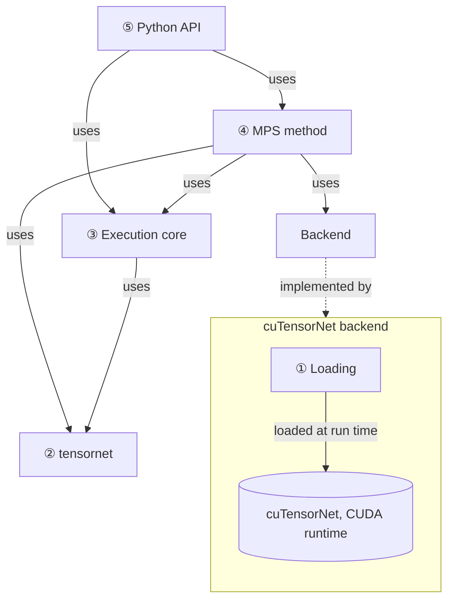
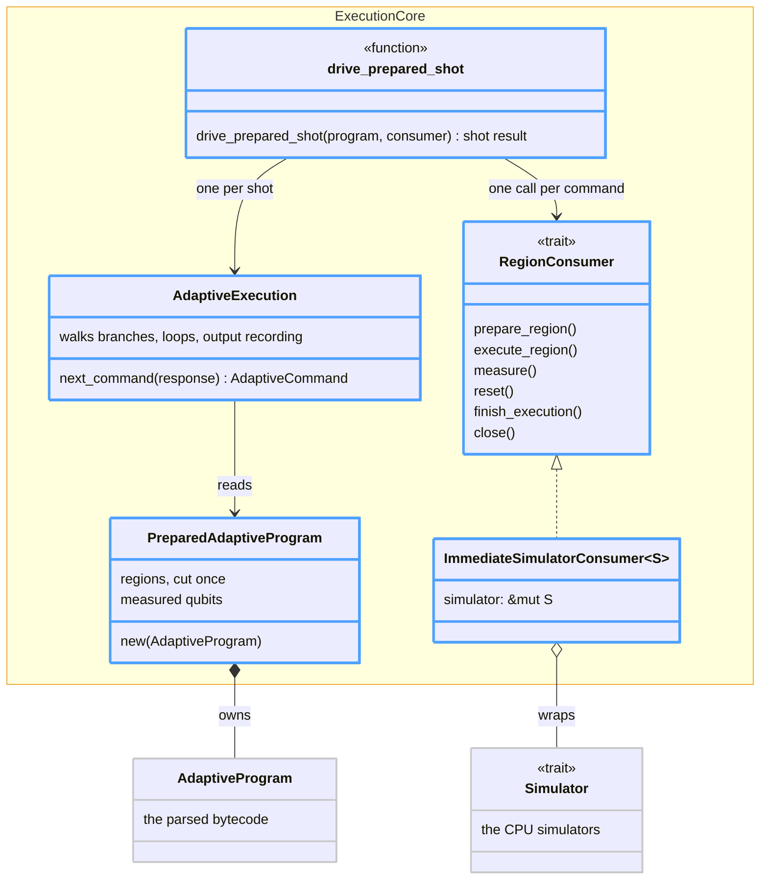
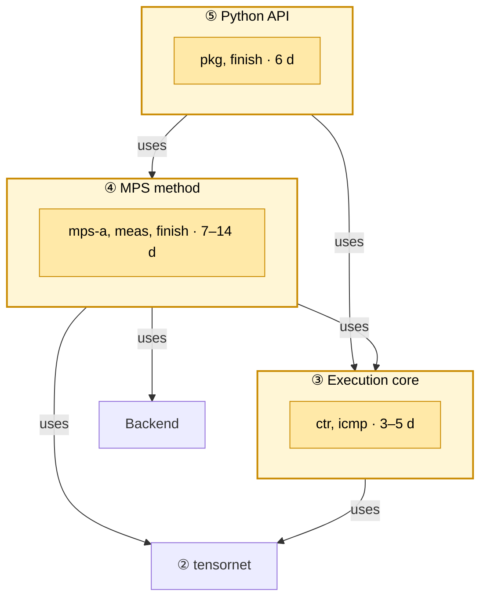
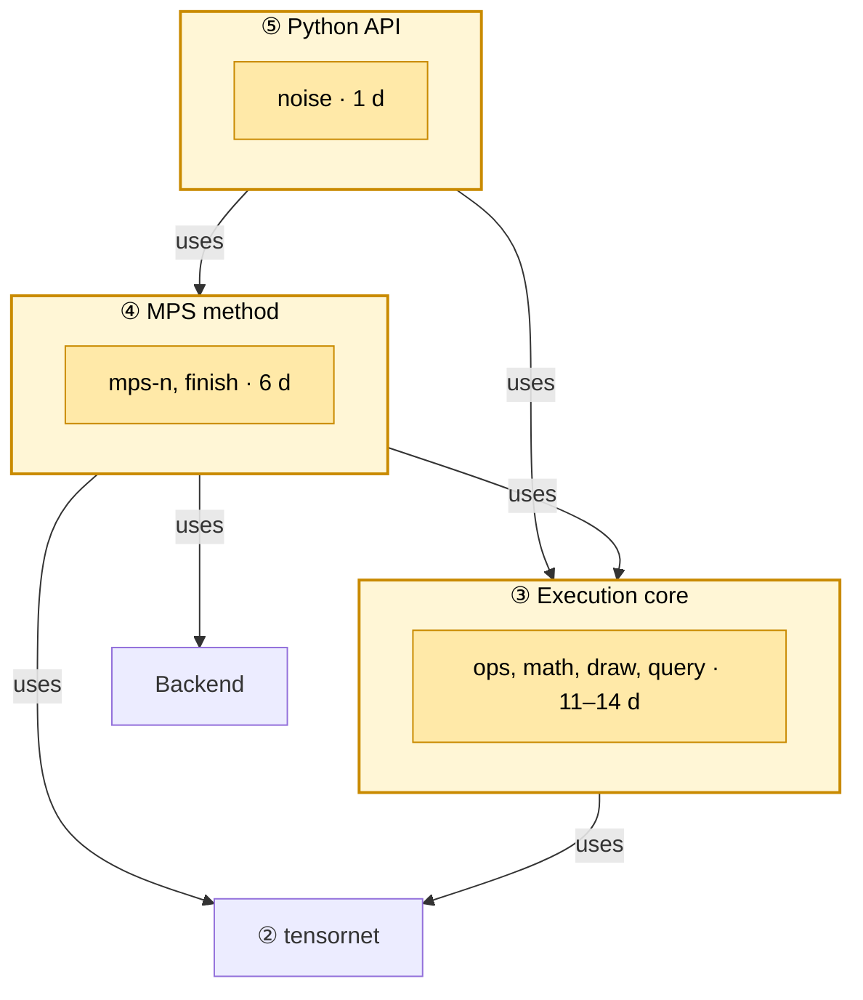
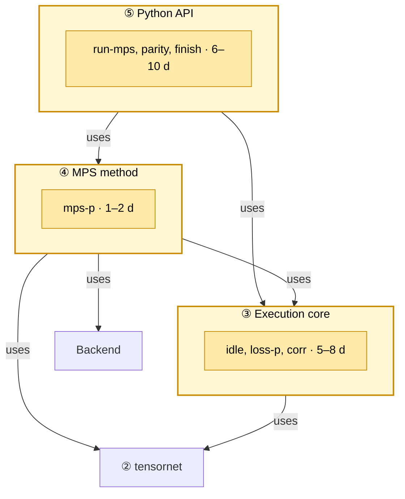

# Tensor-network simulation in the QDK: design

This document proposes how the QDK adds tensor-network simulation, starting
with matrix product states (MPS) on NVIDIA GPUs. It asks QDK developers to
approve the high-level design (§4) and the milestone approach (§3, §5) before
the first PRs. §1–§6 make the proposal; the appendices give the evidence and
can be read later.

## 1. The problem

The QEC user frames the two users' problems as one. The chemistry user's
quantum phase estimation (QPE) circuits, from `qdk-chemistry`, contain
non-Clifford rotations, each run fault-tolerantly as a gadget; the QEC user
simulates each gadget under noise and reports its logical performance, so
the chemistry user knows what to expect of his circuits. That needs two
simulations: the chemistry user's circuits, starting with H₂ and moving to
larger molecules, and the gadgets, starting with the Fire & Ice Rz1 gadget.
Both users want shots, as hardware gives them, and accept a controlled
approximation if its error is reported.

The QDK's simulators cannot meet both needs: sparse runs H₂, but the gadget
runs on none of them today, and larger molecules are expected to be out of
reach too (Appendix A). Qodec, new on `main`, adds no simulation method: it
drives dense, branching-stabilizer and Clifford engines, and shares their
limits.

## 2. Why tensor networks

The QDK's simulators, and the other options, have costs that grow with what the
gadget has plenty of. Dense grows with qubits: the gadget uses 56 at once, so a
dense state needs $2^{60}$ bytes. Sparse grows with non-zero amplitudes,
exponentially many in code states, and stabilizer-based methods with
non-Clifford rotations, several in some constructions. Appendix A compares
them. In the QEC user's words, "the TN approach is essential when we use
constructions with several 1Q rotations".

A tensor network's cost grows with entanglement instead. A matrix product state
(MPS) needs $32\,n\,\chi^2$ bytes for $n$ qubits, rather than the dense
$16\cdot2^n$, where the bond dimension $\chi$ grows with the entanglement
(Appendix B). That fits the users' needs (§1):

- **Size.** For the gadget, a bound gives $\chi\le4{,}096$: 28 GiB, within one
  80 GiB GPU.
- **Controlled approximation.** Past a cap on $\chi$, the MPS truncates and
  reports the discarded weight.
- **Shots.** It draws each mid-circuit measurement from the state, as hardware
  does.

We build it into the QDK on NVIDIA's cuTensorNet, a library loaded at run time,
so users keep their programs and tools.

## 3. Approach

We work backwards from the users. Each milestone starts from a program a
user gave us and the check that tells them it works, and builds only what
that program needs:

- **Build on what shows value.** A prototype, validated on an NVIDIA A100 and
  liked by both users, is ported to `domingom/tensor-network-simulation` one
  block per commit (§4); each commit can become a PR.
- **About a month each.** Larger work is split, so value never waits.
- **Production quality.** Each milestone ships tested, documented and
  installable.
- **Evidence revises the plan.** Measurements and feedback from each milestone
  reshape the later ones.

| Milestone | Delivers                                                                                                                          | For            | Checked by                                                  | Effort estimation                      |
| --------- | --------------------------------------------------------------------------------------------------------------------------------- | -------------- | ----------------------------------------------------------- | -------------------------------------- |
| M1        | H₂ QPE sampled on MPS without noise, installed with `pip install qdk[tensornetwork]`                                              | chemistry user | the shot results peak where the chemistry user expects      | 16–25 d; parallelizable down to 8–15 d |
| M2        | the Rz1 logical Bell test on MPS with Pauli noise and loss, scored from its logical parities, without a decoder steering the shot | QEC user       | without noise, the two logical outcomes match on every shot | 18–21 d; parallelizable down to 8–9 d  |
| M3        | parity with the QDK's simulators: the rest of the noise model; then `run_qir(type="mps")` makes MPS public                        | all QDK users  | a parity suite against the other `run_qir` types            | 12–20 d; parallelizable down to 6–10 d |

M4, optional, moves the CPU simulators and Qodec onto the execution core
(Appendix D). M5+ gathers proposals: a decoder steering the shot, the two
users' problems combined (§1), and other methods behind the same interfaces,
such as exact contraction, PEPS, tree tensor networks and Clifford-augmented
MPS.

## 4. High-level design

This section gives the design that holds for every milestone: the
requirements, and the functional blocks the milestones extend. §5 starts from
what the branch has today and shows what each milestone changes.

### 4.1 Requirements

- **Same semantics as `run_qir`.** A Base or Adaptive QIR program gives the
  same distribution of shot results, though not the same shot results for a
  given seed.
- **Weak simulation.** As on hardware, each mid-circuit outcome $r_k$ is drawn
  and fed forward: $P(r)=\prod_{k=1}^{M}P(r_k\mid r_{<k})$.
- **Several results per call:** shot results, expectation values and cost.
- **Trustworthy.** Nothing degrades silently: an approximation reports the bond
  dimension it reached and the weight it discarded, anything a method cannot do
  raises a typed error, and a seed reproduces its shot results.
- **Existing users unaffected.** `run_qir` and the existing simulators are
  unchanged, no build gains a GPU dependency, and vendor code stays in its
  backend's crate.
- **Extensible.** A method or backend plugs in at one place; running a program
  (branches, loops, shots, noise) is written once for all of them.
- **Testable.** Each part is tested through its contract against an independent
  oracle, mostly without a GPU (Appendix E).

Not in scope: backends other than cuTensorNet, and so devices other than NVIDIA
GPUs (§4.2); M4 (Appendix D).

### 4.2 Functional blocks

Five blocks, numbered from the lowest level to the highest. ④ is the first
method, and the box around ① the first backend, which implements the Backend ④
uses; others can be added beside them. A milestone changes what is inside the
blocks, not their dependencies (§5).



**① Loading** finds and loads cuTensorNet and the CUDA runtime at run time, so
no build depends on CUDA and users who don't need them are unaffected. Only
versions with an audited ABI load (Appendix C); a failure is a typed
availability error, raised by the query that needed the library.

**The cuTensorNet backend** is ① and the library it loads. A backend runs a
method's numerics on one library and device: memory, tensors, gate application
and truncation, and measurement marginals. cuTensorNet comes first: the gadget
needs a GPU (§2), and cuTensorNet applies gates to an MPS with truncation,
samples it, and optimizes contraction paths for later methods; CUDA-Q's
tensor-network backends use it too. Another backend, such as tensor4all-rs for
an MPS on the CPU, can be added beside it without changing the methods. Until
then, ④ calls cuTensorNet directly; the backend interface is extracted when the
second backend arrives, shaped by both.

**② tensornet** describes tensor networks (indices, networks, contraction
queries and plans, the MPS) but not how they are contracted, so the same
description goes to a GPU library, a CPU library or a test's reference
implementation.

**③ Execution core** runs a program once for every simulator, whether a
tensor-network method or an existing QDK simulator. It prepares the program,
walks branches, loops and shots, and keeps what simulators share: shot results,
each shot's seeded random stream and its noise. A simulator receives regions of
gates, measurements and resets, and never selects a branch. ③'s contracts
(consumer, queries, observables, contraction) are neutral to simulators and
backends, and ③ depends on none of them (§4.3).

**④ MPS method** represents the state as a chain of site tensors whose bonds it
truncates. It implements ③'s consumer contract and queries, describes its state
with ②'s `Mps`, takes gate matrices from ③'s shared tables, and runs its
numerics on a backend. Other methods (§3) can be added beside it without
changing ③ or ⑤.

**⑤ Python API** is `tensornetwork_qir`: a Base or Adaptive QIR program and a
list of queries in, one value per query out. It is a new function because
`run_qir` returns only shot results and takes no method options, and could not
gain either without changing its callers; M3 adds `run_qir(type="mps")` on top
of it (§5.4). `method` selects the method and `options.backend` the backend,
and with it the device; `seed` and `noise` are keywords, as on `run_qir`. ⑤
reaches methods and backends only by name, through ③'s contracts. For example,
H₂'s shot results and cost (§5.2):

```python
from qdk.simulation import Cost, MpsOptions, Sample, tensornetwork_qir

shots, cost = tensornetwork_qir(
    qir,
    [Sample(1000), Cost()],
    method="mps",
    options=MpsOptions(max_bond_dimension=256),
    seed=42,
)
```

Each query returns one value:

| Query                | Returns                                                                                       | Notes                                                                                                                                       |
| -------------------- | --------------------------------------------------------------------------------------------- | ------------------------------------------------------------------------------------------------------------------------------------------- |
| `Sample(shots)`      | shot results, as `run_qir` returns them                                                       | Base and Adaptive; `seed` reproduces them; the only query that accepts `noise` (M2)                                                         |
| `Expectation(terms)` | $\langle\psi\|O\|\psi\rangle$, $O=\sum_k c_k P_k$, from `(paulis, qubits, coefficient)` terms | $\psi$ is the state before the terminal measurements; a mid-circuit measurement is an unsupported-operation error, as in CUDA-Q's `observe` |
| `Cost()`             | a dict: the largest bond reached, the discarded weight, state and workspace bytes             | over the call's other queries                                                                                                               |

Errors subclass today's exceptions, so existing handlers keep working: device
unavailable and resource limit exceeded are `OSError`s; unsupported operation
and invalid input are `ValueError`s.

### 4.3 Execution core

On `main`, three interpreters run programs: the CPU runtime, the GPU
simulator's WGSL shader and Qodec's Python interpreter. Each has its own walk,
shot loop and opcode table, and hands its simulator one operation at a time. A
tensor-network method added to any of them, Qodec included, could not receive
regions (below) or answer queries such as `Expectation`; in Qodec, each
operation would also be a Python call holding the GIL. ③ writes the common part
once, in Rust, and Qodec can move onto it (Appendix D).

**Regions.** ③ prepares a program once, before any shot, and cuts each basic
block into _regions_: maximal runs of consecutive gates, closed by any other
instruction.

```text
 block 7:  cz cz h │ ADD │ cz s sx │ MEASURE │ READ_RESULT │ BRANCH
           └region┘        └region─┘
```

During a shot, the walk resolves a region's angles and qubits from the shot's
registers and hands the region to the simulator as one command. Regions let a
simulator:

- see many gates at once, to fuse them or to pay one GPU dispatch for them;
- recognize a region met again, in a loop or in another shot, since regions are
  cut statically; any per-region cache needs this.

**Classes.** ③'s classes are in blue, and the classes on `main` they build on
are in grey:



Three invariants hold:

- `PreparedAdaptiveProgram` is read-only, so shots share nothing mutable.
- `reset` is mandatory, so a simulator that cannot reset returns an error.
- `drive_prepared_shot` closes the simulator on every path, so device memory is
  released on errors too.

## 5. Milestone design

Each milestone is drawn on §4.2's blocks, with the blocks it changes
highlighted, and their tasks and effort. §5.1 is the starting point. Efforts
are for one implementer and include tests, not review; a task needs only the
tasks it lists and the milestones before it.

### 5.1 Today: the starting point

The table lists what each block has in the branch once the prototype is
ported (§3); links to the code follow once it is there.

| Block            | In the branch                                                                                                                                                                       |
| ---------------- | ----------------------------------------------------------------------------------------------------------------------------------------------------------------------------------- |
| ① Loading        | `source/cutensornet` (`bindings`, `library`): cuTensorNet 2.13 and CUDA runtime 12.9, audited, on Linux x86_64                                                                      |
| ② tensornet      | `source/tensornet`: `Index`, `Indices`, `TensorNetwork`, `ContractionQuery`, `ContractionPlan`, `Mps`                                                                               |
| ③ Execution core | `source/simulators/src/execution`: preparation and regions, the walk, `RegionConsumer`, `ImmediateSimulatorConsumer`, `PauliSum`, the shared gate tables, the contraction contracts |
| ④ MPS method     | `source/cutensornet` (`execution`, `library::simulation`): `Sample` of Base programs, `Expectation`, `Cost`; tested against test doubles, qualified on an A100                      |
| ⑤ Python API     | `source/qdk_package`: `tensornetwork_qir` with `Sample`, `Expectation`, `Cost`; `MpsOptions(backend, max_bond_dimension)`; `seed`                                                   |

### 5.2 M1: H₂ QPE on MPS

The chemistry user installs `qdk[tensornetwork]` and samples his H₂ QPE with
`tensornetwork_qir(qir, [Sample(shots)], method="mps")`. His acceptance test:
the shot results, qubits 0–4 read most significant first, peak at `01010` and
`10110`. These are the ±θ eigenphase pair (10 + 22 = 32), which also fixes the
bit order. The test needs no reference; the sparse simulator, which runs H₂,
adds a parity check.

H₂ has 29 qubits, 1,404 measurements and 399,537 instructions. Beyond what ③
supports today, it needs only `ICMP`, for 713 branch conditions on the XOR of
two or three results. Its 1,400 regions have a median of 7 gates and at most
351, so a shot's cost follows its measurements, not its gates.



| Block | Task     | Needs         | Effort     | Delivers                                                                                                                               |
| ----- | -------- | ------------- | ---------- | -------------------------------------------------------------------------------------------------------------------------------------- |
| ③     | `ctr`    | —             | 2–3 d      | `ShotContext { rng, log_p }`, with a random stream fixed by the seed and shot index; `measure` returns the outcome and its probability |
| ③     | `icmp`   | —             | 1–2 d      | the `ICMP` opcode, ported from the CPU runtime                                                                                         |
| ④     | `meas`   | `icmp`        | 1–2 d      | on the A100, the time per MPS measurement and the $\chi$ reached on H₂                                                                 |
| ④     | `mps-a`  | `ctr`, `icmp` | 1–2 wk     | adaptive `Sample`: measurements drawn from the MPS and fed forward; resets                                                             |
| ④     | `finish` | `mps-a`       | 1–2 d      | typed errors; bond reached and discarded weight in `Cost`, for `Sample` and `Expectation`                                              |
| ⑤     | `pkg`    | —             | about 1 wk | the `qdk[tensornetwork]` extra; GPU tests in the release pipeline                                                                      |
| ⑤     | `finish` | —             | 1 d        | typed Python errors; GIL released during GPU work                                                                                      |

The critical path is `ctr` → `mps-a` → `finish` (④), 8–15 days. `meas` runs in
week one, before `mps-a`; its numbers are not acceptance conditions.

### 5.3 M2: the Rz1 logical Bell test with noise on MPS

The QEC user samples the Rz1 logical Bell test, a [[20,2,6]] code on 56 live
qubits, with `tensornetwork_qir(qir, [Sample(shots)], method="mps",
noise=...)`, and scores the shot results offline; no decoder steers the shot.
M2 has two acceptance tests:

- Without noise, the two logical outcomes match on every shot, at non-Clifford
  angles. The test therefore needs no reference, and the QDK has none at this
  size.
- With noise, the shot results agree statistically with the CPU full-state
  simulator's under the same `NoiseConfig`, on smaller programs it can run.

Rz1 repeats a teleported rotation, doubling the angle, until the rotation
lands; each round's angle needs `cos`, `sin` and `arccos` of measured values.
Until those exist, a bounded form runs: at most 6 rounds, with angles fixed at
compile time. A shot that did not finish, with probability $2^{-6}$ per logical
qubit, is flagged. The bounded test lowers to about 28,600 instructions.



| Block | Task     | Needs   | Effort     | Delivers                                                                                                                                          |
| ----- | -------- | ------- | ---------- | ------------------------------------------------------------------------------------------------------------------------------------------------- |
| ③     | `ops`    | —       | about 1 wk | 10 opcodes ported from the CPU runtime: `ADD`, `ALLOCA`, `CALL`, `CALL_RETURN`, `GEP`, `LOAD`, `MOV`, `SELECT`, `STORE`, `XOR`                    |
| ③     | `math`   | —       | 2–3 d      | for the unbounded gadget, if needed: `cos`, `sin` and `arccos` in the lowering, bytecode and walk; new, since the CPU runtime lacks them          |
| ③     | `draw`   | —       | 2–3 d      | Pauli faults, loss and readout noise, drawn from `NoiseConfig` with the shot's random stream; the default `LossPolicy` skips gates on lost qubits |
| ③     | `query`  | —       | 2–3 d      | queries move from ④ to ③; ④ answers them, ⑤ calls ③; `tensornetwork_qir` is unchanged                                                             |
| ④     | `mps-n`  | `draw`  | about 1 wk | the drawn faults and loss applied to the MPS                                                                                                      |
| ④     | `finish` | `mps-n` | about 1 d  | typed errors and reports for the noise paths                                                                                                      |
| ⑤     | `noise`  | `draw`  | about 1 d  | `noise: Optional[NoiseConfig] = None`, checked as on `run_qir`; noise with a query other than `Sample` is a typed error                           |

The critical path is `draw` → `mps-n` → `finish` (④), 8–9 days. M2 reports the
$\chi$ reached on the gadget.

### 5.4 M3: parity with the QDK's simulators

Every `run_qir` user can choose MPS: `run_qir(qir, shots, noise, seed,
type="mps")` runs `tensornetwork_qir`'s `Sample` and returns the same results
as the other types. `type=None` still selects the GPU, then the CPU. The
acceptance test is the parity suite: on shared programs and noise models, MPS's
shot results agree statistically with every other `run_qir` type that runs the
program.

M3 completes `NoiseConfig` on MPS. As in M2, ③ draws the noise and ④ applies
it. `qodec` and `decoder` need a decoder that steers the shot (M5+), so they
are typed errors with `type="mps"`. `run_qir` takes no method options, so
`type="mps"` uses the `MpsOptions` defaults, $\chi\le128$, and warns when
truncation discards weight. To set $\chi$ or read the truncation costs, call
`tensornetwork_qir`. Efforts are estimated from the CPU simulator's code, not
the prototype's, and are revisited when M2 ends.



| Block | Task      | Needs                    | Effort | Delivers                                                                                       |
| ----- | --------- | ------------------------ | ------ | ---------------------------------------------------------------------------------------------- |
| ③     | `idle`    | —                        | 1–2 d  | idle noise (`IdleNoiseParams`), from each qubit's time since its last operation, as on the CPU |
| ③     | `loss-p`  | —                        | 2–3 d  | the four other `LossPolicy` variants: propagate, degrade, residual S†, apply anyway            |
| ③     | `corr`    | —                        | 2–3 d  | correlated-noise intrinsics, drawn as multi-qubit Pauli faults                                 |
| ④     | `mps-p`   | `idle`, `loss-p`, `corr` | 1–2 d  | those faults applied to the MPS                                                                |
| ⑤     | `run-mps` | —                        | 2–3 d  | `"mps"` among `run_qir`'s types, backed by `Sample`, with the same input checks                |
| ⑤     | `parity`  | `run-mps`, `mps-p`       | 3–5 d  | the parity suite, in the release pipeline                                                      |
| ⑤     | `finish`  | `run-mps`                | 1–2 d  | typed errors raised by `run_qir`, and the truncation warning                                   |

The critical path is `loss-p` or `corr` → `mps-p` → `parity`, 6–10 days.

## 6. What we know and what we don't

### 6.1 What we measured

On the prototype, on an A100:

- **Cost follows $\chi$, not depth.** On 128 qubits, sampling took 13 s at
  $\chi=46$ and 26 min at $\chi=2{,}048$.
- **Low entanglement scales far.** A 1,024-qubit quench, beyond every QDK
  simulator, took 34 s at $\chi=12$.
- **QEC programs can need a large $\chi$.** On the QEC user's Fire & Ice
  error-correction rounds, Clifford and so checkable, one record's probability
  on 78 qubits was exact only from $\chi=512$; at $\chi=256$ it was about 80×
  too small.

### 6.2 Limits we accept

Each is the cost of a choice in this design.

- **Adaptive shots run one at a time,** as in CUDA-Q's tensor-network backends;
  Base programs draw every shot from one state. This is a baseline: since each
  shot's random stream depends only on the seed and the shot index (§5.2),
  faster strategies, such as walking once the shots that share outcomes, can be
  added to ③ later.
- **NVIDIA GPUs on Linux x86_64 only,** until a second backend arrives (§4.2).
  Elsewhere, a query raises a typed availability error.
- **The GPU path is tested only at release,** not on every PR (Appendix E). PR
  CI covers it through test doubles.
- **The dependency is proprietary:** cuTensorNet is under NVIDIA's licence. The
  QDK redistributes nothing; users install NVIDIA's wheels (Appendix C).

### 6.3 What we don't know yet

- **M1** measures the time per MPS measurement on H₂, which has 1,404 per shot
  (`meas`, §5.2).
- **M2** reports the gadget's $\chi$ and its time per shot. If shots are too
  slow for the QEC user's statistics, calls with different seeds can spread
  them over GPUs, and Clifford-augmented MPS becomes the first proposal after
  M3.
- **The team** decides which cuTensorNet versions the extra accepts (Appendix
  C), and checks whether the release pipeline's GPU pool has an NVIDIA GPU
  (Appendix E).

## Appendix A. Alternatives to tensor networks

The QDK's simulators, and the other alternatives, each fall short:

| Alternative                                                                     | Cost grows with             | Why it falls short                                                                                    |
| ------------------------------------------------------------------------------- | --------------------------- | ----------------------------------------------------------------------------------------------------- |
| Dense full state, also on larger hardware                                       | qubits                      | near 30 qubits today; the gadget's 56 live qubits need $2^{60}$ bytes, beyond any machine             |
| Sparse, through `run_qir`                                                       | non-zero amplitudes         | the gadget's code states have exponentially many: more than 10 minutes per shot                       |
| Branching stabilizer, with random measurements absorbed into its Clifford frame | live non-Clifford rotations | the cost still doubles with each: it may fit gadgets with few, not those with several                 |
| Other methods (stabilizer rank, quasi-probability)                              | non-Clifford rotations      | the same limit, and not in the QDK                                                                    |
| Clifford stand-ins for the rotations                                            | —                           | they change what is measured: the gadget's non-Clifford behavior                                      |
| An external platform (CUDA-Q, Qiskit Aer)                                       | —                           | users leave the QDK: their Q# and QIR programs and noise models must be translated into another stack |

## Appendix B. Matrix product states

A matrix product state (MPS) stores one tensor per qubit rather than all $2^n$
amplitudes:

$$
\underbrace{16\cdot 2^{n}\ \text{bytes}}_{\text{dense}}
\qquad\qquad
\underbrace{|\psi\rangle \approx \sum_{s_1\ldots s_n} A^{[1]}_{s_1} A^{[2]}_{s_2}\cdots A^{[n]}_{s_n}\,|s_1\ldots s_n\rangle}_{\text{MPS: } 32\,n\,\chi^{2}\ \text{bytes},\quad \chi\approx 2^{S}}
$$

Each $A^{[k]}_{s_k}$ is a $\chi\times\chi$ matrix, where the bond dimension
$\chi$ is set by the entanglement $S$ across the chain's most entangled cut:
each Bell pair across a cut doubles it. Memory therefore grows linearly with
the qubits and exponentially only with the entanglement.

For the gadget, $\chi=256$ was measured with every rotation removed; with them,
a bound gives $\chi\le4{,}096$, so $32\cdot56\cdot4{,}096^2$ bytes, or 28 GiB,
within one 80 GiB GPU. The actual $\chi$ is measured in M2.

## Appendix C. cuTensorNet versions and installation

Which versions to accept is a question for the team (§6.3).

- **Install:** `pip install "qdk[tensornetwork]"` installs NVIDIA's own wheels
  from PyPI, under NVIDIA's licence, so the QDK redistributes nothing; a system
  install also works.
- **Audit:** a version loads only after its ABI is audited: bindings generated
  from its header, layouts checked at compile time, and the GPU qualification
  suite passing. Today only 2.13 with CUDA Runtime 12.9 is audited.
- **Suggestion:** accept the current release and the one before it, today 2.14
  and 2.13. The API has been stable, so auditing 2.14 means regenerating the
  bindings and running the suite.

## Appendix D. Other simulators on the execution core (M4)

The QDK's other simulators can run on ③ as M4, an optional milestone. On ③ a
simulator keeps only its numerics.

- **CPU full state and stabilizer:** they already run on ③ in its tests,
  checked against the CPU runtime; the per-shot overhead is still to be
  measured.
- **Qodec:** only its decoders are its own; ③ would take over the rest (below).
- **GPU full state:** stays. Its shader advances a batch of shots on the
  device, while ③ walks one shot at a time on the host, with up to about 6,500×
  more round trips at ≤ 11 qubits.

**Qodec on ③.** Qodec is an execution framework in Python, and every part
except its decoders has a counterpart on ③. On ③, Qodec would:

- drop three Python copies of what the QDK has in Rust: its interpreter with
  its opcode table, its noise sampling (a fourth copy) and its stabilizer
  simulator;
- gain the tensor-network methods as they are, with regions and plan reuse,
  rather than through a Python adapter per method;
- run shots in Rust with the GIL released, so they can run in parallel. It is
  likely faster too, since Qodec already routes Clifford single-layer runs
  around its interpreter (`native_batch.py`). One gadget benchmark, run both
  ways, confirms the gain.

In return, ③ gains a gadget-call opcode, consumer composition, a Pauli frame
and a shot-failure policy, which every backend can use. The move costs more to
start than extending Qodec in Python, and Qodec is still changing. It therefore
lands in phases, behind an unchanged `run_qir(qodec=...)`, on a plan agreed
with Qodec's owners.

**Recommendation:** decide M4 after M3. By then the parity suite can guard the
move, and ③'s per-shot overhead is measured. Move the CPU simulators first,
since they already run on ③. Move Qodec if its owners agree and the gadget
benchmark confirms the gain. Keep the GPU simulator. M4 changes existing users'
default paths, so it is its own milestone.

## Appendix E. Testing in CI

| Where                                          | What runs                                                                                                                                                                                                        |
| ---------------------------------------------- | ---------------------------------------------------------------------------------------------------------------------------------------------------------------------------------------------------------------- |
| Every PR, no GPU                               | public-API tests (Rust and Python); test doubles of cuTensorNet's API; brute-force contraction of small networks; checks that the bindings and loader match their generator; the parity suite for CPU simulators |
| Release pipeline's GPU pool, `QDK_GPU_TESTS=1` | library discovery; GPU qualification against closed forms and the dense simulator; the parity suite for MPS                                                                                                      |
| An A100, by hand                               | H₂ and the gadget at full size, which need more memory than a CI GPU may have                                                                                                                                    |

Whether the release pool has an NVIDIA GPU is a question for the team (§6.3).
If it doesn't, the GPU tests need an NVIDIA pool.
