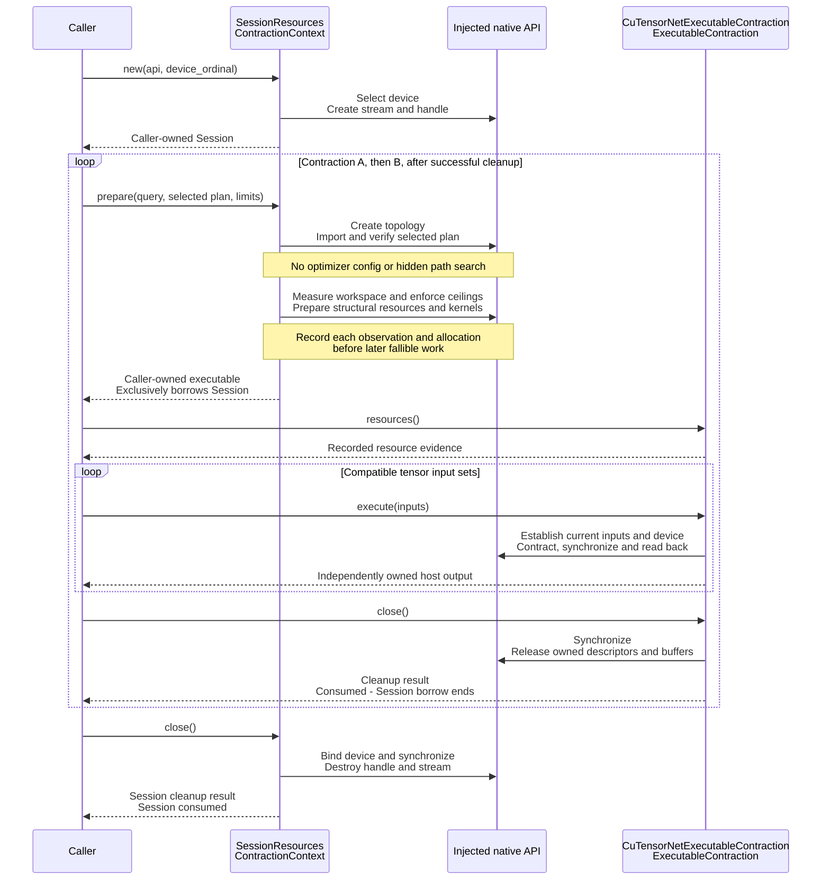

# qdk_cutensornet

> [!IMPORTANT]
> This crate is work in progress, and this README is a living design and
> implementation guide. It must be reviewed and updated in every phase so that
> implemented behavior, planned layers, ownership decisions, and validation
> evidence remain clearly distinguished.

`qdk_cutensornet` is the experimental Rust boundary between QDK and NVIDIA
cuTensorNet. The work is staged so that optional GPU acceleration does not make
CUDA part of QDK's ordinary build or startup contract.

The implemented loader can explicitly discover and validate the CUDA Runtime
and cuTensorNet at runtime. It is Linux x86-64 only and introduces no
native link-time dependency; instead, it uses
[explicit runtime dynamic loading](#why-dynamic-loading). Building QDK, loading
another QDK component, and using CPU simulation require none of the following:

- an NVIDIA GPU;
- a CUDA or cuTensorNet installation;
- NVIDIA headers or shared libraries; or
- a CUDA-aware linker configuration.

The crate also contains a private, test-only qualification layer. B0 and B1
have executed on an A100: they own the device, stream, handle, state,
workspaces, retained operators, and MPS outputs; support variable widths and
metadata-only readout; and report requested/realized extents and workspace.
B2 product-term expectation support is A100-qualified at widths 12, 16, and 20
against retained exact values and one independently refreshed QDK sparse-state
oracle. Private B3 evidence qualifies the N=128 matched-bond anchor and exact
pre-cleanup Query timing boundary. Private B4 spike evidence qualifies the
N=256 cap ladder through its converged upper plateau. Private B5 gate-1 evidence
qualifies caller-selected forced-Z branch masses, normalized non-unitary
projection, MPS capture, continuation, and Query on the same GPU-resident state.
Later Adaptive execution gates, noise, public API work, and QDK integration
remain unimplemented pending their review stops. None of these private fixtures
is a public QDK API, provider integration, or product architecture precedent.

## What this crate contains

The implementation is split into narrow layers so that generated ABI facts,
runtime availability, native resources, and QDK integration do not acquire
overlapping responsibilities.

Phase 2 works with two native shared libraries. The CUDA Runtime
(`libcudart.so.12`) provides the selected CUDA version, device, memory, and
stream APIs. NVIDIA cuTensorNet (`libcutensornet.so.2`) provides the tensor
network API. Discovery loads and validates both libraries, although it invokes
only their approved version and error probes and performs no GPU work.

| Layer                      | Location                                          | Status                                                                                     | Responsibility                                                                                                                                      |
| -------------------------- | ------------------------------------------------- | ------------------------------------------------------------------------------------------ | --------------------------------------------------------------------------------------------------------------------------------------------------- |
| Generated cuTensorNet ABI  | `src/bindings/v2_13.rs`                           | Implemented                                                                                | Reduced declarations generated from the audited cuTensorNet 2.13 header.                                                                            |
| Audited CUDA Runtime ABI   | `src/bindings/cudart_12.rs`                       | Implemented                                                                                | Hand-audited declarations for the 12 CUDA Runtime calls required by the spike.                                                                      |
| ABI assertions             | `src/bindings/mod.rs`                             | Implemented                                                                                | Compile-time size, alignment, offset, and selected constant checks.                                                                                 |
| Version policy             | `src/version.rs`                                  | Implemented                                                                                | Accepts only the audited cuTensorNet and CUDA Runtime versions.                                                                                     |
| Dynamic loader             | `src/library.rs`                                  | Implemented                                                                                | Opens `libcudart.so.12` and `libcutensornet.so.2`, resolves typed function tables, probes versions, and retains library guards.                     |
| Availability API           | `src/lib.rs`, `src/error.rs`                      | Implemented                                                                                | Exposes explicit discovery, a report, and structured failures without exposing raw FFI.                                                             |
| Native qualification       | `src/library/simulation*`                         | Private B0-B5 gate-1 qualified                                                             | Owns thread-confined native resources and validates Base execution, terminal product-term Queries, cap convergence, and forced-branch continuation. |
| Native path metadata       | `src/library/simulation/contraction*`             | Private implementation; native acceptance separate                                         | Builds topology, optimizes or imports a binary path, and copies path/slicing/structural metadata into owned Rust storage. No numerical contractor.  |
| Shared contraction adapter | `src/library/simulation/contraction/adapter.rs`   | Private; shared-route native qualification pending                                         | Implements the optimizer, checked portable-plan import and `ContractionContext` directly on Session.                                                |
| Native contraction         | `src/library/simulation/contraction/execution.rs` | Reusable inputs host-tested; earlier fixed-input diagnostic/2x2/4x4 route native-qualified | Prepares structure without search, owns resident inputs and scratch, replaces/rebinds inputs and returns owned outputs.                             |
| QDK provider integration   | Future phase                                      | Not implemented                                                                            | Will translate QDK simulation requests without exposing native details to callers.                                                                  |

The raw bindings, function tables, library guards, resolver seam, and native
status mapping are private. The only public Phase 2 capability is
`discover() -> Result<Availability, AvailabilityError>`.

## Runtime discovery

Discovery is explicit and lazy. No global loader cache or startup hook exists.
If `discover()` is never called, this crate does not inspect the host, open a
native library, probe a version, perform GPU work, or produce an error. Phase 2
has no hidden operation that requires prior initialization.

When availability is requested, the caller handles the result of `discover()`.
The function returns an `AvailabilityError` rather than panicking when the
platform, configuration, native libraries, symbols, or versions are unsuitable.
A future QDK provider should call `discover()` inside its own preparation path
and propagate that structured error, rather than require application code to
remember a separate initialization call.

The discovery transaction is:

1. Reject targets other than Linux x86-64 with `UnsupportedPlatform`.
2. Validate any explicit library overrides before loading either library.
3. Open the CUDA Runtime with `RTLD_NOW | RTLD_LOCAL`.
4. Resolve its complete 12-function table.
5. Open cuTensorNet with `RTLD_NOW | RTLD_LOCAL`.
6. Resolve all 54 required cuTensorNet functions and the optional
   `cutensornetGetLastError` diagnostic.
7. Probe the loaded CUDA Runtime, CUDA driver API, cuTensorNet runtime, and the
   CUDA Runtime ABI used to build cuTensorNet.
8. Apply the exact version policy and return an `Availability` value that keeps
   both libraries alive longer than every copied function pointer.

Construction is all-or-nothing. Every opened library is immediately protected
by a Rust RAII guard, and no partially initialized function table or
availability value can escape on failure. This is implemented in Rust in
`src/library.rs`: `LoadedLibrary` owns a `libloading::Library`, local values are
advanced through each fallible step with `Result` and `?`, and Rust drops every
successfully constructed guard if a later step returns an error.
`libloading::Symbol` values are not retained; plain typed function pointers are
copied out while their owning libraries stay alive.

### Loader flags

On Linux, `libloading` opens each shared object through `dlopen` with
`RTLD_NOW | RTLD_LOCAL`:

- `RTLD_NOW` requires the operating-system loader to resolve undefined symbols
  before the open succeeds. Missing transitive dependencies therefore fail at
  discovery instead of appearing later during simulation.
- `RTLD_LOCAL` keeps symbols from the opened object out of the process-global
  symbol namespace. This avoids making QDK's optional backend an implicit
  dependency of subsequently loaded components and reduces symbol collisions.

Together, these flags provide an early, bounded validation point without
polluting global process state. Transitive dependencies are still resolved by
the operating-system loader according to its normal rules.

### Failure reporting

Discovery failures preserve the context needed by a provider or user to
diagnose the installation:

- unsupported target platform;
- invalid override variable, path, and reason;
- every default path or loader name attempted for a missing library;
- the selected library path and native loader message for load or transitive
  dependency failures;
- the library path and exact missing required symbol;
- the component, observed version, and accepted version for policy failures;
  and
- the native status and copied CUDA error text for failed version probes.

There is no "call `discover()`" error when discovery is omitted because code
that is never invoked cannot return an error. Once an acceleration path is
requested, its owning provider is responsible for calling `discover()` and
surfacing the returned message or selecting an allowed fallback.

### Search policy

| Component    | Exclusive override        | Ordered defaults                                                                            |
| ------------ | ------------------------- | ------------------------------------------------------------------------------------------- |
| cuTensorNet  | `QDK_CUTENSORNET_LIBRARY` | `/usr/lib/x86_64-linux-gnu/libcuquantum/12/libcutensornet.so.2`, then `libcutensornet.so.2` |
| CUDA Runtime | `QDK_CUDART_LIBRARY`      | `/usr/local/cuda-12.9/targets/x86_64-linux/lib/libcudart.so.12`, then `libcudart.so.12`     |

An override must be an absolute path to an existing regular file or symlink.
When set, it is attempted exclusively, so a bad deployment configuration does
not silently fall back to another installation. The default search is finite
and ordered; this crate does not walk the filesystem or guess unreviewed
versions. Transitive native dependencies are resolved by the operating-system
loader, and their failures retain the attempted path and loader message.

### Version policy

The accepted values are deliberately exact:

- cuTensorNet runtime: `21300` (2.13.0);
- CUDA Runtime: `12090` (12.9); and
- cuTensorNet's reported CUDA Runtime ABI: `12090`.

The CUDA driver API version is reported for diagnostics. It is not substituted
for either CUDA Runtime check. Unknown versions fail before device selection or
native handle creation; a newer version is not assumed ABI-compatible.

## FFI and ABI boundary

The FFI layer describes how Rust calls the C libraries. The ABI policy defines
the exact binary layouts, calling conventions, constants, symbols, and runtime
versions for which those calls have been audited. Both are intentionally
private and narrower than the complete NVIDIA APIs.

### Scoped declarations

- `src/bindings/v2_13.rs` is generated from the checksum-identified official
  cuTensorNet 2.13 header. It contains 55 selected functions: 54 required for
  discovery, state replay, expectations, sampling, general contraction and
  logging, plus the optional `cutensornetGetLastError` diagnostic and their
  required type/constant closure.
- `src/bindings/cudart_12.rs` contains hand-audited declarations for the 12
  CUDA Runtime functions needed by discovery and the planned resource layer.
- Function pointers use exact private `unsafe extern "C"` types. Unsafe loading,
  symbol resolution, and native probe calls remain inside the crate; the public
  `discover()` API is safe Rust.
- The owning `libloading::Library` guards outlive all copied function pointers.
  Borrowed native C strings are copied into Rust-owned `String` values before
  another native call can invalidate them.
- Discovery resolves the full approved tables atomically but invokes only
  version and error probes. Resolving future state, workspace, memory, and
  stream calls does not execute them.

Ordinary Cargo builds consume only the checked-in Rust declarations. They do
not run bindgen, inspect an SDK header, execute a build script, or pass a native
link directive.

### Compile-time ABI checks

On the supported Linux x86-64 target, `src/bindings/mod.rs` rejects compilation
if the selected ABI facts drift. It checks:

- 32-bit size and alignment for represented cuTensorNet/CUDA status and enum
  values;
- 64-bit size and alignment for opaque cuTensorNet handles and CUDA streams;
- a 16-byte size and alignment, with real and imaginary fields at byte offsets
  0 and 8, for the private complex-f64 storage type intended for
  `CUDA_C_64F` buffers; and
- selected constants including `CUDA_C_64F` and host-to-device and
  device-to-host copy directions.

Path and slicing attribute payloads also have size, alignment and field-offset
assertions. Their Linux x86-64 layouts, in bytes, are:

| Type                           | Size | Alignment | Field offsets                      |
| ------------------------------ | ---- | --------- | ---------------------------------- |
| `cutensornetNodePair_t`        | 8    | 4         | `first`: 0, `second`: 4            |
| `cutensornetContractionPath_t` | 16   | 8         | `numContractions`: 0, `data`: 8    |
| `cutensornetSliceInfoPair_t`   | 16   | 8         | `slicedMode`: 0, `slicedExtent`: 8 |
| `cutensornetSlicingConfig_t`   | 16   | 8         | `numSlicedModes`: 0, `data`: 8     |

The selected cuTensorNet calls pass complex tensor storage through device
`void *` buffers rather than passing a complex struct by value. The future safe
layer must still use the asserted private storage representation and explicit
conversion instead of assuming that a general Rust complex type has the C ABI.

These assertions do not claim compatibility with another operating system,
architecture, CUDA major version, header ABI, or cuTensorNet runtime. Support
for any of those requires a separate retained audit. Native status conversion
also preserves unknown numeric values so a new status is not silently
misclassified.

## Why dynamic loading

Runtime loading is the best fit for this optional QDK capability because it:

- keeps ordinary QDK builds and packages independent of proprietary GPU
  installations;
- prevents a missing NVIDIA library from breaking process startup or unrelated
  simulation methods;
- turns absence, transitive dependency failures, missing symbols, and version
  mismatches into actionable Rust errors;
- allows deployments and tests to select exact shared objects without changing
  global loader configuration; and
- keeps support tied to an audited ABI policy instead of whatever SDK happened
  to be present at build time.

Static or load-time linking would move an optional deployment concern into
every QDK build and process. A process-global native singleton was also
rejected: it would hide device and lifetime ownership, complicate tests, and
couple independent simulation workers. Dynamic loading costs a small explicit
discovery step and requires a maintained symbol/version policy; those are
appropriate costs for preserving QDK's existing CPU and cross-platform paths.

## Key data structures and ownership

### Implemented availability layer

- `AvailabilityReport` is cloneable data containing the selected paths and
  observed versions. It owns no native resource.
- `Availability` owns the report and the private loader owner, ensuring that
  loaded libraries outlive their copied function pointers.
- `LoadedLibrary` owns one path and one `libloading::Library` guard.
- `CudaFunctions` and `CuTensorNetFunctions` are immutable typed function
  tables. Required tables are constructed atomically.
- `CuTensorNetApi` owns immutable shared-library guards plus immutable function
  tables, with no CUDA device or cuTensorNet execution handle.

The initial Phase 1 implementation conservatively made the whole availability
owner `!Send` and `!Sync`. The subsequent NVIDIA cuTensorNet API and NVIDIA
CUDA-Q implementation review showed that this was too broad. The selected
ownership model is:

```text
Provider root
`- Arc<CuTensorNetApi>            Send + Sync
   |- CUDA Runtime Library + immutable function table
   `- cuTensorNet Library + immutable function table

Worker thread
`- MpsSession                    !Send + !Sync
   |- ExecutionPolicy
   |- SessionResources
   |  |- selected device ordinal and CUDA stream
   |  `- cuTensorNet handle
   `- shorter-lived MpsExecution (borrows API; parent handles stay live)
      |- state and workspaces
      `- retained gate, scratch, and output buffers
```

Only the loader/function-table owner is shared. This is not a claim that a
cuTensorNet handle, state, workspace, stream, or buffer graph is safe to share.
The initial broad thread-confinement marker has been removed from this
immutable owner; mutable `MpsSession` remains the confinement boundary.

### Private qualification session

`SessionResources` records the selected device and owns the stream and handle
independently of MPS policy. It does not own the GPU. It is structurally
`!Send` and `!Sync`; `MpsSession`
contains that owner plus its unchanged `ExecutionPolicy`. Native contraction
metadata borrows `&mut SessionResources`, so its parent cannot close or be
reused while a child is alive. Safe external callers receive no raw pointers.

`SessionResources::new(api, device_ordinal)` takes a retained native
API/library owner and a device selection, not a contraction or memory request.
It checks device availability, selects the device, creates a CUDA stream and
creates a cuTensorNet handle. Each native call can fail; partial construction
cleans up acquired resources and preserves primary/cleanup errors. The stream
is an ordered queue for GPU work, not a communication connection. The
cuTensorNet handle is the library's execution context, not a quantum state.
The Session groups these resources; it is a QDK abstraction, not a separate
NVIDIA Session object or an explicitly created CUDA context.

Creating a Session does not allocate the contraction's coefficient, output or
scratch buffers. Structural preparation determines output/workspace
requirements, checks the device/host scratch ceilings and allocates those buffers,
without initial coefficients. The reusable-input interface separates this from
explicit registration/replacement and complete per-run bindings. Explicitly
registered inputs remain until executable close; same-shape replacement reuses
capacity, and execution adds no input allocations. Any registration, replacement
or execution error makes the executable unusable, with reports and close still
available. Actual allocations
hold memory until cleanup; a planning budget, execution ceiling or free-memory
observation does not reserve memory. Neither the Session nor these allocations
reserve exclusive GPU compute capacity or impose a total GPU-memory limit.

**Implemented ownership:** `ContractionContext` replaces the separate
`ContractionExecutor`. `SessionResources<Api>` implements this capability directly: the caller
prepares a query and selected plan on Session and receives an owned
`CuTensorNetExecutableContraction<'session, Api>` implementing `ExecutableContraction`.
There is no additional Context object or separate Executor to bind and unbind.
The shared trait, native adapter and portable lifetime witnesses have migrated
together. Native qualification of this reusable-input route remains pending.

**Implemented input semantics:** the executable accepts different
tensor values/bindings on successive executions without rebuilding its
structure. Registration/replacement accepts a synchronous `TensorInput` view
of ordered dimensions and contiguous column-major complex values; host views
do not escape the call. Opaque `InputId` values are local to one executable.
The [shared data-reuse, noise and loss design](../simulators/src/execution/README.md#tensor-data-reuse-noise-and-loss-design)
defines the distinction, including resident matrix sharing, update lifetimes,
and why loss needs more than a pre-sampled Pauli-like binding. Subsequent review
approved executable-owned resident input storage and separate
registration/replacement from complete per-run binding selection. Slice 3b
implements these operations without noise orchestration or Pauli-only restrictions.

The approved ownership model retains the existing **exclusive Session borrow**:
the caller owns both the Session and the returned executable. The executable
owns its contraction resources and exclusively borrows the caller's Session.
Preparation is a factory method on Session through the shared Context trait,
not a transfer of Session ownership to the executable.

```text
Caller
  |-- owns Session
  `-- owns ExecutableContraction
        |-- owns contraction-specific native resources and resident inputs
        `-- exclusively borrows Session until close
```

Responsibilities remain separate:

| Owner or capability                                                         | Responsibility                                                                                                                                             |
| --------------------------------------------------------------------------- | ---------------------------------------------------------------------------------------------------------------------------------------------------------- |
| `SessionResources<Api>` / `ContractionContext`                              | Own the selected device information, CUDA stream and cuTensorNet handle; prepare a supplied plan without search.                                           |
| `CuTensorNetContractionOptimizer`                                           | Temporarily borrow Session for explicit path search; return an owned portable plan and planning report; close its temporary children.                      |
| `CuTensorNetExecutableContraction<'session, Api>` / `ExecutableContraction` | Own topology, prepared resources and resident input storage; exclusively borrow Session; execute supplied inputs, report resources and close its children. |
| Caller                                                                      | Own Session and each returned executable; retain outputs and error outcomes; close Session separately after its children are gone.                         |

The Context lifetime is explicit in the approved lifetime direction
`prepare<'session>(&'session mut self, ...) -> Result<Self::Executable<'session>, ...>`.
It is the actual Session borrow, not a borrow of a temporary Executor or of the
local query/plan. Implementing the capability on Session does not make Session
store an executable that borrows its own fields.

After successful executable cleanup, the caller can prepare a different
contraction on the same Session, then eventually close Session itself. The
following diagram shows the successful sequential lifecycle; each loop
iteration creates a fresh executable. Inside each iteration, compatible
input changes reuse that executable; they do not require the outer loop.



This is sequential reuse, not multiple live executables sharing one Session.
Session does not store or orchestrate an executable. `resources`, `execute`
and executable `close` belong to the returned owner, not Session. The
executable uses Session's API, device, handle and stream; closing it does not
close Session. Separate Sessions support independently closable live owners
created from reusable plan/coefficient storage. This model introduces neither
per-executable Session ownership nor shared-session interior mutability.

Failed preparation cleans up acquired children and returns a by-value
`PreparationFailure` with partial resource evidence, the primary error and a
separate optional cleanup error. It leaves no executable retaining the Session
borrow. Executable close consumes its owner and ends its borrow even on cleanup
error; neither outcome promises native/device health after failed cleanup.
Record successful measurements and allocations incrementally, preserving
unknown versus known-zero observations and requirements versus actual
allocations. Session construction and final Session cleanup have their own
results, outside preparation's failure envelope.

The [shared contraction contracts](../simulators/src/execution/README.md#shared-contraction-contracts-i3)
define the lifetime-indexed prepared owner, synchronous methods and failure
sequence. The ownership/wiring direction, resident-input operations and policies,
native/shared report representation and host-allocation seam are implemented.
`CuTensorNetResourceReport` embeds `ResourceReport` plus optional native cache
recommendations. Selected bytes/count describe the last fully validated
selection; resident bytes/count include unselected candidates and failed-upload
allocations. Required/recommended sizes remain distinct from actual acquisitions.
Every input/execute failure poisons the owner, including preflight errors;
`UnusableContraction`, resource inspection and consuming cleanup make that
state explicit. Early preparation failures preserve primary and cleanup errors
separately by value.
The [shared implementation boundary](../simulators/src/execution/README.md#implementation-boundary-and-required-evidence)
records these decisions and the resource-keyed native API double's
input-dependent analytical coverage. Its real host-scratch owner is exercised
through `ContractionExecutionApi::allocate_host_scratch`, including injected
allocation failure. Native shared-route qualification
remains a later gate; private-route results do not qualify these new adapters.
That later VM/A100 gate must cover representative automatic/explicit planning
budgets, execution scratch ceilings, search effort, thread counts, seeds, rank
simplification settings and supplied plans with no search. Use broad tiny-case
coverage and a few representative frozen 4x4 cases, not a Cartesian sweep.
Finalize its settings from slice 3b evidence; VM delivery and GPU execution
still require separate authorization.

`MpsExecution` owns one MPS state and its execution/readout resources under a
live `MpsSession`. `MpsExecutionApi` and `ContractionApi` are private cuTensorNet
injection boundaries, implemented by `CuTensorNetApi`, not shared Execution
Framework interfaces. `SessionApi` provides their common context lifecycle.
`MemoryWorkspaceApi` supplies shared allocation/copy and workspace primitives;
MPS retains its recommended-device-scratch wrappers and State-specific calls.
`ContractionExecutionApi` adds only the general-contraction native operations.
These generic owners and injected host tests compile on every platform. The
concrete NVIDIA implementations and native qualification remain Linux/x86-64-only.

This boundary follows the evidence:

- NVIDIA documents `cutensornetCreate` as thread-safe, but state, workspace,
  contraction, and sampling calls operate on mutable `inout` objects, retained
  buffers, internal metadata, or per-instance PRNG state. A handle is fixed to
  the CUDA device active when it is created.
- CUDA-Q creates one thread-local tensor-network simulator. That simulator owns
  its handle, state, scratch memory, cache, and PRNG, and deletes copy and move
  construction.

### Private general-network metadata

The reusable metadata layer accepts the existing `tensornet::ContractionQuery`.
It preserves input-node and output-axis order and checks narrowing at the
native boundary. It appends every input, sets the explicit complex-f64 output
and fp64 compute type, and **only then creates optimizer info**. The returned
native tensor IDs are retained separately: NVIDIA permits nonsequential IDs,
and they are not contraction-path positions. `set_path` and `set_slicing`
copy supplied metadata into native optimizer info without searching.
`read_path` and `read_slicing` fill caller-owned buffers; neither selects a path.

```text
SessionResources (device / stream / handle; no MPS policy)
    |
    +-- borrowed ContractionResources
          inputs -> explicit output/compute type -> optimizer info
              |                                  |
              +-- optimize(settings)              +-- import(selected metadata)
              |       explicit search             |       no search or config
              +------------------+-----------------+
                                 |
                        export owned NativeMetadata
                        inspect native intermediates/estimates
                                 |
                        close children -> close session
                                 |
                        owned copies remain usable
```

`NativeMetadata` is a private copy of NVIDIA's positional path, sliced
mode/extent pairs and slice count. It is **not** the portable contraction
plan or shared contraction contracts. This layer qualifies
complete binary paths over at least two inputs and full internal slicing
with sliced extent one. It rejects unsupported slicing rather than dropping
it, completing a path or silently optimizing a replacement. It binds no
coefficients, allocates no contraction workspace, and performs no contraction.

#### What a positional path means

The pinned SDK declares the path interchangeable with `numpy.einsum_path`.
Its expected interpretation is: select two positions in the current operand
list, remove both operands while preserving the other operands' order, and
append the result. Positions are recycled, not stable IDs:

```text
[A,B,C,D] --(1,2)--> [A,D,X] --(0,2)--> [D,Y] --(0,1)--> [Z]
```

For `A[a,b] B[b,c] C[c,d] D[d,e] -> [a,e]`, the native qualification fixtures
use dimensions `[2,3,5,7,11]` and labels `[11,23,37,53,71]`.

| Supplied path         | Expected intermediate mode sets |
| --------------------- | ------------------------------- |
| `(1,2), (0,2), (0,1)` | `{b,d}`, `{a,d}`, `{a,e}`       |
| `(2,3), (1,2), (0,1)` | `{c,e}`, `{b,e}`, `{a,e}`       |

The table defines expectations independently of the host test double.
The native tests read `NUM_INTERMEDIATE_MODES` and
`INTERMEDIATE_MODES`, comparing **sets**, not an assumed intermediate axis
order. They also export an optimized path, close its native owners and import
the owned metadata into a fresh network. A separate case imports internal mode
`b` with extent one and requires three slices. No optimizer call occurs during
import, including when structural diagnostics are unavailable.

Qualification on cuTensorNet 2.13 / CUDA Runtime 12.9 with an A100 observed
both supplied paths' intermediate mode sets exactly as listed. Manual import
provided the native structural attributes without another optimizer call.
Optimize/export/close/fresh-import preserved path, slicing and intermediate
mode sets; internal mode `b` at unit extent round-tripped with three slices.
All explicit topology and session cleanup calls succeeded. These observations
qualify this fixture and metadata subset, not arbitrary networks or numerical
execution. Native intermediate axis order remains unconstrained.

Path echo alone does not establish interpretation. A missing or inconsistent
native structural result fails the structural qualification with an explicit
acceptance gap; it must not be replaced by host-computed metadata. Even these
metadata checks do not establish numerical contraction or execution order.
Those require later Context/executable qualification through the shared interface.

The optimization case explicitly requests a **64 MiB workspace constraint**,
one hyper-sample, one thread, seed 17, zero reconfiguration iterations,
disabled deferred rank simplification and disabled automatic slicing. These
are qualification settings, not production defaults. The constraint is not an
allocation or a total-memory cap. Other attributes retain pinned-SDK defaults,
including the FLOPS objective and CUTENSOR memory model. The selected path is
not pinned merely because the seed is fixed. Native FLOP and largest-tensor
estimates are reported separately; no complex-operation counting convention or
inclusion of the output in the largest-tensor metric is inferred.

The attribute layouts and ranks come from the pinned
[2.13 types](https://docs.nvidia.com/cuda/cuquantum/26.06.0/cutensornet/api/types.html)
and checked-in bindings. The caller-allocated path/slicing buffers and flat
intermediate-mode retrieval follow the pinned SDK's
[`OptimizerInfoInterface`](https://github.com/NVIDIA/cuQuantum/blob/v26.06.0/python/cuquantum/tensornet/_internal/optimizer_ifc.py).
The wrapper checks returned counts and never adopts a returned foreign pointer
as Rust-owned storage.

Host tests inject `TestDoubleContractionApi` through the same production owner
to check ordering, nonsequential IDs, validation, ownership, failures and
cleanup. Explicit close consumes owners, and partial-construction paths combine
the operation and cleanup errors. Drop is a non-panicking best-effort safety
net; callers use explicit close to observe native release errors. Session and
contraction cleanup rebind the selected device before releasing resources.

#### Shared planning and portable-plan lowering

The crate-private `CuTensorNetContractionOptimizer` implements
`qdk_simulators::execution::ContractionOptimizer` over the existing
`ContractionResources` and injected native APIs. It exclusively borrows a
caller-owned session; each search explicitly closes its temporary topology
and optimizer objects before returning an independently owned plan and report.
The adapter never closes the session. Cleanup failure is observable even after
otherwise successful planning, and simultaneous primary/cleanup errors are
preserved by the existing native error machinery.

`PlanningConstraints.workspace_bytes` is resolved per optimization:

- `None` selects half of the currently free memory on the session's device,
  rounded down to whole bytes. This is a backend policy, not a cuTensorNet
  default or a reservation of that memory.
- `Some(n)` with positive `n` passes the exact byte budget to native search
  without querying available memory.
- `Some(0)`, failed memory queries and a zero automatically resolved budget
  fail explicitly; none is replaced by a different budget.

The budget is what path search considers for device workspace, not an
allocation, search-process memory limit, or total GPU-memory cap. The
optimizer allocates no coefficient, output or scratch buffers. Actual scratch
allocation limits remain an execution concern, and available memory can change
before preparation. The backend report embeds `PlanningReport` and records
effective workspace bytes and explicit/automatic origin. Its accepted-constraint
echo includes only caller requests, not automatically chosen values. Native
FLOP and largest-intermediate-element estimates retain the `"cuTensorNet"`
provider label. Search time is unmeasured (`None`); failed or invalid estimate
reads are errors, not fabricated zero or missing values.

Conversion preserves stable input/result references independently of native
tensor IDs and recycled path positions. It uses `ContractionPlan::new` for
model validation. This adapter supports at least two inputs, unsliced pairwise
plans and native-width axes. Unsupported capabilities are distinct from an
invalid portable plan or an invalid native result. Slicing is disabled during
search and checked again on export.

Portable intermediate axes describe logical tensors. cuTensorNet may choose
different private intermediate layouts, but may not change axis identities,
dimensions, the selected path, input-buffer interpretation or ordered output.
Export orders observed surviving modes by first occurrence in the two operands;
the final axes follow `query.keep()` exactly. Supplied intermediate orders need
not follow this convention: import does not rewrite the plan and compares
native structural semantics, not physical intermediate ordering.

`import_plan` creates a fresh native owner, attaches the supplied path and
checks path/slicing/intermediate readback without creating a search config or
invoking optimization. It produces no planning report and performs no numerical
preparation. Native metadata is a lowering, not lossless serialization of all
portable axis-order choices; retain the original portable plan for exact
re-export. Shared execution adapters and their reusable-input revision remain
unimplemented; noise integration and GPU qualification are separate later work.

The [native validator](scripts/README.md#validating-the-ffi-surface-and-gpu-behavior)
selects these ignored tests with `--metadata-qualification`, independently of
the MPS numerical suite. Native acceptance requires inspecting that run's
executed cases, structural results, errors and cleanup; host tests and symbol
availability cannot supply it.

### Private general-network numerical execution

The retained `CuTensorNetExecutableContraction` implements the shared
`ExecutableContraction` contract. Session's `ContractionContext::prepare`
imports the selected portable plan, then owns its topology, kernels, output
and scratch independently of the initial input values. The exclusive Session
borrow prevents changing selected metadata while native resources retain
pointers. Explicit registration/replacement owns the input allocations;
complete per-run selections can change sharing without uploading warm candidates.
The I2 bank is one source of inputs, not the executable's fixed-input contract.

The earlier fixed-input diagnostic, 2x2 and frozen 4x4 cases passed A100
qualification, including the 4x4 retry after an explicit workspace rejection.
Those historical results below do **not** qualify the slice 3b shared/reusable
route. Its ignored qualification and experiment callers now compile against
Context, registration and complete selections, with fixtures/tolerances unchanged.
They have not been rerun on a GPU in this slice.

```text
query -> optimize or supply a portable plan
    -> Session.prepare(query, plan, limits): import, workspace/output, kernels
    -> register each explicitly retained input: validate, allocate, upload once
    -> execute(complete selection): validate all slots, bind changed native IDs
    -> contract with replacement -> synchronize -> owned host readback
    -> replace mutable values or select resident candidates; repeat execution
    -> synchronize -> close workspace/network -> free buffers -> close session
```

Input and output use complex-f64 column-major storage with explicit
`Complex64Abi` conversion, not a cast of Rust complex values. Shared resident
inputs remain distinct from tensor nodes. Native slots are explicitly
nonconstant even when a selected payload is immutable; caches stay disabled.
Output is uninitialized
before the first contraction: `accumulateOutput=0` must replace it. Execution
or input-operation failure disables further input operations and native
inspection, including failures rejected before native calls; explicit close preserves
cleanup errors alongside the primary failure. Drop is a best-effort fallback.
Numerical slicing is explicitly rejected in this bounded unit; the existing
metadata-only slicing qualification remains intact.

The three retained native selectors run smallest first through this owner:
the asymmetric three-qubit shared-buffer diagnostic, 2x2 Case A, and unchanged
4x4 Case A. The [retained workload inputs and independent CPU oracles](../../samples/python_interop/ising2d_tensor_network_demo/Ising2D.md#i3a-bounded-native-numerical-experiment)
fix the gates, output order and comparison limits. Each case optimizes once,
closes source resources, imports into fresh resources and contracts twice.
No MPS State API, fallback CPU contractor, public `run_qir` route or new
optimizer dependency is involved.

Search uses the metadata qualification settings above, including its 64 MiB
optimizer workspace constraint. **Separate execution ceilings** are 64 MiB
device scratch for the diagnostic/2x2 cases, **3 GiB for 4x4**, and 1 MiB host
scratch for all cases. Allocate the native minimum, with a
256-byte positive device-scratch floor when the minimum is zero; allocate host
scratch only when positive. Both caches are disabled with `(null, 0)`, with no
memory pool or autotuning. Minimum/recommended scratch, recommended cache,
actual scratch, selected inputs, all resident candidates, required output and owned device bytes are reported
separately. Exceeding a ceiling fails; it does not trigger reoptimization or a
larger allocation. There is **no total GPU-memory cap**: context/library/profiler
allocations and device-wide free-memory snapshots are not per-owner accounting.

On cuTensorNet 2.13 / CUDA Runtime 12.9 / A100, the diagnostic and 2x2 each
contracted twice after optimize/export/close/fresh-import. Their repeated
readbacks were byte-identical; maximum amplitude errors against the independent
oracles were `1.25e-16` and `1.12e-15` or less, respectively, with norm and
probability errors below `1e-12`. Explicit cleanup succeeded. Device scratch
requirements were 1,024 and 33,559,040 bytes, with no host scratch or cache.
The selected unsliced 4x4 path required **2,186,281,216 bytes** of device
scratch and was rejected before allocation/contraction under its original
64 MiB ceiling. This rejection is retained as an injected production-owner
regression, independent of future optimizer path choices. Only the 4x4 execution
ceiling was subsequently increased to 3 GiB.
The SDK's disable-slicing option applies regardless of available memory, so an
optimizer constraint is not a substitute for checking actual execution needs.

The source-built retry at `511141aba105cbd5738380d67246a1f1e8f909a9`
passed all three cases. The 4x4 readbacks were byte-identical across both
contractions, with maximum amplitude error `5.99e-10` or less, probability TV
below `9.56e-11`, and squared-norm error below `7.55e-14`, each within `1e-8`.
Its selected metadata matched the earlier rejected run; preparation and repeated
execution preserved the metadata and native intermediate mode sets. All explicit
cleanup succeeded.

4x4 allocated the **2,186,281,216-byte minimum**, despite a
**3,289,383,680-byte recommendation** exceeding the 3 GiB ceiling. The
recommendation is advisory, not a second minimum. Six unique coefficient
buffers occupied 352 bytes; the output occupied 1,048,576 bytes, bringing owned
device storage to 2,187,330,144 bytes. No host scratch or cache was needed.
These observations confirm the bounded binding/preparation/readback lifecycle,
not numerical slicing, a total-memory cap, optimal performance or a portable
plan/interface design.

The qualified 4x4 path is a correctness baseline, not a tuned performance result.
It reports 55,136,810,460 FLOPs and a largest intermediate of 2^26 complex-f64
elements (1 GiB), versus a 2^16-element final state (1 MiB). Intermediate indices
can span multiple circuit times; 26 indices do not mean 26 physical qubits.
The retained logical path includes a contraction equivalent to multiplying
`(256 x 262,144)` by `(262,144 x 256)`, containing over 17 billion product terms.
This illustrates the cost of this order, not an unavoidable cost for 16 qubits
or a normalized hardware FLOP count. The qualification explicitly uses one
hyper-sample, zero subtree-reconfiguration iterations, and disables deferred
rank simplification and slicing. Its 1.67-second whole-case time includes both
contractions and setup; individual contraction times were not recorded.

Use `scripts/validate-on-cuda-host.sh --contraction-qualification`; this never
changes the metadata-only or MPS selectors. Numerical acceptance requires
source provenance, actual readbacks, resource reporting and cleanup outcomes.
Nsight kernel tracing and performance analysis are deferred to a later iteration,
not prerequisites for numerical results. No kernel trace is claimed from these
runs; no profiler installation or privileged configuration is implied.
The experiment informs later common interfaces; it does not implement them.

#### Tiny supplied-plan reusable-input qualification

`scripts/validate-on-cuda-host.sh --reusable-input-qualification` selects two
additional ignored native cases. These are separate from the unchanged frozen
diagnostic/2x2/4x4 cases and **passed native qualification on an A100** with
cuTensorNet 2.13 / CUDA Runtime 12.9.

| Case                              | Analytical workload                                                                    | Input-reuse coverage                                                                                                                                                     |
| --------------------------------- | -------------------------------------------------------------------------------------- | ------------------------------------------------------------------------------------------------------------------------------------------------------------------------ |
| `a_supplied_plan_candidate_reuse` | Three 2x2 matrices, `A[a,b] B[b,c] C[c,d] -> [d,a]`                                    | Complex/nonunitary alternatives, sharing divergence/rejoining, same-shape mutable replacement, S and fixed reset-branch factors, and an always-unselected resident input |
| `b_supplied_plan_joint_operators` | A rank-four two-qubit operator times a rank-two state, with reversed output-axis order | Complex/nonunitary joint operators, candidate restoration, mutable state replacement, an unselected duplicate candidate, and unchanged warm execution                    |

Each case prepares a caller-supplied portable plan through the actual Session
Context, registers its input bank once, then executes its selection/replacement
sequence. The executable is explicitly closed before repeating on the same
Session, with a fresh resident bank. Earlier returned outputs remain alive and
are checked after subsequent executions, replacement, executable close and
Session close. Resource snapshots distinguish selected inputs from all resident
inputs after preparation, each registration, replacement and execution.

The independent expected amplitudes and squared norms are small analytical
constants, cross-checked by host matrix arithmetic. Both maximum complex-amplitude
error and error against the **expected squared norm** must be at most `1e-12`;
there is no normalization or global-phase alignment. This comparator permits
nonunitary outputs and does not change the frozen fixtures' unit-norm comparator.
Execution retains the existing tiny-case ceilings: 64 MiB device scratch and
1 MiB host scratch. No ceiling increase or optimizer fallback is attempted.

Set `QDK_CONTRACTION_EVIDENCE_DIR` to a fresh directory to retain the synchronized
readbacks: `reusable_chain-0.complex64le` through `reusable_chain-19.complex64le`
and `reusable_joint-0.complex64le` through `reusable_joint-11.complex64le`.
The cases stop on errors and report explicit cleanup. No optimizer is called by
these tests, and native allocation/upload call counts are **not measured**.
Shared-optimizer settings and expanded frozen-4x4 coverage remain separate work;
these cases alone do not close that qualification gate or provide a public demo.

The 2026-09-24 source-built run produced all 32 readbacks: 20 for the matrix
chain and 12 for the joint-operator case. Every complex amplitude matched its
analytical expectation exactly, including after replacement and when the updated
input occupied two slots. Independent readback recomputation gave maximum
squared-norm errors of zero and `1.78e-15` or less, respectively, within the
unchanged `1e-12` limit. Corresponding outputs from both executable lifecycles
were byte-identical. Retained-output checks and all explicit cleanup succeeded.

Device scratch was 768 bytes for the chain and 512 bytes for the joint case,
with no host scratch. Resident banks occupied 448 and 832 bytes; including
scratch and each 64-byte output, owned device storage was 1,280 and 1,408 bytes.
The qualification snapshot was base `e9b3e58011fedb6c25704bb774fb94083db97ea7`
plus patch SHA256
`424b0e9d4c1abed09f0e2a2c57f9e3da3e0fe0bc6efccb90c57704b8899a22fc`.
The returned `qdk-i3a-slice3c-reusable-input-v1-evidence.tar.gz` has SHA256
`9bfde6c437a9b72fdd928090208f2d36f1e1eb87d31238421355b2f9514eae92`;
source/binary/library provenance and preservation of both existing VM checkouts
were verified before acceptance.

### Overnight contraction-plan experiments

`scripts/contraction-experiments.py` explores the **same frozen 4x4 Case A**
through `ContractionResources` and `CuTensorNetExecutableContraction`. It does not change the
three fixed qualification cases or introduce a common plan API. This suite is a
separate review candidate; the accepted numerical evidence above does **not**
qualify its new configurations or chronological control on GPU.

```text
fresh release test build -> diagnostic / 2x2 / 4x4 qualification preflight
    -> chronological control -> 8 optimizer trials (sequential child processes)
        select/export -> close source owners -> fresh import -> prepare once
        -> first contraction/readback -> five repeated contractions/readbacks
        -> independent-oracle checks outside timings -> explicit cleanup
```

The default first stage is **nine trials**: hyper-samples `{1,64}`,
reconfiguration iterations `{0,500}`, deferred rank simplification
disabled/enabled, and seed `17`, plus the chronological control.
Review those results before selecting two informative optimizer configurations
for seeds `29` and `43` (four additional optimizer trials). Selection should
consider planning time, execution time and memory, not just the fastest
contraction. Add intermediate settings only when the evidence justifies them;
endpoint testing does not establish monotonic plan quality. Follow-up selection
and execution are not automatic; exact follow-up manifests are deferred until
that review. The runner currently always includes the control and both
simplification settings.

Each optimizer uses one thread with slicing disabled. The supplied
chronological positional path folds the I2 initial boundaries followed by gates
in circuit order; it uses the same native executor, not a statevector fallback.
It has no optimizer search or fabricated FLOP/largest-tensor estimate.
All trials use complex-f64, the unchanged independent CPU oracle and inclusive
`1e-8` amplitude/norm/probability-TV limits. Caches and autotuning remain off.
Repeated outputs are checked against the oracle and report bitwise equality to
the first output; bitwise equality is an observation, not a new numerical bar.

| Resource policy              | Meaning                                                                                   |
| ---------------------------- | ----------------------------------------------------------------------------------------- |
| Optimizer workspace argument | 32 GiB (`34,359,738,368` bytes); not a guarantee that execution fits                      |
| Execution device scratch     | Independent 32 GiB ceiling, allocating the native minimum with a 256-byte floor           |
| Execution host scratch       | No policy ceiling; allocate only the requested minimum                                    |
| Total process GPU/RAM        | Not capped by these scratch policies; native/optimizer/context allocations are additional |

Five-minute trial and six-hour campaign deadlines exclude build/preflight.
The active trial receives the smaller of its own timeout and the remaining
campaign time. Termination uses the child's process group, escalates from TERM
to KILL after up to two seconds, and reaps the child before continuing.
Memory sampling calls can take up to five seconds; deadline detection, termination
and evidence finalization can therefore finish after the nominal deadline.
No next trial starts after the campaign deadline.

Resource rejection/allocation failure and timeout permit continuation without
raising limits or rerunning search. Numerical errors, metadata invariants,
cleanup failures, malformed evidence, sampling/I/O failures and interruption stop
the campaign. A recorded fatal error takes precedence over a subsequent timeout.
A timed-out process cannot certify successful explicit native cleanup; process
termination is reported instead. An unavailable GPU is not a skipped success.

The runner requires Linux x86-64, a clean checkout at an explicitly supplied full
commit, an unused evidence directory and an unused Cargo target directory. It
builds the library test binary from source with `--locked --release`, checks exact
ignored selectors, and runs the unchanged qualification preflight. It neither
installs dependencies nor switches branches. Use a separate validation checkout;
do not build in a protected known-good checkout. A reviewed, versioned VM delivery
must still check pinned SDK/toolchain inputs and preserve existing refs before
invoking this runner.

After source review/commit and environment approval, the invocation is:

```sh
python3 source/cutensornet/scripts/contraction-experiments.py \
  --expected-head <reviewed-full-commit-sha> \
  --output /absolute/path/to/new-evidence-directory \
  --target-dir /absolute/path/to/new-target-directory
```

`--hyper-samples`, `--reconfigurations` and `--seeds` accept distinct,
comma-separated nonnegative i32 integers. `--repeats` must be positive.
`--trial-seconds` and `--campaign-seconds` override the time bounds. Resource
policy and numerical thresholds are intentionally not CLI overrides.
The original 55-trial grid remains available by explicitly adding
`--hyper-samples 1,8,64 --reconfigurations 0,64,500 --seeds 17,29,43`;
it is not the default or a prerequisite for interface work.

Each trial retains `config.json`, flushed `events.jsonl`, `trial.log`, sampled
`memory-observations.jsonl`, and `summary.json`. The native journal records path,
intermediate modes, available estimates, library versions/paths, requirements,
allocations, comparisons and cleanup. Successful trials record resource snapshots
after registration and after the final execution; summaries retain the latest
snapshot. `selected_input_bytes`/`selected_input_count` are unknown before the
first validated selection, while `resident_input_bytes`/`resident_input_count`
already include all registered candidates. The first raw readback is retained and
hashed; a failed comparison's output is also saved when available.
A preparation rejection retains its plan and available required/maximum bytes,
but **does not supply a complete allocation report**. Missing measurements remain
absent, never zero or invented runtime results.

Wall timings separate search, metadata export, Context preparation (including
plan import), and each contract/synchronize/readback/host-conversion call.
There is no separately measured import interval or `import_seconds` CSV column.
Input registration is outside the preparation and contraction timing intervals.
Preparation is a host-call
timing; the first contraction can include queued preparation work. Comparisons,
readback persistence and hashing are outside these intervals. These are not
GPU-only timings. Approximately 100 ms `nvidia-smi`/`/proc` sampling records
observed process GPU peaks and host RSS high-water marks; it adds overhead and
can miss allocations before the last observation. Exact owned allocations are
reported separately.

`results.jsonl` and `results.csv` accumulate completed trials; `campaign.json`
ranks successful trials by median repeated contract/readback time, excluding the
first execution. Planning/preparation costs remain separate columns.
`source-before.json`, `binary.json`, `provenance.json` and `final.json` retain
source/fixture/binary identities and environment. Source, fixtures, local branch
refs and binary identity are rechecked after preflight and on exit. Per-trial
summaries also hash the reported native libraries. A successful campaign may
contain documented resource rejections/timeouts; require `final.json` exit code
zero, completed campaign status and inspect nonpassing trials, not merely rankings.
Partial logs survive failures; an unwritable evidence directory or SIGKILL cannot
guarantee a final summary.

Native library identities must name absolute files for hashing. On hosts using
the loader's bare-soname fallback, set the existing `QDK_CUTENSORNET_LIBRARY` and
`QDK_CUDART_LIBRARY` overrides to the audited absolute paths.

Host-only driver coverage uses real injected child commands and memory samplers,
without CUDA, a duplicate contractor or monkey-patching:

```sh
PYTHONDONTWRITEBYTECODE=1 python3 -m unittest discover \
  -s source/cutensornet/scripts -p 'test_contraction_experiments.py'
```

## Threading and process model

The initial execution model is parallelism through independent ownership, not
concurrent access to one native graph.

### Recommendation

Use one process-scoped `Arc<CuTensorNetApi>` for immutable library guards and
function tables, and create one independent `!Send + !Sync` `MpsSession` inside
each owning worker thread. Each process performs its own discovery and creates
its own sessions. The initial implementation neither transfers native resources
between threads/processes nor enables cuTensorNet distributed execution.

This is the recommended model because:

- `CuTensorNetApi` is immutable and contains no device or simulation state, so it
  can be shared without sharing an execution graph.
- cuTensorNet handles are device-associated, and session operations mutate
  native objects or retain caller-owned buffers.
- CUDA's active device is a calling-thread concern, so worker ownership is a
  clearer invariant than implicit rebinding.
- NVIDIA CUDA-Q independently uses a non-copyable, non-movable, thread-local
  simulator containing its handle, state, scratch storage, cache, and PRNG.

The tradeoff is one native session and its device resources per active worker.
The provider controls that cost through its worker count, GPU assignment, and
admission policy.

### Multithreading

- Perform discovery once in provider setup and share only `Arc<CuTensorNetApi>` with
  workers.
- Create, use, and destroy each `MpsSession` on one worker. Expose native state
  transitions through `&mut self`; a lock does not establish `Sync` or correct
  CUDA device affinity.
- Bind the intended CUDA device before handle creation and before any operation
  or cleanup that relies on the calling thread's current device.
- Synchronize the owned stream before host reads, buffer reuse, or destruction
  of queued resources. Do not share session handles, states, workspaces,
  streams, or buffers between workers.

### Multiple processes

- Treat libraries, function pointers, CUDA state, handles, streams, workspaces,
  and device pointers as process-local. Each process discovers and initializes
  independently; `Arc` and raw native values are not IPC mechanisms.
- Configure library overrides and GPU visibility before discovery. Assign GPUs
  explicitly per process or rank; discovery does not reserve capacity or
  coordinate memory budgets.
- Fork safety has not been audited. Do not call `fork()` after discovery or
  session initialization and use inherited backend state in the child. Use a
  fresh process image and initialize independently.
- Phase 2 and the planned Phase 3 surface do not include cuTensorNet's
  distributed/MPI APIs. MPI ranks may run independent sessions, but native
  distributed contraction requires a separate design and validation phase.

## Developer model

Code using or extending this crate should follow these rules:

1. Treat discovery as an explicit capability check, not process
   initialization.
2. Keep the public API in QDK terms. Native library paths, symbols, pointers,
   and handles remain implementation details.
3. Share immutable `CuTensorNetApi`; never share or globally cache a mutable
   session.
4. Create and destroy each session on its owning worker. Bind the intended CUDA
   device before handle creation and before any future operation or cleanup
   whose contract depends on the calling thread's active device.
5. Encode retained native pointers as Rust ownership. Gate, MPS output, and
   workspace buffers must outlive every native object that can reference them.
6. Synchronize asynchronous work before host reads, dependent resource
   destruction, or buffer reuse.
7. Make partial construction locally safe. Each successful native creation
   immediately gains one non-panicking RAII owner.
8. Add an ABI or runtime version only with retained header, symbol, layout,
   dependency, and hardware evidence. Do not broaden the allowlist merely
   because a newer library loads.
9. Preserve optionality. Ordinary tests and builds must never read SDK headers,
   call the binding generator, or require NVIDIA libraries.

Typical Phase 2 use is intentionally small:

```rust
let availability = qdk_cutensornet::discover()?;
let report = availability.report();

println!(
    "cuTensorNet {} loaded from {}",
    report.cutensornet_version,
    report.cutensornet_library.display()
);
```

Holding `availability` keeps both libraries and their function tables alive.
It does not reserve a GPU or imply that a later workload will fit in device
memory.

## Validation strategy

Phase 2 is designed to be validated without CUDA first, then corroborated in a
frozen native environment.

### CPU-only and no-SDK validation

```bash
cargo check -p qdk_cutensornet --all-targets
cargo test -p qdk_cutensornet
cargo tree -p qdk_cutensornet
```

The focused tests verify:

- invalid relative, missing, and directory overrides fail before loading;
- every missing required cuTensorNet and CUDA symbol is reported by name;
- absence of optional `cutensornetGetLastError` does not reject discovery;
- malformed shared objects and exhausted candidate lists retain actionable
  context;
- CUDA version-probe failures preserve both status and copied native text;
- only the audited runtime values are accepted;
- known and unknown native status values remain distinguishable; and
- the cuTensorNet bindings and loader cover the manifest's required symbols,
  with only `cutensornetGetLastError` optional, and the CUDA Runtime inventory
  remains fixed at 12 functions.

Compile-time assertions separately verify the selected opaque pointer sizes,
represented enum sizes/alignments, complex element layout, and constants used
by MPS execution.

### Real-library validation

`tests/availability.rs` contains an ignored discovery test for the audited CUDA
Runtime 12.9 and cuTensorNet 2.13 installation. It opens and reports the real
libraries but deliberately performs no device selection, allocation, handle
creation, or GPU work:

```bash
cargo test -p qdk_cutensornet --test availability -- --ignored --nocapture
```

This test is native-environment evidence, not a replacement for CPU-only
tests. The private Bell, ordering, and width tests have separate retained A100
evidence. The B2 expectation test has separate retained A100 evidence at widths
12, 16, and 20.

### Deterministic binding validation

Header regeneration is maintainer-only and never runs during ordinary Cargo
builds. The script checks the archive, header, bindgen, clang, and full-reference
hashes; runs the
reduced generation twice; compares both outputs byte-for-byte; validates the
selected declaration set; and reports the resulting hash and line count.

The complete decision history, native object graph, validation gates, and
phase boundaries are retained in
[`CUTENSORNET-RUST-FFI-WORKING-DOC.md`](../../CUTENSORNET-RUST-FFI-WORKING-DOC.md).

## Binding provenance

The checked-in cuTensorNet declarations are generated from NVIDIA cuQuantum
26.06.0 for CUDA 12:

- artifact: `cuquantum-linux-x86_64-26.06.0.17_cuda12-archive.tar.xz`
- artifact SHA-256: `4c37aa346fab9023d985e79667b047e13a0c0f9b9fea7dfca453979b331c8f77`
- `cutensornet.h` SHA-256: `f70f31595c3c7b44682a7e4bdcd468504615983a4ec628f519cf18f0036a4687`
- bindgen CLI: 0.72.1
- clang: Ubuntu 14.0.0-1ubuntu1.1
- full reference output SHA-256: `8921d1acf0ff6d384a793893e92e10cadc850dfb29a0312726c31c4d692c3d7a`
- reduced output SHA-256: `2252b5ea29af1bf8ed5eb2d8268530ed289647791b9fa04bdc53c8599ee956da`
- reduced output line count: 882

Changing the selected functions or types changes the reduced output without
changing the SDK inputs. The full-reference hash depends on the headers and
pinned generation tools/options, not the reduced selection; its check remains
unchanged when only that selection changes.

The source artifact is identified by NVIDIA's `redistrib_26.06.0.json`.
NVIDIA headers, archives, and binaries are not stored in this repository. See
the NVIDIA cuQuantum SDK license distributed with that artifact for the source
material's terms.

## Regeneration

Generation is an explicit maintainer operation, not an ordinary Cargo build
step. There are two generators:

```text
SDK headers + function/type selection
  -> generate-bindings.sh -> src/bindings/v2_13.rs
Rust declarations + function manifest
  -> generate-loader -> src/library/symbols.rs and symbols/*.rs
```

Header generation requires the pinned Linux x86-64 tools and CUDA headers, but
no NVIDIA GPU, driver or native library loading. Loader generation needs only
the Rust development environment and the manifest/generated declarations, so it
can also run on another development host. Neither step runs the simulator.

After updating the selection inputs, run from the repository root:

```bash
source/cutensornet/scripts/generate-bindings.sh \
  /path/to/cuquantum-linux-x86_64-26.06.0.17_cuda12-archive.tar.xz \
  source/cutensornet/src/bindings/v2_13.rs &&
cargo run -p qdk_cutensornet --bin generate-loader
```

The script validates every pinned input, verifies the known full bindgen
output, generates the approved reduced declarations twice, requires the two
outputs to be byte-identical, and reports the final SHA-256. The full reference
hash verifies the complete input closure; the reduced output hash identifies
the exact declarations checked into `src/bindings/v2_13.rs`.

The explicit `cargo run` command builds and runs our loader generator; it does
not make code generation part of ordinary builds. It writes typed function
pointers, function-table fields and symbol-resolution code. Actual lookups in
`libcutensornet.so` occur later, during runtime discovery.

See [cuTensorNet FFI generation](scripts/README.md) for the SDK/header inputs,
selection rules, generated versus handwritten files, host requirements, and
validation commands. Transfer-specific paths and evidence do not belong to the
generation mechanism.

## TODO: a guided environment tool

Today the two environment questions are answered by different means: a
maintainer regenerates bindings with `scripts/generate-bindings.sh`, and a user
finds out whether acceleration works by calling `discover()` and reading an
`AvailabilityError`. Both are usable but neither is guided.

The intended end state is one tool that asks a few questions, diagnoses the
machine it is running on, and names the next action rather than just the
failure. Most of the vocabulary already exists:

| Question                         | Already available                         | Missing                                                                                   |
| -------------------------------- | ----------------------------------------- | ----------------------------------------------------------------------------------------- |
| Is this a supported platform?    | `UnsupportedPlatform`                     | phrasing the remedy                                                                       |
| Is a GPU present?                | `cudaGetDeviceCount` is resolved          | it is not reported; `AvailabilityReport` carries versions only                            |
| Is a driver present?             | `cuda_driver_version`                     | mapping "0" to "install a driver"                                                         |
| Are the libraries installed?     | `LibraryNotFound { attempted }`           | pointing at the redist archive that supplies them                                         |
| Are they the right version?      | `UnsupportedVersion { found, supported }` | the supported version is already named; only the download hint is missing                 |
| Is the library the one we bound? | `MissingRequiredSymbol { symbol }`        | explaining that this means a version skew, and reporting it as one (see the next section) |

So this is mostly an ergonomics layer over `discover()`, plus surfacing the
device count, plus a table mapping each variant to a remedy.

**Keep the two axes separate.** It is tempting to have this tool demand a GPU
before doing anything, but generating bindings does not need one: it needs the
headers, the pinned clang, and an x86-64 ABI. A GPU is needed to _run_ the
simulator, not to _bind_ it. A tool that refuses to proceed without a GPU would
block a legitimate workflow.

|                       | Needs GPU | Needs the `.so` | Needs x86-64 | Who does it         |
| --------------------- | --------- | --------------- | ------------ | ------------------- |
| Generate bindings     | no        | no              | yes          | maintainer, rarely  |
| Preflight the runtime | yes       | yes             | yes          | user, every install |

A second, related step is fetching the SDK. Both `redistrib_<version>.json`
manifests are machine-readable and carry per-archive SHA-256 values, which is
where the hashes in **Binding provenance** came from. Reading them instead of
transcribing them would let the tool offer a supported version and verify what
it downloaded, and would let `scripts/generate-bindings.sh` be pointed at a
version rather than a file. See `scripts/README.md` for the generation side.

Neither piece is started, and neither blocks current work.

## TODO: validate versions before resolving the symbol table

`discover()` resolves the whole cuTensorNet function table and only afterwards
probes and validates the versions. That order means a library of the wrong
version is usually reported as a missing symbol rather than as a version
mismatch:

- what a user sees today, for a cuTensorNet older than the audited one:
  `MissingRequiredSymbol { symbol: "cutensornetLoggerSetLevel" }`
- what is actually wrong:
  `UnsupportedVersion { found: 21200, supported: "21300" }`

Both paths fail closed, so nothing is silently wrong and no result is affected.
The cost is diagnostic: the error names a symptom instead of the cause, and
points the reader at the wrong repair. The older-library case is the most
likely real misconfiguration, and it is exactly the one the message misleads on.

The fix is to resolve only `cutensornetGetVersion` and
`cutensornetGetCudartVersion`, validate them against `POLICY`, and resolve the
rest of the table afterwards. The CUDA Runtime side has the same ordering.

What makes this more than a reordering is that `discover()` has no seam: it
calls `load_library` itself, so every test that reaches it needs real
libraries, which is why the existing coverage is either `#[ignore]`d or lives
in `tests/availability.rs`. Extracting the version step behind
`SymbolResolver` is what turns the regression guard into a plain unit test
that needs no GPU and no x86-64 host. Each piece has a precedent to copy:

| Step                                             | Precedent to copy                                                        |
| ------------------------------------------------ | ------------------------------------------------------------------------ |
| Extract a resolver-generic version check         | `probe_cuda_version` already takes its function pointers as parameters   |
| Report a chosen version from a fake              | `failing_version_probe` is already a callable `extern "C"` test fake     |
| Assert a wrong version outranks a missing symbol | `every_missing_cutensornet_symbol_is_reported` already iterates that set |

Not started, and it does not block current work: the version policy accepts one
exact runtime, so a library that resolves today is the audited one.
