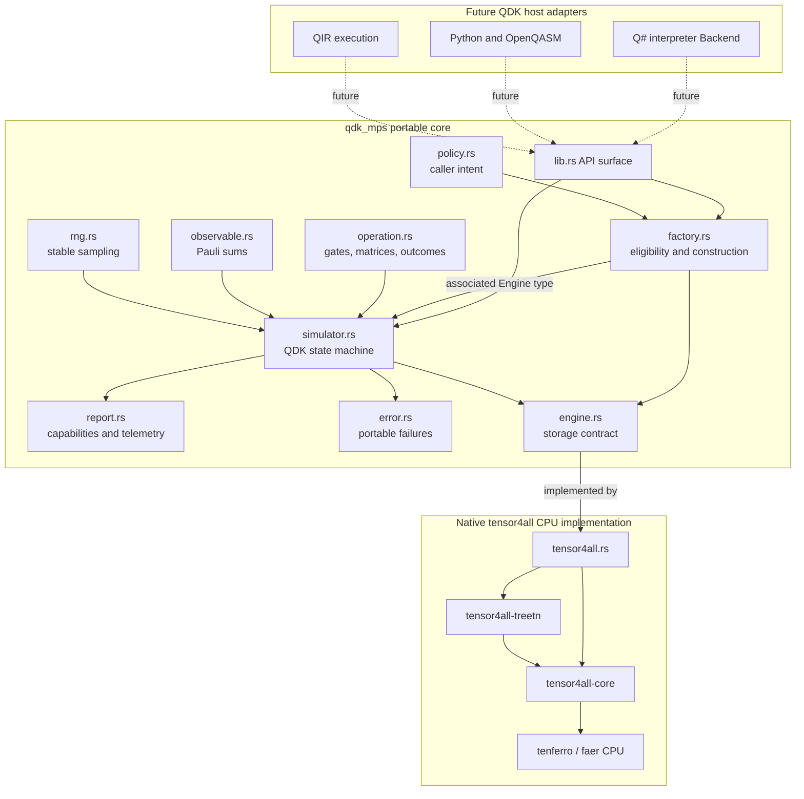
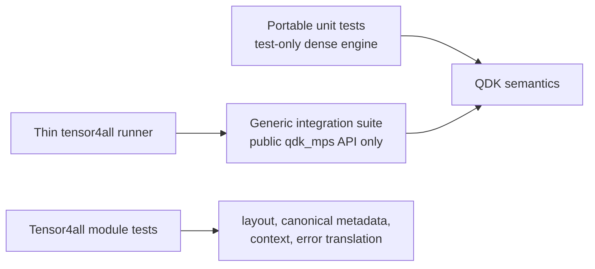
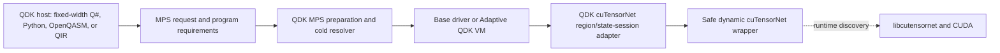
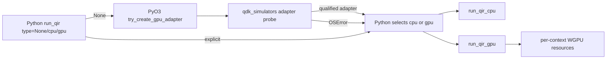
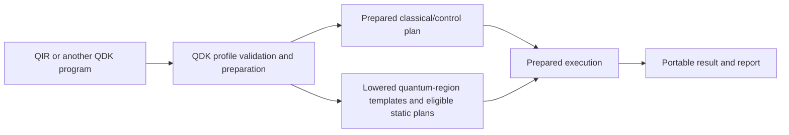
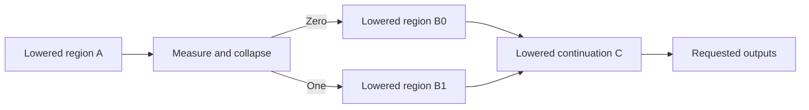
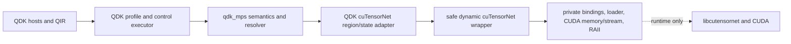
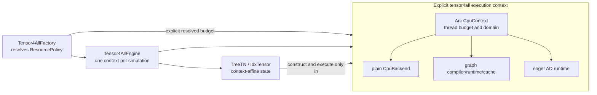

# QDK MPS Core Design

Status: Gate 3 implemented design for review. This crate is an internal Rust
API. It is not yet a stable public QDK API and is not connected to a QDK host.

## Purpose

`qdk_mps` owns portable matrix product state simulation semantics while hiding
the tensor library that stores and updates the state. The current engine uses
tensor4all-rs through its tenferro/faer CPU backend. Future tensor4all GPU or
direct cuTensorNet engines should implement the same storage contract without
changing QDK gate, lifecycle, measurement, observable, or reporting semantics.

The crate intentionally separates:

1. caller intent and QDK vocabulary;
2. simulation orchestration and semantic policy; and
3. concrete tensor storage and factorization.

## Architecture



The solid arrows are implemented. Dotted host arrows are the expected next
integration boundary and are intentionally absent from Gate 3.

## Module Responsibilities

| Module          | Owns                                                                           | Provides                                                                                                                                                      | Must not own                                                                                  |
| --------------- | ------------------------------------------------------------------------------ | ------------------------------------------------------------------------------------------------------------------------------------------------------------- | --------------------------------------------------------------------------------------------- |
| `lib.rs`        | Deliberate crate API and feature-gated engine registration                     | Re-exports portable contracts; exposes the QDK-owned concrete tensor4all factory module only for native `tensor4all-cpu` builds                               | Upstream tensor4all types, host selection, Python APIs, or tensor implementation details      |
| `operation.rs`  | QDK gate names, angle signs, matrix values, bit ordering, measurement outcomes | `QubitId`, gate and operation enums, row/column `Matrix2` and `Matrix4` construction                                                                          | Tensor storage layout or backend dispatch                                                     |
| `observable.rs` | Backend-neutral Pauli observable vocabulary                                    | Real-weighted Pauli sums over logical qubits and engine-facing `SitePauli` factors                                                                            | Contraction algorithms or tensor types                                                        |
| `policy.rs`     | Explicit caller intent and validation                                          | Precision, per-split truncation, bond cap, seed, and CPU resource request                                                                                     | Engine defaults, environment mutation, or backend-specific knobs                              |
| `factory.rs`    | Eligibility and resolved construction boundary                                 | `MpsEngineFactory` with an associated engine type and the only public simulator-construction path                                                             | Quantum state semantics or runtime host selection                                             |
| `simulator.rs`  | Portable QDK simulation state machine                                          | Allocation, release, logical mapping, gate dispatch, measurement/reset, normalization policy, observables, timing, and reports                                | Tensor indices, factorization, canonical regions, or backend randomness                       |
| `engine.rs`     | Minimal fallible tensor-storage contract                                       | Append-zero, local matrix application, probability/projection, Pauli inner product, norm, bond telemetry, and engine information                              | Named QDK gates, logical qubit lifecycle, sampling, or host behavior                          |
| `rng.rs`        | Reproducible QDK sampling                                                      | Explicit ChaCha12 draws and deterministic per-shot seed derivation                                                                                            | Engine-specific RNGs or unspecified platform randomness                                       |
| `report.rs`     | Requested-versus-resolved diagnostics                                          | Engine identity, effective resources, capability status, operation/timing counters, retained norm, and available bond/cap telemetry                           | Inferring unavailable discarded weight, historical maxima, cap causes, or global error bounds |
| `error.rs`      | Portable failure taxonomy                                                      | Policy, capability, lifecycle, probability, engine, and invariant errors                                                                                      | Concrete tensor4all or tenferro error types                                                   |
| `tensor4all.rs` | Mapping the engine contract onto the pinned native library                     | `Tensor4AllFactory`, `Tensor4AllEngine`, MPS construction, column-major conversion, canonicalization, SVD factorization, projection, and resource observation | QDK logical IDs, sampling decisions, public fallback, or host selection                       |

“Exposes the tensor4all factory module” does not mean that `qdk_mps` re-exports
tensor4all-rs internals. The native module provides QDK-owned `factory()`,
`Tensor4AllFactory`, and the concrete associated engine type required by the
public `MpsEngineFactory` implementation. Its fields and upstream `TreeTN`,
`IdxTensor`, tenferro, and provider types remain private. Portable callers use
`MpsEngineFactory`, `MpsEngine`, and `MpsSimulator`; naming the concrete factory
is the current explicit engine-selection step.

## Core Design Rationale

### QDK owns semantics

Gate matrices and conventions live in `operation.rs`, not in an engine. The
first operand of a two-qubit operation is QDK basis bit 0, rotations use
$\exp(-i\theta P/2)$, and matrices are mathematical row/column arrays. Engines
only translate those matrices into their storage layout. This prevents
tensor4all and a future cuTensorNet engine from silently implementing different
gate conventions.

The same rule applies to lifecycle, sampling, normalization, and observables.
`MpsSimulator` chooses random outcomes, validates probability tolerance,
controls logical-to-physical mapping, and normalizes observable values. Engines
never choose outcomes or expose implementation-specific qubit handles to a
host.

### Logical qubits are not storage sites

`QubitId` is the QDK-visible logical identity. `SiteId` identifies a persistent
engine site. `MpsSimulator` owns the mapping between them, allowing release and
ID reuse without requiring tensor removal. `swap_ids` changes only the mapping;
the quantum `Swap` operation changes the state through an engine matrix.

Keeping this distinction above the engine makes allocation semantics identical
across tensor libraries and avoids coupling hosts to MPS chain positions.

### Construction enforces policy

Callers construct a simulator through `MpsEngineFactory::create_simulator`.
The factory validates `ExecutionPolicy`, rejects an ineligible engine before
state construction, creates the concrete engine, and passes resolved descriptor
and capability information into the crate-private simulator constructor.

The associated `Engine` type preserves static dispatch in the operation path.
A later runtime selector can erase or enumerate factories at the cold selection
boundary without changing `MpsSimulator<E>` or the engine contract.

### Intent and evidence are separate

`ExecutionPolicy` records what the caller requested. `EngineInfo`,
`MpsCapabilities`, and `ExecutionReport` record what was selected and observed.
This supports a future abstract QDK API without claiming that all engines expose
the same diagnostics.

In particular, the current policy names a local relative discarded-squared-tail
criterion. It does not claim a global simulation error bound. Reaching a hard
bond cap is reported as `ReachedCapIndeterminate`, because the pinned
tensor4all API does not expose enough discarded-tail data to prove whether
truncation occurred or the local criterion was met.

The current tensor4all engine can track its historical maximum bond dimension.
That observation is not a universal reporting requirement. A future shared
report should distinguish current realized extents, historical maximum,
discarded weight, and whether a hard cap overrode an accuracy criterion, with
availability represented independently for each field. In particular,
cuTensorNet's high-level State path can expose final realized extents but not
the historical maximum, per-split discarded weight, or cap-override cause.

### Failures remain portable and fallible

All engine operations return `Result`. Concrete library failures are translated
to `MpsError::EngineFailure`; QDK-owned validation and invariant failures retain
their own categories. Unsupported work returns explicit planned or unavailable
capability errors. There is no silent fallback to another simulator.

### Randomness is engine-independent

QDK owns an explicitly named ChaCha12 measurement stream and deterministic
shot-seed derivation. The same policy and seed therefore produce the same draws
and measurement ordering across engines. `mix64` is retained only to derive shot
seeds and expand a `u64` into the fixed 32-byte ChaCha seed; it is not the random
stream. An engine computes probabilities and applies the selected projector but
never samples.

## Relationship to Existing QDK Contracts

QDK does not currently have one shared gate/measurement value model that this
crate can import without taking on the wrong ownership boundary.

| Existing surface            | Shape                                                                                                                                                                                                          | Relationship to `qdk_mps`                                                                                                                                    |
| --------------------------- | -------------------------------------------------------------------------------------------------------------------------------------------------------------------------------------------------------------- | ------------------------------------------------------------------------------------------------------------------------------------------------------------ |
| `qsc_eval::Backend`         | Compiler/evaluator host trait; fallible gate methods, dynamic `usize` qubit IDs, evaluator `Result`, allocation/release, state capture, custom intrinsics, and seed control                                    | This is the likely first host adapter. `qsc_eval` should depend on `qdk_mps`; the portable core should not depend back on its host/compiler types.           |
| `qdk_simulators::Simulator` | Fixed `new(num_qubits, num_results, seed, noise)` construction; infallible gate methods; `QubitID = usize`; recorded result IDs; `MeasurementResult::{Zero, One, Loss}`; noise and state-dump associated types | Useful semantic oracle, but not a compatible MPS core contract. Importing it for a few types would also pull a broad simulator/GPU/noise dependency surface. |
| Stabilizer `operation.rs`   | Private Clifford-plus-move queue representation                                                                                                                                                                | Implementation detail of one simulator, not a reusable QDK vocabulary.                                                                                       |

The first interpreter integration should therefore be a thin
`qsc_eval::Backend` adapter that converts IDs and evaluator results at the
boundary. If a second independent portable simulator core later needs the same
gate/value definitions, extracting a small lower-level quantum-primitives crate
may be justified. Gate 3 alone is not enough evidence to introduce it.

### Operation coverage is not QIR profile coverage

`Operation` is a normalized, single-step command for `qdk_mps`; it is not QIR,
a circuit IR, or a representation of an entire computation. A Q#, QIR, or
OpenQASM host decodes its own input and submits these commands.

The current variants largely match methods common to `qsc_eval::Backend` and
`qdk_simulators::Simulator`, but are not a complete copy:

- `CCX` is absent because Gate 3 advertises maximum arity 2;
- loss, move, correlated noise, state capture, and custom intrinsics are absent;
- `SxAdj` exists in the low-level simulator vocabulary but is not a direct
  `qsc_eval::Backend` method; and
- measurement/reset return immediate values rather than writing QIR result IDs.

QIR Base Profile constrains program dynamism and result use; it does not define
this gate enum. A Base Profile program can still require an intrinsic such as
`CCX`. Host integration must retain an explicit intrinsic coverage table and
either decompose, implement, or reject each missing operation before execution.
Do not infer profile support from the current enum.

### Observables are queries, not measurements

`PauliObservable` describes a real-weighted sum of Pauli products whose
expectation value is requested from the current state. Evaluating it neither
samples nor collapses the state. `MeasureZ` and `MeasureResetZ` are the
probabilistic, state-changing operations. Keeping these concepts separate lets
QDK expose estimators and diagnostics without treating an expectation as a
measurement result.

## State and Transition Model

“State machine” means that `MpsSimulator` owns the evolving simulation
invariants and applies commands sequentially. The quantum state is present:
`MpsSimulator` owns an engine, and `Tensor4AllEngine` owns a private
`TreeTN<IdxTensor, usize>`. It is opaque to portable callers so tensor4all and a
future cuTensorNet engine do not leak incompatible representations.

The current API does not expose a full state snapshot. That is a capability
decision, not a consequence of mutation. Backend-neutral selected amplitudes,
reduced data, snapshots, or diagnostic visitors can be added later with
explicit cost and size semantics. Exposing `TreeTN` directly would defeat
backend substitution.

Rust supports a consuming functional shape such as
`fn apply(self, operation) -> Result<Self, Error>`. Moving `self` can be
zero-copy, so functional syntax is not intrinsically slower. It does not,
however, provide persistent immutable states for free: retaining both old and
new tensor-network states requires structural sharing or cloning. Current
tensor4all operations and QDK's `Backend` host contract are naturally mutable;
persistent versions could copy large tensors and add ownership complexity.

The current compromise is idiomatic and performance-oriented:

- policy, operations, observables, outcomes, and reports are immutable values;
- one owned simulator/engine state is mutated in place;
- clones are explicit only where branch semantics require them, such as a
  projected probability branch or observable transformation; and
- the generic engine boundary keeps the mutable representation private.

One consequence to retain in review is failure atomicity. A fallible mutable
engine method must validate before mutation or deliberately repair state on
failure. A consuming API would not automatically solve this unless it also
retained or rebuilt the prior state. Engine-specific tests should continue to
check that portable precondition failures do not mutate state.

## Representation Review

### Qubit identifiers

`QubitId(pub u64)` gives the MPS contract a stable-width logical identity for
future public or serialized boundaries. Existing in-process QDK contracts use
`usize`, so the interpreter adapter will convert IDs explicitly. The simulator
also performs checked `u64`-to-`usize` conversion before indexing its logical
map; values outside the target's addressable range return `UnallocatedQubit`.

This is a deliberate API-width choice rather than a simulation-capacity claim.
Physical allocation remains bounded by memory and `usize`; no engine is
expected to allocate anything close to the `u64` identity space.

### Operation outcomes

`OperationOutcome::{Unit, Measurement}` is the sum type required by the uniform
`apply(Operation)` dispatcher: unitary/reset commands return `Unit`, while
measurement commands return a value immediately. It is clearer than
`Option<Measurement>`, but it does not encode at compile time which operation
produces which outcome.

A typed API with separate `apply_gate`, `measure`, and `reset` methods would
provide stronger return typing; the enum dispatcher is convenient for generic
replay and conformance tests. These can coexist if host ergonomics justify
typed wrappers. Host adapters map `Measurement` to their result type; the MPS
core deliberately does not import evaluator `val::Result` or low-level
`MeasurementResult::Loss`.

### Gate matrices and conversion cost

`Matrix2` and `Matrix4` are stack-sized mathematical arrays: 4 and 16
`Complex64` values, or 64 and 256 bytes. They are passed by reference through
`MpsEngine`, so the trait call itself does not copy or heap-allocate them.

The current tensor4all adapter materializes each gate:

1. `matrix_tensor` copies the 4 or 16 values into a column-major `Vec`;
2. `IdxTensor::from_dense` validates it and passes its slice to
   `dense_native_tensor_from_col_major`, which creates a native eager tensor;
3. the temporary host vector is dropped; and
4. tensor4all contracts that gate tensor with one or two site tensors.

Thus every gate currently incurs a small host allocation/copy and native tensor
materialization. For high-bond two-site gates, contraction and SVD should
dominate. For fixed one-site gates and low bonds, setup may dominate. Cache
fixed native gate tensors per explicit engine context, or contribute a direct
context-safe local-matrix update upstream, only after gate-level profiling
shows this is material. Parameterized rotations still require new values.

### Fallibility and panics

Rust has no exception mechanism in this path. Expected failures use
`Result<_, MpsError>` and are handled explicitly. This does not prove that the
whole process can never panic: programming bugs, violated dependency
invariants, explicit upstream panics, and unrecoverable allocation failures are
outside the portable error contract. The goal is no panic for validated user
input or ordinary engine failure, not the stronger claim that panic is
impossible.

### Random-number generator

The initial Gate 3 implementation used SplitMix64 because it is small, fast,
and easy to specify. The Rust Rand quality guide rates it for simple
applications with significant known flaws, a 64-bit state/period, and no stream
support. That is weaker than desired for parallel shots and future noisy
trajectories, so Gate 3 now uses explicitly named `ChaCha12Rng` before any
public sequence compatibility promise.

The choice differs from neighboring implementations:

- existing QDK simulators use Rust `StdRng`, currently ChaCha12, but rand
  documents that alias as non-portable and changeable; `qdk_mps` names
  `ChaCha12Rng` directly instead;
- quimb 1.14 sampling uses `numpy.random.default_rng`, whose default is PCG64;
  PCG64 offers explicit stream/advance support and a fixed integer stream; and
- NumPy's generic `Generator` selection does not promise that its default will
  remain unchanged forever.

The fixed-sequence and 10,000-shot tests verify the explicit ChaCha12
implementation and one distribution point, not a complete stochastic
qualification. Before noisy trajectories or large parallel campaigns, add
stream-separation tests and broader statistical evidence. Counter-based Philox
or PCG64DXSM remain candidates if random access or large-scale stream spawning
becomes a requirement. Quimb's exact sequence need not be copied; portable QDK
semantics are the requirement.

## Implemented Operation Flow

For a typical operation:

1. A future host creates an `ExecutionPolicy` and asks a selected factory for a
   simulator.
2. `MpsEngineFactory` validates eligibility and constructs one engine.
3. The host submits a backend-neutral `Operation` using logical `QubitId`s.
4. `MpsSimulator` validates lifecycle and adjacency, resolves `SiteId`s, and
   obtains the QDK-owned matrix.
5. `MpsEngine` applies that matrix or returns a portable error.
6. `MpsSimulator` updates portable operation counts and timing only after a
   successful mutation.

Measurement adds three QDK-owned steps: validate and clamp probability within
tolerance, draw from the stable RNG, then request engine projection and
normalization. Reporting combines simulator-owned counters and policy with
engine-owned norm, reached bond, identity, and resolved resource information.

## Tensor4all Boundary

The current native engine uses `TreeTN<IdxTensor, usize>`. Its implementation
must account for library behavior that does not belong in the abstract API:

- `IdxTensor` dense payloads are column-major, while QDK matrices remain
  row/column values.
- Tensor contraction requires a connected index network; appending a site adds
  a shared dimension-one bond before calling `TreeTN::connect`.
- Adjacent updates canonicalize, contract, factorize with explicit
  `FactorizeOptions`, replace both tensors and the bond, and restore canonical
  metadata.
- Non-unitary mutations, including temporary projected clones used for
  probabilities, clear copied canonical metadata before reading a norm.
- The pinned public API uses a process-global tenferro context. The engine is
  eligible for an unconstrained CPU request only and reports the actual global
  backend thread budget.

These rules are covered by tensor4all-specific tests and are intentionally not
visible in `MpsEngine` or portable conformance expectations.

## Test Architecture

The tests preserve the same boundary as production code:



- Portable unit tests isolate simulator policy from any tensor library.
- `tests/common` is a generic conformance suite with an independent dense
  oracle. It may use only public backend-neutral `qdk_mps` items.
- `tests/tensor4all_conformance.rs` supplies only the tensor4all factory.
- `tensor4all/tests.rs` owns implementation-only library invariants.

A future resident engine implementing `MpsEngine` adds a thin conformance
runner and cannot change expected values, tolerances, policy semantics, or
portable error categories. A deferred provider such as direct cuTensorNet uses
the same semantic fixtures through its prepared execution adapter, plus
provider-specific lifecycle tests; it is not required to implement eager
`MpsEngine` calls merely to reuse the tests.

## Expected QDK Integration

The current shape is intended to serve QDK in stages:

1. Q#/Python/OpenQASM/QIR hosts map user configuration into one `MpsRequest`.
   They select the MPS method, not a tensor library per operation.
2. A QDK execution layer validates profile, fixed/dynamic resource
   requirements, noise strategy, outputs, and portable policy, then lowers
   quantum-region templates from the existing QDK program representation.
3. A cold `qdk_mps` resolver selects an eligible provider before state escapes.
   An explicit provider request either succeeds or returns a typed readiness
   error; `Auto` may try another eligible provider only at this boundary.
4. Resident tensor4all execution adapts lowered operations to the validated
   `MpsSimulator<E>`/`MpsEngine` path. Direct cuTensorNet uses a separate
   deferred region/state-session adapter beneath the same QDK executor.
5. Base QIR execution lowers its fixed instruction sequence into a static
   region. Adaptive QIR retains the existing QDK bytecode/VM for classical
   control and enters provider regions on one continuing state.
6. Fallible MPS runners return eligibility, engine, deferred, and completion
   failures to the host. They must not hide those failures behind the current
   infallible `qdk_simulators::Simulator` methods.
7. Completed execution returns normal QDK outputs plus a resolved report. No
   runtime MPS registry or host adapter exists in Gate 3.

The internal API already provides the common semantic foundation needed by
those hosts: fallible operations, dynamic allocation, measurement/reset,
observables, deterministic seeds, explicit approximation policy, capabilities,
and resolved diagnostics. It deliberately does not yet provide a public selector,
non-local routing, noise, dense state capture, fp32, constrained tensor4all CPU
contexts, or a stable user-facing policy schema.

The cuTensorNet coordination does not require an immediate change to the
validated Gate 3 Rust implementation. Before the first host/provider
integration, code must add the prepared execution/resolver layer, make shared
telemetry availability explicit, split conformance by declared capability, and
add a fallible host runner. Do not enlarge or weaken `MpsEngine` solely to make
the deferred cuTensorNet State API look eager.

### Direct cuTensorNet integration path

Direct cuTensorNet v1 integrates as an optional Linux/NVIDIA provider of the QDK
MPS method, not as a parallel public simulator with its own QIR semantics:



The dependency and ownership slices are:

1. **Safe wrapper crate.** The `cutensornet-rust-ffi` work contributes a small
   native-only crate with checked-in bindings, dynamic symbol loading, typed
   readiness/status errors, CUDA device memory and stream ownership, RAII, and
   safe state/workspace/property primitives. It has no dependency on
   `qdk_mps`, QIR, Python, or QDK policy types, and ordinary process startup
   does not load CUDA or cuTensorNet.
2. **QDK provider adapter.** A feature-gated module or companion crate depends
   on both `qdk_mps` contracts and the safe wrapper. It translates
   `ExecutionPolicy`, lowered gates/parameters, observations, and selected QDK
   measurement/noise outcomes into native sessions. It owns segment
   invalidation, conservative reprepare, output buffers, synchronization, and
   provider reporting. It does not implement the eager `MpsEngine` trait.
3. **Prepared MPS executor.** `qdk_mps` owns the provider-neutral request,
   capability validation, resolver, lowered region templates, per-shot seed
   semantics, portable results, and completion boundary. Provider variants may
   be represented by a closed enum at this cold boundary while retaining static
   dispatch inside each hot path.
4. **QIR host adapter.** The Python package adds one provider-neutral MPS entry
   path, conceptually `run_qir_mps`, and maps a future user-facing MPS request
   into Rust. It must not add public `run_qir_tensor4all` and
   `run_qir_cutensornet` semantic lanes. Existing QIR parsing, CCX
   decomposition, output recording, Base instruction collection, and Adaptive
   bytecode remain QDK-owned.
5. **Other QDK hosts.** The unrestricted Q# interpreter's fallible
   `qsc_eval::Backend` can host a resident tensor4all adapter. Direct
   cuTensorNet is initially ineligible for unrestricted dynamic allocation and
   enters through fixed-width prepared programs. OpenQASM and other hosts reuse
   the same request/executor instead of calling the wrapper directly.

Execution differs by profile while preserving one API:

- **Base.** Preparation validates the fixed width, resolves cuTensorNet,
  creates a state/session, registers the static topology, finalizes/configures
  MPS, obtains workspace, and prepares what is valid before execution. Each
  independent shot starts from the defined initial state; compatible data
  updates use stable owned buffers and wrapper v1 conservatively reprepares.
  Terminal measurements/properties complete, synchronize, and return through
  the normal QDK output recorder.
- **Adaptive.** The existing QDK VM owns LLVM/classical execution. At each
  reached quantum segment, the adapter registers the selected lowered template
  against the live captured state, prepares, computes, synchronizes as needed,
  and captures continuation state. At measurement, cuTensorNet returns raw
  branch masses, QDK's ChaCha12 stream chooses the outcome, and the adapter
  applies the normalized projector/reset before the VM selects the next
  continuation.
- **Noise.** QDK selects the declared trajectory/Kraus/loss effect and consumes
  randomness. The adapter applies the selected non-unitary operator. Until that
  path passes semantic and hardware tests, the resolver reports noise as
  unavailable for direct cuTensorNet rather than delegating randomness to a
  native sampler.

Provider readiness occurs before the prepared object escapes and includes the
loaded library/version/symbols, CUDA compatibility, device identity and C64
support, requested width (including wrapper v1's minimum of two), workspace
feasibility, and policy mapping. Explicit cuTensorNet selection fails on any
unmet requirement. `Auto` may then choose tensor4all or another eligible engine
without changing MPS semantics; no fallback occurs after execution begins.

MPS finalization/configuration is established for a newly created native state,
not repeated for every continuation segment. `StateCaptureMPS` retains that
configuration while deleting the previously registered operators and IDs. The
adapter therefore registers the reached continuation and reruns native
preparation/computation against the captured state. A fresh state for an
independent shot repeats state creation and finalization unless later evidence
qualifies safe reset/reinitialization reuse.

Packaging remains independently shippable. A cuTensorNet-first QDK build can
depend on contract-only `qdk_mps` plus the optional wrapper/adapter without
enabling `tensor4all-cpu`. A tensor4all-first build does not include or load the
cuTensorNet wrapper. A build containing both enables both provider features and
uses the same resolver and public request.

## Engine, Provider, and Device Selection

Backend-specific options are useful and sometimes necessary. The design risk is
not that they reveal the selected implementation; it is that untyped or silently
ignored options can bypass portable semantics. Use these terms consistently:

- **method:** MPS simulation, owned by `qdk_mps`;
- **engine family:** the concrete implementation, such as tensor4all or direct
  cuTensorNet;
- **execution provider:** the compute path used by an engine, such as
  tenferro/faer CPU, a future tenferro CUDA/WebGPU provider, or cuTensorNet;
- **device:** a concrete CPU domain, CUDA ordinal, or WebGPU adapter; and
- **policy:** backend-neutral caller intent and hard constraints.

At the pinned revision, tensor4all's selected crates expose the tenferro/faer
CPU path only. Tenferro has CUDA and WebGPU capabilities underneath it, but
tensor4all does not yet wire a verified MPS execution path to those providers.
`qdk_mps` must not advertise `Tensor4AllCuda` or `Tensor4AllWebGpu` until those
paths exist and pass the same conformance and residency tests. A future
tensor4all GPU engine and a direct cuTensorNet engine are distinct offerings
even when both run on NVIDIA hardware.

### Comparable SDK patterns

| SDK/library           | Dispatch model                                                                                                                                             | Backend-specific controls                                                                                                                                                                                    | Lesson for QDK                                                                                                                                                                                                                               |
| --------------------- | ---------------------------------------------------------------------------------------------------------------------------------------------------------- | ------------------------------------------------------------------------------------------------------------------------------------------------------------------------------------------------------------ | -------------------------------------------------------------------------------------------------------------------------------------------------------------------------------------------------------------------------------------------- |
| Qiskit Aer 0.17       | One `AerSimulator` selects `method` and `device`; queries expose available methods/devices                                                                 | A flat option namespace contains generic controls and method-specific MPS controls such as max bond, truncation threshold, sampling algorithm, swap direction, OMP threads, and LAPACK                       | Separating method/device and querying eligibility works. A large flat option bag makes validation and ownership harder. Aer also treats CPU MPS and GPU tensor-network simulation as different eligible methods, not merely a device switch. |
| PennyLane 0.45        | A QNode binds to a device/plugin. `default.tensor` is CPU/quimb; `lightning.tensor` is GPU/cuTensorNet. Each device then selects `method="mps"` or `"tn"`. | Device constructors accept implementation-specific kwargs and publish capabilities. `lightning.tensor` exposes backend/workspace preference and MPS controls; `default.tensor` passes quimb options through. | Concrete factory/plugin boundaries are a natural place for typed implementation options. Capabilities and preprocessing validate before execution.                                                                                           |
| CUDA-Q                | A named target selects the implementation; `set_target` accepts target-specific kwargs/options                                                             | Precision, multi-GPU mode, and many implementation controls are target-specific; some controls are process environment variables                                                                             | Explicit targets are understandable, but process-global target state and environment mutation are poor fits for concurrent per-execution QDK policy.                                                                                         |
| quimb                 | `CircuitMPS` is an implementation class with `gate_opts`; tensor arrays dispatch through the numerical array backend                                       | `max_bond`, cutoff mode, contraction mode, optimizers, and provider threading are implementation concerns                                                                                                    | Useful as an engine/reference model, not as QDK's public selection architecture.                                                                                                                                                             |
| cuQuantum/cuTensorNet | Stateful network APIs separate `NetworkOptions` from `MPSConfig`                                                                                           | Network/device options own device ID, memory limit, allocator, handle, stream/blocking; MPS config owns extent, canonical center, cutoffs, SVD algorithm, normalization, gauge, and MPO behavior             | This is the strongest separation for a GPU engine: execution resources and MPS algorithm configuration should be distinct typed objects.                                                                                                     |

Survey sources: [Qiskit Aer simulator options](https://qiskit.github.io/qiskit-aer/stubs/qiskit_aer.AerSimulator.html),
[PennyLane default.tensor](https://docs.pennylane.ai/en/stable/code/api/pennylane.devices.default_tensor.DefaultTensor.html),
[PennyLane lightning.tensor](https://docs.pennylane.ai/projects/lightning/en/stable/lightning_tensor/device.html),
[CUDA-Q backend configuration](https://nvidia.github.io/cuda-quantum/latest/api/languages/python_api.html#backend-configuration),
[quimb circuit MPS](https://quimb.readthedocs.io/en/latest/tensor/tensor-circuit-mps.html),
and [cuTensorNet types/options](https://docs.nvidia.com/cuda/cuquantum/latest/cutensornet/api/types.html).

### Existing QDK WGPU dispatch

QDK already implements automatic CPU/GPU dispatch for the Python QIR full-state
simulator. The current path is:



The concrete behavior is useful precedent:

1. `run_qir(type=None)` probes for a GPU adapter. It selects GPU on success and
   CPU only when the probe raises `OSError`.
2. Explicit `type="gpu"` or `type="cpu"` is authoritative. An explicitly
   selected GPU does not silently fall back if setup or execution fails.
3. The Rust WGPU probe enumerates `Backends::PRIMARY`, accepts only discrete or
   integrated adapters on Vulkan, Metal, or DX12, requires compute/workgroup and
   1 GiB storage-buffer limits, then scores discrete over integrated and
   Vulkan/Metal over DX12.
4. The probe returns adapter information but intentionally does not retain GPU
   resources. Device/queue and pipelines are created lazily in a per-context
   `GpuResources` object on execution.
5. CPU and GPU paths separately preprocess the same QIR: both decompose CCX and
   choose Base versus Adaptive execution, but the CPU adaptive representation is
   64-bit while GPU uses a 32-bit shader representation. GPU then maps supported
   instructions into its own shader operation format.
6. A reusable Python `GpuSimulator` owns a native context behind a mutex and can
   reuse loaded program/noise state. The convenience `run_qir_gpu` path creates
   fresh native resources for a run.
7. GPU tests are explicitly enabled, probe capabilities, and skip with the
   concrete unavailability reason.

Relevant owners are
`qdk/simulation/_simulation.py`,
`qdk_package/src/qir_simulation/gpu_full_state.rs`, and
`simulators/src/gpu_full_state_simulator/{gpu_resources,gpu_context}.rs`.

This is not a general QDK engine registry. Selection currently lives in the
Python QIR host, takes a string (`"clifford"`, `"cpu"`, or `"gpu"`), chooses no
device ordinal, and returns no resolved backend metadata in ordinary results.
The probe can also succeed before later `request_device` or pipeline creation
fails, at which point no fallback occurs. Neutral-atom simulation repeats the
same selector pattern and records the selected type in telemetry.

The MPS design should reuse these accepted principles:

- auto fallback is allowed only during qualification, before state mutation;
- explicit engine/device requests never fall back;
- capability detection belongs near the concrete provider;
- concrete resources are context-owned and lazily created;
- preprocessing/decomposition makes the operation set explicit; and
- unavailability is a typed/actionable result and a platform test condition.

It should improve on the current placement by putting MPS resolution in one
Rust owner used by every host, returning a resolved report, and separating
engine family from provider/device. It must also avoid precision drift: the
existing full-state GPU path intentionally uses some 32-bit representations,
but an MPS `Precision::Complex64` request cannot auto-select an fp32 provider.
Finally, WGPU availability is not evidence of NVIDIA CUDA availability: a WGPU
adapter may be integrated, AMD, Intel, Apple, or NVIDIA, while a direct
cuTensorNet engine requires CUDA and NVIDIA-specific qualification.

### Proposed QDK layering

The future runtime request should have four typed layers:

1. **Portable execution policy.** Precision, approximation semantics, seed, and
   hard resource constraints. This remains valid across engines.
2. **Engine/device request.** `Auto` or an explicit engine family plus an
   explicit/automatic provider and device.
3. **Typed concrete-engine options.** Options that are meaningful only after an
   engine is selected, owned by that engine's factory module.
4. **Resolved report.** The selected engine/provider/device, effective policy,
   concrete mechanisms, ignored-none guarantee, and unavailable diagnostics.

One possible Rust shape for discussion is:

```rust
pub struct MpsRequest {
    pub policy: ExecutionPolicy,
    pub engine: EngineRequest,
}

pub enum EngineRequest {
    Auto { device: DeviceRequest },
    Tensor4All(Tensor4AllOptions),
    CuTensorNet(CuTensorNetOptions),
}

pub enum DeviceRequest {
    Auto,
    Cpu,
    Cuda { ordinal: u32 },
    WebGpu,
}
```

This is a design sketch, not an approved Gate 3 API. Concrete option types can
remain in feature-gated engine modules or companion crates. For example,
tensor4all may eventually have provider-specific CPU/CUDA/WebGPU configuration,
while direct cuTensorNet needs CUDA ordinal, workspace/memory, handle/stream,
and SVD mechanism controls.

Explicit engine-specific options should imply explicit engine selection. An
`Auto` request uses portable policy and qualified defaults only; it should
reject, not ignore, an override for an unselected engine. An explicitly
requested unavailable engine/device returns a typed eligibility error. Auto
selection may choose among eligible engines, but must report the choice and
must never silently change requested precision, accuracy, resource limits, or
device class.

### Which options belong where

| Concern                                                                | Portable policy                                  | Engine-specific options                                           | Rule                                                                                    |
| ---------------------------------------------------------------------- | ------------------------------------------------ | ----------------------------------------------------------------- | --------------------------------------------------------------------------------------- |
| Precision and accepted numerical error                                 | Yes                                              | Concrete compute/storage type is resolved by engine               | An engine must reject unsupported precision rather than substitute it.                  |
| Bond cap and discarded-weight intent                                   | Yes                                              | Engine maps to its exact truncation mechanisms                    | Engine options must not secretly weaken portable accuracy.                              |
| Seed and shot semantics                                                | Yes                                              | A qualified native batch sampler may receive a derived seed       | Results must preserve QDK seed/ordering semantics.                                      |
| CPU thread/device memory limits                                        | Portable resource intent                         | Provider-specific pool, workspace, allocator, and stream settings | Requested limits are hard; mechanisms and effective values are reported.                |
| Engine family and device class                                         | Selection request                                | Factory validates concrete availability and device ordinal        | Separate algorithm/library identity from physical execution device.                     |
| SVD algorithm, gauge, canonical center, contraction/sampling algorithm | Usually no                                       | Typed engine tuning                                               | Expose only when it preserves portable semantics; always report the resolved mechanism. |
| Absolute/relative singular-value cutoffs                               | Not interchangeable with discarded-weight intent | Advanced explicit-engine override only, if supported              | These alter approximation semantics and cannot be an unreported tuning knob.            |

`ExecutionPolicy` currently maps exactly to the validated tensor4all CPU slice.
It also maps to quimb's relative squared-tail rule only when quimb is configured
with `cutoff_mode="rsum2"`. A direct cuTensorNet engine can map the same local
criterion to discarded-weight cutoff, subject to version/normalization tests;
cuTensorNet additionally offers absolute and relative singular-value cutoffs,
multiple SVD algorithms, normalization, partition, gauge, workspace, allocator,
and stream controls. Those extra mechanisms should not all become fields in the
portable policy.

### Where dispatch lives

`qdk_mps` should remain the semantic entry point and own a future cold-path
resolver. Concrete engine modules or companion crates own typed factory options
and dependencies. Host adapters map Q#/Python/OpenQASM/QIR user configuration
into one `MpsRequest`; they do not branch per gate or call tensor libraries.

The current associated-type factory keeps the hot simulator generic. Runtime
selection can preserve that with a closed enum of resolved simulator variants,
or erase types only at a cold factory/session boundary. This choice needs a
small benchmark, but either is preferable to leaking tensor4all/cuTensorNet
branches into every host. GPU-heavy dependencies may live in companion crates.
Resident providers can implement `MpsEngine`; deferred providers implement the
prepared region/state-session contract and run the same portable semantic
fixtures through that boundary.

### Proposed prepare/execute lifecycle

The deferred cuTensorNet model is useful and should be represented explicitly,
not hidden behind an apparently eager per-gate method. The ergonomic public
shape remains:

```rust
let result = execution_provider
    .prepare(program, &request)?
    .execute(&inputs)?;
```

This is a design proposal, not a Gate 3 public API. `program` may be QIR, a
QDK-owned interpreter plan, or a future direct MPS workload. The chain does not
require all hosts to lower into a new `MpsWorkload` IR.

The full-program execution provider is a QDK composition layer. A tensor engine
is a lower-level quantum-region provider. Keeping those levels separate avoids
making tensor4all or cuTensorNet interpret LLVM branches, phi nodes, calls,
integer arithmetic, output recording, or QIR profile metadata:



The ownership and semantic rules are:

1. QDK retains the source program's control-flow and profile semantics. For QIR,
   the existing `AdaptiveProfilePass`/`AdaptiveProgram` bytecode remains the
   owner of LLVM blocks, registers, phi nodes, calls, branches, switches,
   classical computation, and output recording.
2. QDK identifies optimizable quantum regions or region templates within that
   program. A template may contain run-time angle, qubit, result, or noise slots
   whose values are supplied by the QDK executor when the region is entered.
3. `prepare` validates the program's exact requirements against QDK orchestration
   and provider capabilities, resolves policy and noise strategy, lowers region
   templates, and creates every provider plan/workspace that is valid before a
   live state exists. It returns one opaque prepared execution and produces no
   user-visible execution result. A provider may still need to perform native
   segment preparation during execution against the reached live state.
4. The prepared execution owns or safely shares every native resource and
   static gate buffer retained by the provider. It must not retain pointers
   borrowed from the source program unless Rust ownership proves that lifetime.
5. `execute` binds run-specific inputs, starts from the defined initial state,
   runs QDK classical control and lowered quantum regions over one continuing
   state, performs state-dependent native preparation where required, completes
   requested outputs, synchronizes as necessary, surfaces deferred provider
   errors, and returns a result and report. It is synchronous in observable
   semantics even when work is internally deferred or enqueued.
6. A future `submit(inputs) -> InFlightExecution` may expose asynchronous
   execution. `execute` remains the convenience equivalent of
   `submit(inputs)?.wait()`. An in-flight object must own or pin all buffers the
   provider may retain.
7. `&mut self` is the conservative initial receiver for `execute`, allowing
   provider caches, workspaces, streams, and deterministic run state. Repeated
   and concurrent execution guarantees require separate evidence.
8. Auto fallback may occur while resolving/preparing candidates only if the
   failed candidate is completely dropped and no prepared object escaped. Once
   `prepare` succeeds, `execute` never falls back to another provider.

This gives both engines useful optimization scope. cuTensorNet can register a
static network, select a path, prepare workspace, and reuse compatible plans;
an adaptive continuation can reuse its lowered template while native
`StatePrepare` runs against the reached captured state.
Tensor4all can fuse adjacent gates, eliminate identities/inverses, schedule
canonicalization, batch observables, precompute routing, and reuse explicit
contexts and workspaces.

#### QIR profiles

QIR profiles describe target execution capabilities, not tensor-state
representations. Preparation must preserve the exact module requirements rather
than collapse them into a boolean `adaptive` flag:

| QDK profile or capability    | Program shape                                                                                                                  | Preparation/execution consequence                                                                                                              |
| ---------------------------- | ------------------------------------------------------------------------------------------------------------------------------ | ---------------------------------------------------------------------------------------------------------------------------------------------- |
| Base                         | Fixed qubit/result counts; quantum transformations followed by terminal irreversible measurements; no result-dependent control | Prepare the static quantum phase and terminal measurement/output plan as one acyclic execution                                                 |
| Adaptive RI                  | Mid-circuit measurement, qubit reuse, forward branching, and integer computation                                               | Keep the acyclic QIR CFG/classical bytecode in QDK; lower reusable quantum-region templates with integer-bound slots where needed              |
| Adaptive RIF                 | Adaptive RI plus floating-point computation                                                                                    | Also support run-time computed rotation parameters without rebuilding unrelated regions                                                        |
| Adaptive                     | RI/RIF plus QDK's enabled backward branching, static arrays, and IR-call support                                               | Lower reusable block/region templates; the QDK VM revisits them across loops and calls and owns termination/error semantics                    |
| Dynamic allocation extension | Run-time qubit/result allocation is indicated independently by QIR module flags                                                | Use a provider with dynamic-width support or reject during preparation; fixed `numStateModes` cannot silently emulate it with an arbitrary cap |
| Unrestricted                 | Full language/evaluator behavior rather than one bounded QIR profile                                                           | Use the incremental QDK host adapter and only prepare regions whose requirements are known                                                     |

Minimal Adaptive QIR requires nested forward branching but not loops. The full
QDK `Adaptive` profile adds backward branching, whereas dynamic qubit allocation
is still a separate capability flag. Eligibility must therefore use a
structured requirement set, including integer/float widths and module flags,
instead of assuming the five profile names describe every combination.

Base and Adaptive execution already share `qdk_simulators::Simulator` through
different dispatchers. The MPS integration should preserve that design: Base
uses its existing instruction collector, Adaptive keeps its existing bytecode
VM, and both target the same fallible MPS state/region adapter. Do not decode QIR
again inside `qdk_mps`.

#### Planned regions and continuations

Mid-circuit measurement and classical decisions extend planned execution; they
do not require a separate semantic model. QIR already defines a control-flow
graph. Preparation identifies quantum regions within its blocks and the QDK VM
selects continuations:



A consumed measurement result, reset, host-visible query, or other dependency
may require materialization before classical execution continues. That boundary
does not end the workload or state lifetime. The selected continuation resumes
from the same collapsed logical state.

The execution layer may choose among several equivalent strategies:

1. lower the whole graph and use native conditional/control support;
2. lower all reachable quantum regions and let the QDK VM select among them;
3. lower the entry region and lazily lower/cache reached continuations;
4. execute one complete branch per shot; or
5. clone/share state prefixes and traverse or batch branches across shots.

QDK fixes measurement RNG, collapse, branch conditions, state continuity,
output ordering, and report semantics. A strategy cannot speculatively commit a
branch or change random-stream ordering. Lowering all branches is not executing
all branches. Here, lowering a region does not imply that a detached native plan
can be attached to any state. cuTensorNet 2.13 exposes no such object: after
capture, the selected continuation's operators are registered and natively
prepared against that live state. State-prefix cloning and sharing require a
separate provider capability and are excluded from the initial direct
cuTensorNet path.

`MpsSimulator` is the fine-grained implementation of the same model: operations
can initially be individual regions and later be buffered/fused between
dependencies. An open-ended host callback that creates new operations absent
from the prepared program may require incremental extension or a stepping API.
Encoded QIR control flow does not.

#### Noise

Noise is orthogonal to QIR profile. It changes the prepared quantum program and
the stochastic execution strategy, so split its ownership explicitly:

- the noise model, gate/intrinsic matching, loss policies, and chosen simulation
  semantics are preparation inputs;
- parameter bindings, shot count, seed, and individual stochastic draws are
  execution inputs; and
- QDK owns the noise vocabulary, seed derivation, result/loss semantics, and
  reproducibility contract. A tensor provider supplies state primitives and may
  accelerate a qualified equivalent mechanism.

Prepared MPS execution can support noise through multiple strategies:

1. **Pure-state trajectories.** Sample Pauli/Kraus/loss branches and evolve one
   MPS per trajectory. This is the closest match to current QDK Pauli/loss noise
   and the likely first tensor4all implementation.
2. **Shot branching/tree traversal.** Share or clone prefixes and group shots
   that take the same measurement/noise branch, provided QDK RNG ordering and
   per-shot results remain identical.
3. **Exact mixed-state evolution.** Use a density-matrix, MPDO, purification, or
   superoperator provider. This is a separate state capability, not something a
   pure-state MPS engine should claim automatically.
4. **Native provider channels.** Use cuTensorNet or another backend's channel
   support only after proving channel, normalization, measurement, and seed
   equivalence.

Measurement and sampled noise outcomes form one stochastic execution tree.
They are not all user-visible control-flow branches, but they constrain legal
fusion and state sharing. Preparation may move or combine effects only with a
proof that channel semantics and random consumption are unchanged. A change to
the structural noise model generally invalidates the prepared plan; changing
the seed must not.

The current `MpsEngine` does not yet expose arbitrary Kraus application, loss,
state cloning, or mixed-state evolution. `prepare()?.execute()` gives those
features a coherent home but does not make them implemented capabilities.

#### Alignment with other systems

The proposal follows established execution architecture while retaining
stronger typing and ownership boundaries:

| System      | Relevant model                                                                                                                                                         | Lesson for QDK MPS                                                                                            |
| ----------- | ---------------------------------------------------------------------------------------------------------------------------------------------------------------------- | ------------------------------------------------------------------------------------------------------------- |
| QIR         | LLVM CFG plus profile/module capability metadata; target-specific lowering validates required features                                                                 | Preserve QIR CFG/profile ownership and prepare provider regions below it                                      |
| Current QDK | Base gate collector and Adaptive bytecode VM both dispatch to `Simulator`; noise is lowered/injected by QDK                                                            | Extend the existing dispatcher boundary instead of creating a second QIR interpreter                          |
| PennyLane   | Device `preprocess` then `execute`; dynamic circuits choose deferred, one-shot, or tree-traversal strategies                                                           | Separate semantic program from selectable execution strategy and validate before expensive work               |
| Qiskit/Aer  | Structured `IfElseOp`/`WhileLoopOp`; backend `run` returns a job; methods include MPS, density matrix, and cuTensorNet; noise and shot branching are execution options | Keep control flow structured, method/device distinct, and shot branching provider-selectable                  |
| Cirq        | Circuit plus parameter resolver; `run`, `simulate`, and step iteration; channels/noise models; separate pure- and mixed-state simulators                               | Keep a high-level completed execution plus an optional stepping surface and explicit state/noise capabilities |
| cuTensorNet | Explicit state configuration, prepare, compute, retained buffers, and CUDA synchronization                                                                             | Model preparation and resource ownership honestly; make completed execution the portable result boundary      |
| CUDA-Q      | Captured kernels execute against selected CPU/GPU/QPU targets; simulator backends perform gate fusion and expose method-specific options                               | Let providers optimize captured work without leaking backend mechanics into program semantics                 |

PennyLane's dynamic-circuit strategies and Aer shot branching are particularly
strong evidence for the user's proposed model: one prepared program can have
multiple valid execution algorithms. The algorithm should be selected by policy
and capabilities and reported, not embedded into the program representation.

#### Future physics and scientific workloads

The same lifecycle can serve circuit simulation and tensor-network physics, but
they should not be forced through one universal workload IR. A circuit program,
Hamiltonian ground-state problem, time-evolution problem, and variational tensor
fit preserve different structure and admit different optimizations. Each should
be a typed QDK-owned computation family over shared preparation, execution,
state, observable, policy, capability, and reporting concepts.

"Typed family" primarily means a separate problem type with matching input and
result types. It does not require one enum containing every possible scientific
problem. For example, the following simplified types retain information that
would be lost if every workload were immediately flattened into gates or raw
tensors:

```rust
struct CircuitProblem {
   program: QuantumProgram,
   requested_outputs: Vec<CircuitOutput>,
}

struct GroundStateProblem {
   hamiltonian: Hamiltonian,
   lattice: Lattice,
   initial_state: InitialState,
   convergence: ConvergencePolicy,
   observables: Vec<Observable>,
}

struct TimeEvolutionProblem {
   hamiltonian: Hamiltonian,
   initial_state: InitialState,
   schedule: TimeSchedule,
   observables: Vec<ScheduledObservable>,
}

trait Computation {
   type Inputs;
   type Output;
}

impl Computation for GroundStateProblem {
   type Inputs = ParameterBindings;
   type Output = GroundStateResult;
}

struct GroundStateResult {
   energy: f64,
   state: StateArtifact,
   observations: ObservationSet,
   report: ExecutionReport,
}
```

The provider API uses the problem type to select the compatible prepared and
result types:

```rust
trait ExecutionProvider<Problem: Computation> {
   type Prepared: PreparedComputation<Problem>;

    fn prepare(
        &self,
        problem: &Problem,
        request: &ExecutionRequest,
    ) -> Result<Self::Prepared, Error>;
}

trait PreparedComputation<Problem: Computation> {
   fn execute(
      &mut self,
      inputs: &Problem::Inputs,
   ) -> Result<Problem::Output, Error>;
}
```

This is an architectural shape, not a proposed object-safe public trait. A
concrete API may use associated families, enums at a cold resolver boundary, or
separate provider traits. The important rule is that `Problem` retains its
scientific meaning: Hamiltonian terms, lattice or graph geometry, boundary
conditions, symmetries, initial-state representation, objective, observables,
time schedule, convergence criteria, and checkpoint intent survive until
preparation. Lowering all of these to gates or raw tensors before provider
selection would discard optimization information.

An enum is useful when the problem or provider is selected dynamically, for
example at a Python, QIR, configuration, or device-resolution boundary:

```rust
enum HostProblem {
   Circuit(CircuitProblem),
   GroundState(GroundStateProblem),
   TimeEvolution(TimeEvolutionProblem),
}

enum ResolvedGroundStateProvider {
   Cpu(CpuGroundStateProvider),
   Cuda(CudaGroundStateProvider),
}
```

The host dispatches a `HostProblem` variant into the corresponding typed API.
Likewise, a resolver may return a family-specific provider enum containing only
implementations eligible for that computation. The enum is a cold dispatch
mechanism; it is not the common workload representation and need not appear in
the provider's hot tensor operations.

The public convenience path remains one call. A circuit execution might be:

```rust
let problem = CircuitProblem {
   program,
   requested_outputs: vec![CircuitOutput::Measurements],
};

let result = execution_provider
   .prepare(&problem, &request)?
   .execute(&CircuitInputs { shots: 1_000 })?;
```

A ground-state search uses the same lifecycle while preserving its own domain
types and returning a reusable state:

```rust
let problem = GroundStateProblem {
   hamiltonian: heisenberg_chain(100),
   lattice: Lattice::Chain {
      sites: 100,
      boundary: BoundaryCondition::Open,
   },
   initial_state: InitialState::Neel,
   convergence: ConvergencePolicy::energy_tolerance(1e-8),
   observables: vec![Observable::Energy],
};

let result = execution_provider
   .prepare(&problem, &request)?
   .execute(&ParameterBindings::default())?;

println!("energy = {}", result.energy);
let optimized_state = result.state;
```

Prepared scientific computations may additionally expose an iterative session
for long-running algorithms:

```rust
let mut run = execution_provider.prepare(problem, &request)?.start(&inputs)?;

while !run.status()?.is_terminal() {
    run.step(&control)?;
    let observations = run.observe(&requested_observables)?;
    // The application may adjust only controls declared mutable by preparation.
}

let result = run.finish()?;
```

`execute` is the high-level equivalent of driving that session under the
prepared convergence/evolution policy. The optional session is not a second
semantic model: it exposes declared barriers in the same prepared computation.
Its step granularity is algorithm-specific (for example a DMRG sweep, TEBD time
step, variational iteration, or prepared circuit region), not necessarily one
gate or tensor operation.

The following evidence comes from the public quimb implementation and NVIDIA's
cuTensorNet API. It validates the abstraction boundary; it does not claim that
the current QDK tensor4all engine implements these algorithms.

Retained source surfaces:

- quimb [`DMRG`/`DMRG1`/`DMRG2`](https://github.com/jcmgray/quimb/blob/main/quimb/tensor/tn1d/dmrg.py),
  [`TEBD`](https://github.com/jcmgray/quimb/blob/main/quimb/tensor/tn1d/tebd.py),
  [2D TEBD/simple/full update](https://github.com/jcmgray/quimb/blob/main/quimb/tensor/tn2d/tebd.py),
  [arbitrary-geometry TEBD/simple update](https://github.com/jcmgray/quimb/blob/main/quimb/tensor/tnag/tebd.py),
  [MPS/MPO/superoperator primitives](https://github.com/jcmgray/quimb/blob/main/quimb/tensor/tn1d/core.py),
  [block-sparse/fermionic-aware array operations](https://github.com/jcmgray/quimb/blob/main/quimb/tensor/array_ops.py),
  and [eager/lazy MPS circuits](https://github.com/jcmgray/quimb/blob/main/quimb/tensor/circuit/mps.py);
- NVIDIA cuTensorNet
  [overview](https://docs.nvidia.com/cuda/cuquantum/latest/cutensornet/overview.html)
  and [API functions](https://docs.nvidia.com/cuda/cuquantum/latest/cutensornet/api/functions.html),
  including network/state preparation, gradients, state accessors, MPS, and
  ProjectionMPS.

| Scientific workflow                      | Structure that must survive preparation                                                 | Evidence from quimb or cuTensorNet                                                                                                                                             | Required portable lifecycle support                                        | Gate 3 tensor4all status                                        |
| ---------------------------------------- | --------------------------------------------------------------------------------------- | ------------------------------------------------------------------------------------------------------------------------------------------------------------------------------ | -------------------------------------------------------------------------- | --------------------------------------------------------------- |
| Circuit and QIR execution                | Gates, parameters, control dependencies, requested outputs, QIR requirements            | quimb has eager and lazy MPS circuit strategies; cuTensorNet separates network/state definition, preparation, and computation                                                  | Typed circuit problem, prepared regions, completed result                  | Fine-grained adjacent one/two-qubit primitives only             |
| Adaptive measurement                     | Measurement barriers, continuations, collapse and RNG semantics                         | cuTensorNet accessors, marginals, and state operations provide provider mechanisms below a QDK-owned continuation graph                                                        | Continuing state across prepared regions                                   | Measurement and collapse available; prepared regions not built  |
| Noisy and open-system evolution          | Channel model, trajectory/mixed-state choice, seed semantics, normalization             | cuTensorNet exposes pure and mixed states plus general channels; quimb exposes tensor-network superoperator operations                                                         | Explicit state representation and stochastic strategy capabilities         | Pauli/Kraus/loss and mixed states not implemented               |
| Finite-temperature and operator states   | MPO/MPDO or purification representation, imaginary-time schedule, normalization         | quimb exposes MPO and superoperator primitives and cuTensorNet exposes mixed-state/channel mechanisms; this is representation evidence, not a complete thermal algorithm       | Typed operator-state representations, evolution, observables, checkpoints  | Not implemented                                                 |
| DMRG ground and excited states           | MPO Hamiltonian, MPS guess, sweep schedule, eigensolver, truncation and convergence     | quimb `DMRG1`/`DMRG2` retain current state, energies, local energies, sweep controls, and convergence; cuTensorNet ProjectionMPS names conventional and circuit DMRG use cases | Typed eigensolve problem, sweep barriers, observations, resumable state    | Tensor primitives exist; DMRG algorithm not implemented         |
| TEBD real/imaginary-time evolution       | Local Hamiltonian, geometry, time schedule, Trotter order, truncation and error targets | quimb `TEBD` exposes `step`, `update_to`, and `at_times`; its 2D and arbitrary-geometry variants expose callbacks, energy histories, and best state                            | Time-step barriers, scheduled observations, checkpointable state           | Local gates exist; TEBD algorithm and scheduler not implemented |
| TDVP and local projected updates         | Tangent-space/projected algorithm, sweep direction, local environments and live bonds   | cuTensorNet ProjectionMPS explicitly supports extract-compute-insert cycles for TDVP and DMRG with run-time SVD truncation                                                     | Provider-private mutable state plus QDK/algorithm-owned step orchestration | Not implemented                                                 |
| PEPS and arbitrary geometry              | Lattice/graph, boundary conditions, tensor topology, environment and contraction method | quimb provides PEPS, 2D/3D local Hamiltonians, arbitrary-geometry TEBD/simple update, approximate contraction, and geometry-aware algorithms                                   | Topology-preserving problem types and representation capabilities          | Current engine is a linear MPS only                             |
| Observables, correlators, marginals/RDMs | Observable structure, sites/regions, normalization and approximation policy             | quimb exposes local expectations and energy callbacks; cuTensorNet has accessor, expectation, marginal, and reduced-density-matrix-oriented state APIs                         | Typed observables, observation barriers, result/error metadata             | Pauli-product expectation only                                  |
| Variational fitting and gradients        | Parameter identities, objective, differentiation method and optimizer state             | quimb tensor fitting supports ALS and autodiff-oriented methods; cuTensorNet supports network and expectation gradients plus reusable constant intermediates                   | Parameter binding, gradient capability, optimizer checkpoint state         | Not implemented                                                 |
| Symmetry-aware and fermionic tensors     | Conserved charges, sectors, parity, index orientation and compatible decompositions     | quimb detects block-sparse and fermionic arrays and preserves their metadata in selected decomposition, compression, contraction, and fitting paths                            | Typed symmetry/statistics metadata plus operation-level capability checks  | Not implemented                                                 |
| Repeated contraction and parameter scans | Stable network topology, mutable inputs, constant tensors and requested outputs         | quimb contraction trees/expressions and cuTensorNet optimizer plans, autotuning, constant caching, and plan reuse separate static structure from changing data                 | Prepared-plan reuse with explicit compatibility/invalidation rules         | No prepared plan API                                            |
| Long runs, checkpoints, and restart      | Logical state, algorithm position, convergence history, RNG position and compatibility  | quimb algorithm objects retain state, iteration and energy history; cuTensorNet exposes reusable native state/plan resources but not a portable QDK checkpoint format          | First-class state artifact and explicit checkpoint capability              | No portable checkpoint                                          |

The external systems also show where the abstraction must remain open:

1. **State is a first-class artifact.** A result may contain a portable state
   artifact or a provider-resident state handle in addition to scalar outputs.
   The artifact records its representation, provider compatibility, logical
   topology, approximation metadata, and RNG/algorithm position needed for
   continuation. Portability and serialization are explicit capabilities; a
   provider-resident handle is not falsely advertised as a portable checkpoint.
2. **Algorithms sit above tensor kernels.** DMRG, TEBD, TDVP, simple/full
   update, contraction, and variational fitting own different step semantics.
   QDK or a scientific algorithm crate should own their typed contracts and
   convergence semantics; providers own optimized plans, environments,
   contractions, decompositions, streams, and storage.
3. **Preparation may return long-lived resources.** Contraction trees,
   constant intermediates, MPO environments, workspaces, compiled expressions,
   and device allocations can be reused while their compatibility key remains
   valid. The prepared object owns them and reports why a change requires
   rebind, partial reprepare, or full rebuild.
4. **Observation is planned work.** Energies, correlators, marginals, reduced
   density matrices, gradients, and convergence diagnostics can dominate cost.
   Preparation must know requested observation families and cadence while an
   iterative session may choose among predeclared observations at valid
   barriers.
5. **Capabilities are multidimensional.** State representation (MPS, MPDO,
   purification, PEPS), geometry, algorithm, scalar type, symmetry, gradients,
   checkpoint portability, and provider/device support are independent. A
   single `supports_physics` or `supports_mps` flag is insufficient.

This model preserves the important optimization opportunities demonstrated by
both systems: quimb can choose geometry-specific algorithms, gauges,
canonicalization, compression, contraction trees, and autodiff backends;
cuTensorNet can optimize and autotune contractions, cache constant
intermediates, retain GPU workspaces, schedule distributed slices, compute
gradients, and use ProjectionMPS without exposing those mechanisms as portable
program semantics.

The current `MpsEngine` remains an appropriate validated primitive interface
for circuit simulation and for building initial algorithms. It is not the
universal public interface for scientific workloads. Adding DMRG, TDVP, TEBD,
mixed states, PEPS, or gradients requires typed algorithm/provider contracts
and capability tests, not more unrelated methods on `MpsEngine`.

#### Effect on the cuTensorNet concerns

This lifecycle resolves the original deferred/synchronous ambiguity:

- graph construction and path optimization belong to preparation and
  provider-private execution internals;
- successful `execute` means requested outputs are complete and preceding
  deferred/CUDA errors have surfaced;
- internal measurement dependencies synchronize only the state/errors needed to
  select a continuation, then execution proceeds on the same state;
- prepared/execution objects own retained operators, workspaces, streams, and
  output buffers;
- fixed-width QIR maps naturally to cuTensorNet's fixed `numStateModes`; and
- preparation, enqueue, synchronization, and completed execution timings can be
  reported separately.

cuTensorNet 2.13 documentation supports a candidate collapsed-state
continuation: materialize and capture the current state, obtain raw branch
masses with a marginal diagonal, let QDK sample, apply and compute a normalized
projector, capture again, and append the selected continuation. If the incoming
state has raw branch masses $q_0$ and $q_1$, QDK samples from
$p(1)=q_1/(q_0+q_1)$ while the provider applies $P_m/\sqrt{q_m}$, or
$|0\rangle\langle m|/\sqrt{q_m}$ for measure-and-reset. This preserves the
portable contract: `probability_one` returns a normalized probability and
`project_z` returns a normalized selected state. The sequence still requires a
focused A100 proof before the provider claims Adaptive support.

This does not prove dynamic allocation, zero/one-mode MPS finalization, state
cloning/checkpointing, cross-shot prefix sharing, per-split truncation
diagnostics, or complete QDK noise semantics. Those remain explicit
capabilities. Property objects are segment-local when topology changes because
appending operators invalidates them. A compatible data-only operator update
preserves their identity, but wrapper v1 conservatively reruns state/property
preparation and rechecks workspace requirements before computation.
`StateCaptureMPS` continues one state and deletes registered operators/IDs; it
is not a clone, checkpoint, or replayable prepared program.

## cuTensorNet Wrapper Coordination

The sibling `cutensornet-rust-ffi` effort is designing a dynamically loaded
safe wrapper. Its ordinary build must require no CUDA SDK, NVIDIA library,
driver, or GPU. The wrapper and `qdk_mps` should have a one-way dependency:



The safe wrapper owns dynamic discovery, symbol/version validation, unsafe FFI,
native error/status conversion, CUDA memory/stream ownership, retained pointer
lifetimes, synchronization, and handle/workspace destruction. QDK owns profile
validation, classical control, noise semantics, `ExecutionPolicy` translation,
portable errors/capabilities/reports, and MPS region/state adaptation. QIR replay
and other host adapters remain above `qdk_mps`; the wrapper must not know QIR or
QDK policy types.

### Answers to the wrapper-agent questions

1. **API boundary.** QIR/Q#/OpenQASM retain their existing QDK program and
   control representations. The QDK execution layer prepares the full program;
   `qdk_mps` prepares or incrementally executes only quantum regions/state.
   QDK owns profile/classical semantics, lifecycle, randomness,
   measurement/reset, noise, normalized observables, outputs, and reports. A
   future resolver owns auto/explicit selection. Concrete engines own typed
   options and private prepared-region/state resources. The lower cuTensorNet
   wrapper owns only safe native resources and operations.
2. **Method versus provider.** Separate MPS method, engine family, execution
   provider, and device. Prefer hierarchical typed selection over a flat string
   such as `tensor4all-cuda`: `Tensor4All { provider: Cpu/Cuda/WebGpu }` and
   `CuTensorNet { cuda_device }` are distinct engine requests. No tensor4all GPU
   provider is currently qualified.
3. **Compile/load dependencies.** The pinned QDK tensor4all feature graph
   enables faer CPU only. The compile-time and runtime impact of wiring its
   tenferro CUDA/WebGPU providers remains unverified and must be measured before
   advertising them. Ordinary QDK and WASM builds must remain CUDA-SDK-free.
   The direct cuTensorNet crate's checked-in bindings and runtime loader satisfy
   the stronger no-header/no-load-time-library requirement if binary dependency
   inspection and absence tests pass.
4. **Tensor4all readiness.** It currently has no qualified GPU selection API.
   Its CPU path uses process-global defaults; tenferro has the lower-level
   explicit context/backend diagnostics, but tensor4all issue #663 must expose
   them through all tensor paths. Future factories should return typed readiness
   and resolved device/provider information rather than environment inference.
5. **Shared state/session abstraction.** Full prepared execution remains a QDK
   object; lowered region templates are QDK-owned and fine-grained provider
   state/plans are private engine objects. Tensor4all's resident `TreeTN` and
   cuTensorNet handles, streams, workspaces, device buffers, retained operators,
   and live-state segment preparations need not share a representation. A
   deferred engine should expose honest prepare/compute/state-continuation
   building blocks rather than pretend every `MpsEngine::apply_*` is an eager
   completed mutation.
6. **Discarded weight.** The pinned tensor4all public path does not return it.
   cuTensorNet low-level `GateSplit`/`TensorSVD` can fill `TensorSVDInfo`, but the
   deferred state/finalize path must be inventoried separately. Until a chosen
   path proves per-split telemetry, portable reporting remains `Unavailable` or
   `ReachedCapIndeterminate`.
7. **Portable settings.** Every engine should honor precision, hard bond cap,
   local relative discarded-squared-tail intent, QDK seed/measurement/noise
   semantics, normalized result semantics, hard resource constraints, exact QIR
   program requirements, and typed capability/error reporting.
   Absolute/relative singular-value cutoffs, SVD algorithm, normalization,
   partition, gauge, canonical center, MPO mode, workspace preference,
   allocator, handle, and stream remain typed engine/provider controls unless
   broader evidence establishes portable semantics.
8. **Toolchain and pins.** The shared MPS interface, adapter shape, and
   conformance contract do not require Rust 1.96. The concrete tensor4all-rs
   dependency does: any QDK delivery containing tensor4all must use the
   validated Rust 1.96 baseline. A cuTensorNet-only delivery may retain the
   wrapper's independently valid 1.95 baseline if the rest of that QDK baseline
   permits it. If tensor4all ships first or both providers ship together,
   cuTensorNet adopts the repository's 1.96 baseline when integrated. If
   cuTensorNet ships first, moving it to 1.96 when tensor4all is later added is
   ordinary incremental validation, not an interface or ABI redesign. The QDK
   repository-level toolchain policy owns the delivered baseline. Exact
   tensor4all and tenferro Git revisions are temporary internal pins and any
   revision change reopens API/dependency review. The dynamic cuTensorNet
   wrapper should avoid a Git dependency if crates.io dependencies plus
   checked-in generated bindings suffice.
9. **Shared fixtures.** Reuse the same semantic cases through direct engine,
   Base QIR, and Adaptive QIR harnesses according to declared capabilities:
   gate/operand ordering, Bell and sweep state, retained bond-4 truncation,
   lifecycle, deterministic measurement, adaptive continuation, Pauli
   observables, policy/capability failures, resources, and reports. Keep
   provider-only tests for FFI layout, pointer lifetimes, synchronization,
   dynamic loading, versions, workspace, and device identity.
10. **Auto fallback.** Fallback exists only during provider readiness, before an
    engine/session is returned and before any logical state mutation or
    operation is accepted. A probe is advisory; authoritative session creation
    may still fail. `Auto` may try another candidate only if the failed
    candidate is fully dropped and never escaped. After selection, every error
    is returned from that provider with no fallback.

### Contract pressure from cuTensorNet

The cuTensorNet state API is not merely another resident MPS implementation.
`StateApplyTensorOperator` can register a deferred tensor network, operator data
must remain alive for the state lifetime, and MPS is materialized through
finalize/prepare/compute. The proposed layered prepare/execute lifecycle gives
this behavior an honest portable home. The remaining implementation decisions
are:

- **Resident versus deferred engine.** A low-level resident implementation
  using local gate split resembles tensor4all and can expose per-split SVD
  telemetry. A high-level state/finalize implementation accumulates operators
  and materializes at query/barrier points. These paths may have different
  truncation timing, memory, and mid-circuit behavior and cannot be treated as
  implementation trivia. The initial direct cuTensorNet path should use the
  separate deferred region/state-session adapter; the current eager
  `MpsEngine` remains the validated tensor4all primitive interface.
- **Ownership implementation.** A provider state/session resolves the portable
  lifetime boundary, but the safe wrapper must still copy/upload, own, or safely
  share every gate/input/output buffer for as long as native state references
  it. Borrowing a temporary `Matrix2/Matrix4` remains unsound.
- **Completion implementation.** `execute` is the portable completion/error
  boundary. The wrapper must inventory which native calls only register work,
  which enqueue CUDA work, and which synchronize, then ensure `execute` returns
  only after requested outputs and deferred errors are complete. Preparation,
  enqueue, synchronization, and completed execution timing must not be conflated.
- **Dynamic width.** Fixed-width Base and Adaptive QIR provide required qubit
  counts and fit `cutensornetCreateState`. QIR's separate dynamic-allocation
  extension and unrestricted incremental hosts do not. The adapter must reject
  that capability or prove delayed creation/context-safe growth; silent
  preallocation to an arbitrary cap is not acceptable.
- **One-qubit state.** The wrapper must verify current cuTensorNet behavior for
  zero and one logical qubit; historical `FinalizeMPS` documentation excludes a
  one-mode state. Generic conformance includes those widths. Wrapper v1
  advertises a minimum of two logical qubits, rejects an explicit smaller width
  before execution, and permits `Auto` to select another engine. A
  provider-private spectator mode may later enable one-logical-qubit support
  without changing the shared interface, but only after the complete native
  lifecycle and hidden-mode reporting are qualified.
- **Measurement/collapse.** QDK owns the selected outcome and ChaCha12 stream.
  Native batch sampling can be a separate qualified capability, but
  `probability_one` and `project_z(outcome)` must support QDK-selected
  mid-circuit branches without delegating the choice to a provider PRNG. Shared
  conformance should include a non-unit-norm fixture proving normalized
  probability and post-projection norm; provider-specific tests should prove
  the raw-mass sequence and continuation on hardware.
- **Noise effects.** QDK owns Pauli/Kraus/loss selection and seed semantics.
  The wrapper needs either selected non-unitary state transitions and cloning,
  or a native channel path proven equivalent. Provider-native random channel
  selection is not automatically compatible.
- **Non-local operations.** The current core rejects non-adjacent gates before
  dispatch and the engine trait exposes only `apply_adjacent_two`. This prevents
  a stronger provider from exposing native non-local support and must be
  revisited with a QDK routing/native-application policy.

The generic conformance suite also currently hard-codes tensor4all's `Planned`
statuses for non-local routing, noise, discarded-weight diagnostics, and
constrained resources. Before a cuTensorNet runner is added, split this into:

1. unconditional baseline semantic tests shared by every engine;
2. capability-contract tests that validate behavior according to the declared
   `Available`, `Planned`, or `Unavailable` status; and
3. capability-specific positive tests activated when a provider claims
   `Available`.

A provider must never weaken baseline semantics, but it should not fail
conformance merely for implementing more capabilities.

### Native clarification decisions and residual tests

The cuTensorNet 2.13 coordination response resolves the original questions and
closes the shared architecture. Wrapper v1 uses these conservative rules:

1. A compatible `StateUpdateTensorOperator` preserves registered topology, MPS
   finalization/configuration, and existing property-object identity. Because
   2.13 does not promise reuse of native state/property preparation, workspace
   sizing/attachment, or cached intermediates, wrapper v1 marks computational
   preparation dirty, reruns state and property preparation, re-queries
   workspace requirements, and reuses an allocation only when its capacity is
   sufficient. Hardware evidence may later relax this policy without changing
   portable semantics or API shape.
2. Wrapper v1 advertises a minimum of two logical qubits. Explicit smaller
   requests fail eligibility before execution; `Auto` may select another
   provider. A private second spectator mode fixed in $|0\rangle$ is a future
   provider optimization. Enabling it requires a focused test covering
   finalization, compute, capture, diagonal/full marginals, accessors,
   projection, reset, continuation, public bit ordering, norm, and hidden-mode
   bond/report filtering. A successful proof changes only the provider's
   capability result.

Adaptive support separately requires the focused A100
measurement/reset/continuation proof. These are acceptance and optimization
tests, not unresolved interface or ownership questions. Tensor4all and direct
cuTensorNet development can proceed independently; re-coordination is required
only if evidence forces a change to portable lifecycle, RNG/collapse semantics,
required report fields, or fallback boundaries.

The A100 gate must measure performance as well as correctness. Retain wall-clock
and provider timings separately for initial finalization/preparation,
`StateCompute`, synchronization, capture, marginal preparation/computation,
projector/reset preparation/computation/capture, and continuation preparation.
Run a ladder spanning low, borderline, and high bond dimensions and multiple
barrier counts, with an equivalent static execution baseline. This evidence may
change provider eligibility or optimization policy, but not the shared
lifecycle or semantic ownership.

## Multithreading and Explicit Contexts

### What Gate 3 established

Tensor4all-rs issue
[#663](https://github.com/tensor4all/tensor4all-rs/issues/663) identifies the
right upstream problem: canonical tensor4all execution must accept an explicit
caller-owned execution context instead of reacquiring process-global defaults.
Gate 3 does not implement that fix, but it provides a concrete MPS consumer and
sharpens how to evaluate one.

Tenferro already supplies the lower-level building blocks:

- `CpuContext::with_threads(n)` owns an isolated Rayon pool;
- `CpuBackend::from_context(Arc<CpuContext>)` and
  `CpuBackend::with_threads(n)` create independently budgeted backends; and
- `CpuExecutionInfo` exposes domain identity and thread-budget diagnostics.

The blocker is the layer above tenferro. At the pinned revision,
`tensor4all-tensorbackend` owns four process-global values:

- `DEFAULT_CPU_CONTEXT`;
- `DEFAULT_BACKEND` behind a global mutex;
- `DEFAULT_GRAPH_RUNTIME`, including compiler/runtime/cache; and
- `DEFAULT_EAGER_RUNTIME`.

Our adapter directly calls `with_default_backend` only to report its thread
count, but the tensor operations it uses reach all execution modes indirectly:

| QDK adapter work                                                                          | Representative tensor4all path                                                            | Context requirement                                     |
| ----------------------------------------------------------------------------------------- | ----------------------------------------------------------------------------------------- | ------------------------------------------------------- |
| `IdxTensor::from_dense`, reconstruction during append, projector/gate tensor construction | Creates `EagerTensor` through `default_eager_ctx()`                                       | Explicit eager runtime bound to the simulation domain   |
| One- and two-site contraction, inner products, canonicalization support                   | Native bridge can use `with_default_graph_runtime` and `with_default_backend`             | Explicit graph compiler/runtime/cache and plain backend |
| QR canonicalization and SVD factorization                                                 | Backend bridge calls `with_default_backend`; eager payloads retain eager-runtime affinity | Explicit backend plus context-compatible eager tensors  |
| Norm, scale, projection, and observable branches                                          | Reuse the same context-bound tensor payloads and contraction paths                        | No fallback while operating on cloned or mutated state  |

Consequently, a change that parameterizes only SVD, only
`with_default_backend`, or only tensor construction is insufficient for QDK.
Every computational path reachable from the MPS engine must stay in one
caller-selected execution domain.

### Evaluation model for a good fix

The following diagram is an evaluation model, not a required upstream type or
naming proposal:



A strong implementation should have these properties:

1. **One explicit root per simulation.** `Tensor4AllEngine` can construct and
   retain one context/session. Plain, graph, and eager paths share its CPU
   domain even if they require separate backend objects internally.
2. **Context cannot be omitted on canonical APIs.** Constructors,
   reconstruction, contraction, factorization, norm/inner-product work, graph
   execution, and eager AD have explicit entry points. Compile/API tests prove
   that an explicit build cannot accidentally call a default.
3. **No fallback.** Explicit paths make zero calls to all four `DEFAULT_*`
   values, `from_env`, `with_default_backend`, or an implicit global registry.
   Legacy convenience APIs may exist only in an opt-in module or feature that
   an integration build can disable.
4. **Context affinity is enforceable.** Tensors, eager payloads, compiled
   executables, workspaces, and cache entries are associated with the domain
   that created them. Cross-context use returns a typed mismatch or cache miss,
   never implicit copying or fallback.
5. **Caches have domain lifetime.** Graph and eager caches, compiled artifacts,
   provider workspaces, and retained buffers are owned by or bounded by the
   supplied context. Dropping it releases those resources; recreating a context
   cannot observe stale domain-bound entries.
6. **Reconstruction is explicit.** Logical host data, dtype, shape, strides,
   and layout can be reconstructed in a target context, with allocation and
   first touch there. Transfer data carries no backend, executor, pointer,
   admission token, runtime, or cache identity.
7. **No unnecessary new executor abstraction.** Tensor4all should use existing
   tensor4all/tenferro context and backend types. It should not depend on QDK,
   Hataori, or another host scheduler.

The concrete upstream API could use context methods such as
`context.from_dense(...)` and `context.contract(...)`, explicit `_in`/`_with`
parameters, or another typed session shape. QDK should evaluate ownership and
invariants rather than require one spelling. The decisive property is that
context use is complete and mechanically hard to bypass.

### QDK-side integration after #663

Once a qualifying revision exists, the tensor4all factory should:

1. resolve `ResourcePolicy` into a concrete thread budget and resolution source
   before creating tensor state;
2. construct an isolated tenferro/tensor4all context explicitly;
3. store that context in `Tensor4AllEngine` for the full simulation lifetime;
4. construct every `IdxTensor` and execute every `TreeTN` operation through it;
5. report `CpuExecutionInfo` from the owned backend, not environment inference
   or a default backend; and
6. leave `ExecutionPolicy`, `MpsEngine`, and host-facing semantics unchanged.

For `max_cpu_threads: Some(n)`, the supplied domain must prove an effective
budget at most $n$. For `None`, the factory still resolves an explicit budget;
no tensor operation should read environment variables. The exact owner of
ambient-policy resolution remains a QDK design decision, but resolution must
happen once before context construction and be recorded in `EngineInfo`.

### Required QDK acceptance evidence

A proposed #663 fix is not qualified by a constructor compiling alone. QDK
should retain these checks:

| Check                   | Evidence required                                                                                                                                                                                               |
| ----------------------- | --------------------------------------------------------------------------------------------------------------------------------------------------------------------------------------------------------------- |
| Complete MPS path       | Product-state construction, append/reconstruction, one-site contract, canonicalization, two-site contract/SVD, probability, projection/scale, norm, inner product, and observables all use the supplied context |
| No defaults             | Instrument all four `DEFAULT_*` paths, `from_env`, and the global backend mutex; explicit MPS tests observe zero hits                                                                                           |
| Hard thread limits      | With ambient budget 8, four concurrent simulations request 2 and each reports an effective budget at most 2 without changing the environment                                                                    |
| Real executor ownership | Instrumented work executes only on workers belonging to the supplied domain; no global Rayon or provider thread source appears                                                                                  |
| Independent progress    | Two contexts execute concurrently without sharing a process-global backend lock; use synchronization/instrumentation rather than timing alone                                                                   |
| Numerical parity        | Concurrent and serial executions match the unchanged generic conformance suite and retained bond-4 result                                                                                                       |
| Context mismatch        | A tensor or compiled/cache object from context A used in B returns a typed error or documented cache miss                                                                                                       |
| Lifetime                | Dropping A releases domain-owned runtime/cache/buffers; a newly created context cannot hit A's stale entries                                                                                                    |
| Target reconstruction   | A logical tensor round-trip reconstructs and runs in a supplied target context for plain, graph, and eager paths                                                                                                |
| Explicit build          | A feature configuration without global conveniences compiles tensor4all and the QDK adapter                                                                                                                     |

`MPS-CONF-RESOURCE-001` remains the stable public-contract test for the first
three rows. Tensor4all-specific context, executor, mismatch, and lifetime tests
may evolve with the upstream API.

### Rejection signals

QDK should not treat a proposal as completion of #663 if it:

- wraps current defaults with a thread-local override;
- adds a context parameter but allows any reachable operation to reacquire a
  default or call `from_env`;
- constructs a private backend while graph or eager work still uses globals;
- keeps the process-global backend mutex on explicit paths;
- reports the requested thread count without observing the actual executor;
- uses a process-global registry keyed by a context ID;
- shares compiled executables, provider buffers, or cache entries across
  domains without typed compatibility proof; or
- requires QDK to mutate environment variables or serialize all simulations.

Issue #663 explicitly rejects TLS overrides, process-global registries, and
host-specific dependencies. Our integration experience supports those
constraints: wrapping calls in another backend's `install` cannot work when
tensor4all reacquires its own defaults internally.

## Tensor4all Capability Gap Ledger

The following table distinguishes missing upstream facilities from semantics
that should remain in QDK. “Upstream candidate” means generally useful beyond
QDK; it is not a commitment to contribute it.

| Need                                          | What tensor4all currently provides                                                                       | Current QDK implementation or status                                                                   | Long-term ownership / upstream potential                                                                                        |
| --------------------------------------------- | -------------------------------------------------------------------------------------------------------- | ------------------------------------------------------------------------------------------------------ | ------------------------------------------------------------------------------------------------------------------------------- |
| Explicit isolated CPU context                 | Tenferro can create isolated contexts/backends; tensor4all canonical paths use globals                   | Explicit limits reject the engine before state construction                                            | **Upstream prerequisite:** #663; QDK owns resource intent and eligibility                                                       |
| Circuit and named-gate vocabulary             | Arbitrary tensors/operators, not a quantum circuit facade                                                | `operation.rs` owns gates, signs, matrices, and bit ordering                                           | **QDK-owned:** tensor4all should remain domain-generic                                                                          |
| Logical qubit lifecycle and IDs               | Tree nodes and indices, not QDK allocation semantics                                                     | `MpsSimulator` owns logical/site mapping, release, reuse, and `swap_ids`                               | **QDK-owned**                                                                                                                   |
| Reproducible measurement RNG and shot seeds   | No quantum sampler contract                                                                              | QDK-owned explicit ChaCha12 stream and shot derivation                                                 | **QDK-owned:** upstream sampling helpers must accept caller-selected outcomes/RNG policy                                        |
| Z probability, collapse, normalization, reset | Projectors, norm, scale, clone, and local tensor updates                                                 | QDK composes these primitives and owns probability tolerance/outcome/reset                             | QDK semantics remain; a generic context-safe project-and-normalize primitive is an **upstream candidate**                       |
| Pauli sums and normalized expectations        | Local operators and `TreeTN::inner`; no Pauli observable facade                                          | QDK maps logical Pauli terms, applies local matrices to a clone, divides by retained norm²             | Observable vocabulary is QDK-owned; context-safe local expectation or batched inner-product helpers are **upstream candidates** |
| Adjacent two-site gate update                 | Generic operator APIs and low-level canonicalize/contract/factorize operations                           | Adapter manually updates two tensors, bond, direction, and canonical region                            | A focused truncating local-update API that preserves metadata is a **strong upstream candidate**                                |
| Safe canonical metadata maintenance           | Metadata APIs exist; raw tensor replacement does not infer invalidation                                  | Adapter restores metadata after split and clears it after every non-unitary mutation, including clones | Mutation helpers that preserve or invalidate metadata atomically are a **strong upstream candidate**                            |
| Append a product-state site                   | `add_tensor`, `replace_tensor`, and `connect`; contraction rejects disconnected outer products           | Adapter materializes one terminal tensor to add a shared dimension-one bond                            | `append_product_site` or metadata-only singleton-axis insertion is an **upstream candidate**                                    |
| Non-adjacent two-site routing                 | Broader operator machinery exists; no qualified local MPS router is used                                 | Planned capability; QDK rejects before mutation                                                        | Routing policy is QDK-owned; generic swap scheduling/local-operator primitives may be upstream                                  |
| Truncation policy                             | Exact relative squared discarded-tail criterion and independent cap                                      | QDK maps policy explicitly                                                                             | Shared strength; retain upstream                                                                                                |
| Per-split truncation result                   | Retained rank/bond is observable; public applied-operation path exposes no discarded-tail result         | QDK reports discarded weight unavailable and cap status indeterminate                                  | **Strong upstream candidate:** return retained rank, discarded squared weight, and whether cap overrode criterion               |
| Accumulated/global error                      | No validated accumulated simulation bound                                                                | QDK deliberately makes no global-bound claim                                                           | Requires research/planner semantics; do not infer from local cutoffs                                                            |
| Historical maximum bond                       | Current links available through `link_dims`                                                              | Engine tracks the maximum reached after each split                                                     | QDK report ownership is reasonable; operation result could simplify tracking                                                    |
| FP32/complex FP32 truncating MPS              | Dynamic scalar layer exists; inspected SVD readout rejects F32/C32                                       | Planned/unavailable                                                                                    | **Upstream enhancement** before QDK can qualify fp32                                                                            |
| Tensor4all GPU execution                      | Tenferro has GPU providers; tensor4all manifests/path do not expose a verified MPS GPU route             | No GPU claim; future engine/device capability                                                          | **Upstream integration and evidence required**; direct cuTensorNet remains a separate engine                                    |
| Noise and Kraus trajectories                  | Arbitrary local tensors make pure-state branches feasible; no trajectory facade                          | Planned QDK orchestration                                                                              | Noise model/RNG/reporting are QDK-owned; context-safe non-unitary local apply/branch helpers may be upstream                    |
| Terminal/batched sampling                     | No MPS sampler                                                                                           | QDK implements sequential single-shot measurement; batching is not implemented                         | QDK owns shot semantics; efficient conditional/batched tensor primitives could be upstream                                      |
| Selected amplitudes and full state            | `evaluate_point` and `to_dense` exist                                                                    | Selected amplitude remains diagnostic; dense capture planned and capability-gated                      | Mostly available upstream; QDK owns safety limits and user exposure                                                             |
| State transfer into a target domain           | Host extraction exists; no complete explicit-context reconstruction path                                 | Not needed for Gate 3, required to evaluate #663                                                       | **Upstream prerequisite in #663**; transport protocol remains outside tensor4all                                                |
| Portable error categories                     | Tensor4all has typed errors, but context mismatch does not yet exist; QDK does not expose concrete types | Adapter translates external failures to `MpsError`                                                     | QDK taxonomy remains; typed context/domain mismatch is an **upstream requirement**                                              |
| Capabilities and execution report             | Library-specific methods and backend diagnostics                                                         | QDK owns portable capabilities, timings, norm, seed, and requested/resolved policy                     | **QDK-owned**; richer typed backend diagnostics improve evidence                                                                |
| Host adapters and engine selection            | No QDK knowledge by design                                                                               | Deferred native interpreter/Python/OpenQASM/QIR adapters and resolver                                  | **QDK-owned**                                                                                                                   |

## Potential Upstream Contribution Order

If QDK contributes upstream later, evidence suggests this order:

1. Complete and qualify #663 across plain, graph, and eager paths. This is the
   only blocker to honoring hard per-simulation CPU limits.
2. Add context-safe local tensor-network mutation APIs that atomically maintain
   canonical metadata, especially adjacent two-site factorization and
   non-unitary projection.
3. Return per-split truncation diagnostics from factorization/application so a
   host can distinguish threshold compliance from a binding hard cap.
4. Add efficient product-site append/singleton-axis support to remove the
   adapter's terminal-tensor host round-trip.
5. Consider generic expectation, projection, and conditional-sampling
   primitives only if they remain tensor-domain operations and allow the host
   to own RNG, tolerances, and quantum semantics.
6. Qualify F32/C32 and a tensor4all-level GPU path independently; neither should
   be bundled into the context fix.

This ordering keeps the first contribution narrow and testable. It also avoids
moving QDK-specific gate, lifecycle, policy, or host abstractions into a generic
tensor library.

## Design Review Questions

The following decisions should be reviewed before the first host integration:

1. Is `MpsEngine` the right minimum common denominator for both tensor4all and
   cuTensorNet, especially `probability_one`, `project_z`, and Pauli products?
2. Should `SiteId` remain publicly constructible, or become opaque so only an
   engine can create valid site identifiers?
3. Should runtime engine selection use an enum of built-in factories, cold-path
   trait erasure, or a separate resolver crate while preserving generic
   `MpsSimulator<E>` execution?
4. Which `ExecutionPolicy` fields are suitable for a future public API, and
   which require a planner or translation layer first?
5. Should capability reporting remain a fixed struct, or become a typed query
   model as non-local routing, noise, state capture, and additional devices are
   added?
6. Which report fields are required across every engine, and which should be
   explicitly optional or unavailable?
7. Does the first interpreter adapter need non-adjacent routing immediately, or
   can it expose only a qualified nearest-neighbor execution profile?
8. What selection behavior is acceptable when no engine satisfies a hard
   resource or precision request? Silent fallback remains prohibited.
9. Is stable-width `QubitId(u64)` the right future API boundary, or should the
   first host adapter motivate a separate in-process `usize` identifier?
10. Is explicit ChaCha12 plus hash-derived per-shot seeds sufficient for the
    stable sampling/noise contract, or do future parallel workloads require a
    counter-based or independently spawned stream model?
11. Should explicit engine requests carry typed options directly, while `Auto`
    accepts portable policy/device constraints only?
12. Should runtime selection return a closed enum of concrete simulators or use
    cold-path type erasure, while preserving one shared conformance contract?

These questions are intentionally outside the concrete tensor4all adapter. The
answers should evolve the portable contracts and generic conformance suite, not
add engine-specific branches to host code.
