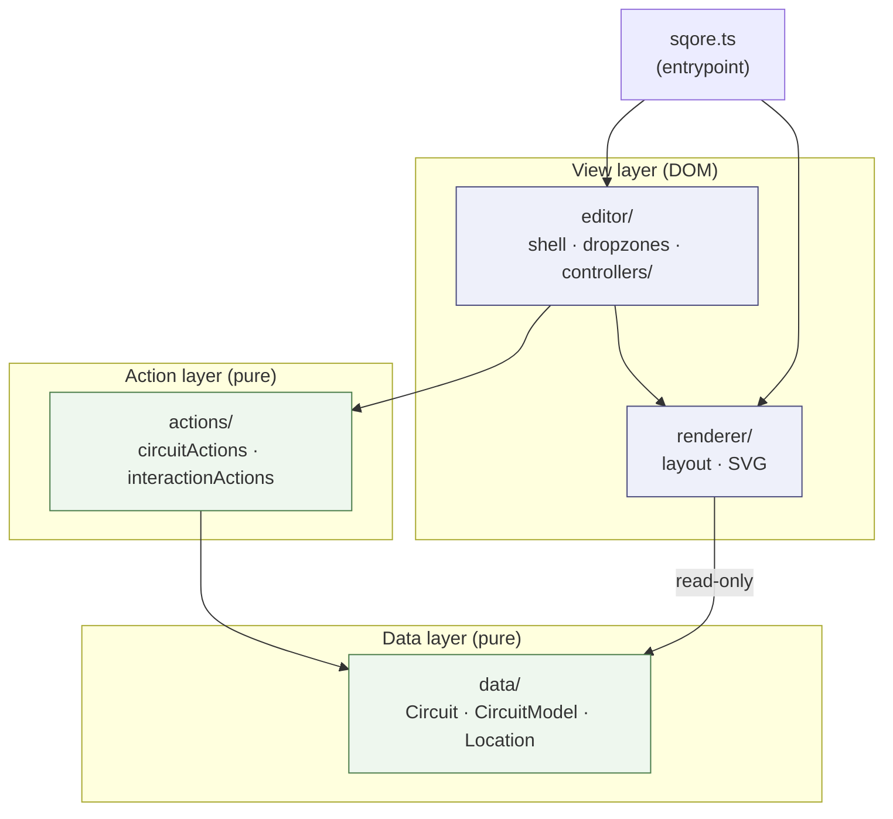
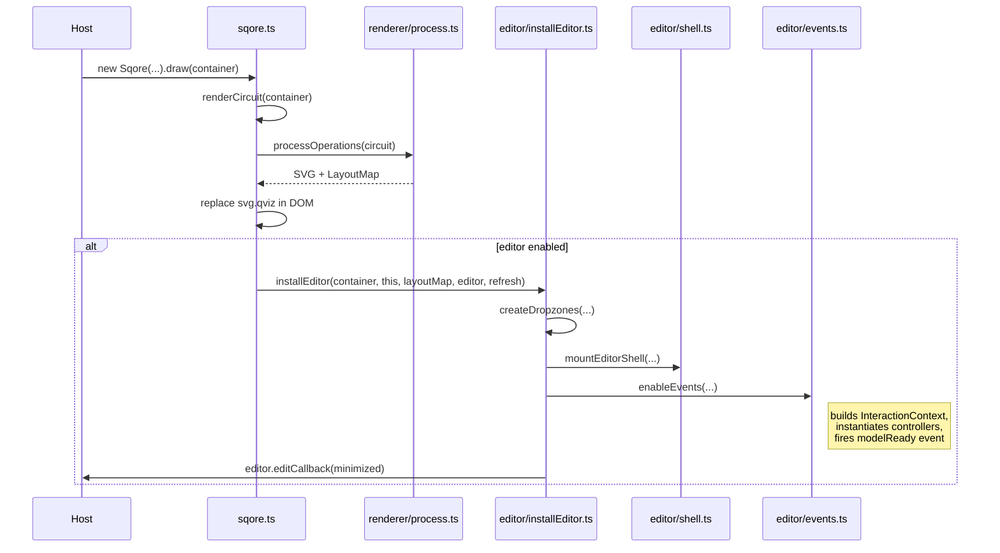
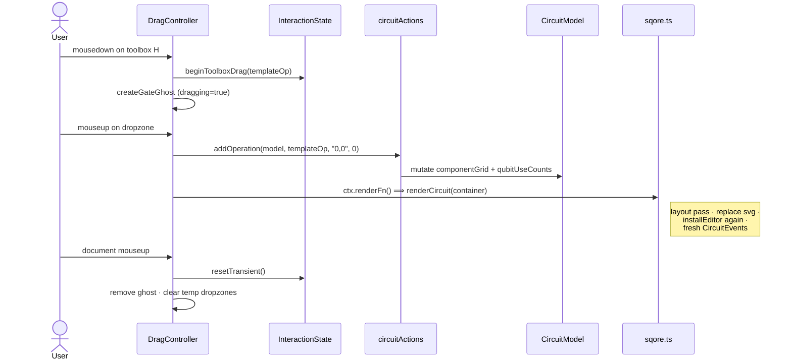

# Circuit editor — architecture walkthrough

> Working note for the re-architecture PR. Captures the structure
> the post-refactor code now follows so reviewers can navigate it
> without having to reverse-engineer it from imports.

## TL;DR

The circuit editor is split into three layers:

```
data/        ← persistent circuit definition + value types
actions/     ← pure mutations against data, plus session state
editor/      ← DOM glue: controllers, overlays, context menu
renderer/    ← layout + SVG generation (View, called by sqore.ts)
state-viz/   ← state visualization panel (parallel subsystem)
```

Plus three top-level files:

- `sqore.ts` — entrypoint. `new Sqore(...).draw()` renders, and on
  every render hands control to either the read-only path or
  `installEditor`.
- `utils.ts` — small shared helpers (location-walking
  `findOperation` family, register helpers, DOM lookups).
- `index.ts` — public API barrel.

The hard rule that drives the layering: **`data/` and `actions/`
are pure data and never touch the DOM.** That's why the
[circuitActions](actions/circuitActions.ts),
[circuitModel](data/circuitModel.ts), and
[location](data/location.ts) tests can be plain Node tests with no
JSDOM, while the editor controllers use a tiny JSDOM in their
test harnesses.



Arrows are _depends on_. `actions/` and `data/` have no edges out
to `editor/` or `renderer/` — that's the testability boundary.

---

## Module map

```
ux/circuit-vis/
├── sqore.ts                      ← entrypoint (Sqore class)
├── utils.ts                      ← findOperation/findParentArray/... + DOM helpers
├── index.ts                      ← public re-exports
│
├── data/                         ← Data layer (no DOM, no actions)
│   ├── circuit.ts                  Circuit/ComponentGrid/Operation types
│   ├── circuitModel.ts             CircuitModel: invariants + qubitUseCounts
│   ├── location.ts                 Location: hierarchical address value type
│   ├── register.ts                 Register / qubit-id helpers
│   └── viewState.ts                ViewState: per-session view prefs (e.g. expand/collapse)
│
├── actions/                      ← Action layer (mutates data, no DOM)
│   ├── circuitActions.ts           addOperation/moveOperation/etc against CircuitModel
│   ├── interactionState.ts         InteractionState: ephemeral session state
│   └── interactionActions.ts       resetTransient/clearSelection/etc against InteractionState
│
├── editor/                       ← View layer (DOM glue, controllers)
│   ├── installEditor.ts            Editor-mode bootstrap (one call from sqore.ts)
│   ├── events.ts                   CircuitEvents: builds InteractionContext, owns controllers
│   ├── shell.ts                    DOM shell: wrapper, toolbox panel, empty-msg, classes
│   ├── toolbox.ts                  createToolboxElement (+ optional Run button)
│   ├── toolboxGates.ts             toolboxGateDictionary (gate templates)
│   ├── standaloneRenderData.ts     toRenderData for ghosts / toolbox icons
│   ├── draggable.ts                createDropzones, ghost helpers, wire-dropzone factory
│   ├── contextMenu.ts              right-click menu (uses CircuitEvents shim)
│   ├── prompts.ts                  _createConfirmPrompt / _createInputPrompt
│   │
│   └── controllers/                Pointer/keyboard event translation
│       ├── interactionContext.ts     InteractionContext: shared deps for controllers
│       ├── dragController.ts         gate-drag, toolbox-drag, dropzone commit, doc-mouseup, add/remove control
│       ├── qubitController.ts        qubit-label drag + remove-qubit-with-confirm
│       ├── selectionController.ts    host-element mousedown + context-menu attach
│       ├── keyboardController.ts     Ctrl-toggle move/copy mode
│       └── scrollController.ts       enableAutoScroll() shared by gate + qubit drags
│
│
├── renderer/                     ← View layer (layout + SVG generation)
│   ├── process.ts                  layout pass: positions every gate, builds LayoutMap
│   ├── layoutMap.ts                LayoutMap value type (geometry handed to editor)
│   ├── gateRenderData.ts           render-data shape consumed by formatters
│   ├── constants.ts                gate sizes, paddings, SVG NS
│   └── formatters/                 gate/wire/register/input formatters → SVG
│
└── state-viz/                    ← parallel subsystem (state visualization panel)
    └── ...
```

---

## The three layers

### Data layer — `data/`

The persistent circuit definition. Read by the renderer, mutated
by the action layer, **never** touches the DOM.

- **[`Circuit`, `ComponentGrid`, `Operation`, `Qubit`](data/circuit.ts)**
  — the on-disk JSON shape. Everything ultimately serializes back
  to this.
- **[`CircuitModel`](data/circuitModel.ts)** — wraps a `Circuit` and
  maintains incremental derived state (`qubitUseCounts`). Owns its
  own invariants (`removeTrailingUnusedQubits`,
  `ensureQubitCount`). Does **not** know how to perform user-level
  edits; that's the action layer's job.
  - Borrows `componentGrid` and `qubits` by reference, not copy.
    Intentional: the renderer (`Sqore`) and the editor see the
    same arrays.
- **[`Location`](data/location.ts)** — value type for hierarchical
  addresses (`"0,1"` top-level, `"0,1-2,3"` nested). Owns the
  parse/compose of the format so the addressing convention lives
  in exactly one place. Immutable; `parent()`/`child()` return new
  instances. `Location.root()` is the empty-segments case.
- **[`Register`](data/register.ts)** — qubit/result register IDs.
- **[`ViewState`](data/viewState.ts)** — per-session view
  preferences that survive `renderCircuit` but are intentionally
  NOT serialized into the saved `.qsc` file. Today: per-group
  expand/collapse overrides keyed by location string. Owned by
  `Sqore`; read by `renderCircuit` after the default-expansion
  passes; written by the chevron click handler. Sits in `data/`
  because it's plain mutable state with no DOM/action coupling —
  but it's a _third_ lifetime distinct from `CircuitModel`
  (persisted) and `InteractionState` (single gesture).

### Action layer — `actions/`

Pure mutations. Each function takes a state container as its first
argument and mutates it in place; returns the affected
`Operation`/`boolean` when the caller needs a handle.

- **[`circuitActions.ts`](actions/circuitActions.ts)** — operates on
  `CircuitModel`. Examples:
  `addOperation`, `removeOperation`, `moveOperation`,
  `addControl`, `removeControl`, `removeQubitWithDependents`,
  `moveQubit`, `removeQubit`. No DOM.
- **[`interactionState.ts`](actions/interactionState.ts)** —
  ephemeral session state container. Holds `selectedOperation`
  (persists across mouseup so the context menu can use it),
  `selectedWire`, `movingControl`, `mouseUpOnCircuit`, `dragging`,
  `disableLeftAutoScroll`, `temporaryDropzones`. Plain mutable
  fields; no methods.
- **[`interactionActions.ts`](actions/interactionActions.ts)** —
  pure helpers (and one DOM-touching helper,
  `clearTemporaryDropzones`) for the multi-step state transitions
  controllers need: `resetTransient`, `beginToolboxDrag`,
  `trackTemporaryDropzone`, etc.

The deliberate split between `CircuitModel` (persistent) and
`InteractionState` (ephemeral) makes it obvious which fields
should never round-trip through serialization.

### View layer — `editor/` + `renderer/`

The renderer turns a `Circuit` into SVG; the editor wires the
resulting DOM to the action layer.

- **`renderer/`** — runs on every render. `processOperations`
  positions every gate and emits a [`LayoutMap`](renderer/layoutMap.ts)
  alongside the SVG, so the editor can position dropzones from the
  same numbers instead of reverse-engineering them from rendered
  attributes.
- **`editor/`** — installed once per render via
  [`installEditor`](editor/installEditor.ts). Builds the editor's
  shell DOM, creates the dropzone overlay, and instantiates the
  controllers that translate pointer/keyboard events into action
  calls.

---

## How a render happens

1. Host calls `new Sqore(circuitGroup, options).draw(container)`
   ([sqore.ts](sqore.ts)).
2. `draw` calls the private `renderCircuit(container)`, which:
   - Deep-copies the circuit (so mutations don't leak back to the
     host), assigns `Location`-based IDs to every op, runs the
     default-expansion passes (`expandOperationsToDepth`,
     `expandIfSingleOperation`), then applies
     [`viewState`](data/viewState.ts) overrides on top so any
     user-toggled expand/collapse choices win. Runs the layout
     pass and replaces the previous `svg.qviz` element.
   - If `options.editor` is set (editing enabled), calls
     [`installEditor(container, this, layoutMap, editor, refresh)`](editor/installEditor.ts).
3. `installEditor` does four things in order:
   1. **`createDropzones`** ([draggable.ts](editor/draggable.ts)) —
      builds the `<g class="editor-overlay">` group inside `svg.qviz`
      and populates the dropzone + ghost-qubit sub-layers from the
      `LayoutMap`.
   2. **`mountEditorShell`** ([shell.ts](editor/shell.ts)) — wraps
      the SVG in `.circuit-wrapper`, prepends the `.panel` toolbox
      (with optional Run button), adds the empty-circuit hint when
      relevant, and ensures the state-viz panel is mounted.
   3. **`enableEvents`** ([events.ts](editor/events.ts)) — disposes
      any previous `CircuitEvents`, builds a new one, and fires a
      `qsharp:circuit:modelReady` event so state-viz can recompute.
   4. **`editor.editCallback(...)`** — notifies the host of the new
      minimized circuit (so the host can persist it).
4. `Sqore.renderCircuit` is also the editor's re-render hook. The
   `refresh` closure handed to `installEditor` is
   `() => sqore.renderCircuit(container)`. Every controller calls
   `ctx.renderFn()` after a successful action.



---

## How a click flows through the layers

The cleanest way to read the layering is to follow a single user
action end-to-end.

### Example: "user drags an H gate from the toolbox onto wire 0"

1. **Toolbox mousedown** ([dragController.ts](editor/controllers/dragController.ts) —
   `installToolboxListeners`). Reads the toolbox-item type, calls
   `beginToolboxDrag(interaction, templateOp)` which sets
   `selectedOperation = templateOp` and
   `disableLeftAutoScroll = true`. Spawns the ghost element via
   `createGateGhost`, which sets `interaction.dragging = true`
   ([draggable.ts](editor/draggable.ts)). Registers a temporary
   dropzone overlay with `trackTemporaryDropzone`.
2. **Mousemove** is handled by `enableAutoScroll`
   ([scrollController.ts](editor/controllers/scrollController.ts)) — installed at
   drag start, removes itself on the next mouseup.
3. **Dropzone mouseup** ([dragController.ts](editor/controllers/dragController.ts) —
   `installDropzoneListeners`). Reads
   `data-dropzone-location`/`data-wire` off the dropzone element,
   marks `mouseUpOnCircuit = true`, and dispatches one of:
   - `addOperation(model, templateOp, location, wire)` — for a
     fresh toolbox drop.
   - `moveOperation(model, src, dst, srcWire, dstWire, ...)` — for
     a placed-gate move.
   - `addControl(model, op, wire)` / `removeControl(...)` — for the
     wire-pick flow that `contextMenu` invokes.
4. **Action** ([circuitActions.ts](actions/circuitActions.ts)) mutates
   the `CircuitModel`. Pure data; no DOM.
5. **Re-render**. Controller calls `ctx.renderFn()`, which is the
   `() => sqore.renderCircuit(container)` closure. Sqore re-runs
   the layout pass, replaces `svg.qviz`, and `installEditor` runs
   again. The previous `CircuitEvents` is disposed; a new one is
   built. The model is fresh from `new CircuitModel(sqore.circuit)`.
6. **Document mouseup** ([dragController.ts](editor/controllers/dragController.ts) —
   `installDocumentListeners`). Cleans up the ghost, calls
   `resetTransient(interaction)` to clear all transient flags and
   tear down the temporary dropzones, removes the auto-scroll
   listener.

Every controller is read-only with respect to the others — they
all read/write the same `model` and `interaction` via the shared
[`InteractionContext`](editor/controllers/interactionContext.ts), and they all
re-render via the same `renderFn`.



---

## The `InteractionContext`

The single piece of glue every controller depends on. Built once
per `CircuitEvents` instance in [events.ts](editor/events.ts) and
handed by reference to each controller:

```ts
interface InteractionContext {
  readonly model: CircuitModel; // Data layer
  readonly interaction: InteractionState; // Action-layer ephemeral
  readonly layoutMap: LayoutMap; // geometry from renderer
  readonly container: HTMLElement;
  readonly circuitSvg: SVGElement;
  readonly overlayLayer: SVGGElement; // editor-only DOM lives here
  readonly dropzoneLayer: SVGGElement;
  readonly ghostQubitLayer: SVGGElement;
  wireData: number[]; // wire Y positions; mutable
  readonly renderFn: () => void; // = () => sqore.renderCircuit(container)
}
```

Controllers are intentionally translation-only: they own their
listeners and lifecycle, but hold no state. State lives on
`model` (persistent) or `interaction` (ephemeral). That's what
lets `dragController.test.mjs` etc. construct a controller with a
hand-built context and exercise it directly.

---

## Controller responsibilities

| Controller                                                                         | Surface                                                                                        | Notes                                                                                                                                                                                       |
| ---------------------------------------------------------------------------------- | ---------------------------------------------------------------------------------------------- | ------------------------------------------------------------------------------------------------------------------------------------------------------------------------------------------- |
| [DragController](editor/controllers/dragController.ts)                             | gate-drag, toolbox-drag, dropzone commit, document-level mouseup, add/remove-control wire-pick | Largest controller — these flows share dropzones/ghost/`interaction` flags so splitting wouldn't separate concerns. Holds a `QubitController` ref for the qubit-label drag-out-delete path. |
| [QubitController](editor/controllers/qubitController.ts)                           | qubit-label drag (swap + insert-between dropzones), `removeQubitLineWithConfirmation`          | Public method called from two callers: context menu (via `CircuitEvents` shim) and `DragController`'s document-mouseup handler.                                                             |
| [SelectionController](editor/controllers/selectionController.ts)                   | host-element mousedown (sets `selectedWire`/`movingControl`), context-menu attach              | Smallest controller; runs deeper in the DOM than `DragController`'s gate handler so its state mutation is visible by the time the drag handler runs.                                        |
| [KeyboardController](editor/controllers/keyboardController.ts)                     | document `keydown`/`keyup` for Ctrl-toggle move/copy                                           | Stateless; only consults whether `selectedOperation` has a location.                                                                                                                        |
| `enableAutoScroll` ([scrollController.ts](editor/controllers/scrollController.ts)) | document `mousemove` near container edges                                                      | Function not class — no shared state, called fresh by both gate-drag and qubit-drag. Self-removes on next mouseup.                                                                          |

`CircuitEvents` itself ([events.ts](editor/events.ts)) is just
wiring: build the context, instantiate each controller, expose
`dispose()` and the two `_startAddingControl`/`_startRemovingControl`
delegates that `contextMenu.ts` still calls by name.

### Compatibility shims still on `CircuitEvents`

Three deliberate carryovers from the pre-refactor API:

- `componentGrid` / `qubits` / `qubitUseCounts` getters delegate
  to `model`. Kept so `getCurrentCircuitModel` (consumed by
  state-viz) and `contextMenu.ts` keep working unchanged.
- `_startAddingControl(op, loc)` / `_startRemovingControl(op)`
  delegate to `DragController`. Kept so `contextMenu.ts` doesn't
  need to know about controllers yet.

These can be retired once `addContextMenuToHostElem` itself is
migrated to a controller-shaped API. Out of scope for this PR.

---

## Notable invariants

- **Editor-only DOM lives in one place.** Every node the editor
  creates inside `svg.qviz` lives inside `<g class="editor-overlay">`
  ([draggable.ts](editor/draggable.ts)). Renderer-owned children of
  `svg.qviz` (gates, wires, register labels) stay purely
  presentational. Controllers append to `ctx.overlayLayer` /
  `ctx.dropzoneLayer` / `ctx.ghostQubitLayer`, never directly to
  `svg.qviz`.
- **Re-render replaces the SVG.** `renderCircuit` swaps `svg.qviz`
  wholesale on every render. Anything inside the SVG dies with it
  (including all listener attachments on host elements / qubit
  labels / dropzones). That's why those controllers don't need
  `dispose()` — only `KeyboardController` and `DragController`
  install document-level listeners and need to clean them up.
- **Locations are always `Location.parse`-able.** Strings on the
  wire (`data-location`, `data-dropzone-location`, `LayoutMap`
  keys) all round-trip through [`Location`](data/location.ts).
  Out-of-bounds locations return `null` from
  `findOperation`/`findParentArray`/`findParentOperation` — they
  no longer throw `TypeError`, which made stale-DOM-attribute
  races unsafe ([utils.ts](utils.ts)).
- **`LayoutMap` is the single source of geometry.** Dropzones and
  the editor's ghost positioning read from `LayoutMap`, not from
  rendered SVG attributes. Keeps the editor accurate for nested
  scopes too.

---

## Testing layout

Tests mirror the source layering:

```
test/
├── circuit-editor/                ← layered editor tests
│   ├── location.test.mjs            (data/)
│   ├── circuitModel.test.mjs        (data/)
│   ├── circuitActions.test.mjs      (actions/)
│   ├── interactionActions.test.mjs  (actions/)
│   ├── findOperation.test.mjs       (utils.ts nav helpers)
│   ├── dropzones.test.mjs           (editor/draggable layer)
│   ├── dragController.test.mjs      (editor/)
│   ├── qubitController.test.mjs     (editor/)
│   ├── selectionController.test.mjs (editor/)
│   ├── keyboardController.test.mjs  (editor/)
│   ├── scrollController.test.mjs    (editor/)
│   └── toolboxRunButton.test.mjs    (editor/, run-button regression)
│
├── state-viz/                     ← state-viz subsystem tests
│   ├── stateCompute.test.mjs
│   ├── stateViz.js
│   └── cases/                       HTML snapshots
│
└── (top-level: language/compiler tests — unchanged)
```

`data/` and `actions/` tests are plain Node tests with no JSDOM.
`editor/` controller tests construct an `InteractionContext` from a
tiny JSDOM and a fresh `CircuitModel`, then invoke the controller
directly.

233 tests total at time of writing.

---

## Conventions

- **Controllers translate, they do not own.** No mutable state on
  the controller class itself.
- **Actions mutate, they do not render.** No DOM, no `renderFn`
  calls inside `actions/`. Controllers re-render after dispatching.
- **Locations go through `Location`.** Never hand-format
  `${col},${op}`; always `Location.of(...).toString()` (or use the
  string already on the DOM attribute).
- **`null` means "not found".** `findOperation` & friends return
  `null` for both "no input" and "out of bounds" — callers stay
  defensive, no throws to catch.
- **One overlay group, one source of geometry.** Don't append to
  `svg.qviz` directly; use `ctx.overlayLayer`. Don't measure
  rendered SVG; ask the `LayoutMap`.
