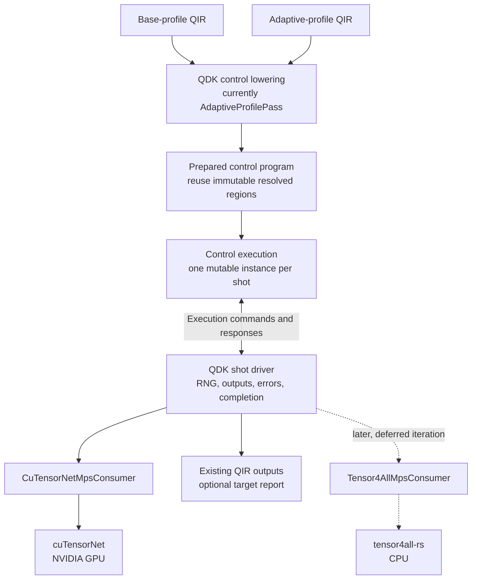

# Shared Simulator Execution

This directory separates Adaptive control from target-specific quantum-state
evolution. The public API remains available through `qdk_simulators::execution`;
`execution.rs` is the facade and the files here own the implementation.

## Module Responsibilities

| File           | Responsibility                                                                                               |
| -------------- | ------------------------------------------------------------------------------------------------------------ |
| `adaptive.rs`  | Prepares Adaptive bytecode, identifies unitary regions, interprets classical control, and produces commands. |
| `protocol.rs`  | Defines the commands and responses exchanged between Adaptive control and an execution target.               |
| `region.rs`    | Defines target-neutral quantum evolution regions and the consumer lifecycle.                                 |
| `unitary.rs`   | Defines resolved unitary operations and the legacy `Simulator` application bridge.                           |
| `immediate.rs` | Provides the generic synchronous shot driver and adapts the legacy `Simulator` trait.                        |

The source-level dependency direction is:

```text
Adaptive bytecode
      |
      v
 adaptive.rs -------> protocol.rs
      |                    |
      |                    v
      +--------------> region.rs
                           |
                           v
                       unitary.rs
                           |
                           v
                     target adapter
```

The bytecode is a control-plan representation. A target adapter does not
interpret bytecode or select branches. It receives only reached regions and
host-visible requests.

## Glossary

- **Engine**: the computational method that evolves quantum state, such as
  tensor4all, cuTensorNet, or a full-state simulator.
- **Device**: the host target on which an engine runs, currently `cpu` or
  `nvidia` in the planned MPS route.
- **Simulation Method**: the QDK-facing `type=` selector, such as `"mps"`.
- **Target**: the concrete Engine and Device pairing selected for dispatch.

The `MpsOptions(device=...)` examples in
[Next Integration Iteration](#next-integration-iteration) show how the
Simulation Method remains stable while Device selects a Target.

## Infrastructure Sharing vs. Profile Semantics

Sharing `PreparedAdaptiveProgram` and `AdaptiveExecution` across Base and
Adaptive QIR simplifies the implementation; it does not merge their QIR-level
contracts. Base Profile's no-branching, statically resolvable guarantee is
enforced independently by QIR validation, regardless of which Engine executes
the program.

`QuantumEvolutionRegion` enables that sharing without a profile-specific
execution mode. Base Profile is the one-region restriction of the same general
structure rather than a separate control implementation. The candidate
single-region, no-branch fast path recognizes a Base-shaped program internally;
it does not relax or change either profile's specification-level meaning or
validation.

## Execution Flow

`PreparedAdaptiveProgram` retains the original bytecode control tables and
caches deterministic region locations once. Each `AdaptiveExecution` owns the
mutable state for one shot: its instruction position, registers, measurement
results, ordered output records, and command/response protocol state.

```text
Python AdaptiveProfilePass
           |
           v
   AdaptiveProgram<Word>
           |
           v  prepare once per request
 PreparedAdaptiveProgram
           |
           +-----------------------+
           |                       | one per shot
           v                       v
   AdaptiveExecution         AdaptiveExecution ...
           |
           | AdaptiveCommand
           v
      shot driver
           |
           v
      target adapter --------> continuing target state
           |
           | AdaptiveResponse
           +------------------> AdaptiveExecution
```

The command/response protocol is deliberately small:

```text
AdaptiveExecution::new
           |
           v
         Ready
           |
           +-- ExecuteRegion ---------> AwaitingRegionCompletion
           |                                      |
           |<---------- RegionComplete -----------+
           |
           +-- Measure --------------> AwaitingMeasurementResult
           |                                      |
           |<-------- Measurement(result) --------+
           |
           +-- Complete(records) -----> Complete
```

A `QuantumEvolutionRegion` is uninterrupted target-local state evolution
between host-visible semantic boundaries. The current payload contains only
resolved unitary operations. Measurements, stochastic decisions, queries,
ordered output, and classical branch selection remain outside a region.

`drive_prepared_shot` provides synchronous orchestration for any
`RegionConsumer`. `run_prepared_shot` retains the existing simulator-facing
signature as a thin `ImmediateSimulatorConsumer` compatibility wrapper:

```text
driver             AdaptiveExecution          RegionConsumer                 target
   |                        |                         |                           |
   |-- next_command ------->|                         |                           |
   |<-- ExecuteRegion ------|                         |                           |
   |-- prepare/execute ------------------------------>|                           |
   |                        |                         |-- apply operation -------->|
   |                        |                         |<-- operation complete -----|
   |                        |                         |-- apply operation ... ---->|
   |                        |                         |<-- operation complete -----|
   |<-- region report --------------------------------|                           |
   |-- RegionComplete ----->|                         |                           |
   |<-- Measure ------------|                         |                           |
   |-- measure(request) ----------------------------->|                           |
   |                        |                         |-- mz or mresetz ---------->|
   |                        |                         |<-- measurement complete ---|
   |                        |                         |-- read result ------------>|
   |                        |                         |<-- MeasurementResult ------|
   |<-- MeasurementResult ----------------------------|                           |
   |-- Measurement(result) ->|                        |                           |
   |<-- Complete(records) --|                         |                           |
   |-- finish/close --------------------------------->|                           |
```

`RegionConsumer` is the driver's only interface for region execution; the
underlying legacy `Simulator` (`FullStateSimulator` or `StabilizerSimulator`)
never receives a region and has no concept of one. The
`ImmediateSimulatorConsumer::execute_region` implementation re-decomposes each
region into ordinary one-gate-at-a-time `Simulator` calls through
`apply_unitary_immediately` in `unitary.rs`, eagerly discarding the batching
opportunity. Region grouping is therefore a structural no-op for CPU and
Clifford, making parity with the legacy oracle direct. Planned
`Tensor4AllMpsConsumer` and `CuTensorNetMpsConsumer` implementations will instead
consume whole regions and replace that per-operation loop with one batched
tensor-network contraction; no current consumer exercises that purpose yet.

The immediate path is currently a compatibility implementation and parity
oracle. The legacy `bytecode::runtime::run_shot` remains the production CPU and
Clifford execution path until migration is explicitly validated.

An internal, experimental Python/native route now proves that representative
Base-profile QIR can be lowered by `AdaptiveProfilePass`, prepared once as a
`PreparedAdaptiveProgram`, and executed per shot by `run_prepared_shot` with an
`ImmediateSimulatorConsumer`. The deterministic two-qubit proof program
partitions its unitary prefix into exactly one `QuantumEvolutionRegion` and
matches the existing Base CPU output across multiple shots. This route is not a
documented API or production dispatch path and does not add backend or noise
support.

The public `run_qir(type="mps", mps_options=MpsOptions(...))` contract now
routes noiseless Base-profile QIR through the same lowering and preparation,
then through a separately named native entry point using
`drive_prepared_shot` and
`ImmediateSimulatorConsumer<FullStateSimulator>`. Preparation is shared per
request, while simulator, RNG, measurement, and control state remain fresh per
shot. This full-state implementation is an explicit contract-solidification
placeholder. It is not an MPS engine, NVIDIA execution, backend completion, or
a performance claim. The private probe remains available as a separate
diagnostic route.

## A Walk Through `run_qir` MPS

This traces one noiseless Base-profile request from the public API down to the
cuTensorNet Engine and back, one row per functional block. It uses the
[Glossary](#glossary) terms: Simulation Method is the `type=` selector, Device
is the host target, Engine is the computational method that evolves quantum
state, and Target is the selected pairing.

Base Profile guarantees a single `QuantumEvolutionRegion`, so all state
evolution precedes all measurement. That is the precondition that allows the
state to be prepared once and every shot to be drawn in one Engine call. Rows
12-17 convert that sample buffer into ordinary output records through the
existing per-shot control path, so the result contract is identical to
`type="cpu"`.

The rightmost column names the objective currently being tracked and records
each block's readiness against it. When that objective is met the column is
renamed to the next one and the readiness values are reassessed, so the table
stays a live plan rather than an accumulating history.

Note one terminology hazard throughout this walk. In the QDK, `type="gpu"` and
every `gpu` identifier refer to the wgpu full-state simulator, which runs on any
compatible adapter and requires no NVIDIA hardware. The path described here is
reached through `type="mps"` and needs CUDA and cuTensorNet. The two are
independent, so this walk names NVIDIA hardware explicitly and never borrows the
existing `gpu` vocabulary for it.

TODO: the `run_qir` docstring still tells a user who has NVIDIA hardware to
select `type="gpu"`, which reaches wgpu rather than cuTensorNet. That guidance
is accurate today only because `type="mps"` is a placeholder. Before the MPS
path performs real NVIDIA execution, the public documentation and the option
surface must make this distinction discoverable without reading source. The
mechanism is undecided and is recorded here so that it is not decided by
default.

| #   | Block                                                                                                        | Input                                                     | Output                                                     | Demo               | Effort | Comment |
| --- | ------------------------------------------------------------------------------------------------------------ | --------------------------------------------------------- | ---------------------------------------------------------- | ------------------ | ------------ | ----------- |
| 1   | [`run_qir`](../../../qdk_package/qdk/simulation/_simulation.py) Simulation Method dispatch                   | QIR source, `type="mps"`, `MpsOptions(device=...)`, shots, seed | Target selection; call to the MPS entry point           | Missing: availability probe and hardware-test split | 45m | Follows the hardware-gate pattern in `test_adaptive_gpu_bytecode.py`, which gates wgpu rather than NVIDIA and therefore needs a separate variable; `AvailabilityError` already carries the `OSError` message |
| 2   | [`preprocess_simulation_input`, `_validate_base_profile`](../../../qdk_package/qdk/simulation/_simulation.py) | QIR source                                                | Validated Base Profile module                              | Done | -- | Shared with every other Simulation Method; nothing target-specific |
| 3   | `AdaptiveProfilePass(Bytecode.Bit64)`                                                                        | Base Profile module                                       | Adaptive bytecode (`AdaptiveProgram<Word>`)                | Done | -- | The same lowering pass production Adaptive QIR already uses |
| 4   | [Native entry point](../../../qdk_package/src/qir_simulation/cpu_simulators.rs)                              | Bytecode dict, shots, seed                                | `AdaptiveProgram<u64>`                                     | Missing: swap the full-state call for the MPS shot loop | 15m | `run_mps_full_state_placeholder` is already wired to `run_qir`; one call changes |
| 5   | [`PreparedAdaptiveProgram::new`](adaptive.rs)                                                                | `AdaptiveProgram<u64>`                                    | Prepared program with region sites resolved once           | Done | -- | Shared with the Base-profile probe; unchanged |
| 6   | [`measured_qubits()`](adaptive.rs)                                                                           | Prepared program                                          | Ordered measured qubits with `result_id` mapping           | Done | -- | Computed during the existing region walk through the decoder shared with runtime execution |
| 7   | [MPS shot loop](../../../qdk_package/src/qir_simulation/cpu_simulators.rs)                                   | Prepared program, shots, seed                             | `Vec<Vec<OutputRecord>>`; owns the session lifetime        | Missing: whole shot loop | 1h | Transcribes `run_shared_execution_full_state_shots` (28 lines), sequential rather than `par_iter` |
| 8   | Target adapter `CuTensorNetMpsConsumer`                                                                      | The single `QuantumEvolutionRegion`, sample matrix, shot index | Measurement bits from the precomputed sample row       | Done | -- | Crate-private per-shot view with no-op region and close methods, guarded against multiple regions and feedforward |
| 9   | [`Gate::from_unitary_operation`](../../../cutensornet/src/library/simulation/circuit.rs)                     | `UnitaryOperation`                                        | `Gate`, no gate for `I`, or a typed unsupported error      | Done | -- | Landed in `11a651339`; exhaustive over all unitary variants with no catch-all, and its four tests run on any host since `f262a60ae` |
| 10  | [`SessionApi`](../../../cutensornet/src/library/simulation/session.rs) / [`ReplayApi`](../../../cutensornet/src/library/simulation/replay.rs) via `NativeApi` | `Circuit` and `ExecutionPolicy`     | Evolved MPS state on the Device                            | Done | -- | Ported `SamplerApi`, `PreparedSampler`, session/replay sampling, and cross-platform FakeApi coverage from `eed6e1bbe`; pure logic remains ungated while the native adapter stays with the existing native implementations to preserve loader encapsulation |
| 11  | cuTensorNet Sampler Engine APIs                                                                              | State handle, measured modes, shot count, derived seed    | Flat `int64` array indexed `[shot * n_measured + j]`       | Done | -- | Ported the five generated bindings and required symbols from `eed6e1bbe`; the frozen surface is 30 symbols |
| 12  | Sample narrowing                                                                                             | Flat `int64` buffer                                       | `u8` buffer plus the qubit-to-column map                   | Missing: native sample narrowing; column map done | 15m | The device buffer is flat `[shot * measured + j]`; plain indexing |
| 13  | [`AdaptiveExecution`](adaptive.rs)                                                                           | Prepared program and one buffer row                       | Ordered `OutputRecord`s for that shot                      | Done | -- | Unchanged; already accumulates the output records during the walk |
| 14  | [`drive_prepared_shot`](immediate.rs)                                                                        | Prepared program and a per-shot `RegionConsumer`          | `ShotExecutionOutput`                                      | Done | -- | Unchanged; `close()` fires per shot, which is why the consumer must be a view |
| 15  | Shot loop collection                                                                                         | One `Vec<OutputRecord>` per shot                          | `Vec<Vec<OutputRecord>>`; session closed once              | Missing: collection and session close | 15m | Same `collect::<Result<Vec<_>, _>>()` as the full-state loop |
| 16  | [`output_records_to_pylist`](../../../qdk_package/src/qir_simulation/cpu_simulators.rs)                       | `Vec<Vec<OutputRecord>>`                                  | Python list                                                | Done | -- | Unchanged; already target-neutral |
| 17  | [`run_qir`](../../../qdk_package/qdk/simulation/_simulation.py) return                                       | Python list                                               | Same records, ordering, and errors as `type="cpu"`         | Done | -- | Unchanged; `OutputRecordingPass` shapes the returned records |

Effort is a rough estimate for one implementer already familiar with the code.
It excludes review, A100 validation, and the demonstration circuit, none of
which are functional blocks in this walk. The missing work totals just under
two and a half hours. The estimates are low because every remaining block
has a working sibling to copy rather than a design to invent; the comment
column names the sibling in each case, so the numbers can be argued with
directly.

Rows 10 and 11 were ported from committed source `eed6e1bbe`, which carries the
symbol allowlist, five Sampler bindings, `SamplerApi`, and `PreparedSampler`
together and was qualified on an A100 in `cutensornet-rust-ffi`. This port
extends the `simulation.rs` split established in `f262a60ae`: pure sampler
logic and FakeApi tests compile on every host, while native bindings remain
`linux + x86_64`-gated. The native `SamplerApi` implementation lives beside
the existing native replay adapter so the dynamic-loader fields remain
private.

Three constraints hold this together and are easy to violate silently.

The Target adapter receives only reached regions and host-visible requests. It
does not interpret bytecode, select branches, or assemble output records. Rows
13 and 14 own that conversion, which is why the sample buffer needs no
reshaping beyond narrowing.

`RegionConsumer::close` is invoked at the end of every shot, so the per-shot
consumer must not own the session. Row 7 owns it; the per-shot consumer is a
view over one row of the buffer whose region and close operations are no-ops.

Sampling every shot at once is valid only for a single-region program. A
Base-profile program that measures mid-circuit and then continues evolving
partitions into more than one region, and must be rejected with a typed error
naming the region count rather than silently sampled. Lifting that restriction
requires incremental measurement, where each `Measure` draws from a conditional
marginal and collapses the state, which is also what Adaptive Profile
feedforward will require.

## Next Integration Iteration

The next backend iteration is a non-production, end-to-end Base-profile
integration through the established public/shared-control path and a real
NVIDIA cuTensorNet MPS consumer, replacing the full-state placeholder at the
consumer boundary. Near-term scope is NVIDIA cuTensorNet integration only. A CPU
tensor4all-rs consumer (`Tensor4AllMpsConsumer`) is a later, not-yet-scheduled
follow-on iteration; it is deferred and out of scope for the current work,
though the shared control/driver design below is kept consumer-agnostic so
that a second consumer can be added without rework. Base Profile is a
restriction of the same control execution used for Adaptive Profile, not
a separate tensor-network execution model. Its control program is linear: it
does not branch on measurement results, and preparation can resolve and cache
its immutable region definitions once for reuse across shots. Resolving a
region means decoding operation IDs, angles, qubit operands, and region
boundaries into target-neutral `UnitaryOperation` values. It does not mean
sharing mutable quantum state, measurement outcomes, native operator
registrations, workspaces, or other target-specific resources between shots.

This integration proceeds in four iterations, each independently evidenced
and separately reviewed before the next begins:

1. **Port the native cuTensorNet crate, unchanged.** Bring over the crate
  from `cutensornet-rust-ffi` at its committed HEAD `2f48bd233` as a new
  workspace member, in full -- dynamic loading, bindings, the error/result
  layer, the qualified static execution lifecycle, and the branch-
  continuation machinery. Porting only the Base stage (B0-B5) is
  insufficient: `cutensornetStateCaptureMPS` arrived with branch
  continuation and is required here, because Base runs through the Adaptive
  lowering and measurement must return to the caller and continue. Exclude
  the untracked, in-progress noise work (`selected_pauli.rs`). Gate the
  member with the workspace's existing `gpu` cargo feature convention
  (`source/simulators/src/lib.rs:7`). Also port the VM provisioning and
  evidence scripts (`bootstrap-os.sh`, `bootstrap-rust.sh`,
  `bootstrap-cuda.sh`, `verify-environment.sh`, `collect-evidence.sh`,
  `rebuild-all.sh`), without which the ported code cannot be validated on
  the A100. Evidence bar: every non-ignored test passes locally on CPU
  against the crate's `FakeReplayApi` mock, and every `#[ignore]`-gated
  A100 test passes on the qualified host; no drift from the source
  worktree's committed HEAD.
2. **Decompose the measurement primitive.** `cutensornet-rust-ffi`'s
  qualified measurement/branch sequence exists only as a monolithic,
  `#[cfg(test)]`-gated harness (`Session::simulate_with_branch` et al.)
  that takes a whole circuit and a pre-forced outcome upfront, with no
  return-to-caller point between mass computation and projection.
  Refactor the ported crate's internals into independently callable
  steps (compute-masses / project-given-outcome / capture-continue) and
  expose the right visibility boundary for iteration 3 to consume.
  Validate the decomposition reproduces the exact same qualified numbers
  as the monolithic call.
3. **Implement `CuTensorNetMpsConsumer: RegionConsumer`.** Wrap the
  decomposed primitives from iteration 2 behind the trait
  (`prepare_region`/`execute_region` on the static lifecycle, `measure()`
  on the mass/project split, `finish_execution`/`close` for output
  reconstruction and cleanup). Validate against the CPU oracle
  (`ImmediateSimulatorConsumer<FullStateSimulator>`) purely through the
  trait; no `run_qir` wiring yet.
4. **Wire into `run_qir(type="mps", device="nvidia")`, end-to-end.** Real
  Base-profile QIR through the real entry point on an actual NVIDIA host.
  Retained evidence: (a) deterministic Base fixtures match
  `run_qir(type="cpu")` exactly, per shot, with no tolerance; (b) stochastic
  fixtures reproduce exactly under a fixed seed on the same backend, and agree
  with CPU distributionally within a stated tolerance at a stated shot count;
  (c) elapsed time at no fewer than two operating points, with shot count
  varied across them.

Only iteration 1 requires fresh approval beyond this iteration's own
(new native/GPU-gated dependency in the workspace); iterations 2-4 build
on that approved boundary.

Caching resolved region content is one optimization this structure enables; a
further one is available but not yet implemented. When a prepared program has
exactly one region and no reachable branch instruction, its entire command
sequence (`ExecuteRegion` → measurements → `Complete`) is fully determined at
prepare time—nothing depends on a runtime outcome. A specialized executor could
skip the `next_command`/`accept_response` state machine entirely for this class
of program: apply the cached resolved operations directly, issue the known
measurement requests directly, and collect records, with no
`AdaptiveCommand`/`AdaptiveResponse` round-trip or per-shot region-`Vec`
allocation. This must remain a prepare-time-selected specialization validated
against the general engine as the correctness oracle—not a second,
independently-maintained execution path—to avoid reintroducing the API or
semantic drift this project exists to eliminate. This is a candidate for a
later, explicitly scoped performance iteration with its own before-and-after
measurement; it must not be implemented alongside correctness-focused work.

The current names `AdaptiveProfilePass`, `PreparedAdaptiveProgram`,
`AdaptiveExecution`, `AdaptiveCommand`, and `AdaptiveResponse` predate this
decision. Generalize those names and ownership only as implementation requires;
do not introduce a parallel `BaseProfileExecutionDriver`. The first
discriminating check is that representative Base QIR can use the existing
control lowering and command protocol while preserving current MPS outputs.

Correctness parity is necessary but not sufficient to prove Base and Adaptive
control convergence. Before making that claim, retain performance parity
evidence against the legacy Base runtime for per-shot dispatch and VM overhead,
including elapsed time at no fewer than two operating points. This is a
required evidence gate, not an assumption that follows from implementing the
shared route.



The temporary host selection for this iteration keeps the Simulation Method
stable and constrains the Device explicitly:

```python
run_qir(qir, type="mps", mps_options=MpsOptions(device="nvidia"))
```

`device="nvidia"` is the accepted forward contract for the next cuTensorNet
consumer, but it currently executes the explicitly named full-state
placeholder; it does not yet claim NVIDIA execution. Omitting `device` uses the
same placeholder. `device="cpu"` resolving to tensor4all-rs is deferred to the
later follow-on iteration described below and is rejected without fallback.
Unknown devices are also rejected. Engine and Device remain distinct
internally. Automatic selection from host capabilities or Program Requirements
is future work.

The iteration must establish one path for target-neutral measurements,
QDK-owned outcome sampling, consumer failures, target reports, completion, and
cleanup, using the cuTensorNet consumer as the first real, non-placeholder
implementation. It is not forced through the eager `MpsEngine` trait.

### Deferred Follow-On: CPU tensor4all-rs Consumer

Building `Tensor4AllMpsConsumer` against tensor4all-rs (CPU) is explicitly
out of scope for the current iteration. It is a later, not-yet-scheduled
follow-on that reuses the same shared control execution, `RegionConsumer`
contract, and shot driver validated by the NVIDIA cuTensorNet work. It should
not be started until the cuTensorNet consumer is complete and a separate,
explicit go-ahead is given for the CPU consumer. `device="cpu"` resolving to
tensor4all-rs, and the tensor4all parity implementation itself, belong to that
later iteration, not this one.

### Authority and Coordination

For this iteration, current executable code and tests define implemented
behavior, this README owns the local execution direction, and retained backend
evidence defines proven engine capabilities. `source/mps/DESIGN.md` is
historical and advisory, not a source of truth or required pre-read. It must not
block, widen, or override this iteration. Report missing decisions or conflicts
to the user instead of reconciling implementation back to that document.

#### Exploration Inputs

`tensor4all-mps-integration`, `cutensornet-rust-ffi`, `fire-and-ice-tn`, and
`~/Work/qir-mps-tensornetwork` are exploration and demonstration sources, not
production candidates or contracts. Their lessons and capability evidence are
extracted and reshaped into this design; their APIs, symbol names, and option
shapes are not imported verbatim. This includes the existing `MpsOptions` and
`run_qir_mps` surface in `tensor4all-mps-integration`.

The cuTensorNet noise spike and Fire and Ice tensor4all/QEC investigation run
in parallel. Their findings provide capability and contract feedback; they do
not independently change this integration scope. Never consume incidental
bytes from either agent's live dirty worktree.

The retained cuTensorNet B5 mechanism evidence is in the sibling evidence
repository:

```text
/home/domingom/Work/qdk-tensor-network-project/cutensornet/retained/
```

Relevant inputs are:

- `t3-adaptive-b5-gate1-20260827-a100/` for branch-mass, selected projection,
  capture, continuation, lifecycle, and failure evidence;
- `t3-b5-matched-performance-20260828-a100-evidence-r1.tar.gz`, SHA-256
  `000276865bc3ae94fe0144d7302c699dbecbc4fae372e984ebd060fa92f667cd`;
- `t3-b5-matched-performance-20260828-a100-evidence-r2.tar.gz`, SHA-256
  `f490d85e3bca2a86376f0404592570c8f2d418ceec3e166edfdc3e7c8ef0bee4`;
  and
- the nested sealed source snapshot
  `inputs/qdk-cutensornet-b5-matched-performance-20260828-r1.tar.gz`, SHA-256
  `2dcdd3c0bdbdef250254a3ad7cecccd33e7b4f350fdeb74fb5ba521bd5474601`.

The stable B5 branch-continuation source baseline is cuTensorNet worktree commit
`2f48bd2332d3c6143fedf38cd5913756284a5f4a`. The current cuTensorNet agent is
changing overlapping replay files for B6; integrate from a committed or sealed
input and reconcile later findings explicitly.

### Toolchain Boundary

QDK requires Rust 1.96 or later. The retained cuTensorNet mechanism was
qualified with Rust 1.95, so importing it requires explicit compatibility
validation rather than assuming that evidence transfers across toolchains:

1. compile, format, run focused tests, and run strict Clippy for the wrapper and
   adapter under Rust 1.96;
2. prove an ordinary CPU-only QDK build neither loads nor requires CUDA or
   cuTensorNet at build time or process startup;
3. run the same focused suite on Linux x86-64 with the qualified CUDA and
   cuTensorNet libraries; and
4. run both `device="cpu"` and `device="nvidia"` from identical Base QIR on the
   NVIDIA VM, retaining correctness, failure, cleanup, target, and wall-clock
   evidence.

Local results are not NVIDIA VM evidence. Record VM commands and elapsed time
explicitly. Do not begin Adaptive product integration, noise integration,
general-TN work, automatic target selection, or production API stabilization
as part of this iteration.

## Simulator Adoption

The shared abstractions allow backends to reuse control semantics without
requiring every backend to use the same state representation or execution
strategy.

| Simulator path      | Current execution                                                                                                                | Shared-executor path                                                                                                                                                                                                                    |
| ------------------- | -------------------------------------------------------------------------------------------------------------------------------- | --------------------------------------------------------------------------------------------------------------------------------------------------------------------------------------------------------------------------------------- |
| CPU full-state      | `AdaptiveProgram<u64>` interpreted by the legacy Rust runtime; implements `Simulator`.                                           | Use `ImmediateSimulatorConsumer` first. Replace it only if region preparation provides a measured benefit.                                                                                                                              |
| Clifford/stabilizer | Same legacy Adaptive runtime; implements `Simulator`.                                                                            | Use `ImmediateSimulatorConsumer`; preserve identical measurement, noise, and output behavior.                                                                                                                                           |
| Adaptive GPU        | `AdaptiveProgram<u32>` and control are interpreted inside WGSL.                                                                  | A persistent GPU region consumer is possible, but host synchronization at every region or measurement may regress performance. Compare that design with retaining device-side control while sharing preparation and protocol semantics. |
| MPS                 | `run_qir(type="mps")` uses shared execution through `ImmediateSimulatorConsumer<FullStateSimulator>`, a non-MPS placeholder.     | Replace the placeholder with a fallible NVIDIA cuTensorNet consumer that retains one live MPS per shot and uses the generic driver's target-neutral measurement protocol. A CPU tensor4all consumer remains deferred.                   |
| Sparse Q# evaluator | Executes the Q# evaluator graph through its own fallible backend and supports dynamic runtime services beyond Adaptive bytecode. | Keep the evaluator path unless a future normalization layer can preserve allocation, values, messages, dumps, custom intrinsics, and failure semantics. Region consumption may still be reusable below that control layer.              |

The generic driver performs target-neutral measurement through
`RegionConsumer`, returns ordered region reports and the final execution
report, and propagates control, consumer, and cleanup failures without assuming
an infallible target. A cleanup failure is retained alongside a preceding
control or consumer failure rather than replacing it.

Base-profile programs use a restricted linear control program through the same
target-neutral command protocol. Preparation should cache their fully resolved
static region definitions so sharing control execution does not repeat
bytecode decoding for every shot. Each shot still owns its control state and
quantum state, and each consumer still performs target-specific preparation at
the lifecycle boundary required by its engine. The consumer remains independent
of the control-plan representation.

## Adaptive Bytecode Ownership

The Adaptive bytecode encoding is currently a cross-language contract without
a single enforced owner.

```text
                         Adaptive bytecode contract
                         /          |             \
                        v           v              v
              Python emitter   Rust interpreters   WGSL interpreter
```

The duplicated surfaces currently include:

- `OP_*` primary instruction opcodes and `FLAG_*` operand-mode bits in the
  Python emitter, legacy Rust runtime, `adaptive.rs`, and WGSL interpreter;
- quantum operation identifiers in Rust `shader_types::OpID`, `unitary.rs`,
  Python `GATE_MAP`, and WGSL `OPID_*` constants;
- instruction and table layout assumptions shared by Python serialization,
  Rust `bytecode.rs`, GPU buffer layouts, and WGSL structures.

Comments saying that files "must stay in sync" are not sufficient. They are a
temporary warning until the following work is completed.

### Proposed Single-Source Plan

1. Define one repository-owned, declarative format manifest containing opcode
   values, flag bit positions, operation IDs, field meanings, table layouts,
   supported word widths, and reserved ranges.
2. Generate typed Rust definitions, Python constants, and WGSL constants from
   that manifest. Generated source may be checked in when package builds need
   to consume it independently.
3. Move the Rust operation-ID owner out of the GPU-specific module. Both GPU
   shader types and shared execution decoding should depend on the shared type.
4. Keep QIR-name aliases such as `cnot` and `cx` in the Python lowering layer,
   but map them to generated operation-ID constants rather than numeric values.
5. Add a `--check` generation mode to CI so handwritten or generated copies
   cannot drift. Include layout-size/alignment tests and complete value-parity
   tests for Rust, Python, and WGSL representations.
6. Migrate one constant family at a time: instruction encoding, operation IDs,
   then serialized table layouts. Preserve compatibility fixtures for both
   32-bit GPU and 64-bit CPU bytecode during the migration.

The manifest should describe the wire format, not execution policy. Region
partitioning, simulator capabilities, noise behavior, and host/device control
placement remain owned by their respective execution layers.

## Current Constraints

- Public `type="mps"` execution is restricted to noiseless Base-profile QIR.
  It accepts omitted `device` or `device="nvidia"`, but both currently use the
  full-state contract placeholder. Unsupported devices fail without fallback.
- The public MPS route rejects shared-control opcodes `OP_PEEK_LOSS` (`0x16`)
  and `OP_READOUT_NOISE` (`0x17`) explicitly.
- The shared layer prepares generically over `Word` but currently executes only
  at `u64` (`AdaptiveExecution`, `drive_prepared_shot`, `run_prepared_shot`);
  generalising the driver over `Word` is deferred to the consumer iteration.
  Region consumers are word-agnostic by design — they receive
  `QuantumEvolutionRegion`s and never see bytecode — so the legacy GPU path's
  `Bytecode.Bit32` convention, which exists because that path executes bytecode
  on-device, does not apply to backend routes here.
- Shared execution detects output-recording instructions once during
  preparation. Without them, completion returns every result-register slot in
  index order, preserving default `Zero` values for unmeasured slots and
  `Loss` values returned by a consumer.
- Region preparation currently recognizes only the supported unitary operation
  subset.
- Adaptive control currently handles the bytecode instructions exercised by
  the shared execution tests; the legacy runtime remains the complete oracle.
- The protocol is synchronous and one-shot. Batching, asynchronous targets,
  and same-prefix replay require explicit designs rather than hidden consumer
  behavior.
- Existing backend entry points and result shapes must remain stable while a
  backend migrates to shared execution.
