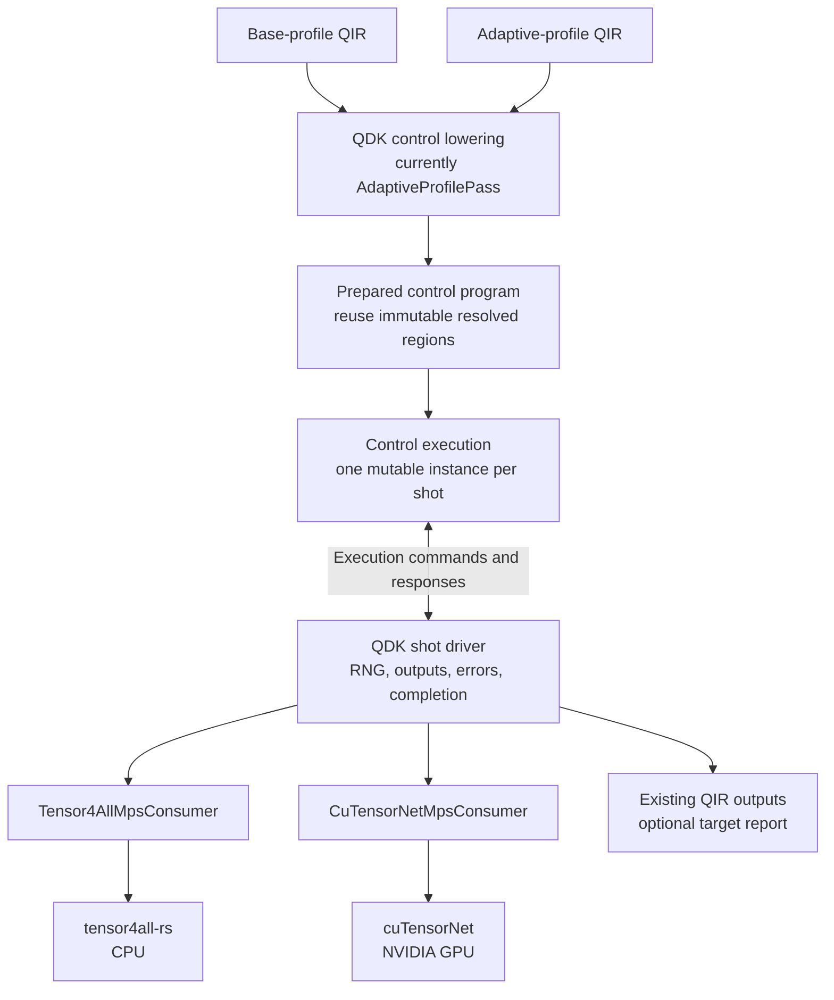

# Shared Simulator Execution

This directory separates Adaptive control from target-specific quantum-state
evolution. The public API remains available through `qdk_simulators::execution`;
`execution.rs` is the facade and the files here own the implementation.

## Module Responsibilities

| File           | Responsibility                                                                                               |
| -------------- | ------------------------------------------------------------------------------------------------------------ |
| `adaptive.rs`  | Prepares Adaptive bytecode, identifies unitary regions, interprets classical control, and produces commands. |
| `protocol.rs`  | Defines the commands and responses exchanged between Adaptive control and an execution target.               |
| `region.rs`    | Defines target-neutral quantum evolution regions and the consumer lifecycle.                                 |
| `unitary.rs`   | Defines resolved unitary operations and the legacy `Simulator` application bridge.                           |
| `immediate.rs` | Adapts the legacy `Simulator` trait and provides the reference one-shot driver.                              |

The source-level dependency direction is:

```text
Adaptive bytecode
      |
      v
 adaptive.rs -------> protocol.rs
      |                    |
      |                    v
      +--------------> region.rs
                           |
                           v
                       unitary.rs
                           |
                           v
                     target adapter
```

The bytecode is a control-plan representation. A target adapter does not
interpret bytecode or select branches. It receives only reached regions and
host-visible requests.

## Execution Flow

`PreparedAdaptiveProgram` retains the original bytecode control tables and
caches deterministic region locations once. Each `AdaptiveExecution` owns the
mutable state for one shot: its instruction position, registers, measurement
results, ordered output records, and command/response protocol state.

```text
Python AdaptiveProfilePass
           |
           v
   AdaptiveProgram<Word>
           |
           v  prepare once per request
 PreparedAdaptiveProgram
           |
           +-----------------------+
           |                       | one per shot
           v                       v
   AdaptiveExecution         AdaptiveExecution ...
           |
           | AdaptiveCommand
           v
      shot driver
           |
           v
      target adapter --------> continuing target state
           |
           | AdaptiveResponse
           +------------------> AdaptiveExecution
```

The command/response protocol is deliberately small:

```text
AdaptiveExecution::new
           |
           v
         Ready
           |
           +-- ExecuteRegion ---------> AwaitingRegionCompletion
           |                                      |
           |<---------- RegionComplete -----------+
           |
           +-- Measure --------------> AwaitingMeasurementResult
           |                                      |
           |<-------- Measurement(result) --------+
           |
           +-- Complete(records) -----> Complete
```

A `QuantumEvolutionRegion` is uninterrupted target-local state evolution
between host-visible semantic boundaries. The current payload contains only
resolved unitary operations. Measurements, stochastic decisions, queries,
ordered output, and classical branch selection remain outside a region.

`run_prepared_shot` demonstrates the current synchronous orchestration with an
`ImmediateSimulatorConsumer`:

```text
driver             AdaptiveExecution          RegionConsumer                 target
   |                        |                         |                           |
   |-- next_command ------->|                         |                           |
   |<-- ExecuteRegion ------|                         |                           |
   |-- prepare/execute ------------------------------>|                           |
   |                        |                         |-- apply operation -------->|
   |                        |                         |<-- operation complete -----|
   |                        |                         |-- apply operation ... ---->|
   |                        |                         |<-- operation complete -----|
   |<-- region report --------------------------------|                           |
   |-- RegionComplete ----->|                         |                           |
   |<-- Measure ------------|                         |                           |
   |-- measure(request) ----------------------------->|                           |
   |                        |                         |-- mz or mresetz ---------->|
   |                        |                         |<-- measurement complete ---|
   |                        |                         |-- read result ------------>|
   |                        |                         |<-- MeasurementResult ------|
   |<-- MeasurementResult ----------------------------|                           |
   |-- Measurement(result) ->|                        |                           |
   |<-- Complete(records) --|                         |                           |
   |-- finish/close --------------------------------->|                           |
```

The immediate path is currently a compatibility implementation and parity
oracle. The legacy `bytecode::runtime::run_shot` remains the production CPU and
Clifford execution path until migration is explicitly validated.

## Next Integration Iteration

The next iteration is a non-production, end-to-end Base-profile integration
through one shared control execution and two real MPS consumers. Base Profile
is a restriction of the same control execution used for Adaptive Profile, not
a separate tensor-network execution model. Its control program is linear: it
does not branch on measurement results, and preparation can resolve and cache
its immutable region definitions once for reuse across shots. Resolving a
region means decoding operation IDs, angles, qubit operands, and region
boundaries into target-neutral `UnitaryOperation` values. It does not mean
sharing mutable quantum state, measurement outcomes, native operator
registrations, workspaces, or other target-specific resources between shots.

The current names `AdaptiveProfilePass`, `PreparedAdaptiveProgram`,
`AdaptiveExecution`, `AdaptiveCommand`, and `AdaptiveResponse` predate this
decision. Generalize those names and ownership only as implementation requires;
do not introduce a parallel `BaseProfileExecutionDriver`. The first
discriminating check is that representative Base QIR can use the existing
control lowering and command protocol while preserving current MPS outputs.



The temporary host selection for this iteration keeps the Simulation Method
stable and constrains the Device explicitly:

```python
run_qir(qir, type="mps", mps_options=MpsOptions(device="cpu"))
run_qir(qir, type="mps", mps_options=MpsOptions(device="nvidia"))
```

`device="cpu"` resolves to tensor4all-rs and `device="nvidia"` resolves to
cuTensorNet. Omitting `device` preserves the current CPU behavior during this
iteration. Explicit selection never falls back silently. Engine and Device
remain distinct internally and the execution report records both. Automatic
selection from host capabilities or Program Requirements is future work.

The iteration must establish one path for target-neutral measurements,
QDK-owned outcome sampling, consumer failures, target reports, completion, and
cleanup. The tensor4all consumer is the first parity implementation. The
cuTensorNet consumer retains its deferred native lifecycle; it is not forced
through the eager `MpsEngine` trait.

### Authority and Coordination

For this iteration, current executable code and tests define implemented
behavior, this README owns the local execution direction, and retained backend
evidence defines proven engine capabilities. `source/mps/DESIGN.md` is
historical and advisory, not a source of truth or required pre-read. It must not
block, widen, or override this iteration. Report missing decisions or conflicts
to the user instead of reconciling implementation back to that document.

The cuTensorNet noise spike and Fire and Ice tensor4all/QEC investigation run
in parallel. Their findings provide capability and contract feedback; they do
not independently change this integration scope. Never consume incidental
bytes from either agent's live dirty worktree.

The retained cuTensorNet B5 mechanism evidence is in the sibling evidence
repository:

```text
/home/domingom/Work/qdk-tensor-network-project/cutensornet/retained/
```

Relevant inputs are:

- `t3-adaptive-b5-gate1-20260827-a100/` for branch-mass, selected projection,
  capture, continuation, lifecycle, and failure evidence;
- `t3-b5-matched-performance-20260828-a100-evidence-r1.tar.gz`, SHA-256
  `000276865bc3ae94fe0144d7302c699dbecbc4fae372e984ebd060fa92f667cd`;
- `t3-b5-matched-performance-20260828-a100-evidence-r2.tar.gz`, SHA-256
  `f490d85e3bca2a86376f0404592570c8f2d418ceec3e166edfdc3e7c8ef0bee4`;
  and
- the nested sealed source snapshot
  `inputs/qdk-cutensornet-b5-matched-performance-20260828-r1.tar.gz`, SHA-256
  `2dcdd3c0bdbdef250254a3ad7cecccd33e7b4f350fdeb74fb5ba521bd5474601`.

The stable B5 branch-continuation source baseline is cuTensorNet worktree commit
`2f48bd2332d3c6143fedf38cd5913756284a5f4a`. The current cuTensorNet agent is
changing overlapping replay files for B6; integrate from a committed or sealed
input and reconcile later findings explicitly.

### Toolchain Boundary

QDK requires Rust 1.96 or later. The retained cuTensorNet mechanism was
qualified with Rust 1.95, so importing it requires explicit compatibility
validation rather than assuming that evidence transfers across toolchains:

1. compile, format, run focused tests, and run strict Clippy for the wrapper and
   adapter under Rust 1.96;
2. prove an ordinary CPU-only QDK build neither loads nor requires CUDA or
   cuTensorNet at build time or process startup;
3. run the same focused suite on Linux x86-64 with the qualified CUDA and
   cuTensorNet libraries; and
4. run both `device="cpu"` and `device="nvidia"` from identical Base QIR on the
   NVIDIA VM, retaining correctness, failure, cleanup, target, and wall-clock
   evidence.

Local results are not NVIDIA VM evidence. Record VM commands and elapsed time
explicitly. Do not begin Adaptive product integration, noise integration,
general-TN work, automatic target selection, or production API stabilization
as part of this iteration.

## Simulator Adoption

The shared abstractions allow backends to reuse control semantics without
requiring every backend to use the same state representation or execution
strategy.

| Simulator path      | Current execution                                                                                                                | Shared-executor path                                                                                                                                                                                                                    |
| ------------------- | -------------------------------------------------------------------------------------------------------------------------------- | --------------------------------------------------------------------------------------------------------------------------------------------------------------------------------------------------------------------------------------- |
| CPU full-state      | `AdaptiveProgram<u64>` interpreted by the legacy Rust runtime; implements `Simulator`.                                           | Use `ImmediateSimulatorConsumer` first. Replace it only if region preparation provides a measured benefit.                                                                                                                              |
| Clifford/stabilizer | Same legacy Adaptive runtime; implements `Simulator`.                                                                            | Use `ImmediateSimulatorConsumer`; preserve identical measurement, noise, and output behavior.                                                                                                                                           |
| Adaptive GPU        | `AdaptiveProgram<u32>` and control are interpreted inside WGSL.                                                                  | A persistent GPU region consumer is possible, but host synchronization at every region or measurement may regress performance. Compare that design with retaining device-side control while sharing preparation and protocol semantics. |
| MPS                 | Separate fallible `MpsSimulator`/`MpsEngine` API currently used by the Base-profile path.                                        | Implement a fallible consumer that translates resolved region operations into MPS operations while retaining one live MPS per shot. Add a target-neutral measurement capability before using a generic shot driver.                     |
| Sparse Q# evaluator | Executes the Q# evaluator graph through its own fallible backend and supports dynamic runtime services beyond Adaptive bytecode. | Keep the evaluator path unless a future normalization layer can preserve allocation, values, messages, dumps, custom intrinsics, and failure semantics. Region consumption may still be reusable below that control layer.              |

Two extensions are needed before one generic driver can serve all applicable
targets:

1. Measurement must be represented by a target-neutral consumer capability;
   the reference driver currently invokes the immediate consumer's measurement
   method directly.
2. Consumer reports and errors must be propagated by a generic driver instead
   of relying on the immediate adapter's `Infallible` implementation.

Base-profile programs use a restricted linear control program through the same
target-neutral command protocol. Preparation should cache their fully resolved
static region definitions so sharing control execution does not repeat
bytecode decoding for every shot. Each shot still owns its control state and
quantum state, and each consumer still performs target-specific preparation at
the lifecycle boundary required by its engine. The consumer remains independent
of the control-plan representation.

## Adaptive Bytecode Ownership

The Adaptive bytecode encoding is currently a cross-language contract without
a single enforced owner.

```text
                         Adaptive bytecode contract
                         /          |             \
                        v           v              v
              Python emitter   Rust interpreters   WGSL interpreter
```

The duplicated surfaces currently include:

- `OP_*` primary instruction opcodes and `FLAG_*` operand-mode bits in the
  Python emitter, legacy Rust runtime, `adaptive.rs`, and WGSL interpreter;
- quantum operation identifiers in Rust `shader_types::OpID`, `unitary.rs`,
  Python `GATE_MAP`, and WGSL `OPID_*` constants;
- instruction and table layout assumptions shared by Python serialization,
  Rust `bytecode.rs`, GPU buffer layouts, and WGSL structures.

Comments saying that files "must stay in sync" are not sufficient. They are a
temporary warning until the following work is completed.

### Proposed Single-Source Plan

1. Define one repository-owned, declarative format manifest containing opcode
   values, flag bit positions, operation IDs, field meanings, table layouts,
   supported word widths, and reserved ranges.
2. Generate typed Rust definitions, Python constants, and WGSL constants from
   that manifest. Generated source may be checked in when package builds need
   to consume it independently.
3. Move the Rust operation-ID owner out of the GPU-specific module. Both GPU
   shader types and shared execution decoding should depend on the shared type.
4. Keep QIR-name aliases such as `cnot` and `cx` in the Python lowering layer,
   but map them to generated operation-ID constants rather than numeric values.
5. Add a `--check` generation mode to CI so handwritten or generated copies
   cannot drift. Include layout-size/alignment tests and complete value-parity
   tests for Rust, Python, and WGSL representations.
6. Migrate one constant family at a time: instruction encoding, operation IDs,
   then serialized table layouts. Preserve compatibility fixtures for both
   32-bit GPU and 64-bit CPU bytecode during the migration.

The manifest should describe the wire format, not execution policy. Region
partitioning, simulator capabilities, noise behavior, and host/device control
placement remain owned by their respective execution layers.

## Current Constraints

- Region preparation currently recognizes only the supported unitary operation
  subset.
- Adaptive control currently handles the bytecode instructions exercised by
  the shared execution tests; the legacy runtime remains the complete oracle.
- The protocol is synchronous and one-shot. Batching, asynchronous targets,
  and same-prefix replay require explicit designs rather than hidden consumer
  behavior.
- Existing backend entry points and result shapes must remain stable while a
   backend migrates to shared execution.
