# Shared Simulator Execution

This directory separates Adaptive control from target-specific quantum-state
evolution. The public API remains available through `qdk_simulators::execution`;
`execution.rs` is the facade and the files here own the implementation.

## Module Responsibilities

| File                | Responsibility                                                                                               |
| ------------------- | ------------------------------------------------------------------------------------------------------------ |
| `adaptive.rs`       | Prepares Adaptive bytecode, identifies unitary regions, interprets classical control, and produces commands. |
| `protocol.rs`       | Defines the commands and responses exchanged between Adaptive control and an execution target.               |
| `region.rs`         | Defines target-neutral quantum evolution regions and the consumer lifecycle.                                 |
| `unitary.rs`        | Defines resolved unitary operations and the legacy `Simulator` application bridge.                           |
| `immediate.rs`      | Provides the generic synchronous shot driver and adapts the legacy `Simulator` trait.                        |
| `tensor_network.rs` | Builds a zero-state ket network and immutable shared coefficient bank from a resolved region; no execution.  |
| `contraction.rs`    | Defines shared contraction optimizer, preparation and execution contracts, constraints, reports and errors.  |

The source-level dependency direction is:

```text
Adaptive bytecode
      |
      v
 adaptive.rs -------> protocol.rs
      |                    |
      |                    v
      +--------------> region.rs
                           |
                           v
                       unitary.rs
                           |
                           v
                     target adapter
```

The bytecode is a control-plan representation. A target adapter does not
interpret bytecode or select branches. It receives only reached regions and
host-visible requests.

## Where the Code Lives

The tensor-network work spans four crates and two sample directories, and the
split between them is deliberate: each directory below states what it is _for_,
so that a file sitting in the wrong one is visible without reading it. The rule
this encodes is that a directory should predict a file's dependencies. Anything
in `tensornet/` that named a vendor, or anything in `cutensornet/` that was pure
math with no FFI, would be misfiled by that test.

Ownership tags: **MODEL** backend-agnostic description · **NVIDIA** vendor-specific
· **GEN** generated, never hand-edited · **SHARED** engine-neutral execution ·
**PRODUCT** QDK public surface · **DEMO** validation material.

```text
source/
│
├── tensornet/ ................................................ [MODEL]
│     What a tensor network *is*. No execution, no device, no vendor, and no
│     tensor elements — shapes only, so feasibility can be asked without
│     allocating. A dependency on a GPU library here would be a defect.
│   ├── src/lib.rs .................. 38    Four concepts; Mps as peer, not case
│   ├── src/index.rs ............... 254    Axis identity and incidence    11 tests
│   ├── src/network.rs ............. 167    Nodes joined by index identity  6 tests
│   ├── src/contraction.rs ......... 309    ContractionQuery: einsum `keep` 14 tests
│   ├── src/mps.rs ................. 299    Chain of site tensors          11 tests
│   ├── src/error.rs ................ 88    Three error families
│   └── README.md .................. 445    Design record and vocabulary
│
├── cutensornet/ .............................................. [NVIDIA]
│     One vendor library, reached by dynamic loading. Everything here is
│     allowed to know about CUDA, handles, workspaces and ABI. It is the only
│     crate permitted to.
│   ├── src/lib.rs ................. 412    discover(); the entire public API   9 tests
│   ├── src/error.rs ............... 145    AvailabilityError                   2 tests
│   ├── src/version.rs .............. 69    Audited version triple              2 tests
│   ├── src/execution.rs ........... 383    run_mps_shots — THE production entry 3 tests
│   ├── src/generator.rs ........... 921    Loader generator (build tool)      20 tests
│   ├── src/bin/generate-loader.rs . 125    Generator CLI
│   ├── src/simulation.rs ........... 55    Declares the 10 modules below via #[path];
│   │                                       carries a blanket #![allow(dead_code)]
│   ├── src/library.rs ............. 522    Dynamic loader, FakeResolver        6 tests
│   │
│   ├── src/bindings/ ......................................... [GEN]
│   │     bindgen output from cutensornet.h. Regenerate on a CUDA host; never
│   │     edit. A hand-edit here is caught by a byte-exact test.
│   │   ├── mod.rs .................. 78
│   │   ├── v2_13.rs ............... 828    cuTensorNet 2.13 declarations
│   │   └── cudart_12.rs ............ 24    CUDA runtime declarations
│   │
│   ├── src/library/symbols*.rs ............................... [GEN]
│   │     Symbol resolution, generated from cutensornet-symbols.txt. Nine files,
│   │     ~876 lines, grouped by API area (state, workspace, sampler, ...).
│   │
│   ├── src/library/simulation.rs .. 1051    CuTensorNetApi: every FFI call site      2 tests
│   │
│   ├── src/library/simulation/ ...............................  MIXED — see below
│   │     Host-capable modules here are `crate::simulation::*`; one is
│   │     `crate::library::simulation::mps_session`. The directory name predicts
│   │     neither.
│   │   ├── circuit.rs ............. 883    Gate, StateReadout, contract_open_mps 16 tests
│   │   ├── mps_execution.rs .............. 1462    MPS state and resource owner
│   │   ├── mps_execution/tests.rs ........ 1714    Host test double, no GPU needed   40 tests
│   │   ├── mps_execution/qualification.rs  1002    A100 runs, cfg(test+linux+x86_64)   7 tests
│   │   ├── sampler.rs ............. 536    Batch sampling                       4 tests
│   │   ├── consumer.rs ............ 548    Bridge to the shared execution layer 6 tests
│   │   ├── contraction.rs ............... Private topology/path-metadata owner; no numerical execution
│   │   ├── contraction/tests.rs ......... Host metadata/ownership/failure test double
│   │   ├── contraction/qualification.rs . Four ignored native metadata cases; separate from MPS
│   │   ├── contraction/execution.rs ..... Private numerical owner; diagnostic/2x2/4x4 native-qualified
│   │   ├── contraction/execution/tests.rs Host lifecycle/failure checks through the same owner
│   │   ├── contraction/execution/qualification.rs I2 diagnostic/2x2/4x4; native cases gated/ignored
│   │   ├── memory_workspace.rs .......... Private allocation/copy/workspace primitives shared with MPS
│   │   ├── resources.rs ................. Shared device/stream/handle owner; host-tested
│   │   ├── mps_session.rs ............... MpsSession: resources + MPS policy — NOT crate::simulation
│   │   ├── branch.rs .............. 246    Mid-circuit branch capture           9 tests
│   │   ├── policy.rs .............. 221    ExecutionPolicy + validate()         5 tests
│   │   ├── query.rs ............... 168    AdjacentZQuery                       3 tests
│   │   ├── error.rs ................ 48    SimulationError
│   │   └── ffi.rs ................... 26    Complex64Abi
│   │
│   ├── tests/availability.rs ....... 13    Symbol resolution, real .so, no GPU  1 test
│   ├── scripts/ ...............................................  tooling
│   │     Binding and loader generation, plus the GPU-host validation entry
│   │     point. The manifest is the single source for both.
│   │   ├── cutensornet-symbols.txt . 82    THE manifest — edit this, regenerate
│   │   ├── generate-bindings.sh ... 208    Needs x86-64 + the cuQuantum archive
│   │   ├── validate-on-cuda-host.sh 251    8-step VM check; --qualification opt-in
│   │   └── README.md .............. 271    What each guard catches
│   └── README.md .................. 568    Crate design record
│
├── simulators/src/execution/ ................................. [SHARED]
│     Engine-neutral. Separates Adaptive control from state evolution, and must
│     stay free of any specific engine. cuTensorNet appears in the README as a
│     consumer, never in the code as a dependency.
│   ├── adaptive.rs ................ 668    Bytecode → regions and commands
│   ├── protocol.rs ................. 55    Commands and responses
│   ├── region.rs ................... 66    Consumer lifecycle
│   ├── unitary.rs ................. 182    UnitaryOperation (21 variants)
│   ├── immediate.rs ............... 248    Synchronous shot driver
│   ├── tensor_network.rs ................. CircuitTensorNetwork: shapes + shared coefficients
│   ├── contraction.rs .................... Shared contraction contracts; no numerical backend
│   ├── tests.rs ................... 903                                      20 tests
│   └── README.md ................. 1013    This file: block plan and defects
│
└── qdk_package/ .............................................. [PRODUCT]
      The QDK surface and private host-qualification bridge. The I2 probe is
      not a public simulator selector.
    ├── qdk/simulation/_simulation.py       _run_qir_mps (:720)
    ├── qdk/_native.pyi                     Type stub
    ├── src/interpreter.rs                  PyO3 registration (:148)
    ├── src/qir_simulation/cpu_simulators.rs  run_mps_full_state_placeholder (:357)
    └── src/qir_simulation/tensor_network.rs  _tensor_network_build_probe (I2 only)

samples/python_interop/ ....................................... [DEMO]
├── mps_trotter_quench_demo/                Working 1D demo: run.py, DEMO.md,
│                                           figures/ with committed CSV + SVG
└── ising2d_tensor_network_demo/            I1 reference + I2 builder qualification:
      build_measured_circuit.py             Chemistry -> measured Base QIR
      reference.py, test_reference.py       Pre-measurement sparse CPU oracle/checks
      test_tensor_network.py               Built-buffer analytic and frozen-QIR checks
      fixtures/case_a_4x4/                  Frozen Q#, QIR, amplitudes/probabilities
```

The Ising [I1 reproduction commands](../../../../samples/python_interop/ising2d_tensor_network_demo/Ising2D.md#i1-retained-input-and-cpu-reference)
use the existing Q# sparse simulator to capture the state before terminal
measurement. The same gate body is compiled to the retained Base QIR, with
gate-for-gate conversion checks. No shared-control, native-interface or MPS
changes are needed for this reference; it is independent of the future TN
builder. I1 does not establish general contraction or A100 execution.

### Circuit-to-network builder (I2)

`CircuitTensorNetwork::from_zero_state(qubit_count, &region)` consumes the
existing `QuantumEvolutionRegion`/`UnitaryOperation` API. The dependency is
`qdk_simulators -> tensornet`: circuit knowledge and numerical buffers remain
in shared simulator code, while `tensornet` remains shapes-only. Neither the
builder nor the existing shared control depends on NVIDIA.

```text
QuantumEvolutionRegion + qubit_count
                 |
       CircuitTensorNetwork
         |       |        |
    network   buffer    output_axes
     nodes     bank     [q0, q1, ...]
         |       ^
         +-------+
       node_buffer_ids
                 |
      query() borrows network
      I3: contraction contracts (numerical adaptation is separate)
```

The owning result exposes read-only `network()`, `buffers()`,
`node_buffer_ids()` and `output_axes()` accessors. For node `v`, its data is
`buffers()[node_buffer_ids()[v]]`, with length equal to
`network().nodes()[v].element_count()`. The bank owns every buffer for the
result's lifetime. Repeated gates of the same kind and exact f64 angle bits
share one buffer, independent of wire identities; all initial zero states
share `[1,0]`. This is immutable sharing, not overwriting a scratch buffer.
There is no approximate angle matching, gate fusion, or device-memory policy.

| Operation          | Node axes and coefficients                                | Wire behavior                                     |
| ------------------ | --------------------------------------------------------- | ------------------------------------------------- |
| Initial zero state | `[wire(q)]`, values `[1,0]`                               | One boundary per qubit, ordered by qubit ID       |
| `I`                | No node, operand still validated                          | Unchanged                                         |
| `Rx(theta)`        | `[output,input]`, `U[out,in]`                             | Fresh output index                                |
| `Rzz(theta)`       | `[current(q1),current(q2)]`, `exp(-i*theta/2*(-1)^(a+b))` | Both indices unchanged; diagonal hyperedge factor |

Rx and Rzz each use four complex-f64 values, but their tables are not
interchangeable. Buffer construction uses `Indices::offset_of` and its
column-major, first-axis-fastest convention. Wire identities represent
circuit connectivity, not physical-site numbers. Nodes are the initial
boundaries followed by nonidentity gates in operation order. Every final
axis survives in `q0, q1, ...` order, so `k = sum(b[q] * 2^q)`.

`query()` constructs a borrowing `ContractionQuery` rather than storing a
self-reference. Construction rejects unsupported gates, nonfinite angles,
invalid/repeated operands, wire-count overflow and accidental marginalized
wires. An empty region retains its initial boundaries; zero qubits with no
operations describe the scalar one. A large output can have
`element_count() == None`: building its description does not allocate it.

The private native probe reuses `adaptive_program_from_pydict`,
`PreparedAdaptiveProgram` and `AdaptiveExecution::next_command` to reach a
single leading region. It stops before measurement without inventing a
measurement outcome, and copies the actual builder data into a diagnostic
report. It is not a full-program validator or a `run_qir` dispatch path.
Public Rust API tests cover the owner and binding contracts; the sample's
Python tests lower actual QIR and use NumPy `einsum` only for tiny analytic
checks. See [I2 reproduction and evidence](../../../../samples/python_interop/ising2d_tensor_network_demo/Ising2D.md#i2-neutral-network-and-shared-coefficient-buffers).

### Shared contraction contracts (I3)

**Approved ownership, implementation pending:** preparation moves from the
separate `ContractionExecutor` abstraction onto `ContractionContext`. The
current Rust exports and contract tests still use `ContractionExecutor`;
the slice 3b implementation will migrate them together with the native adapter.
This is a shared-contract revision, not an additional Context wrapper around
an Executor.

**Input semantics clarified during design review:** the intended executable
is reusable with different tensor values and bindings, not tied to the first
coefficient set. The existing Rust contract and private native owner still
implement fixed-input preparation. The diagrams below describe the intended
separation; `prepare(query, plan, limits)` and `execute(inputs)` are conceptual,
not finalized Rust signatures. Executable-owned resident input storage,
explicit registration/replacement, and complete per-run binding selection are
approved, together with the retention, failure, report and injection-seam
decisions below. Exact Rust spellings remain implementation details of those
reviewed contracts.
See [Tensor data reuse, noise, and loss](#tensor-data-reuse-noise-and-loss-design)
for the data lifecycle and the limits of this reuse.

`tensornet::ContractionPlan` is a portable schedule, not an optimizer report or
a native resource owner. The approved responsibilities are:

| Abstraction             | Responsibility                                                                                                                                                                  | Does not own or do                                                                      |
| ----------------------- | ------------------------------------------------------------------------------------------------------------------------------------------------------------------------------- | --------------------------------------------------------------------------------------- |
| Caller                  | Own the Context and returned executables; retain execution and cleanup outcomes; close children before their environment.                                                       | Delegate program or shot orchestration to the numerical backend.                        |
| `ContractionOptimizer`  | Select a portable plan from an explicit query, constraints and optimizer-specific settings; return a planning report.                                                           | Prepare or own the later executable.                                                    |
| `ContractionPlan`       | Describe the selected contractions and logical result axes independently of native resources.                                                                                   | Store input topology, coefficients, backend resources or measured allocation evidence.  |
| `ContractionContext`    | Provide the backend environment and `prepare` an already-selected plan; return ownership of the executable to the caller.                                                       | Search for a path, store a current executable, or orchestrate its execution.            |
| `ExecutableContraction` | Own contraction-specific resources and resident input storage; retain the required Context borrow; execute supplied tensor inputs and expose `resources` and consuming `close`. | Close the borrowed Context, sample noise implicitly or own previously returned outputs. |

The Context is a backend-agnostic capability, not a prescribed GPU Session.
For cuTensorNet, the existing caller-owned `SessionResources<Api>` implements
it directly. There is no additional Context allocation or separate Executor.
A stateless backend can use a lightweight Context of its own. Backend-specific
construction and environment cleanup remain outside the shared preparation
trait; other backends need not imitate the CUDA Session lifecycle.

Shared contracts are exposed through `qdk_simulators::execution`. Optimizers
choose their own `Settings`, `Report: AsRef<PlanningReport>` and `Error`;
`PlanningReport` implements `AsRef` itself for providers without additional
diagnostics. The revised execution contract must allow backend-defined tensor
input/storage representations, prepared owners and errors. The approved
operation and report contracts below guide the Rust associated types.
No shared type depends on a native backend.

#### Planning, preparation and execution

The caller invokes `prepare` on the Context and owns the returned executable.
`resources`, `execute` and executable `close` are methods of that executable,
not of the Context. In this successful lifecycle, every execution returns a
new owned output; the Context remains available after executable cleanup.

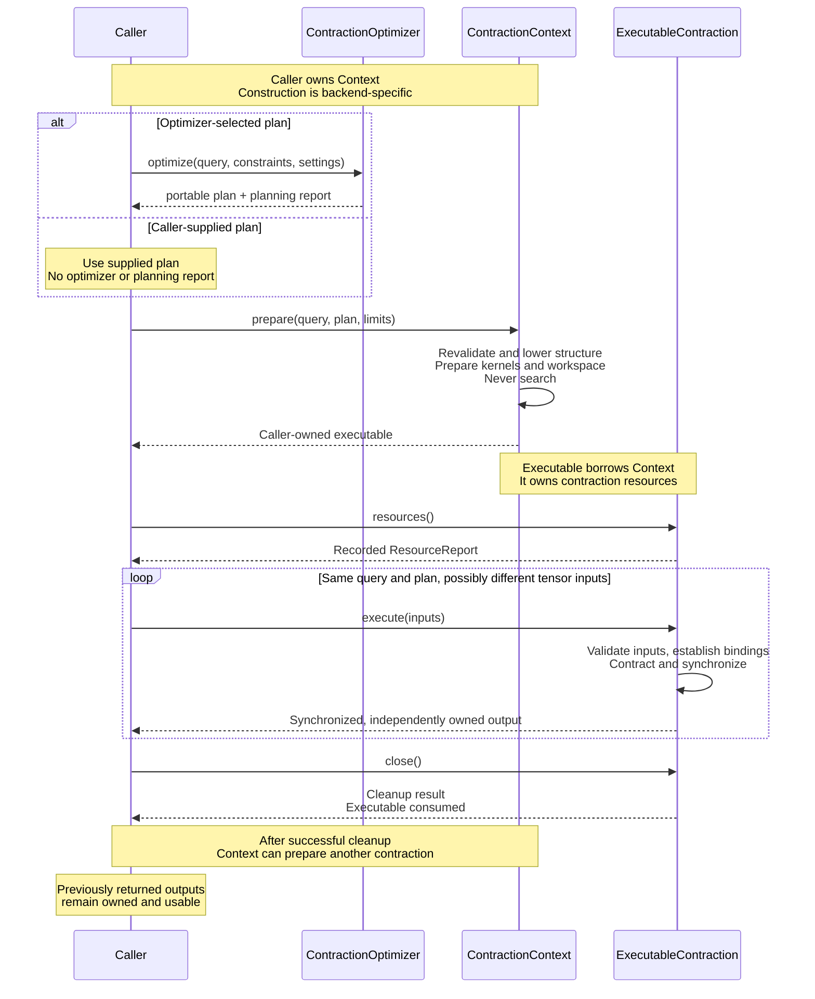

Resource inspection is optional and synchronous. It reads recorded facts,
not asynchronous GPU progress, and does not allocate or reserve resources.
It is available before or after execution, including after execution failure;
the exclusive `&mut self` execution call prevents concurrent inspection of the
same owner. Repeated execution with identical inputs recomputes the same
contraction; different inputs can describe a different noise realization.
The caller makes that choice. The numerical executable does not silently
sample noise or infer a new shot. The current implementation still accepts
only the fixed-input form; input rebinding is an intended contract revision,
not implemented behavior.

#### Context borrow and sequential reuse

Preparation is a factory operation on the actual lifetime owner, not on a
temporary helper that must transfer and later recover a Session binding.
The approved Context-borrow direction is:

```rust
type Executable<'context>: ExecutableContraction<Error = Self::Error>
where
    Self: 'context;
```

This permits the returned executable to borrow the caller-owned Context for
`'context`, independently of the method-local query and plan. It does not
return a reference to an executable stored inside the Context. This is not a
way to extend a short-lived borrow: the caller must keep the actual
Context alive while its executable borrows it. A backend whose executable
needs no Context borrow can return an independently owned implementation.
The complete signature must also express the reviewed tensor-storage model.
The earlier sketch accepting `Self::Coefficients` at preparation is superseded
as an input-semantics proposal. Per-call host upload views need not live as
long as the executable; retained device storage must live through native use.
Executable-owned resident storage is approved separately; the abbreviated GAT
does not settle the remaining input-lifetime API.

The cuTensorNet executable holds an exclusive Context borrow, preventing
another preparation or Context cleanup until that executable closes or drops.
Explicit executable close consumes it even on cleanup error and ends the Rust
borrow; it does not close the Context. Sequential reuse is the normal
successful-cleanup lifecycle, not a promise of native health after arbitrary
cleanup failure. Separate caller-owned contexts support independently closable
live executables prepared from reusable plan and coefficient storage.

The cuTensorNet-specific
[Session lifecycle](../../../cutensornet/README.md#private-qualification-session)
documents the concrete mapping and parent cleanup. Session does not become a
shared concrete type, and this design adds neither executable-owned Sessions
nor shared-session interior mutability.

The separate Executor could have supported independently replaceable
preparation strategies on the same Context. No such requirement is established;
path selection remains independently replaceable through the optimizer.
Keeping preparation on Context avoids an otherwise empty object and binding
state machine. The lifetime-indexed associated type is intended for generic
callers and is not directly `dyn`-compatible; runtime-erased backend selection
would require a separately reviewed interface.

#### Preparation and failure contracts

Structural preparation receives the query explicitly
because a plan does not store input topology. Preparation revalidates the
plan against that query, rejects unsupported features and respects allocation
ceilings. Each submitted input set must also be validated against the prepared
structure before native use. Preparation must not search, complete or binarize a
plan. A supplied-plan flow uses no optimizer and fabricates no planning report.
The model supports arbitrary step arity and zero-step single-input plans;
the initial native execution subset remains unsliced, pairwise contraction.
Its current private implementation binds fixed coefficients during preparation;
the reusable-input revision is not implemented yet. Capability rejection is a
backend error, not a new model restriction.

Intermediate `result_axes` specify a logical representation, not a mandate on
backend-private storage order. Layout lowering must preserve axis identities,
dimensions and selected contractions, as well as the interpretation of input
buffers and the ordered final output. It is not path search and does not permit
approximation or implicit changes to the caller's bindings. Native path metadata
may omit logical intermediate order, so retain the portable plan when exact
re-export is needed.

| Type                            | Meaning                                                                                                                            |
| ------------------------------- | ---------------------------------------------------------------------------------------------------------------------------------- |
| `PlanningConstraints`           | Requested workspace budget considered during path search; not an allocation ceiling or measured search memory.                     |
| `PlanningReport`                | Optimizer identity, optional elapsed search seconds, honored constraints, and provider-labelled estimates.                         |
| `CostEstimate` / `EstimateKind` | Provider-defined FLOP counts or largest-intermediate element counts, not measured resource bytes.                                  |
| `ExecutionLimits`               | Device/host scratch allocation ceilings; not total memory limits. `None` omits a ceiling; `Some(0)` imposes zero.                  |
| `ResourceReport`                | Discovered coefficient/output sizes, unique bound buffers, minimum/recommended/allocated scratch, and actually owned device bytes. |
| `PreparationFailure<E>`         | Partial resource evidence, primary error and optional cleanup error, retained separately.                                          |

Only honored planning constraints appear in `accepted_constraints`; callers
compare that echo with their request. Missing estimates are absent from the
estimate vector. Every resource observation is optional: `None` is unknown
and `Some(0)` is known zero. Coefficient storage counts distinct bound buffers,
not nodes; owned device bytes exclude other owners and process-level sampling.
These are the current report fields. The approved reusable-storage revision
adds distinct selected-input and resident-allocation evidence, including
retained, unselected candidates; see the implementation boundary below.
Failure retains facts already discovered, even if cleanup frees allocations.
`PreparationFailure` displays both errors and exposes the primary error as
its standard error source; the cleanup error remains separately accessible.
The failure is returned by value: packaging resource-failure evidence requires
no additional heap allocation, although the backend error type may itself
own allocations. The preparation signature has a localized large-error lint
exception for this tradeoff.

Record each successful measurement before the next fallible operation, and
each successful allocation before upload, binding or later preparation can
fail. Requirements and recommendations are not allocations. Cleanup must not
erase the failed attempt's recorded evidence.

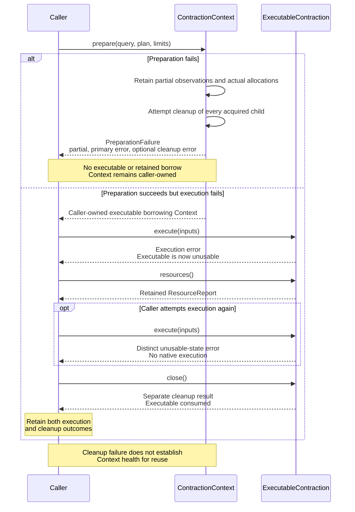

The prepared owner does not borrow the query or plan. Tensor values and bindings
must not change during an execution, but the intended revised interface accepts
different inputs on a later call. Execution synchronizes required work and returns
independently owned output that survives another execution and `close`.
An execution failure prohibits retries, returning a distinguishable
unusable-state error on subsequent attempts, but leaves resource evidence and
explicit cleanup available. `close(self)` reports cleanup errors and consumes
the owner even on failure. Callers must retain the execution result and call
`close` on both success and failure, rather than early-returning with
`execute(inputs)?` when cleanup errors matter. The diagram retains the
conservative poison-on-execution-failure rule; it does not promise recovery
from a partially completed upload or binding update.

`ExecutableContraction` is backend-specific, unlike the portable plan. It
retains or borrows the context required by its live resources, and execution
must establish that context and report backend failures, not silently switch
backends. It is not a transferable description for another host. Preparing
the portable plan on a different host/backend creates a new executable owner.
The shared trait does not currently expose a runtime backend-identity field.

`tests/contraction.rs` currently exercises the committed contracts through
fake optimizers and executors, without a numerical backend dependency. The
Context migration must preserve those behavioral cases, update their lifetime
witnesses, and retain the by-value failure's localized lint exception. These
tests establish interface usability and reporting semantics, not native
conformance. Slice 3b must additionally exercise the real Context/executable
adapters with native APIs injected underneath. The approved input lifecycle,
native/shared reports and host-allocation seam are recorded below. Their
production implementation remains pending.

### Tensor data reuse, noise, and loss (design)

**Purpose:** define what is reused and what changes before finalizing the
input/storage API. This section records the prepare-once, execute-with-new-inputs
intent. It is not a claim that rebinding, noise integration, loss continuation,
or a resident-bank API has been implemented or qualified.

| Established today                                                         | Intended revision                                                                                 | Pending implementation or separate design work                                     |
| ------------------------------------------------------------------------- | ------------------------------------------------------------------------------------------------- | ---------------------------------------------------------------------------------- |
| Portable query/plan; immutable I2 host bank; native fixed-input execution | Executable-owned resident inputs; explicit registration/replacement and complete per-run bindings | Implementation and behavioral evidence for the approved input contract             |
| Caller-owned Session; executable's exclusive Session borrow               | Reuse topology, kernels, scratch and output allocation across runs                                | How input-time allocations/errors extend resource reports                          |
| Synchronous contraction and independently owned outputs                   | Borrow host upload data only for the required call                                                | Loss-aware probability queries/continuation; native stochastic-channel integration |

#### Declare noise independently of its realization

**Design boundary:** declaring "apply noise" specifies semantics, not a tensor
representation or native API call. A declaration identifies the operation
boundary or idle interval, affected qubits and noise model, including channel
probabilities, joint correlations, instrument outcomes or loss policies as
applicable. It does not require a separate noise tensor, a particular device
buffer or caller-side sampling.

```text
Circuit + noise declarations
              |
              v
Execution strategy / representation lowering
              |
              +-- Absorb errors into compatible gate tensors --+
              |                                                |
              +-- Represent errors with explicit noise slots --+
              |                                                |
              |                                  Selected-plan contraction
              |                                  Caller selects trajectory
              |                                  Execute numerical inputs
              |
              +-- Register native stochastic channels
                               |
                         Native State sampling
                         Backend selects trajectory
```

These are candidate realizations of the same channel semantics, not three
implemented options or a finalized strategy-selection API. The selected-plan
route keeps stochastic orchestration outside `ExecutableContraction`; the
native State route is a different execution capability, not a hidden mode
inside its deterministic numerical `execute`.

For Pauli noise after a gate stored as a full operator tensor, absorption is:

$$
U_g^{(r)} = \left(\bigotimes_{q\in\operatorname{outputs}(g)}
P_{g,q}^{(r)}\right)U_g,\qquad P_{g,q}^{(r)}\in\{I,X,Y,Z\}.
$$

If this preserves the existing tensor axes/dimensions, the query and plan
remain valid without extra noise nodes. Identity selections reuse the
original gate payload; other selections use compatible variants. Constructing
Pauli variants involves permutations and phase changes, but storage, uploads
and binding updates are still real costs. Our compact diagonal Rzz factors
are not full operator tensors: arbitrary errors cannot be absorbed into them
by value replacement alone. Preserving that compact representation requires
further investigation, not an assumed expansion or a claim of cost neutrality.

Provisioning one noise slot after every gate output is therefore one lowering
policy, not part of the noise declaration contract. A reusable selected-plan
representation must cover the intended realizations before planning; within
that representation, changing compatible inputs requires neither a new path
search nor a new executable. Choosing a different representation can require
a different query/plan. CUDA-Q's native channel registration is evidence for
the semantic separation, not evidence of how cuTensorNet internally fuses
noise or of which realization is fastest.

#### Attach noise declarations to existing execution work

**Approved attachment boundary, implementation pending:** keep
`QuantumEvolutionRegion` as the ideal unitary sequence and attach ordered
declarative noise data alongside it in `AdaptiveCommand::ExecuteRegion`.
The shared shot driver forwards both to the existing `RegionConsumer`
preparation/execution boundary. Requests remain data; consumers provide
behavior. This does not introduce a new top-level `SimulationRequest`, strategy
trait, or backend-owned program/shot runtime.

The combined work need not be unitary. Internal stochastic realization is
allowed without returning to adaptive control, provided no outcome must be
returned to that control or recorded as a program output. "Internal" describes
the protocol boundary, not the processor: a host-side trajectory algorithm can
make such choices too. This deliberately extends the admitted work of
`ExecuteRegion` and `RegionConsumer`; merely adding metadata would not leave
their current unitary-only payload contract unchanged.

```text
Prepared program + noise declarations
                  |
      AdaptiveExecution / shared shot driver
                  |
      ExecuteRegion { ideal operations, declarations }
                  |
      RegionConsumer: inspect and lower the whole batch
             /                         \
   numerical queries + inputs      native state/channel work
             \                         /
                    RegionComplete
                          |
           measurement / selective instrument
                          |
                  observable outcome
                          |
                resume shared control
```

The instrument boundary above is intended, not an existing command.
[`protocol.rs`](protocol.rs) currently exposes only region execution,
measurement and completion, and [`drive_prepared_shot`](immediate.rs) dispatches
those commands through [`RegionConsumer`](region.rs).

**Rust-shaped illustration, not finalized API:** the added `noise` field and
`declare_*` names below illustrate the attachment. These expressions construct
data, not eager execution callbacks. Collection types, model payloads,
ownership and borrowing are not selected by this example.

```rust
AdaptiveCommand::ExecuteRegion {
    region_id,
    region: QuantumEvolutionRegion::new([
        UnitaryOperation::Rx { angle: theta, target: q0 },
        UnitaryOperation::Rzz { angle: phi, q1: q0, q2: q1 },
    ]),
    noise: [
        declare_idle_before(0, q0, idle_interval, idle_params),
        declare_gate_noise(0, [q0], rx_noise_table),
        declare_gate_noise(1, [q0, q1], rzz_noise_table),
    ],
}
```

Operation indices here refer to the ideal sequence. A gate attachment preserves
the model's application phases and gate policy, not a universal "apply this
channel after an already-executed ideal gate" interpretation. In particular,
[`NoiseTable::on_loss`](../noise_config.rs) can change the gate itself, as the
[`rzz` implementation](../cpu_full_state_simulator.rs) demonstrates. Explicit
boundary declarations also require defined ordering when several share a
location. Lowering must preserve these associations when transforming work.

| Semantics                        | Requirement at this boundary                                                                                                                                                                                                                                    |
| -------------------------------- | --------------------------------------------------------------------------------------------------------------------------------------------------------------------------------------------------------------------------------------------------------------- |
| Pauli and correlated faults      | Preserve ordered target tuples and joint distributions. A joint declaration is not a set of independent per-wire draws. Whole-batch visibility leaves absorption, explicit tensors and native channels available without selecting any of them.                 |
| Idle noise                       | Preserve the relevant per-qubit logical interval at its application site. Region length, wall-clock time and a static `RegionId` do not determine elapsed idle steps. History across regions and repeated visits must not yield stale intervals.                |
| Loss                             | Internal loss/reset choices require conditional quantum state, retained loss flags and subsequent gate policies. One batch does not promise one numerical contraction, pre-samplable reset branches or implemented continuation.                                |
| General channels and instruments | Unobserved channel branches may remain internal with required state/trace bookkeeping. A selective instrument returning an outcome ends the batch and requires a measurement-like request/response before continuation; summing its outcomes changes semantics. |

Noise on a measurement/reset belongs to that boundary request, not arbitrarily
to the preceding region. The current
[`mz` and `mresetz` implementations](../cpu_full_state_simulator.rs) order idle
noise, measurement/reset and subsequent faults explicitly. That ordering must
survive even when there is no preceding unitary region. The current binary
`MeasurementResult` is not a general instrument outcome representation.

Noise semantics and lowering remain above numerical execution, using shared
program/shot orchestration. `ContractionContext` and its executable still
receive numerical queries/plans/inputs, with no hidden stochastic runtime.
Consumers must honor declarations exactly once or reject unsupported semantics
explicitly; they must neither ignore annotations nor apply the same noise again
through a legacy simulator's implicit configuration. This attachment does not
select or expand the compact Rzz representation.

**Still open:** exact declaration/site/model types, declaration storage and
lifetimes, validation and extensibility, timing source/representation, instrument result
types and protocol extensions, and capability-selection APIs. The current
shared protocol has no timing payload. The example does not settle these
questions or authorize production noise integration. The approved Context
ownership and reusable numerical-input semantics are unchanged. Numerical
storage/report/seam decisions are approved below; full loss continuation still
requires its own review.

#### QDK noise-model coverage and interface requirements

The interface must leave room for QDK's different noise semantics, not
reinterpret all models as independent, pre-sampled Pauli errors. This is
architectural coverage, not a claim that the current contraction adapter
implements every model or that every backend must support the same subset.
Concrete declaration types and capability-selection APIs remain a design gate.

| Existing QDK model / surface                                                                                                            | Semantics that must survive lowering                                                                                                             | Consequence for execution                                                                                                    |
| --------------------------------------------------------------------------------------------------------------------------------------- | ------------------------------------------------------------------------------------------------------------------------------------------------ | ---------------------------------------------------------------------------------------------------------------------------- |
| [`PauliNoise`](../../../compiler/qsc_eval/src/noise.rs) and [`NoiseTable`](../noise_config.rs)                                          | Configured Pauli probabilities, ordered targets and joint fault distributions; tables also appear on measurements, resets and custom intrinsics  | Preserve application order and correlations, rather than replacing joint draws with independent per-wire draws               |
| [`IdleNoiseParams`](../noise_config.rs), applied by [`apply_idle_noise`](../cpu_full_state_simulator.rs)                                | An `S` fault probability derived from elapsed idle steps, with lost-qubit handling                                                               | A gate-output-only declaration and an I/X/Y/Z-only payload API are insufficient                                              |
| [`FaultTerm::Loss` / `LossPolicy`](../noise_config.rs) and [GPU loss commits](../gpu_full_state_simulator/gpu_statevector_shaders.wgsl) | Categorical loss selection, conditional measurement/reset, normalization, retained loss flags and subsequent gate policy                         | Trajectory history and state-dependent queries are required; selecting a reset matrix alone is not a complete implementation |
| [`Operation`, `Instrument` and `NoisySimulator`](../../../noisy_simulator/src/lib.rs)                                                   | General Kraus operations, selective instrument outcomes and normalization/trace bookkeeping; state-vector and density-matrix realizations differ | Do not require every operation to be unitary or every branch probability to be known before numerical evaluation             |

Keep two responsibilities distinct:

```text
Noise semantics / trajectory orchestration
  placement and timing, correlations, classical history, outcomes
                         |
       representation-specific numerical requests
                         |
                         v
Numerical execution capability
  selected-plan contractions OR an appropriate stateful/native route
```

For the shared contraction interface, the required flexibility is concrete:

- Preparation depends on the explicit query and selected plan, not the first
  realization's tensor values. Repeated execution accepts compatible values
  and bindings, including nonunitary tensors, without a hidden new search.
- Inputs are not restricted to a Pauli enum, a four-matrix bank, one tensor
  per noise location or a full-bank re-upload. Absorbed variants, explicit
  operators and other compatible numerical payloads must remain expressible;
  registration/replacement and complete per-run binding selection are approved.
  Implementation remains pending; the executable owns resident input storage.
- A higher-level strategy may evaluate different queries for branch
  probabilities and final outputs. Reuse applies within each compatible
  query/plan, not across arbitrary changes of shape or output meaning.
  This does not add state evolution or stochastic sampling to `execute`.
- Model support must be explicit at the appropriate strategy/backend
  boundary. Unsupported semantics must be reported, not silently omitted,
  replaced by a different noise model or approximated without agreement.
  Architectural extensibility is not a promise of equal cost across models.

Future behavioral coverage should use the public execution/model contracts:
correlated Pauli outcomes remain correlated; idle faults honor elapsed steps;
loss on an entangled state preserves conditional branches and subsequent loss
policies; and a general channel such as amplitude damping uses the correct
state-dependent probabilities (or equivalent density evolution). Different
strategies need equivalent physical results, not identical RNG draws or
internal tensor graphs. Deterministic small examples should separately
establish that compatible input updates change results without new preparation
and without changing previously returned outputs.

Those model-level cases belong to their respective future integration work.
Slice 3b must preserve the numerical extension points and demonstrate reusable
input behavior; it does not acquire a full noise runtime, loss continuation
or native stochastic-channel support through this design requirement.
See [cuTensorNet realization examples](#cutensornet-realization-examples)
for possible mappings of these semantics to different native capabilities.

#### Memory view: what stays and what changes

**Approved ownership layout, implementation pending:** the executable owns
its prepared resources and resident input storage. The caller still owns
Session, which the executable exclusively borrows. "Retained" below means
until executable cleanup, not forever. These boxes represent owned resources,
not one contiguous allocation or the literal fields of a Rust struct.

The Pauli example below uses explicit noise slots. It illustrates one
representation, not a requirement imposed by a noise declaration.

```text
                  SAME ExecutableContraction across runs
+----------------------------------------------------------------------+
| RETAINED STRUCTURE AND NATIVE PREPARATION                            |
| [input/output shapes] [selected-path lowering] [prepared kernels]    |
|                      No changes between these runs                   |
|                                                                      |
| INPUT BINDINGS / NATIVE POINTER ASSOCIATIONS                         |
| [slot N1 -> D0] [slot N2 -> D0] [slot N3 -> M0]                      |
|        ^                                                             |
|        +-- (1) New selections update these associations              |
|                Example: N1 -> D1; N2 still -> D0                     |
|                                                                      |
| RETAINED GPU TENSOR MEMORY                                           |
| +--------+ +--------+ +--------+ +--------+ +-----------------------+|
| | D0: I  | | D1: X  | | D2: Y  | | D3: Z  | | M0: variable tensor   ||
| | fixed  | | fixed  | | fixed  | | fixed  | | same shape/capacity   ||
| +--------+ +--------+ +--------+ +--------+ +-----------------------+|
|   Uploaded once; shared by any matching slots          ^             |
|                                                       |              |
|               (2) New host values -- upload/copy ------+             |
|                   only when the numerical payload changes            |
|                                                                      |
| RETAINED WORKSPACE AND OUTPUT ALLOCATIONS                            |
| [device scratch] [host scratch, if needed] [GPU output tensor]       |
|   temporary contents overwritten           result overwritten        |
|   as needed by native execution            on every execution        |
+-----------------------------------------------------|----------------+
                                                      | synchronize
                                                      | copy/readback
                                                      v
Caller-owned results:  [result A]  [result B]  [result C]
                       Separate host memory; later runs do not overwrite it
```

**How to read the two input updates:**

- **(1) Rebinding:** the caller selects another resident payload; the adapter
  updates the native input-pointer association. Changing N1 from D0 to D1
  copies no tensor values. N2 can continue reading D0, or also select D1.
- **(2) Replacing values:** the caller supplies new same-shape values for M0;
  the adapter copies them into its retained allocation after previous use has
  completed. M0 represents a deliberately mutable destination, not an immutable
  shared candidate. If multiple slots reference M0, replacing it changes all
  of them; changing only one slot requires a different destination and binding.

For the Pauli-noise example, **only (1) is needed after the initial uploads**.
M0 illustrates the separate case of genuinely new values, such as a varying
rotation angle. A new payload that does not fit retained storage can require
another allocation; this diagram does not promise allocation-free arbitrary
updates. Exact registration/update methods and capacity policy remain open.

The structure, kernel preparation and reusable allocations are **not rebuilt**
for these compatible updates. Numerical contraction still runs, scratch is
working memory rather than a retained answer, and the internal output is
replaced. Successful `close()` releases the executable-owned resources; caller
outputs and the caller-owned Session remain.

Loss has the same storage distinction for fixed reset candidates $R_0,R_1$,
but choosing between them and normalizing requires current state-dependent
probabilities. Those probabilities are **not** permanent prepared data.
The [loss section](#what-can-be-reused-while-handling-loss) explains the
additional work; the memory boxes alone are not a complete loss simulator.

Read in order: [vocabulary](#structure-values-and-bindings-are-different),
[ordinary noise](#ordinary-pauli-noise-reuse-values-change-bindings),
[updates](#updating-data-without-breaking-sharing),
[loss](#loss-a-classical-event-followed-by-a-state-dependent-update),
and [native precedent](#what-cuda-q-and-cutensornet-actually-reuse).

#### Structure, values, and bindings are different

Here **coefficients** means the numerical entries of a tensor, not its axes,
not its contraction path, and not the probabilities used to choose a noise
operator. Use "tensor values" where that is clearer.

| Symbol / concept            | Meaning                                                                         | Lifetime / change                                                                                          |
| --------------------------- | ------------------------------------------------------------------------------- | ---------------------------------------------------------------------------------------------------------- |
| $Q$: query                  | Input slots with ordered axes/dimensions; connectivity; ordered output axes     | Reusable across preparations; the executable retains required structure, not a borrow of the Query object  |
| $P$: plan                   | Selected contractions and logical intermediate axes                             | Reusable description; contains no values or native resources                                               |
| $E$: executable             | Backend preparation of $Q,P$, including kernel/layout decisions and workspaces  | Prepared for a particular query/plan; reused with different compatible inputs; borrows Session exclusively |
| $D_j$: stored tensor values | One host or resident-device payload, interpreted with the required dtype/layout | Immutable candidate or explicitly updated storage                                                          |
| $\beta_r(v)$: binding       | Which stored payload supplies input slot $v$ in run $r$                         | May change independently at each slot                                                                      |
| $Y_r$: output               | Result of this run, in query output order                                       | Caller-owned; survives later runs and close                                                                |

For each legal output coordinate $\mathbf{o}$:

$$
T_v^{(r)} = \operatorname{view}_{Q_v}(D_{\beta_r(v)}), \qquad
(Y_r)_{\mathbf{o}}
= \sum_{\mathbf{s}}\ \prod_v
(T_v^{(r)})_{\left.(\mathbf{o},\mathbf{s})\right|_{\operatorname{axes}(v)}} .
$$

$\mathbf{s}$ ranges over contracted axes. $P$ chooses how to evaluate
this expression, not its values. Floating-point roundoff aside, changing a
valid pairwise schedule does not change the mathematical contraction.

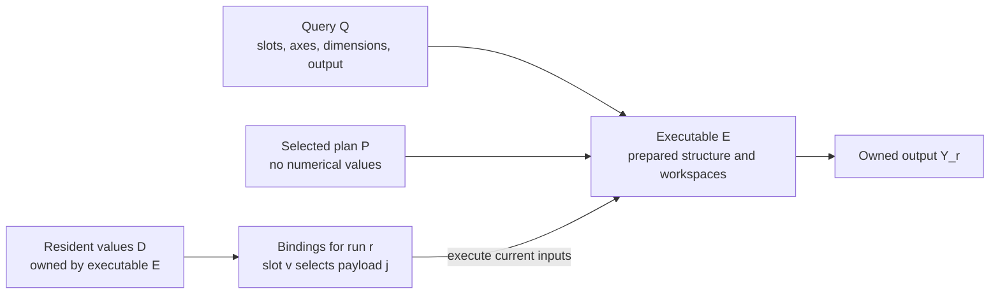

The bank and arrows above are **dataflow**, not a separately owned device bank.
The executable owns resident device storage; retained native pointers cannot
outlive that storage. This design does not add a Session-global mutable cache
or transfer Session ownership to the executable.

Each binding must match the slot's element count, dtype and ordered layout.
The current native layout is column-major, first axis fastest. Axis labels
can differ between slots sharing a payload: that is how the same gate matrix
is reused on different wires. Equal byte lengths alone do not establish
correct mathematical interpretation; e.g., the I2 Rx matrix and diagonal Rzz
factor both have four entries but different meanings. The caller supplies
values appropriate to the query, and lowering preserves their interpretation.

#### Ordinary Pauli noise: reuse values, change bindings

For a unitary-mixture channel:

$$
\mathcal{N}(\rho)=\sum_a p_a U_a\rho U_a^\dagger,\qquad
p_a\geq 0,\quad \sum_a p_a=1 .
$$

One trajectory samples $a\sim p$ and applies $U_a$. It does **not** apply
$\sqrt{p_a}U_a$ as an additional trajectory weight: the probability was
already used in sampling. Pauli noise uses $U_a\in\{I,X,Y,Z\}$.
For a fixed reached circuit with state-independent channel tables, these
choices can be made before its contraction. Adaptive program control still
belongs to the caller and may determine which circuit is reached.

**For this explicit-slot representation, topology includes noise slots from
the start.** An identity outcome fills its slot with $I$; it does not remove
a node. On one wire:

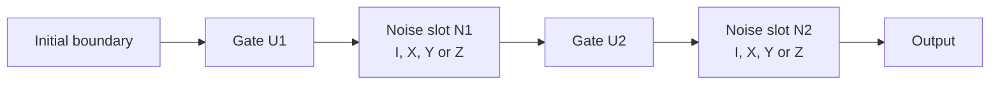

For this illustration, the four $2\times2$ matrices are uploaded once:

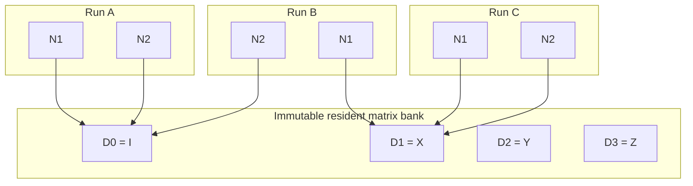

| Transition                       | Payload writes / uploads         | Binding updates            | Structural preparation                 |
| -------------------------------- | -------------------------------- | -------------------------- | -------------------------------------- |
| Initial resident bank            | Upload each distinct matrix once | Establish first selections | Once for $Q,P$                         |
| A to B                           | None                             | N1: I to X                 | None                                   |
| B to C                           | None                             | N2: I to X                 | None                                   |
| C to another identical input set | None                             | None required              | None; numerical contraction still runs |

There is no need to make one Pauli matrix copy per noise location or per
trajectory. The raw complex-f64 payload of this four-matrix bank is
$4\cdot4\cdot16=256$ bytes, regardless of the number of locations.
This excludes gates, bindings, allocator overhead, scratch and outputs.
All resident candidates count toward retained memory, even on a run that
selects only $I$.

Correlated Pauli noise uses a **joint** draw:

$$
(a,b)\sim p_{ab},\qquad U_{ab}=P_a\otimes P_b .
$$

It can select a shared $4\times4$ joint matrix in a two-qubit slot, or two
local matrices in an already-chosen factorized topology. The choices must
remain correlated: $p_{II}=p_{XX}=1/2$ is not equivalent to two independent
coin flips, which also generate $IX$ and $XI$. The representation is
chosen before planning, not switched by rebinding.

The current I2 builder does not yet insert these noise slots. In particular,
its Rzz tensor is a diagonal factor; an arbitrary noisy two-qubit operator
cannot simply replace it because both fit in "a gate buffer." Extra noise
slots or a more general operator representation must first make the query
capable of expressing every intended alternative.

#### Updating data without breaking sharing

Two operations must remain distinct:

$$
\text{rebind: }\beta_r(v)\leftarrow j,\quad D_j\ \text{unchanged};
\qquad
\text{replace values: }D_j\leftarrow D'_j .
$$

The first is enough for a finite, already-resident noise alphabet. The second
is needed for genuinely new values, e.g., a continuously varying rotation.

| Situation                                                       | Required action                                                                                     | What must not happen                                                  |
| --------------------------------------------------------------- | --------------------------------------------------------------------------------------------------- | --------------------------------------------------------------------- |
| Select an existing resident candidate                           | Change the affected slot's native binding; retain both candidate buffers                            | Re-upload the whole bank or rebuild the plan                          |
| Introduce a new same-shape candidate                            | Validate and upload it once, then bind it; allocation may be needed                                 | Pretend new storage costs zero                                        |
| Change one of several slots sharing a payload                   | Bind that slot to another payload; other slots keep the original                                    | Overwrite the shared allocation and accidentally change all consumers |
| Explicitly replace mutable storage                              | Order writes after its last use; update all intended users and invalidate affected numerical caches | Treat a stable host/device address as proof of unchanged contents     |
| Change axes, dimensions, dtype, or supported layout assumptions | Revalidate and prepare the appropriate structure                                                    | Reuse an incompatible executable                                      |

The efficient warm-bank path is:

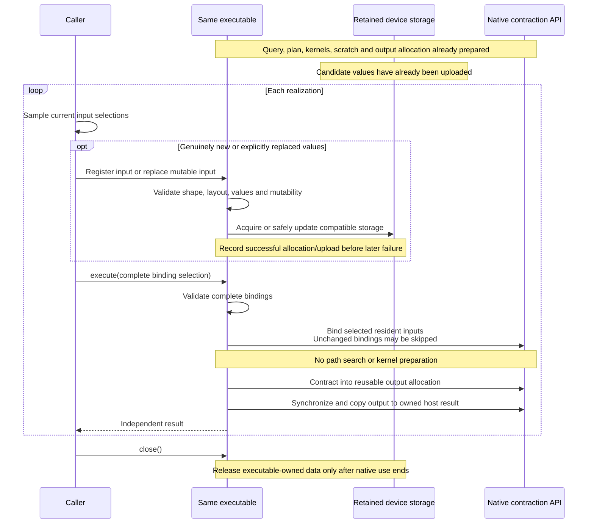

**Approved input-operation separation, implementation pending:** registration
validates and stores a tensor, returning an opaque identity local to the
executable. Registration distinguishes immutable candidates from mutable
storage. Immutable candidates cannot be overwritten; explicit same-shape
replacement updates mutable storage and all slots intentionally selecting it.
To change only one of several sharing slots, select another payload for that
slot instead of overwriting the shared candidate.

Each execution supplies a complete binding selection, one identity per input
slot. The adapter validates it before contracting and can skip native binding
calls for unchanged selections. These operations use explicit identities and
updates, not host-pointer equality or implicit content hashing. The native
implementation uploads at registration/replacement and does not retain the
host view after the synchronous call.

The following spells out the approved operations, but method/type names and
the concrete tensor-view representation are illustrative:

```rust
let mut exec = context.prepare(&query, &plan, limits)?;
let i = exec.register_input(identity, Immutable)?;
let x = exec.register_input(pauli_x, Immutable)?;
let v = exec.register_input(values_a, Mutable)?;

let a = exec.execute(&[i, i, v])?;
let b = exec.execute(&[x, i, v])?;
exec.replace_input(v, values_b)?;
let c = exec.execute(&[x, i, v])?;
```

Registration/replacement preserves the separation between ordered tensor
interpretation and wire labels. Payloads remain general, including nonunitary
values. This API does not require explicit noise nodes or constrain absorption,
native-channel selection, or the number of candidates.

For a synchronous upload/execute interface, the caller's host slices only need
to survive the call that consumes them. Uploaded device data may remain until
executable cleanup. If instead a backend borrows externally owned device
storage, the types must enforce that longer lifetime. No asynchronous work may
retain a pointer into an expired host view.

```text
time --------------------------------------------------------------->
Session              [-----------------------------------------close]
Executable E             [prepare------------------------close]
Resident device values       [upload----reuse----reuse----release]
Host upload view             [call]
Per-run bindings                       [A]     [B]     [C]
Owned result A                          [--------------------------->]

Device release is after the last native use, including descriptor cleanup.
Independently owned external device storage is outside this approved lifecycle.
```

**Approved retention policy:** inputs are registered explicitly and retained
until executable close. Registration adds an allocation; same-shape replacement
reuses its allocation; execution adds no input allocations. There is no implicit
cache of every new realization, automatic eviction, individual input release or
new resident-byte quota in slice 3b. Existing execution limits remain scratch
ceilings. This is not a hard total-memory cap: callers can explicitly register
more inputs. Mutable replacement provides the fixed-capacity path for
continuously changing values. All retained candidates count toward reported
storage, whether selected or not.

**Approved input-failure policy:** every failed registration, replacement or
execution makes the executable unusable, including validation errors rejected
before native work. Validation still precedes upload/binding side effects.
Subsequent attempts return a distinct unusable-state error without native
execution. Recorded resources and consuming close remain available, acquired
allocations remain owned until cleanup, and previously returned outputs remain
valid. This deliberately retains the conservative execution failure contract
rather than promising rollback or recoverable preflight errors.

#### Reusing preparation is not reusing stale numerical results

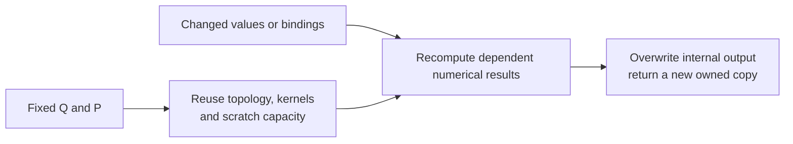

| Reusable across compatible inputs                               | Must be recomputed or explicitly invalidated                 |
| --------------------------------------------------------------- | ------------------------------------------------------------ |
| Selected pairwise schedule; logical-axis lowering               | Numerical intermediates that depend on changed input values  |
| Prepared kernels and workspace sizes                            | Any value-dependent cache containing such intermediates      |
| Compatible input storage capacity; immutable candidate matrices | Changed payload bytes and changed per-slot bindings          |
| Internal output allocation                                      | Output contents; earlier returned results remain independent |

The native contraction owner currently disables cuTensorNet **workspace
caches**. That is distinct from retaining input matrices. Keeping a resident
Pauli bank does not require enabling intermediate-result caching.
Future cache use must honor native invalidation rules, including constant
tensor qualifiers: a slot whose selected values can vary is not constant
merely because each candidate buffer is immutable.

For $R$ realizations, the intended cost decomposition is:

$$
C_{\mathrm{total}} =
C_{\mathrm{search}} + C_{\mathrm{prepare}} + C_{\mathrm{initial\ upload}}
+ \sum_{r=1}^{R}
\left(
C_{\mathrm{selection},r}+C_{\mathrm{validation},r}
+C_{\mathrm{new\ data},r}+C_{\mathrm{binding},r}
+C_{\mathrm{contract},r}+C_{\mathrm{sync},r}+C_{\mathrm{readback},r}
\right).
$$

A supplied plan makes $C_{\mathrm{search}}=0$; a warm finite bank makes
$C_{\mathrm{new\ data},r}=0$. Neither eliminates contraction, synchronization
or the current owned-output readback. There is no general claim that adding
noise slots has zero cost, or that rank simplification produces the same plan
as a clean network. Reuse is across realizations of an already-fixed query.

Resource reports must distinguish selected input bytes, retained candidate
bytes, scratch requirements/recommendations, and actual allocations.
Reusing an allocation is not a new allocation; leaving an unused candidate
resident is not freeing it. The current report's fixed-input meanings must
be reviewed before extending them to this lifecycle. Keep partial evidence,
primary errors and cleanup errors separate; do not hide update failures by
silently running with a mixture of old and new bindings.

#### Loss: a classical event followed by a state-dependent update

QDK's current GPU loss behavior has **two random decisions**, not one:

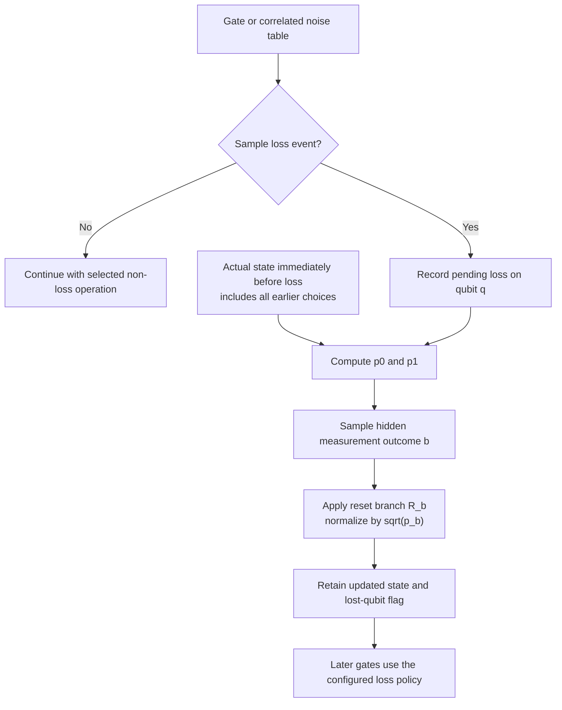

For a normalized state $\lvert\psi_h\rangle$ conditioned on the previous
history $h$, the loss event can have a classical configured probability,
but the reset branch has:

$$
R_0=\lvert0\rangle\langle0\rvert,\qquad
R_1=\lvert0\rangle\langle1\rvert,\qquad
p_b=\langle\psi_h|
(R_b^\dagger R_b)_q\otimes I_{\mathrm{rest}}
|\psi_h\rangle .
$$

$$
b\sim(p_0,p_1),\qquad
|\psi_{h,b}\rangle =
\frac{(R_b)_q\otimes I_{\mathrm{rest}}|\psi_h\rangle}{\sqrt{p_b}},
\qquad \mathrm{lost}[q]\leftarrow\mathrm{true}.
$$

A zero-probability branch must not be selected or normalized. For an
unnormalized prefix, branch weights must first be divided by its norm squared.
If several entangled qubits are lost, subsequent probabilities are conditional
on previous resets; independently sampling their original marginals is wrong.

**Why setting a loss flag or substituting X is insufficient:** losing the
first qubit of a Bell pair gives

$$
|\Phi^+\rangle=\frac{|00\rangle+|11\rangle}{\sqrt2}
\quad\longrightarrow\quad
\begin{cases}
|00\rangle & \text{with probability }1/2,\\
|01\rangle & \text{with probability }1/2.
\end{cases}
$$

The survivor is correlated with the hidden branch. Discarding the lost
wire without tracing or conditioning would lose that physics.
The bit labels here are logical qubit labels, not a change to QDK's dense
buffer-index convention.

The source implements this split in
[`get_noise_ops` / `expand_correlated_loss_commits`](../gpu_full_state_simulator/noise_mapping.rs),
[`prep_loss_commit`, `prep_measure_reset_instrument`, and `propagate_loss_to_qubit`](../gpu_full_state_simulator/gpu_statevector_shaders.wgsl).
The reset chooses from live qubit probabilities, applies a projector/reset
matrix, and renormalizes. Loss is therefore not wholly covered by pre-sampling
a Pauli-like matrix from the configured event table.

#### What can be reused while handling loss

The raw matrices $R_0,R_1$ are fixed and can be resident/shared, just like
Paulis. The changing information is **which branch**, its **normalization**,
the **conditioned quantum history**, and the **classical loss flags**.

| Data                             | Retained / updated at a loss                               | Reuse boundary                                                            |
| -------------------------------- | ---------------------------------------------------------- | ------------------------------------------------------------------------- |
| Raw $I,R_0,R_1$ matrices         | Retain immutable candidates; select one                    | No matrix upload is needed if already resident                            |
| Conditional $p_b$                | Recompute from the actual prefix state                     | Not reusable across different quantum histories                           |
| Normalization $1/\sqrt{p_b}$     | New scalar per selected branch                             | Requires a reviewed scalar-factor representation or updated scaled tensor |
| Quantum state/history            | Retain the selected reset and all previous evolution       | Never restart from a fresh zero state                                     |
| Loss flags / later gate choices  | Update in the caller's trajectory state                    | Not stored inside a portable plan                                         |
| Structural query/plan/executable | Reuse only for the same query and supported representation | A final-ket query is not also a prefix-marginal query                     |

For a prefix represented by an unnormalized ket tensor network
$|\phi_h\rangle$, the necessary weights are ordinary contractions:

$$
w_b=\langle\phi_h|
(|b\rangle\langle b|)_q\otimes I_{\mathrm{rest}}
|\phi_h\rangle,\qquad
p_b=\frac{w_b}{w_0+w_1}.
$$

Those are **ket/bra probability queries**, not the same output query as
returning a final ket. A future loss-aware caller could use reusable
preparations for fixed prefix-probability queries, and another reusable
preparation for a full trajectory with reserved reset slots:

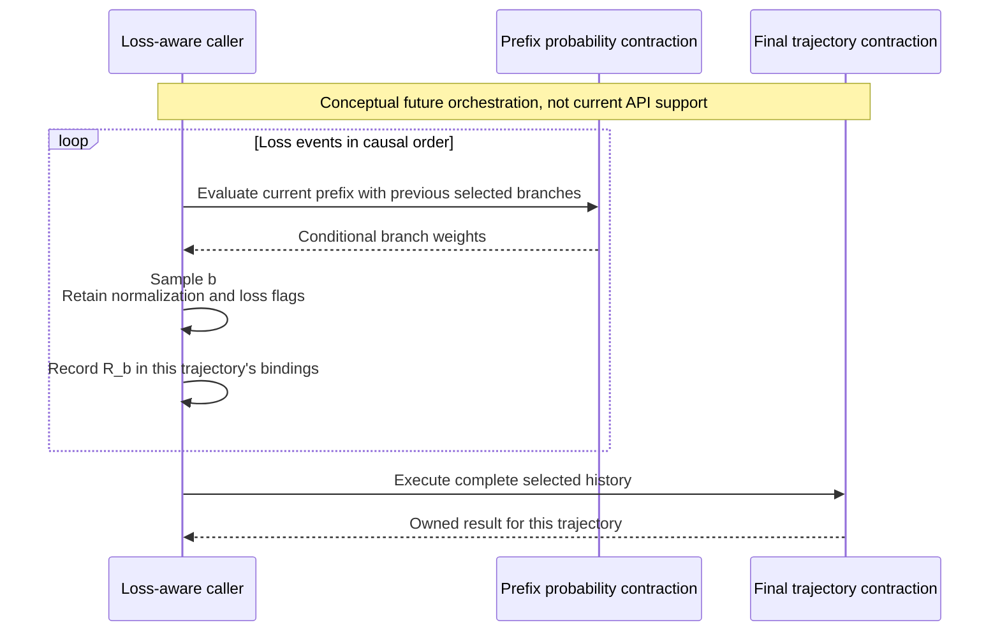

This does **not** promise one executable for all those different queries, or
free marginal calculations. Prefixes/output requests can need different
plans and substantial additional contraction work. The same prepared query
can be reused across histories when its slots/dimensions remain fixed.
Retaining multiple live preparations would require separate Sessions under
the approved exclusive-borrow policy; storing them together in one Session
is not an implicit extension of that policy.

Likewise, replaying a complete retained trajectory from its original boundary
is not the same as restarting an already-evolved region from zero.
The current builder does not implement either loss-aware replay or
continuation; the [I4 guard](#required-i4-consumer-guard) still forbids the
incorrect restart. An incremental/MPS route instead retains the evolving
state and updates it at each event; it has a different numerical lifecycle.

One possible way to preserve immutable $R_b$ matrices is to represent
branch scales as separate scalar factors. Another is to upload scaled values
$R_b/\sqrt{p_b}$ into suitable non-aliased storage. Neither representation
is selected here. Shared matrix retention alone does not solve normalization
or conditional-probability evaluation.

#### Gates after loss: values and classical policy both matter

For the current supported policies, see
[`LossPolicy`](../noise_config.rs) and the GPU shader's
`handle_lost_operand_policy`. In a representation with suitable fixed slots:

| Policy / situation                                     | Numerical action                                                               | Additional trajectory data                          |
| ------------------------------------------------------ | ------------------------------------------------------------------------------ | --------------------------------------------------- |
| `Skip`                                                 | Identity instead of the affected gate                                          | Keep loss flags                                     |
| `Degrade` on supported two-qubit rotations             | Corresponding one-qubit rotation on the survivor, identity on the lost operand | Select according to which operand survives          |
| `ResidualSDagger` on a non-SWAP pair with one survivor | $S^\dagger$ on the survivor                                                    | Keep loss flags; SWAP has separate ordered behavior |
| `Propagate` with a survivor                            | Another state-dependent reset/loss on that survivor                            | New branch probability, normalization and loss flag |
| `ApplyAnyway` for SWAP                                 | SWAP the retained quantum slots                                                | Exchange loss flags too                             |

This is not a new policy definition or a promise that every policy is valid
for every gate. SWAP-specific rules and later noise on surviving operands
must preserve the existing implementation's ordering.

For example, a degraded one-qubit operation can occupy a full two-qubit gate
slot as $I_{\mathrm{lost}}\otimes U_{\mathrm{survivor}}$, with the appropriate
axis ordering. That preserves dimensions. It does not mean every compressed
diagonal-factor representation can hold every reset or policy alternative.
The future builder must choose sufficient slots before planning.

#### An alternative loss representation: trace rather than sample

If the hidden measurement result is not exposed, the quantum reset channel
can instead be represented directly on a density matrix:

$$
\mathcal{R}_q(\rho)=\sum_{b=0}^{1}
(R_b)_q\rho(R_b^\dagger)_q
=|0\rangle\langle0|_q\otimes\operatorname{Tr}_q(\rho).
$$

No branch is sampled within this reset channel. A static doubled ket/bra
network represents the sum using a local channel tensor

$$
S_{aa',cc'}=\sum_b (R_b)_{ac}\,\overline{(R_b)_{a'c'}} .
$$

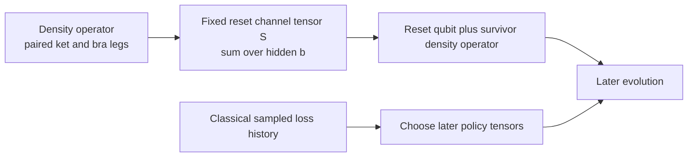

For a fixed classical event history and compatible circuit topology, such
a density-network query can have its own reusable plan/executable. Quantum
reset branches are summed, but classical loss flags still control later gate
policies. Summing over classical histories as well requires representing
those dependencies, not discarding them.

This is an **alternative future representation**, not a drop-in replacement
for the current pure-ket builder, not an individual pure-state trajectory,
and not a claim that amplitudes can be averaged to obtain a mixed state:

$$
\rho_{\mathrm{ensemble}}=\mathbb{E}_r[|\psi_r\rangle\langle\psi_r|],
\qquad
\rho_{\mathrm{ensemble}}\ne
|\mathbb{E}_r[\psi_r]\rangle\langle\mathbb{E}_r[\psi_r]|
\quad\text{in general}.
$$

The numerical payload, query and cost change; paired legs can greatly
increase contraction cost. The abstract pairwise `ContractionPlan` can
describe ordinary doubled networks already, but the circuit lowering,
input interpretation, output semantics and consumer would need new work.
This is not a fundamental inability of exact tensor contraction to represent
loss or general Kraus channels.

#### What CUDA-Q and cuTensorNet actually reuse

The verified CUDA-Q reference is pinned to
[`411f157aaa57125dc4edf17cb81395f97fce6a90`](https://github.com/NVIDIA/cuda-quantum/tree/411f157aaa57125dc4edf17cb81395f97fce6a90/runtime/nvqir/cutensornet):

| Mechanism                                                                | Evidence                                                                                                                                                                                      | Lesson for this design                                                                    |
| ------------------------------------------------------------------------ | --------------------------------------------------------------------------------------------------------------------------------------------------------------------------------------------- | ----------------------------------------------------------------------------------------- |
| Cache device gate/channel matrices, reuse pointers                       | [`getOrCacheMat` and `applyKrausChannel`](https://github.com/NVIDIA/cuda-quantum/blob/411f157aaa57125dc4edf17cb81395f97fce6a90/runtime/nvqir/cutensornet/simulator_cutensornet.inc#L181-L243) | Separate immutable numerical storage from operator locations                              |
| Register candidate unitaries and probabilities                           | [`applyUnitaryChannel`](https://github.com/NVIDIA/cuda-quantum/blob/411f157aaa57125dc4edf17cb81395f97fce6a90/runtime/nvqir/cutensornet/tensornet_state.inc#L119-L132)                         | Native State API can represent a stochastic channel without a host upload per realization |
| Prepare sampler once, execute repeatedly; one sample per call when noisy | [`prepareSample` / `executeSample`](https://github.com/NVIDIA/cuda-quantum/blob/411f157aaa57125dc4edf17cb81395f97fce6a90/runtime/nvqir/cutensornet/tensornet_state.inc#L259-L422)             | Reuse preparation while obtaining independent trajectories                                |
| Recompute MPS factorization per noisy trajectory                         | [`SimulatorMPS::observe`](https://github.com/NVIDIA/cuda-quantum/blob/411f157aaa57125dc4edf17cb81395f97fce6a90/runtime/nvqir/cutensornet/simulator_mps.h#L318-L345)                           | Reused preparation does not mean an unchanged numerical state                             |

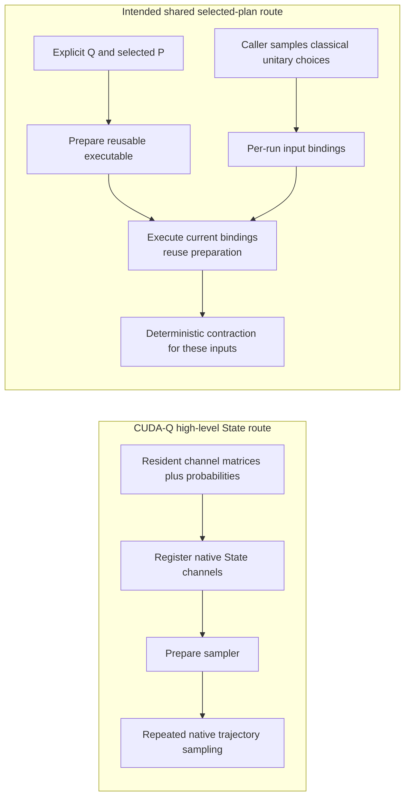

These are different API layers. `cutensornetStateApplyUnitaryChannel` and the
sampler operate on a state; the current adapter uses a network descriptor,
explicit path import and `cutensornetNetworkContract`. Native State sampling
is not a drop-in implementation of an arbitrary supplied-plan contraction.
Do not silently add path search, stochastic sampling or state evolution to
the shared numerical method to imitate that route.

The pinned [cuTensorNet API reference](https://docs.nvidia.com/cuda/cuquantum/26.06.0/cutensornet/api/functions.html)
documents `cutensornetNetworkPrepareContraction` as kernel/intermediate-layout
preparation and `cutensornetNetworkSetInputTensorMemory` as input pointer/stride
binding. The checked-in [2.13 qualifiers](../../../cutensornet/src/bindings/v2_13.rs)
distinguish tensors declared constant across contractions. These support the
structure/data distinction, but QDK still needs injected and later native
evidence for its actual update sequence.

That reference restricts `cutensornetStateApplyGeneralChannel` to MPS with
the supported gauge/mode conditions; CUDA-Q's exact State backend also
[rejects general channels](https://github.com/NVIDIA/cuda-quantum/blob/411f157aaa57125dc4edf17cb81395f97fce6a90/runtime/nvqir/cutensornet/simulator_tensornet.h#L195-L199).
This is a restriction of that native trajectory API, not a prohibition on
the doubled-network representation above. The existing QDK MPS route remains
unchanged by this design discussion.

#### cuTensorNet realization examples

**Illustrative future implementations, not implemented QDK noise support or
a selected strategy.** The two cuTensorNet routes below have different
contracts: the Network API executes an explicit contraction, whereas the
State API represents quantum evolution and provides higher-level operations
such as sampling. A noise declaration should not force either route.

| Declared QDK behavior            | Possible selected-plan Network realization                                                                                                                                                                           | Possible native State realization                                                                                                                                                                                  |
| -------------------------------- | -------------------------------------------------------------------------------------------------------------------------------------------------------------------------------------------------------------------- | ------------------------------------------------------------------------------------------------------------------------------------------------------------------------------------------------------------------ |
| Pauli error after a gate         | Caller samples the Pauli; absorb it into a compatible gate tensor or bind an explicit noise tensor. Execute the prepared query with the resulting inputs                                                             | Register resident candidate unitaries and probabilities with `cutensornetStateApplyUnitaryChannel`; native sampling selects the trajectory                                                                         |
| Correlated two-qubit Pauli error | Sample the joint distribution; absorb the selected product into a compatible full gate tensor, or select correlated inputs in a prepared factorized representation                                                   | Register the joint candidates, e.g. $I\otimes I$ and $X\otimes X$, as one two-mode unitary channel with their joint probabilities, not two independent channels                                                    |
| Idle-time `S` fault              | Determine the idle interval and effective event probability using QDK's timing/loss semantics; choose `I` or `S` and absorb/bind it at the correct boundary                                                          | After determining the same interval and valid distribution, register the `{I, S}` unitary mixture with probabilities `{1-p, p}`. cuTensorNet does not infer QDK's idle timing                                      |
| Loss with QDK gate policies      | After selecting a loss event, evaluate conditional reset probabilities and bind the selected normalized reset, or use the doubled-network reset channel. Retain loss flags and choose later gate tensors accordingly | In the supported MPS mode, the reset channel `{R_0, R_1}` can be registered through `cutensornetStateApplyGeneralChannel`. QDK still selects the loss event, retains loss flags and implements later gate policies |
| General Kraus operation          | Use a doubled ket/bra channel tensor, or orchestrate state-dependent trajectory branches with explicit probability queries and compatible branch tensors                                                             | Register a trace-preserving Kraus set through `cutensornetStateApplyGeneralChannel` where its MPS restrictions are satisfied. This is not native exact-State support for general channels                          |

Here the loss reset candidates are
$R_0=|0\rangle\langle0|$ and $R_1=|0\rangle\langle1|$.
The native reset channel handles the quantum reset, not QDK's classical
`LossPolicy` semantics. The selected-plan loss route can need several
queries/plans; see [what can be reused while handling loss](#what-can-be-reused-while-handling-loss).

For a general Kraus set, a doubled-network channel tensor is

$$
S_{aa',bb'}=\sum_j (K_j)_{ab}\,\overline{(K_j)_{a'b'}} .
$$

This sums the channel's unobserved branches. It does not automatically return
an `Instrument` outcome. A selective instrument needs its outcome
probabilities, selected conditional state and normalization/trace bookkeeping
preserved explicitly; replacing it with the channel that sums all outcomes
would change the semantics. Density-network outputs also differ from
pure-state amplitudes and can require much larger contractions.

**Example: the same bit-flip declaration, two possible realizations.**
For a declared error after gate $U$, with $0\leq p\leq1$:

$$
\rho'= (1-p)\,U\rho U^\dagger
       +p\,XU\rho U^\dagger X^\dagger .
$$

```text
Declaration: apply U, then bit-flip noise with probability p
                              |
               +--------------+--------------+
               |                             |
     Selected-plan Network route       Native State route
     (compatible full gate tensor)
               |                             |
     Caller samples b ~ Bernoulli(p)    Register U
               |                       Register channel:
     Select gate payload U or XU       {I, X} with {1-p, p}
               |                             |
     NetworkSetInputTensorMemory       Prepare sampler
               |                             |
     NetworkContract                   Repeated SamplerSample calls
     (reuse query/plan/preparation)     (native error selection)
```

The Network route can reuse resident `U`/`XU` payloads and does not need a
separate noise node in this example. It returns the query's numerical tensor;
any final shot sampling remains caller-level work. The State sampler returns
samples, not that same contraction output type. Reuse of the native sampler
within a sampling operation has CUDA-Q precedent above; it is not a promise
that arbitrary channel, circuit or probability changes preserve preparation.
Neither the source nor this example establishes whether native execution
internally performs the same absorption.

**Native capability limits matter.** In the pinned
[cuTensorNet API reference](https://docs.nvidia.com/cuda/cuquantum/26.06.0/cutensornet/api/functions.html),
`cutensornetStateApplyGeneralChannel` requires a trace-preserving channel,
supports channels acting on one or two state modes in MPS simulation with
`CUTENSORNET_STATE_MPS_GAUGE_FREE`, and does not support the exact-contraction
State route or the simple MPS gauge. Its channel ID cannot be updated through
`cutensornetStateUpdateTensorOperator`. An individual trace-decreasing
instrument outcome must not be passed as though it were a complete
trace-preserving channel. Unitary-channel probabilities must sum to one.
These examples do not imply that all named native APIs are exposed by the
current QDK adapter, or authorize changes to the existing MPS implementation.

#### Implementation boundary and required evidence

Resident input ownership, operation separation, retention and failure behavior
are approved as described above. The executable owns resident inputs together
with its prepared resources, registers/replaces values explicitly, and executes
complete binding selections. The earlier fixed-input coefficient GAT proposal
is superseded.

**Approved reporting representation, implementation pending:** Context and
executable expose a backend-defined `Report: AsRef<ResourceReport>`, with
`PreparationFailure<E, R = ResourceReport>` retaining the report, primary error
and optional cleanup error by value. Native reporting embeds the common report
and two optional native cache recommendations; it replaces zero-defaulted
`ExecutionMemory`, rather than wrapping it. Common evidence distinguishes the
most recent fully validated input selection from all acquired resident input
allocations. Selected bytes/count do not assert that every native binding
succeeded; resident bytes/count include unselected candidates and allocations
acquired before a failed upload. Owned device bytes count actual acquisitions.
Input-time errors leave the report on the unusable executable. Preparation
errors retain separate primary/cleanup errors even during early topology
construction/import. Record each successful observation/acquisition before the
next fallible operation.

**Approved host allocation seam, implementation pending:** add a narrow
`allocate_host_scratch` operation to the existing private
`ContractionExecutionApi`. It returns the existing aligned RAII `HostScratch`
owner, or a construction-configured injected allocation error. Use the real
owner in both production and injected paths; add neither fake pointers nor a
new allocator object on Session, and leave MPS unchanged.

**Resource-keyed double checkpoint completed:** the existing native API double
now keeps live resources separate from call history and uses unique handles,
per-network metadata/bindings, per-workspace state and per-stream pending work.
All 46 baseline host contraction tests still pass. Three added behavioral cases
exercise sequential numerical preparation on one Session, independently
closable live owners (including cleanup errors), and a failed contraction that
does not block another stream. The 49-case suite and strict crate Clippy pass.
Faults/observations remain construction-configured, and the real native owners
remain under exercise.

This isolated refactor does not change production execution or supply a
numerical input-reuse oracle: the existing sentinel output remains for these
lifecycle cases. Changed-input numerical behavior must be added before claiming
reusable-input evidence. Native/A100 qualification uses the real library API,
not this double; its independent fixtures and tolerances remain unchanged.

The reusable-input contract must demonstrate, through the real native adapter
with injected APIs:

- Prepare once; run A, B and C above without new search or kernel preparation.
- Changed bindings change numerical results while earlier outputs survive.
  A test double returning a constant output cannot establish this property.
- Equal-valued slots can diverge and later share again without corrupting
  other users; resident candidates are not uploaded again merely to rebind.
- New payloads are validated/uploaded through the real path; retained storage,
  successful allocations and failures are reported honestly.
- No stale constant/intermediate cache, expired host view, cross-owner release,
  or partially updated input set is silently used.

These are implementation acceptance requirements, not completed tests or an
authorization to integrate noise now. Loss additionally needs independently
reviewed state/probability and continuation semantics; a successful Pauli
rebinding test does not qualify it. Preserve the later representative-settings
3c native gate, finalize it from implementation evidence, and require separate
authorization for VM delivery, GPU execution and public integration.

### Required I4 consumer guard

**Acceptance requirement, not implemented runtime behavior:** before public
integration, the concrete tensor-network consumer must enforce that
`from_zero_state` is used only for the initial evolution of a fresh execution.
The builder itself is stateless and cannot infer execution history from a
region's operations and qubit count.

```text
Fresh execution + initial region       -> initialize from zero
Already evolved + another region       -> explicit continuation error
After measurement + quantum evolution  -> explicit continuation error
```

The guard belongs at the context-aware execution boundary, before a second
zero-state initialization or numerical execution. It must use per-execution
state, not merely a region ID: revisiting the same region must not bypass it.
Normal terminal readout remains allowed. A fresh independent execution must
still be able to initialize; a process-global or permanently consumed guard
would be incorrect.

I4 is not complete until behavioral tests establish all three transitions
above, including a repeated region ID, and successful independent fresh
executions. These checks must exercise the actual consumer/execution route,
not only a standalone guard helper. I2's private probe already rejects multiple
static regions and nonleading regions, but that structural admission check is
not the production lifecycle guard or a full-program validator. No unused
guard abstraction or partial `RegionConsumer` is introduced in I2.

### What this map makes visible

Three placement facts worth knowing before moving anything:

- **`src/library/simulation/` is not one module.** `src/simulation.rs` pulls the
  host-capable files in via `#[path]`, so they compile as `crate::simulation::*` on
  every platform. `mps_session.rs` is pulled in by `src/library/simulation.rs`
  instead, so it is `crate::library::simulation::mps_session` and exists only on
  linux/x86-64. Inside those host-capable files `super` means `crate::simulation`, which
  is why they say `use crate::simulation::…` rather than a path through
  `library`. The directory is a location, not an owner.
- **`contraction.rs` names two unrelated things.** In `tensornet/` it is
  `ContractionQuery` — what to compute. In `cutensornet/` it is
  `ContractionResources` — borrowed native topology/optimizer metadata ownership.
  Its owned positional metadata is not the planned portable plan or shared
  contraction contracts. The numerical child owner consumes its selected
  metadata and I2 bindings without a new search. The bounded numerical experiment
  precedes shared-interface work; diagnostic/2x2/4x4 native numerical results
  now qualify this bounded lifecycle, not the future common interfaces.
  See the [native contract](../../../cutensornet/README.md#private-general-network-numerical-execution).
  Neither is wrong; the
  collision is worth knowing when grepping.
- **`mps_execution/tests.rs` is larger than the file it tests.** 1714 lines of host
  fakes against a 1462-line driver. That is the FFI boundary being pinned
  without hardware, and it is why most changes can be validated on a laptop.

## Glossary

- **Engine**: the computational method that evolves quantum state, such as
  tensor4all, cuTensorNet, or a full-state simulator.
- **Device**: the host target on which an engine runs, currently `cpu` or
  `nvidia` in the planned MPS route.
- **Simulation Method**: the QDK-facing `type=` selector, such as `"mps"`.
- **Target**: the concrete Engine and Device pairing selected for dispatch.

The `MpsOptions(device=...)` examples in
[Next Integration Iteration](#next-integration-iteration) show how the
Simulation Method remains stable while Device selects a Target.

## Infrastructure Sharing vs. Profile Semantics

Sharing `PreparedAdaptiveProgram` and `AdaptiveExecution` across Base and
Adaptive QIR simplifies the implementation; it does not merge their QIR-level
contracts. Base Profile's no-branching, statically resolvable guarantee is
enforced independently by QIR validation, regardless of which Engine executes
the program.

`QuantumEvolutionRegion` enables that sharing without a profile-specific
execution mode. Base Profile is the one-region restriction of the same general
structure rather than a separate control implementation. The candidate
single-region, no-branch fast path recognizes a Base-shaped program internally;
it does not relax or change either profile's specification-level meaning or
validation.

## Execution Flow

`PreparedAdaptiveProgram` retains the original bytecode control tables and
caches deterministic region locations once. Each `AdaptiveExecution` owns the
mutable state for one shot: its instruction position, registers, measurement
results, ordered output records, and command/response protocol state.

```text
Python AdaptiveProfilePass
           |
           v
   AdaptiveProgram<Word>
           |
           v  prepare once per request
 PreparedAdaptiveProgram
           |
           +-----------------------+
           |                       | one per shot
           v                       v
   AdaptiveExecution         AdaptiveExecution ...
           |
           | AdaptiveCommand
           v
      shot driver
           |
           v
      target adapter --------> continuing target state
           |
           | AdaptiveResponse
           +------------------> AdaptiveExecution
```

The command/response protocol is deliberately small:

```text
AdaptiveExecution::new
           |
           v
         Ready
           |
           +-- ExecuteRegion ---------> AwaitingRegionCompletion
           |                                      |
           |<---------- RegionComplete -----------+
           |
           +-- Measure --------------> AwaitingMeasurementResult
           |                                      |
           |<-------- Measurement(result) --------+
           |
           +-- Complete(records) -----> Complete
```

A `QuantumEvolutionRegion` is uninterrupted target-local state evolution
between host-visible semantic boundaries. The current payload contains only
resolved unitary operations. Measurements, host-visible decisions and queries,
ordered output, and classical branch selection remain outside a region.
The [approved noise attachment](#attach-noise-declarations-to-existing-execution-work)
extends region work with declarations alongside that ideal sequence, allowing
internal stochastic realization while preserving observable outcome boundaries.
That extension is not implemented in the current command/response protocol.

`drive_prepared_shot` provides synchronous orchestration for any
`RegionConsumer`. `run_prepared_shot` retains the existing simulator-facing
signature as a thin `ImmediateSimulatorConsumer` compatibility wrapper:

```text
driver             AdaptiveExecution          RegionConsumer                 target
   |                        |                         |                           |
   |-- next_command ------->|                         |                           |
   |<-- ExecuteRegion ------|                         |                           |
   |-- prepare/execute ------------------------------>|                           |
   |                        |                         |-- apply operation -------->|
   |                        |                         |<-- operation complete -----|
   |                        |                         |-- apply operation ... ---->|
   |                        |                         |<-- operation complete -----|
   |<-- region report --------------------------------|                           |
   |-- RegionComplete ----->|                         |                           |
   |<-- Measure ------------|                         |                           |
   |-- measure(request) ----------------------------->|                           |
   |                        |                         |-- mz or mresetz ---------->|
   |                        |                         |<-- measurement complete ---|
   |                        |                         |-- read result ------------>|
   |                        |                         |<-- MeasurementResult ------|
   |<-- MeasurementResult ----------------------------|                           |
   |-- Measurement(result) ->|                        |                           |
   |<-- Complete(records) --|                         |                           |
   |-- finish/close --------------------------------->|                           |
```

`RegionConsumer` is the driver's only interface for region execution; the
underlying legacy `Simulator` (`FullStateSimulator` or `StabilizerSimulator`)
never receives a region and has no concept of one. The
`ImmediateSimulatorConsumer::execute_region` implementation re-decomposes each
region into ordinary one-gate-at-a-time `Simulator` calls through
`apply_unitary_immediately` in `unitary.rs`, eagerly discarding the batching
opportunity. Region grouping is therefore a structural no-op for CPU and
Clifford, making parity with the legacy oracle direct. Planned
`Tensor4AllMpsConsumer` and `CuTensorNetMpsConsumer` implementations will instead
consume whole regions and replace that per-operation loop with one batched
tensor-network contraction; no current consumer exercises that purpose yet.

The immediate path is currently a compatibility implementation and parity
oracle. The legacy `bytecode::runtime::run_shot` remains the production CPU and
Clifford execution path until migration is explicitly validated.

An internal, experimental Python/native route now proves that representative
Base-profile QIR can be lowered by `AdaptiveProfilePass`, prepared once as a
`PreparedAdaptiveProgram`, and executed per shot by `run_prepared_shot` with an
`ImmediateSimulatorConsumer`. The deterministic two-qubit proof program
partitions its unitary prefix into exactly one `QuantumEvolutionRegion` and
matches the existing Base CPU output across multiple shots. This route is not a
documented API or production dispatch path and does not add backend or noise
support.

The public `run_qir(type="mps", mps_options=MpsOptions(...))` contract now
routes noiseless Base-profile QIR through the same lowering and preparation,
then through a separately named native entry point into cuTensorNet.
Preparation is shared per request: the region is converted once, the state is
evolved once, and every shot is drawn from a single batch sample. Control
state and per-shot record reconstruction stay fresh per shot, driven by
`drive_prepared_shot` exactly as the full-state route drives it. The route
requires NVIDIA hardware and CUDA, is compiled only for Linux x86_64, and
returns a discovery error elsewhere. The private probe remains available as a
separate diagnostic route.

## A Walk Through `run_qir` MPS

This traces one noiseless Base-profile request from the public API down to the
cuTensorNet Engine and back, one row per functional block. It uses the
[Glossary](#glossary) terms: Simulation Method is the `type=` selector, Device
is the host target, Engine is the computational method that evolves quantum
state, and Target is the selected pairing.

Base Profile guarantees a single `QuantumEvolutionRegion`, so all state
evolution precedes all measurement. That is the precondition that allows the
state to be prepared once and every shot to be drawn in one Engine call. Rows
12-17 convert that sample buffer into ordinary output records through the
existing per-shot control path, so the result contract is identical to
`type="cpu"`.

The rightmost column names the objective currently being tracked and records
each block's readiness against it. When that objective is met the column is
renamed to the next one and the readiness values are reassessed, so the table
stays a live plan rather than an accumulating history.

Note one terminology hazard throughout this walk. In the QDK, `type="gpu"` and
every `gpu` identifier refer to the wgpu full-state simulator, which runs on any
compatible adapter and requires no NVIDIA hardware. The path described here is
reached through `type="mps"` and needs CUDA and cuTensorNet. The two are
independent, so this walk names NVIDIA hardware explicitly and never borrows the
existing `gpu` vocabulary for it.

DEFECT: the `run_qir` docstring still tells a user who has NVIDIA hardware to
select `type="gpu"`, which reaches wgpu rather than cuTensorNet. That guidance
was accurate only while `type="mps"` was a placeholder. Since the MPS path
began performing real NVIDIA execution the docstring actively misdirects
exactly the users the cuTensorNet route exists to serve, so this is a
user-facing defect rather than deferred work. The public documentation and the
option surface must make the distinction discoverable without reading source.
The mechanism is undecided and is recorded here so that it is not decided by
default.

| #   | Block                                                                                                                                                                             | Input                                                           | Output                                                | Demo                                                                 | Effort | Comment                                                                                                                                                                                                                                                                                                       |
| --- | --------------------------------------------------------------------------------------------------------------------------------------------------------------------------------- | --------------------------------------------------------------- | ----------------------------------------------------- | -------------------------------------------------------------------- | ------ | ------------------------------------------------------------------------------------------------------------------------------------------------------------------------------------------------------------------------------------------------------------------------------------------------------------- |
| 1   | [`run_qir`](../../../qdk_package/qdk/simulation/_simulation.py) Simulation Method dispatch                                                                                        | QIR source, `type="mps"`, `MpsOptions(device=...)`, shots, seed | Target selection; call to the MPS entry point         | Partial: NVIDIA hardware-test split done; availability probe missing | TBD    | The three NVIDIA acceptance tests use a separate `QDK_NVIDIA_TESTS` opt-in and an `OSError` execution probe; the public availability probe and `device=None` semantics remain deferred                                                                                                                        |
| 2   | [`preprocess_simulation_input`, `_validate_base_profile`, `DecomposeCcxPass`](../../../qdk_package/qdk/simulation/_simulation.py)                                                 | QIR source                                                      | Validated Base Profile module                         | Done                                                                 | --     | Shared with every other Simulation Method; nothing target-specific. `DecomposeCcxPass` runs here, which is why `Ccx` never reaches the row 9 converter                                                                                                                                                        |
| 3   | `AdaptiveProfilePass(Bytecode.Bit64)`                                                                                                                                             | Base Profile module                                             | Adaptive bytecode (`AdaptiveProgram<Word>`)           | Done                                                                 | --     | The same lowering pass production Adaptive QIR already uses                                                                                                                                                                                                                                                   |
| 4   | [Native entry point](../../../qdk_package/src/qir_simulation/cpu_simulators.rs)                                                                                                   | Bytecode dict, shots, seed                                      | `AdaptiveProgram<u64>`                                | Done                                                                 | --     | The existing native signature is unchanged; program errors remain `ValueError` and discovery/device errors surface as `OSError`                                                                                                                                                                               |
| 5   | [`PreparedAdaptiveProgram::new`](adaptive.rs)                                                                                                                                     | `AdaptiveProgram<u64>`                                          | Prepared program with region sites resolved once      | Done                                                                 | --     | Shared with the Base-profile probe; unchanged                                                                                                                                                                                                                                                                 |
| 6   | [`measured_qubits()`](adaptive.rs)                                                                                                                                                | Prepared program                                                | Ordered measured qubits with `result_id` mapping      | Done                                                                 | --     | Computed during the existing region walk through the decoder shared with runtime execution                                                                                                                                                                                                                    |
| 7   | [MPS shot loop `run_mps_shots`](../../../cutensornet/src/execution.rs)                                                                                                            | Prepared program, shots, seed                                   | `Vec<Vec<OutputRecord>>`; owns the session lifetime   | Done                                                                 | --     | Converts the single region before discovery, then owns one session, one state evolution, one batch sample, and sequential per-shot replay                                                                                                                                                                     |
| 8   | Target adapter `CuTensorNetMpsConsumer`                                                                                                                                           | The single `QuantumEvolutionRegion`, sample matrix, shot index  | Measurement bits from the precomputed sample row      | Done                                                                 | --     | Crate-private per-shot view with no-op region and close methods, guarded against multiple regions and feedforward                                                                                                                                                                                             |
| 9   | [`Gate::from_unitary_operation`](../../../cutensornet/src/library/simulation/circuit.rs)                                                                                          | `UnitaryOperation`                                              | `Gate`, no gate for `I`, or a typed unsupported error | Done                                                                 | --     | Landed in `11a651339`; exhaustive over all unitary variants with no catch-all, and its four tests run on any host since `f262a60ae`. `CircuitPreparationConsumer` collects the region's gates by driving row 14 once at preparation time, so that driver serves both circuit construction and per-shot replay |
| 10  | [`SessionApi`](../../../cutensornet/src/library/simulation/resources.rs) / [`MpsExecutionApi`](../../../cutensornet/src/library/simulation/mps_execution.rs) via `CuTensorNetApi` | `Circuit` and `ExecutionPolicy`                                 | Evolved MPS state on the Device                       | Done                                                                 | --     | Ported `SamplerApi`, `PreparedSampler`, session/replay sampling, and cross-platform FakeApi coverage from `eed6e1bbe`; pure logic remains ungated while the native adapter stays with the existing native implementations to preserve loader encapsulation                                                    |
| 11  | cuTensorNet Sampler Engine APIs                                                                                                                                                   | State handle, measured modes, shot count, derived seed          | Flat `int64` array indexed `[shot * n_measured + j]`  | Done                                                                 | --     | Ported the five generated bindings and required symbols from `eed6e1bbe`; the frozen surface is 30 symbols                                                                                                                                                                                                    |
| 12  | [Sample narrowing](../../../cutensornet/src/library/simulation/consumer.rs)                                                                                                       | Flat `int64` buffer                                             | `u8` buffer plus the qubit-to-column map              | Done                                                                 | --     | Uses `u8::try_from` once over the owned buffer and reports the original `i64` plus flat index; the sample matrix remains the sole owner of column indexing                                                                                                                                                    |
| 13  | [`AdaptiveExecution`](adaptive.rs)                                                                                                                                                | Prepared program and one buffer row                             | Ordered `OutputRecord`s for that shot                 | Done                                                                 | --     | Unchanged; already accumulates the output records during the walk                                                                                                                                                                                                                                             |
| 14  | [`drive_prepared_shot`](immediate.rs)                                                                                                                                             | Prepared program and a per-shot `RegionConsumer`                | `ShotExecutionOutput`                                 | Done                                                                 | --     | Unchanged; `close()` fires per shot, which is why the consumer must be a view                                                                                                                                                                                                                                 |
| 15  | [Shot loop collection](../../../cutensornet/src/execution.rs)                                                                                                                     | One `Vec<OutputRecord>` per shot                                | `Vec<Vec<OutputRecord>>`; session closed once         | Done                                                                 | --     | Collects the sequential per-shot views after batch sampling and closes the session exactly once                                                                                                                                                                                                               |
| 16  | [`output_records_to_pylist`](../../../qdk_package/src/qir_simulation/cpu_simulators.rs)                                                                                           | `Vec<Vec<OutputRecord>>`                                        | Python list                                           | Done                                                                 | --     | Unchanged; already target-neutral                                                                                                                                                                                                                                                                             |
| 17  | [`run_qir`](../../../qdk_package/qdk/simulation/_simulation.py) return                                                                                                            | Python list                                                     | Same records, ordering, and errors as `type="cpu"`    | Done                                                                 | --     | Unchanged; `OutputRecordingPass` shapes the returned records                                                                                                                                                                                                                                                  |

Effort is a rough estimate for one implementer already familiar with the code.
It excludes review, A100 validation, and the demonstration circuit. Order A
closes the execution blocks in rows 4, 7, 12, and 15 plus the NVIDIA hardware
test split in row 1. The public availability probe and `device=None` semantics
remain; their original estimate was bundled with the now-complete test split,
so this walk does not assign a replacement estimate by subtraction.

Rows 10 and 11 were ported from committed source `eed6e1bbe`, which carries the
symbol allowlist, five Sampler bindings, `SamplerApi`, and `PreparedSampler`
together and was qualified on an A100 in `cutensornet-rust-ffi`. This port
extends the `simulation.rs` split established in `f262a60ae`: pure sampler
logic and FakeApi tests compile on every host, while native bindings remain
`linux + x86_64`-gated. The native `SamplerApi` implementation lives beside
the existing native replay adapter so the dynamic-loader fields remain
private.

Three constraints hold this together and are easy to violate silently.

The Target adapter receives only reached regions and host-visible requests. It
does not interpret bytecode, select branches, or assemble output records. Rows
13 and 14 own that conversion, which is why the sample buffer needs no
reshaping beyond narrowing.

`RegionConsumer::close` is invoked at the end of every shot, so the per-shot
consumer must not own the session. Row 7 owns it; the per-shot consumer is a
view over one row of the buffer whose region and close operations are no-ops.

Sampling every shot at once is valid only for a single-region program. A
Base-profile program that measures mid-circuit and then continues evolving
partitions into more than one region, and must be rejected with a typed error
naming the region count rather than silently sampled. Lifting that restriction
requires incremental measurement, where each `Measure` draws from a conditional
marginal and collapses the state, which is also what Adaptive Profile
feedforward will require.

## Demo and Validation Cases

These cases are downstream of the walkthrough table. They are what we run once
`run_qir(type="mps")` works, not work items that make it work, so they are not
rows and carry no effort estimate.

Both demonstrations rest on one property. For a fixed-depth, nearest-neighbor
circuit the exact MPS bond is bounded by depth and does not grow with width.
Width is cheap and depth is the cost, so every case fixes depth and varies
width.

### Certification rule

A bond strictly below the requested cap is necessary but **not** sufficient.
The cap test detects only cap-induced truncation. Truncation also occurs
whenever the SVD cutoffs discard Schmidt values, and that discarding is
invisible to a cap comparison: a run can report a bond far below its cap while
having truncated at every site.

Achieved bond is a policy artifact, not a correctness statement. Measured
2026-09-03 on an NVIDIA A100 80GB PCIe, the depth-8 domain-wall Trotter circuit
holds bond exactly 12 at widths 128, 256, 512, and 1024 under
`ExecutionPolicy::base_qualification` (absolute cutoff 1e-10), while tightening
the cutoff to 1e-16 at width 128 raises the bond to 26. The retained POC
measurement of the same circuit reported bond 19 and agrees on the observable
to twelve significant figures. Bond tracks cutoff policy and circuit depth; it
does not track width, and it does not by itself certify anything.

The certificate is the state norm. Report `1 - squared_norm`, the discarded
weight, alongside the achieved bond and the requested cap. Both the bond and
the norm must be read back from the engine and retained with every
measurement, which is why that readback gates these cases.
`CUTENSORNET_STATE_CONFIG_MPS_SVD_S_NORMALIZATION` must remain unset, because
enabling it renormalizes the state and destroys the only evidence we have that
truncation occurred.

Two properties of that certificate must be understood before reading it.

**The noise floor scales with width.** Untruncated runs do not report a norm of
exactly one. Floating-point error accumulates across the contraction, and the
deviation is proportional to the number of sites at roughly `1.6e-15` per
qubit:

| Width | Steps | Bond | `squared_norm - 1` |
| ----- | ----- | ---- | ------------------ |
| 128   | 8     | 12   | +1.99e-13          |
| 256   | 8     | 12   | +3.97e-13          |
| 512   | 8     | 12   | +8.31e-13          |
| 1024  | 8     | 12   | +1.84e-12          |

A single fixed tolerance is therefore the wrong test. Compare the discarded
weight against a width-scaled floor, not against a constant.

**The sign discriminates.** Discarded weight is a sum of squared Schmidt values
and cannot be negative, so a negative reading means the measurement sits below
its own noise floor. Accumulated floating-point error drifts the norm upward
and yields negative discarded weight; genuine truncation removes weight, drives
the norm down, and yields positive discarded weight. Every untruncated run
above is negative. The two runs that reached high bond under a 2048 cap are
positive: depth 32 at bond 447 reports `+2.52e-13`, and depth 44 at the 2048
cap reports `+6.56e-13`, the largest magnitude measured at width 128.

The corollary is a resolution limit. Truncation smaller than the width-scaled
floor cannot be detected by this certificate at all, which near width 1024
means anything below roughly `2e-12`. A run whose discarded weight is negative
has not been shown to be exact; it has been shown to be indistinguishable from
exact at the precision available.

### NVIDIA cuTensorNet case

Two operating points, because they answer different questions. Bond tracks depth
alone, so width is free and depth is the cost: depth 8 gives bond 19, depth 16
gives 62, depth 32 gives 618, and depth 44 saturates a 1024 cap. Depths at or
above 44 are unusable for demonstration because they are always truncated.
Those bonds are the POC's, measured under its cutoff. Ours are lower under
`base_qualification`, so read them as the shape of the growth rather than as
values to reproduce.

Both points use Trotter, gauge simple, SVD algorithm `GESVD`.

#### Point A, depth 8: oracle and width ladder

Cap 128. Achieved bond 12 at widths 128, 256, 512, and 1024 under
`base_qualification`, measured 2026-09-03 on A100; the POC recorded 19 for the
same circuit under a tighter cutoff. Width-independence was expected from the
POC, which held bond 19 across widths 12 through 64. It is now confirmed on our
policy across a further four doublings: the bond is exactly 12 at every width
measured, and the discarded weight has been retained for all of them. Below-cap
remains necessary but not sufficient for exactness — see the certification
rule.

| Width | Reference seconds |   Expectation | A100 sampling seconds |
| ----: | ----------------: | ------------: | --------------------: |
|   128 |              6.91 |  62.743030735 |                  3.92 |
|   256 |             18.35 | 127.195622825 |                  8.16 |
|   512 |             62.75 | 256.100807003 |                 16.62 |
|  1024 |            197.28 | 513.911175361 |                 33.51 |

The last column is one `sample` call and is the only cost the `run_qir` path
pays. It doubles as the width doubles, which is the linear scaling MPS predicts
at fixed bond. It is not comparable to the reference column, which covers the
POC's full run including its expectation computation; our equivalent of that
work is the separate query described below.

The expectation is exactly extensive in width:

```
E(n) = 0.503535876 * n - 1.709561354
```

Fitted from two small widths, this reproduces every retained point from 12 to
1024 qubits to within 1e-9, which is floating-point noise. It is a property of
the workload rather than of any simulator, so it is an oracle no implementation
can contaminate, and it is the only practical correctness check at widths where
no reference simulator can run. It confirms extensivity but not the absolute
constant, because a wrong yet still extensive implementation would also be
linear. Pin the constant at a width the CPU full-state path can reach, then let
the linear law carry that validation outward.

#### Point B, depth 32: the capability claim

Width alone does not justify the accelerator. The CPU case below reaches 1024
qubits unaided, so a depth-8 width ladder would restate on an A100 a result the
CPU already owns. What the CPU cannot enter is the high-bond regime, because
per-gate cost grows with the cube of the bond. Against the CPU case at bond 8,
bond 618 is roughly `(618/8)^3`, about five hundred thousand times the per-gate
work.

Cap 1024, achieved bond 618 in the POC's retained rows. Measured 2026-09-03 on
A100 under `base_qualification`'s looser cutoff with the cap raised to 2048,
depth 32 at width 128 achieved bond 447 — lower than the POC's 618, by the same
mechanism that produced 12 rather than 19 at depth 8. Depth 16 achieved bond
46, and depth 44 saturated the 2048 cap outright. Below-cap does not by itself
certify exactness; see the certification rule.

| Depth | Bond | Sampling seconds | Discarded weight |
| ----: | ---: | ---------------: | ---------------: |
|    16 |   46 |            13.48 |        -4.30e-13 |
|    32 |  447 |           135.69 |        +2.52e-13 |
|    44 | 2048 |          1541.19 |        +6.56e-13 |

Depth 44 is the first measurement in which truncation was genuinely active, and
its discarded weight turned positive accordingly. Cost is driven by bond rather
than by depth: 16 to 32 doubles the depth but multiplies the bond by ten and the
time by ten. Extrapolating a power law across that regime change underestimates
badly, so depth timings must be measured rather than projected.

**This case cannot run through `run_qir` as it stands.** That path hardcodes
`base_qualification`, whose cap is 128, and `MpsOptions` exposes no override.
A depth-32 run would truncate at bond 128 and return plausible but wrong
results with no diagnostic, because the achieved bond would sit at the cap and
the discarded weight is not surfaced to the caller. Point B is reachable only
through the Rust harness until the cap becomes configurable.

| Width | Reference seconds |
| ----: | ----------------: |
|    32 |             31.13 |
|    64 |             90.47 |
|   128 |            215.82 |

Depth 32 is the deepest retained point that stays below its cap, which makes it
the only depth that is simultaneously beyond CPU reach and still certifiable.
That is what makes it the capability claim rather than depth 44.

Headroom here is thin and must be measured rather than assumed. Bond 618 against
a 1024 cap is a factor of 1.65, and these rows come from a different stack, so a
modestly higher bond on this path would cap and forfeit the certification. Run
this point at cap 2048 so the achieved bond is observed with room to spare, and
retain it even when it lands at 618 again.

#### Reference seconds

The reference seconds above are indicators and acceptance targets, not
qualification evidence: they were produced by the CUDA-Q Python stack, which
configures itself through process-global environment variables that this
integration rejects. Binding the C API directly, with no Python layer, should
meet or beat them. Landing materially slower is a defect signal rather than a
measurement.

### CPU tensor4all case

Fixed-depth three-layer nearest-neighbor TFIM QAOA, exact C64, bond 8, one
tensor thread, 12 GiB address-space cap, on a WSL2 aarch64 host.

| Width | Wall time |      Peak RSS |
| ----: | --------: | ------------: |
|    64 |    2.97 s |   132,016 KiB |
|   128 |   11.30 s |   147,640 KiB |
|   256 |   44.57 s |   275,760 KiB |
|   512 |  195.13 s |   777,084 KiB |
|  1024 |  820.98 s | 2,757,252 KiB |

Raising that demo to two threads made it worse rather than better, because the
pinned provider serializes important tensor paths through process-global locks.
At that revision thread count is configured by a process-global environment
variable and a typed per-run option is unsupported. The same class of defect
appears in both backends, which argues for a typed resource option on the shared
MPS surface rather than a fix in either backend.

### QDK baselines

The claim these cases support is that the circuit is out of reach for every
current QDK simulator, and each path fails for a different reason.

- Dense full-state costs `2^n * 16` bytes, since amplitudes are `Complex<f64>`.
  That is 4 GiB at 28 qubits and 16 TiB at 40.
- Sparse is measured dead earlier than dense, not later. It stores roughly 160
  bytes per amplitude, about ten times dense, so 26 qubits already costs 54.52 s
  and 11.3 GB, and 28 qubits is refused outright at a 42.9 GB estimate.
- Clifford cannot express the circuit at all, being excluded by gate set rather
  than by size.

Sparse is reachable through Q# even though `run_qir` does not offer it, so it
belongs in the comparison.

### Scaling observation

At fixed depth and fixed bond the cost of MPS should be linear in width, since
each site takes a constant number of gates costing `O(bond^3)`. The retained
points do not show that. Fitting the tables above gives `O(n^2.03)` for the CPU
path and `O(n^1.61)` for cuTensorNet, leaving roughly seventeen-fold and
threefold headroom at 1024 qubits against the linear ideal. Absolute times are
not comparable across those rows, since the hosts, bonds and circuits differ,
but the exponent is a property of the implementation rather than the host. The
signature is consistent with canonicalizing the whole chain per gate or per
layer instead of moving an orthogonality center locally. This is an observation
to confirm against achieved-bond data, not yet a diagnosis.

### Provenance

Reference measurements and workload definitions come from the earlier
`QDK-QIR-TensorNetwork-POC-package` campaign, under `campaign/gpu-evidence.csv`,
`campaign/cpu-envelope/envelope.csv`, `campaign/chi-scaling/`, and
`qdk_probe_results.csv`. The CPU case is retained in the tensor4all worktree
under `samples/python_interop/mps_qaoa_demo/`.

## Next Integration Iteration

This iteration is code-complete: noiseless Base-profile QIR runs end to end
through the established public path and a real NVIDIA cuTensorNet MPS consumer,
replacing the full-state placeholder at the consumer boundary. Near-term scope
is NVIDIA cuTensorNet integration only. A CPU tensor4all-rs consumer
(`Tensor4AllMpsConsumer`) is a later, not-yet-scheduled follow-on iteration; it
is deferred and out of scope for the current work, though the shared
control/driver design below is kept consumer-agnostic so that a second consumer
can be added without rework. Base Profile is a
restriction of the same control execution used for Adaptive Profile, not
a separate tensor-network execution model. Its control program is linear: it
does not branch on measurement results, and preparation can resolve and cache
its immutable region definitions once for reuse across shots. Resolving a
region means decoding operation IDs, angles, qubit operands, and region
boundaries into target-neutral `UnitaryOperation` values. It does not mean
sharing mutable quantum state, measurement outcomes, native operator
registrations, workspaces, or other target-specific resources between shots.

This integration proceeds in four iterations, each independently evidenced
and separately reviewed before the next begins:

1. **Port the native cuTensorNet crate, unchanged.** Delivered in
   `f1257acf1`. Bring over the crate
   from `cutensornet-rust-ffi` at its committed HEAD `2f48bd233` as a new
   workspace member, in full -- dynamic loading, bindings, the error/result
   layer, the qualified static execution lifecycle, and the branch-
   continuation machinery. Porting only the Base stage (B0-B5) is
   insufficient: `cutensornetStateCaptureMPS` arrived with branch
   continuation and is required here, because Base runs through the Adaptive
   lowering and measurement must return to the caller and continue. Exclude
   the untracked, in-progress noise work (`selected_pauli.rs`). Gate the
   member with the workspace's existing `gpu` cargo feature convention
   (`source/simulators/src/lib.rs:7`). Also port the VM provisioning and
   evidence scripts (`bootstrap-os.sh`, `bootstrap-rust.sh`,
   `bootstrap-cuda.sh`, `verify-environment.sh`, `collect-evidence.sh`,
   `rebuild-all.sh`), without which the ported code cannot be validated on
   the A100. Evidence bar: every non-ignored test passes locally on CPU
   against the crate's `TestDoubleMpsExecutionApi` mock, and every `#[ignore]`-gated
   A100 test passes on the qualified host; no drift from the source
   worktree's committed HEAD.
2. **Decompose the measurement primitive.** Superseded; see below.
   `cutensornet-rust-ffi`'s
   qualified measurement/branch sequence exists only as a monolithic,
   `#[cfg(test)]`-gated harness (`MpsSession::simulate_with_branch` et al.)
   that takes a whole circuit and a pre-forced outcome upfront, with no
   return-to-caller point between mass computation and projection.
   Refactor the ported crate's internals into independently callable
   steps (compute-masses / project-given-outcome / capture-continue) and
   expose the right visibility boundary for iteration 3 to consume.
   Validate the decomposition reproduces the exact same qualified numbers
   as the monolithic call.
3. **Implement `CuTensorNetMpsConsumer: RegionConsumer`.** Delivered. Wrap the
   decomposed primitives from iteration 2 behind the trait
   (`prepare_region`/`execute_region` on the static lifecycle, `measure()`
   on the mass/project split, `finish_execution`/`close` for output
   reconstruction and cleanup). Validate against the CPU oracle
   (`ImmediateSimulatorConsumer<FullStateSimulator>`) purely through the
   trait; no `run_qir` wiring yet.
4. **Wire into `run_qir(type="mps", device="nvidia")`, end-to-end.** Code
   delivered; evidence outstanding. Real
   Base-profile QIR through the real entry point on an actual NVIDIA host.
   Retained evidence: (a) deterministic Base fixtures match
   `run_qir(type="cpu")` exactly, per shot, with no tolerance; (b) stochastic
   fixtures reproduce exactly under a fixed seed on the same backend, and agree
   with CPU distributionally within a stated tolerance at a stated shot count;
   (c) elapsed time at no fewer than two operating points, with shot count
   varied across them.

Two deviations from that plan are recorded here so the difference between what
was designed and what was built is not lost. Iteration 2's compute-masses /
project-given-outcome decomposition was never implemented: Base Profile has no
mid-circuit branch, so the batch sampler supplies every shot from one call and
the mass/project split was unnecessary. It remains required for Adaptive
Profile, where measurement must return to the caller and continue. Iteration
1's `gpu` cargo feature gate was also not used; the crate is gated by target
triple, `#[cfg(all(target_os = "linux", target_arch = "x86_64"))]`, because
`gpu` already denotes wgpu in this workspace and reusing it would have merged
the two vocabularies this walk deliberately keeps apart.

What remains is iteration 4's evidence, not its code. Points (a), (b), and (c)
above must be collected on an actual A100; until they are, NVIDIA execution is
implemented but not retained as evidence. Row 1's availability probe and the
`run_qir` docstring defect recorded above are the other two open items; both
are consumers of the availability surface described below.

Caching resolved region content is one optimization this structure enables; a
further one is available but not yet implemented. When a prepared program has
exactly one region and no reachable branch instruction, its entire command
sequence (`ExecuteRegion` → measurements → `Complete`) is fully determined at
prepare time—nothing depends on a runtime outcome. A specialized executor could
skip the `next_command`/`accept_response` state machine entirely for this class
of program: apply the cached resolved operations directly, issue the known
measurement requests directly, and collect records, with no
`AdaptiveCommand`/`AdaptiveResponse` round-trip or per-shot region-`Vec`
allocation. This must remain a prepare-time-selected specialization validated
against the general engine as the correctness oracle—not a second,
independently-maintained execution path—to avoid reintroducing the API or
semantic drift this project exists to eliminate. This is a candidate for a
later, explicitly scoped performance iteration with its own before-and-after
measurement; it must not be implemented alongside correctness-focused work.

The current names `AdaptiveProfilePass`, `PreparedAdaptiveProgram`,
`AdaptiveExecution`, `AdaptiveCommand`, and `AdaptiveResponse` predate this
decision. Generalize those names and ownership only as implementation requires;
do not introduce a parallel `BaseProfileExecutionDriver`. The first
discriminating check is that representative Base QIR can use the existing
control lowering and command protocol while preserving current MPS outputs.

Correctness parity is necessary but not sufficient to prove Base and Adaptive
control convergence. Before making that claim, retain performance parity
evidence against the legacy Base runtime for per-shot dispatch and VM overhead,
including elapsed time at no fewer than two operating points. This is a
required evidence gate, not an assumption that follows from implementing the
shared route.

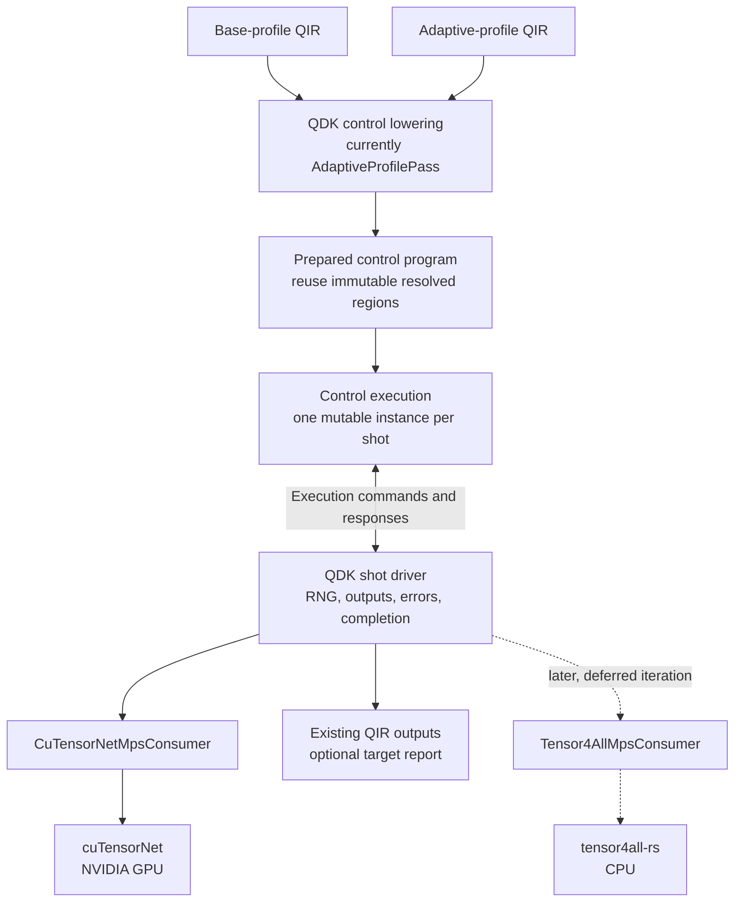

The temporary host selection for this iteration keeps the Simulation Method
stable and constrains the Device explicitly:

```python
run_qir(qir, type="mps", mps_options=MpsOptions(device="nvidia"))
```

`device="nvidia"` selects the cuTensorNet consumer and now performs real NVIDIA
execution. Omitting `device` takes the same path. Neither value is probed for
availability before the run, so an unavailable device surfaces as an `OSError`
raised by the run itself. `device="cpu"` resolving to tensor4all-rs is deferred
to the later follow-on iteration described below and is rejected without
fallback. Unknown devices are also rejected. Engine and Device remain distinct
internally. Automatic selection from host capabilities or Program Requirements
is future work.

This iteration established one path for target-neutral measurements,
QDK-owned outcome sampling, consumer failures, target reports, completion, and
cleanup, using the cuTensorNet consumer as the first real, non-placeholder
implementation. It is not forced through the eager `MpsEngine` trait.

### Deferred Follow-On: NVIDIA Availability Surface

`qdk_cutensornet::discover()` (`source/cutensornet/src/lib.rs:107`) is a
complete availability diagnostic that no Python caller can reach. It returns an
`AvailabilityReport` carrying both resolved library paths, the cuTensorNet
version, the CUDA runtime version that library was built against, and the
host's runtime and driver versions. Its error type is already a diagnostic
taxonomy of seven variants: `UnsupportedPlatform`, `InvalidOverride`,
`LibraryNotFound` with every attempted path, `LoadFailed`,
`MissingRequiredSymbol`, `UnsupportedVersion`, and `VersionProbeFailed`. It
performs no device selection, allocation, handle creation, or GPU work, so it
is safe to call as a pure probe, and the `QDK_CUTENSORNET_LIBRARY` and
`QDK_CUDART_LIBRARY` overrides are the remedy it implies.

Nothing in `source/qdk_package/src` references it. Four consumers therefore
answer "is NVIDIA usable here?" independently: the test probe in
`tests/test_cpu_simulator.py` runs a full circuit and catches `OSError` to
answer a question that needs no GPU work at all; row 1's availability probe is
unbuilt; the `run_qir` docstring defect recorded above is the discoverability
face of the same gap; and a user-facing diagnostic would be the fourth.

The decision is one exposed surface rather than four. Expose `discover()` once
as a narrow Python entry point returning the typed report or raising the typed
error. A user-facing diagnostic is then a presentation layer over it, row 1's
probe is one call to it, and the test probe collapses to that same call.
Whatever is built must call `discover()` and must never reimplement path
search, version rules, or the supported-platform test. A second copy of that
policy is exactly the duplication this separation exists to prevent.

Two constraints on its shape. It is a Python entry point rather than a separate
binary, because a diagnostic must be reachable where the failure is observed
and must not carry its own distribution story. And it is named for NVIDIA and
cuTensorNet, never borrowing the `gpu` vocabulary, which in this workspace
denotes wgpu.

This also fills a real gap. Iteration 1 specified porting
`verify-environment.sh` and the other VM provisioning scripts; they were not
ported, so this worktree has no environment verification tooling for the A100,
where library discovery is the most likely first failure. A minimal version is
therefore useful for bring-up and not only for users. It stays deferred behind
the demo evidence: the smallest valuable slice is the exposed surface alone,
with the presentation layer following separately.

### Deferred Follow-On: CPU tensor4all-rs Consumer

Building `Tensor4AllMpsConsumer` against tensor4all-rs (CPU) is explicitly
out of scope for the current iteration. It is a later, not-yet-scheduled
follow-on that reuses the same shared control execution, `RegionConsumer`
contract, and shot driver validated by the NVIDIA cuTensorNet work. It should
not be started until the cuTensorNet consumer is complete and a separate,
explicit go-ahead is given for the CPU consumer. `device="cpu"` resolving to
tensor4all-rs, and the tensor4all parity implementation itself, belong to that
later iteration, not this one.

### Deferred Follow-On: Contraction Path for Narrow Circuits

cuTensorNet exposes a contraction-based tensor network method alongside MPS
factorization, and the vendor names it as the supported route for state widths
that MPS cannot represent. This crate implements MPS only, so a circuit below
the two-qubit floor is refused rather than redirected, and the refusal message
deliberately points at `type="cpu"` instead of at contraction, because no
contraction selector exists to point at.

Adding one would be the principled remedy for narrow circuits, and it is the
only remedy that does not distort the state representation: the rejected
alternative was padding the chain with an idle ancilla, which is mathematically
exact but introduces an unenforced invariant between logical and physical width
across every site that consumes the extent vector. That invariant is easy to
violate silently — `sampled_qubits` is derived from `state_extents.len()`, so a
padded chain would report one extra bit rather than fail — and the failure mode
is a wrong answer instead of an error. Rejecting is smaller, louder and
reversible; padding is neither.

This stays deferred. It is a genuine roadmap item rather than a gap in the
current iteration, because the demo cases are wide and the narrow case is
already served correctly by the full-state path.

### Authority and Coordination

For this iteration, current executable code and tests define implemented
behavior, this README owns the local execution direction, and retained backend
evidence defines proven engine capabilities. `source/mps/DESIGN.md` is
historical and advisory, not a source of truth or required pre-read. It must not
block, widen, or override this iteration. Report missing decisions or conflicts
to the user instead of reconciling implementation back to that document.

#### Exploration Inputs

`tensor4all-mps-integration`, `cutensornet-rust-ffi`, `fire-and-ice-tn`, and
`~/Work/qir-mps-tensornetwork` are exploration and demonstration sources, not
production candidates or contracts. Their lessons and capability evidence are
extracted and reshaped into this design; their APIs, symbol names, and option
shapes are not imported verbatim. This includes the existing `MpsOptions` and
`run_qir_mps` surface in `tensor4all-mps-integration`.

The cuTensorNet noise spike and Fire and Ice tensor4all/QEC investigation run
in parallel. Their findings provide capability and contract feedback; they do
not independently change this integration scope. Never consume incidental
bytes from either agent's live dirty worktree.

The retained cuTensorNet B5 mechanism evidence is in the sibling evidence
repository:

```text
/home/domingom/Work/qdk-tensor-network-project/cutensornet/retained/
```

Relevant inputs are:

- `t3-adaptive-b5-gate1-20260827-a100/` for branch-mass, selected projection,
  capture, continuation, lifecycle, and failure evidence;
- `t3-b5-matched-performance-20260828-a100-evidence-r1.tar.gz`, SHA-256
  `000276865bc3ae94fe0144d7302c699dbecbc4fae372e984ebd060fa92f667cd`;
- `t3-b5-matched-performance-20260828-a100-evidence-r2.tar.gz`, SHA-256
  `f490d85e3bca2a86376f0404592570c8f2d418ceec3e166edfdc3e7c8ef0bee4`;
  and
- the nested sealed source snapshot
  `inputs/qdk-cutensornet-b5-matched-performance-20260828-r1.tar.gz`, SHA-256
  `2dcdd3c0bdbdef250254a3ad7cecccd33e7b4f350fdeb74fb5ba521bd5474601`.

The stable B5 branch-continuation source baseline is cuTensorNet worktree commit
`2f48bd2332d3c6143fedf38cd5913756284a5f4a`. The current cuTensorNet agent is
changing overlapping replay files for B6; integrate from a committed or sealed
input and reconcile later findings explicitly.

### Toolchain Boundary

QDK requires Rust 1.96 or later. The retained cuTensorNet mechanism was
qualified with Rust 1.95, so importing it requires explicit compatibility
validation rather than assuming that evidence transfers across toolchains:

1. compile, format, run focused tests, and run strict Clippy for the wrapper and
   adapter under Rust 1.96;
2. prove an ordinary CPU-only QDK build neither loads nor requires CUDA or
   cuTensorNet at build time or process startup;
3. run the same focused suite on Linux x86-64 with the qualified CUDA and
   cuTensorNet libraries; and
4. run both `device="cpu"` and `device="nvidia"` from identical Base QIR on the
   NVIDIA VM, retaining correctness, failure, cleanup, target, and wall-clock
   evidence.

Local results are not NVIDIA VM evidence. Record VM commands and elapsed time
explicitly. Do not begin Adaptive product integration, noise integration,
general-TN work, automatic target selection, or production API stabilization
as part of this iteration.

## Simulator Adoption

The shared abstractions allow backends to reuse control semantics without
requiring every backend to use the same state representation or execution
strategy.

| Simulator path      | Current execution                                                                                                                | Shared-executor path                                                                                                                                                                                                                    |
| ------------------- | -------------------------------------------------------------------------------------------------------------------------------- | --------------------------------------------------------------------------------------------------------------------------------------------------------------------------------------------------------------------------------------- |
| CPU full-state      | `AdaptiveProgram<u64>` interpreted by the legacy Rust runtime; implements `Simulator`.                                           | Use `ImmediateSimulatorConsumer` first. Replace it only if region preparation provides a measured benefit.                                                                                                                              |
| Clifford/stabilizer | Same legacy Adaptive runtime; implements `Simulator`.                                                                            | Use `ImmediateSimulatorConsumer`; preserve identical measurement, noise, and output behavior.                                                                                                                                           |
| Adaptive GPU        | `AdaptiveProgram<u32>` and control are interpreted inside WGSL.                                                                  | A persistent GPU region consumer is possible, but host synchronization at every region or measurement may regress performance. Compare that design with retaining device-side control while sharing preparation and protocol semantics. |
| MPS                 | `run_qir(type="mps")` uses shared execution through `CuTensorNetMpsConsumer` on NVIDIA cuTensorNet; Linux x86_64 only.           | Collect the A100 evidence, add the device-availability probe, and correct the docstring that still sends NVIDIA users to `type="gpu"`. A CPU tensor4all consumer remains deferred.                                                      |
| Sparse Q# evaluator | Executes the Q# evaluator graph through its own fallible backend and supports dynamic runtime services beyond Adaptive bytecode. | Keep the evaluator path unless a future normalization layer can preserve allocation, values, messages, dumps, custom intrinsics, and failure semantics. Region consumption may still be reusable below that control layer.              |

The generic driver performs target-neutral measurement through
`RegionConsumer`, returns ordered region reports and the final execution
report, and propagates control, consumer, and cleanup failures without assuming
an infallible target. A cleanup failure is retained alongside a preceding
control or consumer failure rather than replacing it.

Base-profile programs use a restricted linear control program through the same
target-neutral command protocol. Preparation should cache their fully resolved
static region definitions so sharing control execution does not repeat
bytecode decoding for every shot. Each shot still owns its control state and
quantum state, and each consumer still performs target-specific preparation at
the lifecycle boundary required by its engine. The consumer remains independent
of the control-plan representation.

## Adaptive Bytecode Ownership

The Adaptive bytecode encoding is currently a cross-language contract without
a single enforced owner.

```text
                         Adaptive bytecode contract
                         /          |             \
                        v           v              v
              Python emitter   Rust interpreters   WGSL interpreter
```

The duplicated surfaces currently include:

- `OP_*` primary instruction opcodes and `FLAG_*` operand-mode bits in the
  Python emitter, legacy Rust runtime, `adaptive.rs`, and WGSL interpreter;
- quantum operation identifiers in Rust `shader_types::OpID`, `unitary.rs`,
  Python `GATE_MAP`, and WGSL `OPID_*` constants;
- instruction and table layout assumptions shared by Python serialization,
  Rust `bytecode.rs`, GPU buffer layouts, and WGSL structures.

Comments saying that files "must stay in sync" are not sufficient. They are a
temporary warning until the following work is completed.

### Proposed Single-Source Plan

1. Define one repository-owned, declarative format manifest containing opcode
   values, flag bit positions, operation IDs, field meanings, table layouts,
   supported word widths, and reserved ranges.
2. Generate typed Rust definitions, Python constants, and WGSL constants from
   that manifest. Generated source may be checked in when package builds need
   to consume it independently.
3. Move the Rust operation-ID owner out of the GPU-specific module. Both GPU
   shader types and shared execution decoding should depend on the shared type.
4. Keep QIR-name aliases such as `cnot` and `cx` in the Python lowering layer,
   but map them to generated operation-ID constants rather than numeric values.
5. Add a `--check` generation mode to CI so handwritten or generated copies
   cannot drift. Include layout-size/alignment tests and complete value-parity
   tests for Rust, Python, and WGSL representations.
6. Migrate one constant family at a time: instruction encoding, operation IDs,
   then serialized table layouts. Preserve compatibility fixtures for both
   32-bit GPU and 64-bit CPU bytecode during the migration.

The manifest should describe the wire format, not execution policy. Region
partitioning, simulator capabilities, noise behavior, and host/device control
placement remain owned by their respective execution layers.

## Known Defects

Open defects, as distinct from the accepted limits below.

### Sampler seed configuration writes one attribute twice

`configure_sampler_path_seed` and `configure_sampler_sample_seed` both write
`CUTENSORNET_SAMPLER_CONFIG_DETERMINISTIC` on the same sampler handle. The first
runs before `cutensornetSamplerPrepare` and the second immediately before
`cutensornetSamplerSample`, so the later write always wins and the pathfinding
seed is silently discarded.

The attribute is documented as seeding the pseudo-random generator that advances
on sample calls. It is the sampling PRNG and nothing else, so there is no
sampler pathfinding seed for this function to set. The function does not merely
lose a race, it encodes an interface that does not exist, which is why the
resolution is removal rather than reordering. Pathfinding determinism, if it is
reachable at all, belongs to contraction optimizer configuration and must not be
obtained by setting process-global environment variables.

Retained A100 evidence that reports a fixed pathfinding seed alongside a fixed
sample seed remains valid, because reproducibility was genuinely observed. Only
its explanation changes: one seed was in effect, not two.

Existing coverage asserts the exact call sequence, including the discarded
write, so it enshrines the defect rather than detecting it. The fake records
call events and cannot observe that two writes collide on one key. Replacement
coverage should model sampler attribute state so a second write to an already
written attribute fails, which closes the class rather than this instance.

The defect is present in both the integration and qualification trees, in
different files, because the native implementation moved during the port. A fix
on one tree will not cherry-pick onto the other, and independent edits are
cheaper than coordinating a port, provided the resulting trait signature is
identical in both. Diverging here would reintroduce exactly the backend API
drift this layer exists to prevent.

Resolution is removal. The public surface exposes no function that attaches a
contraction optimizer configuration, optimizer information, or an explicit
contraction path to either the state or the sampler. Optimizer configuration
applies to network descriptors alone, so a pathfinding seed cannot be set on
this path at all, and the only remaining route would be the process-global
environment variables this integration rejects. Reproducibility is therefore
documented as covering the sampling generator within a process, and the
pathfinding seed is deleted rather than reimplemented.

Effort is 45 minutes to one hour for the removal across both trees, not the
15 minutes a single-tree deletion would suggest: the change touches 16 sites in
the integration tree and 19 in the qualification tree, and the ordered-sequence
assertion must be rewritten rather than shortened.

### Host fakes cannot observe vendor preconditions

Every `mps_execution` test runs against a `MpsExecutionApi` fake that records call events and
returns success for any sequence. The fake encodes our model of the library, so
the suite confirms that model rather than the library, and it cannot fail on a
call the real implementation would refuse.

This produced a test asserting the opposite of the vendor contract.
`single_qubit_target_has_one_physical_extent_and_no_bond` asserted that a
single-site target is valid, while `cutensornetStateFinalizeMPS` rejects a state
of one mode outright. The assertion was a host-side claim about a vendor-side
property it had no way to observe, and it passed for exactly that reason. It
survived because the crate has no live-GPU Rust test at all, and because the
one-qubit path was unreachable until QDK integration first supplied a one-qubit
fixture, at which point it failed immediately on real hardware.

Correcting that one assertion closes the instance, not the class. Closing the
class means encoding documented vendor preconditions in the fake, so that a call
the library would refuse also fails under test. The same exposure applies to any
future CPU consumer built the same way: a fake that always succeeds will
certify a target the backend will not accept.

## Current Constraints

- Public `type="mps"` execution is restricted to noiseless Base-profile QIR and
  requires NVIDIA cuTensorNet. It accepts omitted `device` or `device="nvidia"`
  and both take the same path; neither is probed before execution, so an
  unavailable device surfaces as an `OSError` raised by the run itself.
  Unsupported devices fail without fallback.
- Public `type="mps"` execution requires at least two qubits.
  `cutensornetStateFinalizeMPS` does not support a state of one mode, as
  documented in the vendor header carried at `bindings/v2_13.rs`, and a chain of
  one site has no bond to factorize. `MpsTarget::new` rejects `qubit_count < 2`
  before any state-creating call. This is a vendor floor rather than a QDK
  policy and should not be expected to lift upstream.
- Platform availability is reported ahead of circuit shape. `discover()` and
  `MpsSession::new` run before any target is constructed, so on a host without
  cuTensorNet an unsupported-platform error surfaces even for a circuit that
  would also be refused on width. The ordering is deliberate, since the platform
  error is the actionable one there, but it means width rejection is observable
  only on a supported host and its coverage must be gated on NVIDIA
  availability rather than run everywhere.
- Public `type="mps"` execution runs at `ExecutionPolicy::base_qualification()`
  — `bond_cap` 128, absolute cutoff 1e-10 — so a qualification policy is
  currently serving as the production default. Circuits whose Schmidt rank
  exceeds the cap are truncated silently: no error is raised and no discarded
  weight is reported. This is sound for the retained demo cases, whose achieved
  bond is 12, but it is not a considered production default and must be
  revisited before the route is documented for general use.
- The public MPS route rejects shared-control opcodes `OP_PEEK_LOSS` (`0x16`)
  and `OP_READOUT_NOISE` (`0x17`) explicitly.
- The shared layer prepares generically over `Word` but currently executes only
  at `u64` (`AdaptiveExecution`, `drive_prepared_shot`, `run_prepared_shot`);
  generalising the driver over `Word` is deferred to the consumer iteration.
  Region consumers are word-agnostic by design — they receive
  `QuantumEvolutionRegion`s and never see bytecode — so the legacy GPU path's
  `Bytecode.Bit32` convention, which exists because that path executes bytecode
  on-device, does not apply to backend routes here.
- Shared execution detects output-recording instructions once during
  preparation. Without them, completion returns every result-register slot in
  index order, preserving default `Zero` values for unmeasured slots and
  `Loss` values returned by a consumer.
- Region preparation currently recognizes only the supported unitary operation
  subset.
- Adaptive control currently handles the bytecode instructions exercised by
  the shared execution tests; the legacy runtime remains the complete oracle.
- The protocol is synchronous and one-shot. Batching, asynchronous targets,
  and same-prefix replay require explicit designs rather than hidden consumer
  behavior.
- Existing backend entry points and result shapes must remain stable while a
  backend migrates to shared execution.
