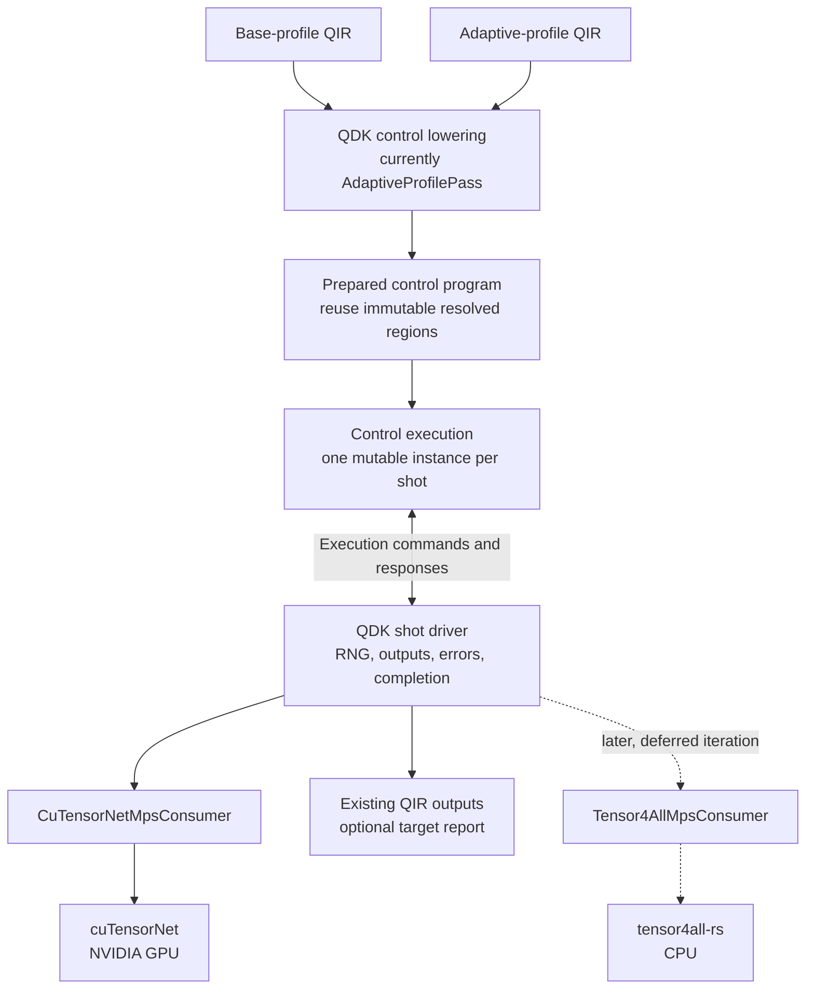

# Shared Simulator Execution

This directory separates Adaptive control from target-specific quantum-state
evolution. The public API remains available through `qdk_simulators::execution`;
`execution.rs` is the facade and the files here own the implementation.

## Module Responsibilities

| File           | Responsibility                                                                                               |
| -------------- | ------------------------------------------------------------------------------------------------------------ |
| `adaptive.rs`  | Prepares Adaptive bytecode, identifies unitary regions, interprets classical control, and produces commands. |
| `protocol.rs`  | Defines the commands and responses exchanged between Adaptive control and an execution target.               |
| `region.rs`    | Defines target-neutral quantum evolution regions and the consumer lifecycle.                                 |
| `unitary.rs`   | Defines resolved unitary operations and the legacy `Simulator` application bridge.                           |
| `immediate.rs` | Provides the generic synchronous shot driver and adapts the legacy `Simulator` trait.                        |

The source-level dependency direction is:

```text
Adaptive bytecode
      |
      v
 adaptive.rs -------> protocol.rs
      |                    |
      |                    v
      +--------------> region.rs
                           |
                           v
                       unitary.rs
                           |
                           v
                     target adapter
```

The bytecode is a control-plan representation. A target adapter does not
interpret bytecode or select branches. It receives only reached regions and
host-visible requests.

## Glossary

- **Engine**: the computational method that evolves quantum state, such as
  tensor4all, cuTensorNet, or a full-state simulator.
- **Device**: the host target on which an engine runs, currently `cpu` or
  `nvidia` in the planned MPS route.
- **Simulation Method**: the QDK-facing `type=` selector, such as `"mps"`.
- **Target**: the concrete Engine and Device pairing selected for dispatch.

The `MpsOptions(device=...)` examples in
[Next Integration Iteration](#next-integration-iteration) show how the
Simulation Method remains stable while Device selects a Target.

## Infrastructure Sharing vs. Profile Semantics

Sharing `PreparedAdaptiveProgram` and `AdaptiveExecution` across Base and
Adaptive QIR simplifies the implementation; it does not merge their QIR-level
contracts. Base Profile's no-branching, statically resolvable guarantee is
enforced independently by QIR validation, regardless of which Engine executes
the program.

`QuantumEvolutionRegion` enables that sharing without a profile-specific
execution mode. Base Profile is the one-region restriction of the same general
structure rather than a separate control implementation. The candidate
single-region, no-branch fast path recognizes a Base-shaped program internally;
it does not relax or change either profile's specification-level meaning or
validation.

## Execution Flow

`PreparedAdaptiveProgram` retains the original bytecode control tables and
caches deterministic region locations once. Each `AdaptiveExecution` owns the
mutable state for one shot: its instruction position, registers, measurement
results, ordered output records, and command/response protocol state.

```text
Python AdaptiveProfilePass
           |
           v
   AdaptiveProgram<Word>
           |
           v  prepare once per request
 PreparedAdaptiveProgram
           |
           +-----------------------+
           |                       | one per shot
           v                       v
   AdaptiveExecution         AdaptiveExecution ...
           |
           | AdaptiveCommand
           v
      shot driver
           |
           v
      target adapter --------> continuing target state
           |
           | AdaptiveResponse
           +------------------> AdaptiveExecution
```

The command/response protocol is deliberately small:

```text
AdaptiveExecution::new
           |
           v
         Ready
           |
           +-- ExecuteRegion ---------> AwaitingRegionCompletion
           |                                      |
           |<---------- RegionComplete -----------+
           |
           +-- Measure --------------> AwaitingMeasurementResult
           |                                      |
           |<-------- Measurement(result) --------+
           |
           +-- Complete(records) -----> Complete
```

A `QuantumEvolutionRegion` is uninterrupted target-local state evolution
between host-visible semantic boundaries. The current payload contains only
resolved unitary operations. Measurements, stochastic decisions, queries,
ordered output, and classical branch selection remain outside a region.

`drive_prepared_shot` provides synchronous orchestration for any
`RegionConsumer`. `run_prepared_shot` retains the existing simulator-facing
signature as a thin `ImmediateSimulatorConsumer` compatibility wrapper:

```text
driver             AdaptiveExecution          RegionConsumer                 target
   |                        |                         |                           |
   |-- next_command ------->|                         |                           |
   |<-- ExecuteRegion ------|                         |                           |
   |-- prepare/execute ------------------------------>|                           |
   |                        |                         |-- apply operation -------->|
   |                        |                         |<-- operation complete -----|
   |                        |                         |-- apply operation ... ---->|
   |                        |                         |<-- operation complete -----|
   |<-- region report --------------------------------|                           |
   |-- RegionComplete ----->|                         |                           |
   |<-- Measure ------------|                         |                           |
   |-- measure(request) ----------------------------->|                           |
   |                        |                         |-- mz or mresetz ---------->|
   |                        |                         |<-- measurement complete ---|
   |                        |                         |-- read result ------------>|
   |                        |                         |<-- MeasurementResult ------|
   |<-- MeasurementResult ----------------------------|                           |
   |-- Measurement(result) ->|                        |                           |
   |<-- Complete(records) --|                         |                           |
   |-- finish/close --------------------------------->|                           |
```

`RegionConsumer` is the driver's only interface for region execution; the
underlying legacy `Simulator` (`FullStateSimulator` or `StabilizerSimulator`)
never receives a region and has no concept of one. The
`ImmediateSimulatorConsumer::execute_region` implementation re-decomposes each
region into ordinary one-gate-at-a-time `Simulator` calls through
`apply_unitary_immediately` in `unitary.rs`, eagerly discarding the batching
opportunity. Region grouping is therefore a structural no-op for CPU and
Clifford, making parity with the legacy oracle direct. Planned
`Tensor4AllMpsConsumer` and `CuTensorNetMpsConsumer` implementations will instead
consume whole regions and replace that per-operation loop with one batched
tensor-network contraction; no current consumer exercises that purpose yet.

The immediate path is currently a compatibility implementation and parity
oracle. The legacy `bytecode::runtime::run_shot` remains the production CPU and
Clifford execution path until migration is explicitly validated.

An internal, experimental Python/native route now proves that representative
Base-profile QIR can be lowered by `AdaptiveProfilePass`, prepared once as a
`PreparedAdaptiveProgram`, and executed per shot by `run_prepared_shot` with an
`ImmediateSimulatorConsumer`. The deterministic two-qubit proof program
partitions its unitary prefix into exactly one `QuantumEvolutionRegion` and
matches the existing Base CPU output across multiple shots. This route is not a
documented API or production dispatch path and does not add backend or noise
support.

The public `run_qir(type="mps", mps_options=MpsOptions(...))` contract now
routes noiseless Base-profile QIR through the same lowering and preparation,
then through a separately named native entry point into cuTensorNet.
Preparation is shared per request: the region is converted once, the state is
evolved once, and every shot is drawn from a single batch sample. Control
state and per-shot record reconstruction stay fresh per shot, driven by
`drive_prepared_shot` exactly as the full-state route drives it. The route
requires NVIDIA hardware and CUDA, is compiled only for Linux x86_64, and
returns a discovery error elsewhere. The private probe remains available as a
separate diagnostic route.

## A Walk Through `run_qir` MPS

This traces one noiseless Base-profile request from the public API down to the
cuTensorNet Engine and back, one row per functional block. It uses the
[Glossary](#glossary) terms: Simulation Method is the `type=` selector, Device
is the host target, Engine is the computational method that evolves quantum
state, and Target is the selected pairing.

Base Profile guarantees a single `QuantumEvolutionRegion`, so all state
evolution precedes all measurement. That is the precondition that allows the
state to be prepared once and every shot to be drawn in one Engine call. Rows
12-17 convert that sample buffer into ordinary output records through the
existing per-shot control path, so the result contract is identical to
`type="cpu"`.

The rightmost column names the objective currently being tracked and records
each block's readiness against it. When that objective is met the column is
renamed to the next one and the readiness values are reassessed, so the table
stays a live plan rather than an accumulating history.

Note one terminology hazard throughout this walk. In the QDK, `type="gpu"` and
every `gpu` identifier refer to the wgpu full-state simulator, which runs on any
compatible adapter and requires no NVIDIA hardware. The path described here is
reached through `type="mps"` and needs CUDA and cuTensorNet. The two are
independent, so this walk names NVIDIA hardware explicitly and never borrows the
existing `gpu` vocabulary for it.

DEFECT: the `run_qir` docstring still tells a user who has NVIDIA hardware to
select `type="gpu"`, which reaches wgpu rather than cuTensorNet. That guidance
was accurate only while `type="mps"` was a placeholder. Since the MPS path
began performing real NVIDIA execution the docstring actively misdirects
exactly the users the cuTensorNet route exists to serve, so this is a
user-facing defect rather than deferred work. The public documentation and the
option surface must make the distinction discoverable without reading source.
The mechanism is undecided and is recorded here so that it is not decided by
default.

| #   | Block                                                                                                                                                         | Input                                                           | Output                                                | Demo                                                                 | Effort | Comment                                                                                                                                                                                                                                                                                                       |
| --- | ------------------------------------------------------------------------------------------------------------------------------------------------------------- | --------------------------------------------------------------- | ----------------------------------------------------- | -------------------------------------------------------------------- | ------ | ------------------------------------------------------------------------------------------------------------------------------------------------------------------------------------------------------------------------------------------------------------------------------------------------------------- |
| 1   | [`run_qir`](../../../qdk_package/qdk/simulation/_simulation.py) Simulation Method dispatch                                                                    | QIR source, `type="mps"`, `MpsOptions(device=...)`, shots, seed | Target selection; call to the MPS entry point         | Partial: NVIDIA hardware-test split done; availability probe missing | TBD    | The three NVIDIA acceptance tests use a separate `QDK_NVIDIA_TESTS` opt-in and an `OSError` execution probe; the public availability probe and `device=None` semantics remain deferred                                                                                                                        |
| 2   | [`preprocess_simulation_input`, `_validate_base_profile`, `DecomposeCcxPass`](../../../qdk_package/qdk/simulation/_simulation.py)                             | QIR source                                                      | Validated Base Profile module                         | Done                                                                 | --     | Shared with every other Simulation Method; nothing target-specific. `DecomposeCcxPass` runs here, which is why `Ccx` never reaches the row 9 converter                                                                                                                                                        |
| 3   | `AdaptiveProfilePass(Bytecode.Bit64)`                                                                                                                         | Base Profile module                                             | Adaptive bytecode (`AdaptiveProgram<Word>`)           | Done                                                                 | --     | The same lowering pass production Adaptive QIR already uses                                                                                                                                                                                                                                                   |
| 4   | [Native entry point](../../../qdk_package/src/qir_simulation/cpu_simulators.rs)                                                                               | Bytecode dict, shots, seed                                      | `AdaptiveProgram<u64>`                                | Done                                                                 | --     | The existing native signature is unchanged; program errors remain `ValueError` and discovery/device errors surface as `OSError`                                                                                                                                                                               |
| 5   | [`PreparedAdaptiveProgram::new`](adaptive.rs)                                                                                                                 | `AdaptiveProgram<u64>`                                          | Prepared program with region sites resolved once      | Done                                                                 | --     | Shared with the Base-profile probe; unchanged                                                                                                                                                                                                                                                                 |
| 6   | [`measured_qubits()`](adaptive.rs)                                                                                                                            | Prepared program                                                | Ordered measured qubits with `result_id` mapping      | Done                                                                 | --     | Computed during the existing region walk through the decoder shared with runtime execution                                                                                                                                                                                                                    |
| 7   | [MPS shot loop `run_mps_shots`](../../../cutensornet/src/execution.rs)                                                                                        | Prepared program, shots, seed                                   | `Vec<Vec<OutputRecord>>`; owns the session lifetime   | Done                                                                 | --     | Converts the single region before discovery, then owns one session, one state evolution, one batch sample, and sequential per-shot replay                                                                                                                                                                     |
| 8   | Target adapter `CuTensorNetMpsConsumer`                                                                                                                       | The single `QuantumEvolutionRegion`, sample matrix, shot index  | Measurement bits from the precomputed sample row      | Done                                                                 | --     | Crate-private per-shot view with no-op region and close methods, guarded against multiple regions and feedforward                                                                                                                                                                                             |
| 9   | [`Gate::from_unitary_operation`](../../../cutensornet/src/library/simulation/circuit.rs)                                                                      | `UnitaryOperation`                                              | `Gate`, no gate for `I`, or a typed unsupported error | Done                                                                 | --     | Landed in `11a651339`; exhaustive over all unitary variants with no catch-all, and its four tests run on any host since `f262a60ae`. `CircuitPreparationConsumer` collects the region's gates by driving row 14 once at preparation time, so that driver serves both circuit construction and per-shot replay |
| 10  | [`SessionApi`](../../../cutensornet/src/library/simulation/session.rs) / [`ReplayApi`](../../../cutensornet/src/library/simulation/replay.rs) via `NativeApi` | `Circuit` and `ExecutionPolicy`                                 | Evolved MPS state on the Device                       | Done                                                                 | --     | Ported `SamplerApi`, `PreparedSampler`, session/replay sampling, and cross-platform FakeApi coverage from `eed6e1bbe`; pure logic remains ungated while the native adapter stays with the existing native implementations to preserve loader encapsulation                                                    |
| 11  | cuTensorNet Sampler Engine APIs                                                                                                                               | State handle, measured modes, shot count, derived seed          | Flat `int64` array indexed `[shot * n_measured + j]`  | Done                                                                 | --     | Ported the five generated bindings and required symbols from `eed6e1bbe`; the frozen surface is 30 symbols                                                                                                                                                                                                    |
| 12  | [Sample narrowing](../../../cutensornet/src/library/simulation/consumer.rs)                                                                                   | Flat `int64` buffer                                             | `u8` buffer plus the qubit-to-column map              | Done                                                                 | --     | Uses `u8::try_from` once over the owned buffer and reports the original `i64` plus flat index; the sample matrix remains the sole owner of column indexing                                                                                                                                                    |
| 13  | [`AdaptiveExecution`](adaptive.rs)                                                                                                                            | Prepared program and one buffer row                             | Ordered `OutputRecord`s for that shot                 | Done                                                                 | --     | Unchanged; already accumulates the output records during the walk                                                                                                                                                                                                                                             |
| 14  | [`drive_prepared_shot`](immediate.rs)                                                                                                                         | Prepared program and a per-shot `RegionConsumer`                | `ShotExecutionOutput`                                 | Done                                                                 | --     | Unchanged; `close()` fires per shot, which is why the consumer must be a view                                                                                                                                                                                                                                 |
| 15  | [Shot loop collection](../../../cutensornet/src/execution.rs)                                                                                                 | One `Vec<OutputRecord>` per shot                                | `Vec<Vec<OutputRecord>>`; session closed once         | Done                                                                 | --     | Collects the sequential per-shot views after batch sampling and closes the session exactly once                                                                                                                                                                                                               |
| 16  | [`output_records_to_pylist`](../../../qdk_package/src/qir_simulation/cpu_simulators.rs)                                                                       | `Vec<Vec<OutputRecord>>`                                        | Python list                                           | Done                                                                 | --     | Unchanged; already target-neutral                                                                                                                                                                                                                                                                             |
| 17  | [`run_qir`](../../../qdk_package/qdk/simulation/_simulation.py) return                                                                                        | Python list                                                     | Same records, ordering, and errors as `type="cpu"`    | Done                                                                 | --     | Unchanged; `OutputRecordingPass` shapes the returned records                                                                                                                                                                                                                                                  |

Effort is a rough estimate for one implementer already familiar with the code.
It excludes review, A100 validation, and the demonstration circuit. Order A
closes the execution blocks in rows 4, 7, 12, and 15 plus the NVIDIA hardware
test split in row 1. The public availability probe and `device=None` semantics
remain; their original estimate was bundled with the now-complete test split,
so this walk does not assign a replacement estimate by subtraction.

Rows 10 and 11 were ported from committed source `eed6e1bbe`, which carries the
symbol allowlist, five Sampler bindings, `SamplerApi`, and `PreparedSampler`
together and was qualified on an A100 in `cutensornet-rust-ffi`. This port
extends the `simulation.rs` split established in `f262a60ae`: pure sampler
logic and FakeApi tests compile on every host, while native bindings remain
`linux + x86_64`-gated. The native `SamplerApi` implementation lives beside
the existing native replay adapter so the dynamic-loader fields remain
private.

Three constraints hold this together and are easy to violate silently.

The Target adapter receives only reached regions and host-visible requests. It
does not interpret bytecode, select branches, or assemble output records. Rows
13 and 14 own that conversion, which is why the sample buffer needs no
reshaping beyond narrowing.

`RegionConsumer::close` is invoked at the end of every shot, so the per-shot
consumer must not own the session. Row 7 owns it; the per-shot consumer is a
view over one row of the buffer whose region and close operations are no-ops.

Sampling every shot at once is valid only for a single-region program. A
Base-profile program that measures mid-circuit and then continues evolving
partitions into more than one region, and must be rejected with a typed error
naming the region count rather than silently sampled. Lifting that restriction
requires incremental measurement, where each `Measure` draws from a conditional
marginal and collapses the state, which is also what Adaptive Profile
feedforward will require.

## Demo and Validation Cases

These cases are downstream of the walkthrough table. They are what we run once
`run_qir(type="mps")` works, not work items that make it work, so they are not
rows and carry no effort estimate.

Both demonstrations rest on one property. For a fixed-depth, nearest-neighbor
circuit the exact MPS bond is bounded by depth and does not grow with width.
Width is cheap and depth is the cost, so every case fixes depth and varies
width.

### Certification rule

A bond strictly below the requested cap is necessary but **not** sufficient.
The cap test detects only cap-induced truncation. Truncation also occurs
whenever the SVD cutoffs discard Schmidt values, and that discarding is
invisible to a cap comparison: a run can report a bond far below its cap while
having truncated at every site.

Achieved bond is a policy artifact, not a correctness statement. Measured
2026-09-03 on an NVIDIA A100 80GB PCIe, the depth-8 domain-wall Trotter circuit
holds bond exactly 12 at widths 128, 256, 512, and 1024 under
`ExecutionPolicy::base_qualification` (absolute cutoff 1e-10), while tightening
the cutoff to 1e-16 at width 128 raises the bond to 26. The retained POC
measurement of the same circuit reported bond 19 and agrees on the observable
to twelve significant figures. Bond tracks cutoff policy and circuit depth; it
does not track width, and it does not by itself certify anything.

The certificate is the state norm. Report `1 - squared_norm`, the discarded
weight, alongside the achieved bond and the requested cap. Both the bond and
the norm must be read back from the engine and retained with every
measurement, which is why that readback gates these cases.
`CUTENSORNET_STATE_CONFIG_MPS_SVD_S_NORMALIZATION` must remain unset, because
enabling it renormalizes the state and destroys the only evidence we have that
truncation occurred.

Two properties of that certificate must be understood before reading it.

**The noise floor scales with width.** Untruncated runs do not report a norm of
exactly one. Floating-point error accumulates across the contraction, and the
deviation is proportional to the number of sites at roughly `1.6e-15` per
qubit:

| Width | Steps | Bond | `squared_norm - 1` |
| ----- | ----- | ---- | ------------------ |
| 128   | 8     | 12   | +1.99e-13          |
| 256   | 8     | 12   | +3.97e-13          |
| 512   | 8     | 12   | +8.31e-13          |
| 1024  | 8     | 12   | +1.84e-12          |

A single fixed tolerance is therefore the wrong test. Compare the discarded
weight against a width-scaled floor, not against a constant.

**The sign discriminates.** Discarded weight is a sum of squared Schmidt values
and cannot be negative, so a negative reading means the measurement sits below
its own noise floor. Accumulated floating-point error drifts the norm upward
and yields negative discarded weight; genuine truncation removes weight, drives
the norm down, and yields positive discarded weight. Every untruncated run
above is negative. The two runs that reached high bond under a 2048 cap are
positive: depth 32 at bond 447 reports `+2.52e-13`, and depth 44 at the 2048
cap reports `+6.56e-13`, the largest magnitude measured at width 128.

The corollary is a resolution limit. Truncation smaller than the width-scaled
floor cannot be detected by this certificate at all, which near width 1024
means anything below roughly `2e-12`. A run whose discarded weight is negative
has not been shown to be exact; it has been shown to be indistinguishable from
exact at the precision available.

### NVIDIA cuTensorNet case

Two operating points, because they answer different questions. Bond tracks depth
alone, so width is free and depth is the cost: depth 8 gives bond 19, depth 16
gives 62, depth 32 gives 618, and depth 44 saturates a 1024 cap. Depths at or
above 44 are unusable for demonstration because they are always truncated.
Those bonds are the POC's, measured under its cutoff. Ours are lower under
`base_qualification`, so read them as the shape of the growth rather than as
values to reproduce.

Both points use Trotter, gauge simple, SVD algorithm `GESVD`.

#### Point A, depth 8: oracle and width ladder

Cap 128. Achieved bond 12 at widths 128, 256, 512, and 1024 under
`base_qualification`, measured 2026-09-03 on A100; the POC recorded 19 for the
same circuit under a tighter cutoff. Width-independence was expected from the
POC, which held bond 19 across widths 12 through 64. It is now confirmed on our
policy across a further four doublings: the bond is exactly 12 at every width
measured, and the discarded weight has been retained for all of them. Below-cap
remains necessary but not sufficient for exactness — see the certification
rule.

| Width | Reference seconds |   Expectation | A100 sampling seconds |
| ----: | ----------------: | ------------: | --------------------: |
|   128 |              6.91 |  62.743030735 |                  3.92 |
|   256 |             18.35 | 127.195622825 |                  8.16 |
|   512 |             62.75 | 256.100807003 |                 16.62 |
|  1024 |            197.28 | 513.911175361 |                 33.51 |

The last column is one `sample` call and is the only cost the `run_qir` path
pays. It doubles as the width doubles, which is the linear scaling MPS predicts
at fixed bond. It is not comparable to the reference column, which covers the
POC's full run including its expectation computation; our equivalent of that
work is the separate query described below.

The expectation is exactly extensive in width:

```
E(n) = 0.503535876 * n - 1.709561354
```

Fitted from two small widths, this reproduces every retained point from 12 to
1024 qubits to within 1e-9, which is floating-point noise. It is a property of
the workload rather than of any simulator, so it is an oracle no implementation
can contaminate, and it is the only practical correctness check at widths where
no reference simulator can run. It confirms extensivity but not the absolute
constant, because a wrong yet still extensive implementation would also be
linear. Pin the constant at a width the CPU full-state path can reach, then let
the linear law carry that validation outward.

#### Point B, depth 32: the capability claim

Width alone does not justify the accelerator. The CPU case below reaches 1024
qubits unaided, so a depth-8 width ladder would restate on an A100 a result the
CPU already owns. What the CPU cannot enter is the high-bond regime, because
per-gate cost grows with the cube of the bond. Against the CPU case at bond 8,
bond 618 is roughly `(618/8)^3`, about five hundred thousand times the per-gate
work.

Cap 1024, achieved bond 618 in the POC's retained rows. Measured 2026-09-03 on
A100 under `base_qualification`'s looser cutoff with the cap raised to 2048,
depth 32 at width 128 achieved bond 447 — lower than the POC's 618, by the same
mechanism that produced 12 rather than 19 at depth 8. Depth 16 achieved bond
46, and depth 44 saturated the 2048 cap outright. Below-cap does not by itself
certify exactness; see the certification rule.

| Depth | Bond | Sampling seconds | Discarded weight |
| ----: | ---: | ---------------: | ---------------: |
|    16 |   46 |            13.48 |        -4.30e-13 |
|    32 |  447 |           135.69 |        +2.52e-13 |
|    44 | 2048 |          1541.19 |        +6.56e-13 |

Depth 44 is the first measurement in which truncation was genuinely active, and
its discarded weight turned positive accordingly. Cost is driven by bond rather
than by depth: 16 to 32 doubles the depth but multiplies the bond by ten and the
time by ten. Extrapolating a power law across that regime change underestimates
badly, so depth timings must be measured rather than projected.

**This case cannot run through `run_qir` as it stands.** That path hardcodes
`base_qualification`, whose cap is 128, and `MpsOptions` exposes no override.
A depth-32 run would truncate at bond 128 and return plausible but wrong
results with no diagnostic, because the achieved bond would sit at the cap and
the discarded weight is not surfaced to the caller. Point B is reachable only
through the Rust harness until the cap becomes configurable.

| Width | Reference seconds |
| ----: | ----------------: |
|    32 |             31.13 |
|    64 |             90.47 |
|   128 |            215.82 |

Depth 32 is the deepest retained point that stays below its cap, which makes it
the only depth that is simultaneously beyond CPU reach and still certifiable.
That is what makes it the capability claim rather than depth 44.

Headroom here is thin and must be measured rather than assumed. Bond 618 against
a 1024 cap is a factor of 1.65, and these rows come from a different stack, so a
modestly higher bond on this path would cap and forfeit the certification. Run
this point at cap 2048 so the achieved bond is observed with room to spare, and
retain it even when it lands at 618 again.

#### Reference seconds

The reference seconds above are indicators and acceptance targets, not
qualification evidence: they were produced by the CUDA-Q Python stack, which
configures itself through process-global environment variables that this
integration rejects. Binding the C API directly, with no Python layer, should
meet or beat them. Landing materially slower is a defect signal rather than a
measurement.

### CPU tensor4all case

Fixed-depth three-layer nearest-neighbor TFIM QAOA, exact C64, bond 8, one
tensor thread, 12 GiB address-space cap, on a WSL2 aarch64 host.

| Width | Wall time |      Peak RSS |
| ----: | --------: | ------------: |
|    64 |    2.97 s |   132,016 KiB |
|   128 |   11.30 s |   147,640 KiB |
|   256 |   44.57 s |   275,760 KiB |
|   512 |  195.13 s |   777,084 KiB |
|  1024 |  820.98 s | 2,757,252 KiB |

Raising that demo to two threads made it worse rather than better, because the
pinned provider serializes important tensor paths through process-global locks.
At that revision thread count is configured by a process-global environment
variable and a typed per-run option is unsupported. The same class of defect
appears in both backends, which argues for a typed resource option on the shared
MPS surface rather than a fix in either backend.

### QDK baselines

The claim these cases support is that the circuit is out of reach for every
current QDK simulator, and each path fails for a different reason.

- Dense full-state costs `2^n * 16` bytes, since amplitudes are `Complex<f64>`.
  That is 4 GiB at 28 qubits and 16 TiB at 40.
- Sparse is measured dead earlier than dense, not later. It stores roughly 160
  bytes per amplitude, about ten times dense, so 26 qubits already costs 54.52 s
  and 11.3 GB, and 28 qubits is refused outright at a 42.9 GB estimate.
- Clifford cannot express the circuit at all, being excluded by gate set rather
  than by size.

Sparse is reachable through Q# even though `run_qir` does not offer it, so it
belongs in the comparison.

### Scaling observation

At fixed depth and fixed bond the cost of MPS should be linear in width, since
each site takes a constant number of gates costing `O(bond^3)`. The retained
points do not show that. Fitting the tables above gives `O(n^2.03)` for the CPU
path and `O(n^1.61)` for cuTensorNet, leaving roughly seventeen-fold and
threefold headroom at 1024 qubits against the linear ideal. Absolute times are
not comparable across those rows, since the hosts, bonds and circuits differ,
but the exponent is a property of the implementation rather than the host. The
signature is consistent with canonicalizing the whole chain per gate or per
layer instead of moving an orthogonality center locally. This is an observation
to confirm against achieved-bond data, not yet a diagnosis.

### Provenance

Reference measurements and workload definitions come from the earlier
`QDK-QIR-TensorNetwork-POC-package` campaign, under `campaign/gpu-evidence.csv`,
`campaign/cpu-envelope/envelope.csv`, `campaign/chi-scaling/`, and
`qdk_probe_results.csv`. The CPU case is retained in the tensor4all worktree
under `samples/python_interop/mps_qaoa_demo/`.

## Next Integration Iteration

This iteration is code-complete: noiseless Base-profile QIR runs end to end
through the established public path and a real NVIDIA cuTensorNet MPS consumer,
replacing the full-state placeholder at the consumer boundary. Near-term scope
is NVIDIA cuTensorNet integration only. A CPU tensor4all-rs consumer
(`Tensor4AllMpsConsumer`) is a later, not-yet-scheduled follow-on iteration; it
is deferred and out of scope for the current work, though the shared
control/driver design below is kept consumer-agnostic so that a second consumer
can be added without rework. Base Profile is a
restriction of the same control execution used for Adaptive Profile, not
a separate tensor-network execution model. Its control program is linear: it
does not branch on measurement results, and preparation can resolve and cache
its immutable region definitions once for reuse across shots. Resolving a
region means decoding operation IDs, angles, qubit operands, and region
boundaries into target-neutral `UnitaryOperation` values. It does not mean
sharing mutable quantum state, measurement outcomes, native operator
registrations, workspaces, or other target-specific resources between shots.

This integration proceeds in four iterations, each independently evidenced
and separately reviewed before the next begins:

1. **Port the native cuTensorNet crate, unchanged.** Delivered in
   `f1257acf1`. Bring over the crate
   from `cutensornet-rust-ffi` at its committed HEAD `2f48bd233` as a new
   workspace member, in full -- dynamic loading, bindings, the error/result
   layer, the qualified static execution lifecycle, and the branch-
   continuation machinery. Porting only the Base stage (B0-B5) is
   insufficient: `cutensornetStateCaptureMPS` arrived with branch
   continuation and is required here, because Base runs through the Adaptive
   lowering and measurement must return to the caller and continue. Exclude
   the untracked, in-progress noise work (`selected_pauli.rs`). Gate the
   member with the workspace's existing `gpu` cargo feature convention
   (`source/simulators/src/lib.rs:7`). Also port the VM provisioning and
   evidence scripts (`bootstrap-os.sh`, `bootstrap-rust.sh`,
   `bootstrap-cuda.sh`, `verify-environment.sh`, `collect-evidence.sh`,
   `rebuild-all.sh`), without which the ported code cannot be validated on
   the A100. Evidence bar: every non-ignored test passes locally on CPU
   against the crate's `FakeReplayApi` mock, and every `#[ignore]`-gated
   A100 test passes on the qualified host; no drift from the source
   worktree's committed HEAD.
2. **Decompose the measurement primitive.** Superseded; see below.
   `cutensornet-rust-ffi`'s
   qualified measurement/branch sequence exists only as a monolithic,
   `#[cfg(test)]`-gated harness (`Session::simulate_with_branch` et al.)
   that takes a whole circuit and a pre-forced outcome upfront, with no
   return-to-caller point between mass computation and projection.
   Refactor the ported crate's internals into independently callable
   steps (compute-masses / project-given-outcome / capture-continue) and
   expose the right visibility boundary for iteration 3 to consume.
   Validate the decomposition reproduces the exact same qualified numbers
   as the monolithic call.
3. **Implement `CuTensorNetMpsConsumer: RegionConsumer`.** Delivered. Wrap the
   decomposed primitives from iteration 2 behind the trait
   (`prepare_region`/`execute_region` on the static lifecycle, `measure()`
   on the mass/project split, `finish_execution`/`close` for output
   reconstruction and cleanup). Validate against the CPU oracle
   (`ImmediateSimulatorConsumer<FullStateSimulator>`) purely through the
   trait; no `run_qir` wiring yet.
4. **Wire into `run_qir(type="mps", device="nvidia")`, end-to-end.** Code
   delivered; evidence outstanding. Real
   Base-profile QIR through the real entry point on an actual NVIDIA host.
   Retained evidence: (a) deterministic Base fixtures match
   `run_qir(type="cpu")` exactly, per shot, with no tolerance; (b) stochastic
   fixtures reproduce exactly under a fixed seed on the same backend, and agree
   with CPU distributionally within a stated tolerance at a stated shot count;
   (c) elapsed time at no fewer than two operating points, with shot count
   varied across them.

Two deviations from that plan are recorded here so the difference between what
was designed and what was built is not lost. Iteration 2's compute-masses /
project-given-outcome decomposition was never implemented: Base Profile has no
mid-circuit branch, so the batch sampler supplies every shot from one call and
the mass/project split was unnecessary. It remains required for Adaptive
Profile, where measurement must return to the caller and continue. Iteration
1's `gpu` cargo feature gate was also not used; the crate is gated by target
triple, `#[cfg(all(target_os = "linux", target_arch = "x86_64"))]`, because
`gpu` already denotes wgpu in this workspace and reusing it would have merged
the two vocabularies this walk deliberately keeps apart.

What remains is iteration 4's evidence, not its code. Points (a), (b), and (c)
above must be collected on an actual A100; until they are, NVIDIA execution is
implemented but not retained as evidence. Row 1's availability probe and the
`run_qir` docstring defect recorded above are the other two open items; both
are consumers of the availability surface described below.

Caching resolved region content is one optimization this structure enables; a
further one is available but not yet implemented. When a prepared program has
exactly one region and no reachable branch instruction, its entire command
sequence (`ExecuteRegion` → measurements → `Complete`) is fully determined at
prepare time—nothing depends on a runtime outcome. A specialized executor could
skip the `next_command`/`accept_response` state machine entirely for this class
of program: apply the cached resolved operations directly, issue the known
measurement requests directly, and collect records, with no
`AdaptiveCommand`/`AdaptiveResponse` round-trip or per-shot region-`Vec`
allocation. This must remain a prepare-time-selected specialization validated
against the general engine as the correctness oracle—not a second,
independently-maintained execution path—to avoid reintroducing the API or
semantic drift this project exists to eliminate. This is a candidate for a
later, explicitly scoped performance iteration with its own before-and-after
measurement; it must not be implemented alongside correctness-focused work.

The current names `AdaptiveProfilePass`, `PreparedAdaptiveProgram`,
`AdaptiveExecution`, `AdaptiveCommand`, and `AdaptiveResponse` predate this
decision. Generalize those names and ownership only as implementation requires;
do not introduce a parallel `BaseProfileExecutionDriver`. The first
discriminating check is that representative Base QIR can use the existing
control lowering and command protocol while preserving current MPS outputs.

Correctness parity is necessary but not sufficient to prove Base and Adaptive
control convergence. Before making that claim, retain performance parity
evidence against the legacy Base runtime for per-shot dispatch and VM overhead,
including elapsed time at no fewer than two operating points. This is a
required evidence gate, not an assumption that follows from implementing the
shared route.



The temporary host selection for this iteration keeps the Simulation Method
stable and constrains the Device explicitly:

```python
run_qir(qir, type="mps", mps_options=MpsOptions(device="nvidia"))
```

`device="nvidia"` selects the cuTensorNet consumer and now performs real NVIDIA
execution. Omitting `device` takes the same path. Neither value is probed for
availability before the run, so an unavailable device surfaces as an `OSError`
raised by the run itself. `device="cpu"` resolving to tensor4all-rs is deferred
to the later follow-on iteration described below and is rejected without
fallback. Unknown devices are also rejected. Engine and Device remain distinct
internally. Automatic selection from host capabilities or Program Requirements
is future work.

This iteration established one path for target-neutral measurements,
QDK-owned outcome sampling, consumer failures, target reports, completion, and
cleanup, using the cuTensorNet consumer as the first real, non-placeholder
implementation. It is not forced through the eager `MpsEngine` trait.

### Deferred Follow-On: NVIDIA Availability Surface

`qdk_cutensornet::discover()` (`source/cutensornet/src/lib.rs:107`) is a
complete availability diagnostic that no Python caller can reach. It returns an
`AvailabilityReport` carrying both resolved library paths, the cuTensorNet
version, the CUDA runtime version that library was built against, and the
host's runtime and driver versions. Its error type is already a diagnostic
taxonomy of seven variants: `UnsupportedPlatform`, `InvalidOverride`,
`LibraryNotFound` with every attempted path, `LoadFailed`,
`MissingRequiredSymbol`, `UnsupportedVersion`, and `VersionProbeFailed`. It
performs no device selection, allocation, handle creation, or GPU work, so it
is safe to call as a pure probe, and the `QDK_CUTENSORNET_LIBRARY` and
`QDK_CUDART_LIBRARY` overrides are the remedy it implies.

Nothing in `source/qdk_package/src` references it. Four consumers therefore
answer "is NVIDIA usable here?" independently: the test probe in
`tests/test_cpu_simulator.py` runs a full circuit and catches `OSError` to
answer a question that needs no GPU work at all; row 1's availability probe is
unbuilt; the `run_qir` docstring defect recorded above is the discoverability
face of the same gap; and a user-facing diagnostic would be the fourth.

The decision is one exposed surface rather than four. Expose `discover()` once
as a narrow Python entry point returning the typed report or raising the typed
error. A user-facing diagnostic is then a presentation layer over it, row 1's
probe is one call to it, and the test probe collapses to that same call.
Whatever is built must call `discover()` and must never reimplement path
search, version rules, or the supported-platform test. A second copy of that
policy is exactly the duplication this separation exists to prevent.

Two constraints on its shape. It is a Python entry point rather than a separate
binary, because a diagnostic must be reachable where the failure is observed
and must not carry its own distribution story. And it is named for NVIDIA and
cuTensorNet, never borrowing the `gpu` vocabulary, which in this workspace
denotes wgpu.

This also fills a real gap. Iteration 1 specified porting
`verify-environment.sh` and the other VM provisioning scripts; they were not
ported, so this worktree has no environment verification tooling for the A100,
where library discovery is the most likely first failure. A minimal version is
therefore useful for bring-up and not only for users. It stays deferred behind
the demo evidence: the smallest valuable slice is the exposed surface alone,
with the presentation layer following separately.

### Deferred Follow-On: CPU tensor4all-rs Consumer

Building `Tensor4AllMpsConsumer` against tensor4all-rs (CPU) is explicitly
out of scope for the current iteration. It is a later, not-yet-scheduled
follow-on that reuses the same shared control execution, `RegionConsumer`
contract, and shot driver validated by the NVIDIA cuTensorNet work. It should
not be started until the cuTensorNet consumer is complete and a separate,
explicit go-ahead is given for the CPU consumer. `device="cpu"` resolving to
tensor4all-rs, and the tensor4all parity implementation itself, belong to that
later iteration, not this one.

### Deferred Follow-On: Contraction Path for Narrow Circuits

cuTensorNet exposes a contraction-based tensor network method alongside MPS
factorization, and the vendor names it as the supported route for state widths
that MPS cannot represent. This crate implements MPS only, so a circuit below
the two-qubit floor is refused rather than redirected, and the refusal message
deliberately points at `type="cpu"` instead of at contraction, because no
contraction selector exists to point at.

Adding one would be the principled remedy for narrow circuits, and it is the
only remedy that does not distort the state representation: the rejected
alternative was padding the chain with an idle ancilla, which is mathematically
exact but introduces an unenforced invariant between logical and physical width
across every site that consumes the extent vector. That invariant is easy to
violate silently — `sampled_qubits` is derived from `state_extents.len()`, so a
padded chain would report one extra bit rather than fail — and the failure mode
is a wrong answer instead of an error. Rejecting is smaller, louder and
reversible; padding is neither.

This stays deferred. It is a genuine roadmap item rather than a gap in the
current iteration, because the demo cases are wide and the narrow case is
already served correctly by the full-state path.

### Authority and Coordination

For this iteration, current executable code and tests define implemented
behavior, this README owns the local execution direction, and retained backend
evidence defines proven engine capabilities. `source/mps/DESIGN.md` is
historical and advisory, not a source of truth or required pre-read. It must not
block, widen, or override this iteration. Report missing decisions or conflicts
to the user instead of reconciling implementation back to that document.

#### Exploration Inputs

`tensor4all-mps-integration`, `cutensornet-rust-ffi`, `fire-and-ice-tn`, and
`~/Work/qir-mps-tensornetwork` are exploration and demonstration sources, not
production candidates or contracts. Their lessons and capability evidence are
extracted and reshaped into this design; their APIs, symbol names, and option
shapes are not imported verbatim. This includes the existing `MpsOptions` and
`run_qir_mps` surface in `tensor4all-mps-integration`.

The cuTensorNet noise spike and Fire and Ice tensor4all/QEC investigation run
in parallel. Their findings provide capability and contract feedback; they do
not independently change this integration scope. Never consume incidental
bytes from either agent's live dirty worktree.

The retained cuTensorNet B5 mechanism evidence is in the sibling evidence
repository:

```text
/home/domingom/Work/qdk-tensor-network-project/cutensornet/retained/
```

Relevant inputs are:

- `t3-adaptive-b5-gate1-20260827-a100/` for branch-mass, selected projection,
  capture, continuation, lifecycle, and failure evidence;
- `t3-b5-matched-performance-20260828-a100-evidence-r1.tar.gz`, SHA-256
  `000276865bc3ae94fe0144d7302c699dbecbc4fae372e984ebd060fa92f667cd`;
- `t3-b5-matched-performance-20260828-a100-evidence-r2.tar.gz`, SHA-256
  `f490d85e3bca2a86376f0404592570c8f2d418ceec3e166edfdc3e7c8ef0bee4`;
  and
- the nested sealed source snapshot
  `inputs/qdk-cutensornet-b5-matched-performance-20260828-r1.tar.gz`, SHA-256
  `2dcdd3c0bdbdef250254a3ad7cecccd33e7b4f350fdeb74fb5ba521bd5474601`.

The stable B5 branch-continuation source baseline is cuTensorNet worktree commit
`2f48bd2332d3c6143fedf38cd5913756284a5f4a`. The current cuTensorNet agent is
changing overlapping replay files for B6; integrate from a committed or sealed
input and reconcile later findings explicitly.

### Toolchain Boundary

QDK requires Rust 1.96 or later. The retained cuTensorNet mechanism was
qualified with Rust 1.95, so importing it requires explicit compatibility
validation rather than assuming that evidence transfers across toolchains:

1. compile, format, run focused tests, and run strict Clippy for the wrapper and
   adapter under Rust 1.96;
2. prove an ordinary CPU-only QDK build neither loads nor requires CUDA or
   cuTensorNet at build time or process startup;
3. run the same focused suite on Linux x86-64 with the qualified CUDA and
   cuTensorNet libraries; and
4. run both `device="cpu"` and `device="nvidia"` from identical Base QIR on the
   NVIDIA VM, retaining correctness, failure, cleanup, target, and wall-clock
   evidence.

Local results are not NVIDIA VM evidence. Record VM commands and elapsed time
explicitly. Do not begin Adaptive product integration, noise integration,
general-TN work, automatic target selection, or production API stabilization
as part of this iteration.

## Simulator Adoption

The shared abstractions allow backends to reuse control semantics without
requiring every backend to use the same state representation or execution
strategy.

| Simulator path      | Current execution                                                                                                                | Shared-executor path                                                                                                                                                                                                                    |
| ------------------- | -------------------------------------------------------------------------------------------------------------------------------- | --------------------------------------------------------------------------------------------------------------------------------------------------------------------------------------------------------------------------------------- |
| CPU full-state      | `AdaptiveProgram<u64>` interpreted by the legacy Rust runtime; implements `Simulator`.                                           | Use `ImmediateSimulatorConsumer` first. Replace it only if region preparation provides a measured benefit.                                                                                                                              |
| Clifford/stabilizer | Same legacy Adaptive runtime; implements `Simulator`.                                                                            | Use `ImmediateSimulatorConsumer`; preserve identical measurement, noise, and output behavior.                                                                                                                                           |
| Adaptive GPU        | `AdaptiveProgram<u32>` and control are interpreted inside WGSL.                                                                  | A persistent GPU region consumer is possible, but host synchronization at every region or measurement may regress performance. Compare that design with retaining device-side control while sharing preparation and protocol semantics. |
| MPS                 | `run_qir(type="mps")` uses shared execution through `CuTensorNetMpsConsumer` on NVIDIA cuTensorNet; Linux x86_64 only.           | Collect the A100 evidence, add the device-availability probe, and correct the docstring that still sends NVIDIA users to `type="gpu"`. A CPU tensor4all consumer remains deferred.                                                      |
| Sparse Q# evaluator | Executes the Q# evaluator graph through its own fallible backend and supports dynamic runtime services beyond Adaptive bytecode. | Keep the evaluator path unless a future normalization layer can preserve allocation, values, messages, dumps, custom intrinsics, and failure semantics. Region consumption may still be reusable below that control layer.              |

The generic driver performs target-neutral measurement through
`RegionConsumer`, returns ordered region reports and the final execution
report, and propagates control, consumer, and cleanup failures without assuming
an infallible target. A cleanup failure is retained alongside a preceding
control or consumer failure rather than replacing it.

Base-profile programs use a restricted linear control program through the same
target-neutral command protocol. Preparation should cache their fully resolved
static region definitions so sharing control execution does not repeat
bytecode decoding for every shot. Each shot still owns its control state and
quantum state, and each consumer still performs target-specific preparation at
the lifecycle boundary required by its engine. The consumer remains independent
of the control-plan representation.

## Adaptive Bytecode Ownership

The Adaptive bytecode encoding is currently a cross-language contract without
a single enforced owner.

```text
                         Adaptive bytecode contract
                         /          |             \
                        v           v              v
              Python emitter   Rust interpreters   WGSL interpreter
```

The duplicated surfaces currently include:

- `OP_*` primary instruction opcodes and `FLAG_*` operand-mode bits in the
  Python emitter, legacy Rust runtime, `adaptive.rs`, and WGSL interpreter;
- quantum operation identifiers in Rust `shader_types::OpID`, `unitary.rs`,
  Python `GATE_MAP`, and WGSL `OPID_*` constants;
- instruction and table layout assumptions shared by Python serialization,
  Rust `bytecode.rs`, GPU buffer layouts, and WGSL structures.

Comments saying that files "must stay in sync" are not sufficient. They are a
temporary warning until the following work is completed.

### Proposed Single-Source Plan

1. Define one repository-owned, declarative format manifest containing opcode
   values, flag bit positions, operation IDs, field meanings, table layouts,
   supported word widths, and reserved ranges.
2. Generate typed Rust definitions, Python constants, and WGSL constants from
   that manifest. Generated source may be checked in when package builds need
   to consume it independently.
3. Move the Rust operation-ID owner out of the GPU-specific module. Both GPU
   shader types and shared execution decoding should depend on the shared type.
4. Keep QIR-name aliases such as `cnot` and `cx` in the Python lowering layer,
   but map them to generated operation-ID constants rather than numeric values.
5. Add a `--check` generation mode to CI so handwritten or generated copies
   cannot drift. Include layout-size/alignment tests and complete value-parity
   tests for Rust, Python, and WGSL representations.
6. Migrate one constant family at a time: instruction encoding, operation IDs,
   then serialized table layouts. Preserve compatibility fixtures for both
   32-bit GPU and 64-bit CPU bytecode during the migration.

The manifest should describe the wire format, not execution policy. Region
partitioning, simulator capabilities, noise behavior, and host/device control
placement remain owned by their respective execution layers.

## Known Defects

Open defects, as distinct from the accepted limits below.

### Sampler seed configuration writes one attribute twice

`configure_sampler_path_seed` and `configure_sampler_sample_seed` both write
`CUTENSORNET_SAMPLER_CONFIG_DETERMINISTIC` on the same sampler handle. The first
runs before `cutensornetSamplerPrepare` and the second immediately before
`cutensornetSamplerSample`, so the later write always wins and the pathfinding
seed is silently discarded.

The attribute is documented as seeding the pseudo-random generator that advances
on sample calls. It is the sampling PRNG and nothing else, so there is no
sampler pathfinding seed for this function to set. The function does not merely
lose a race, it encodes an interface that does not exist, which is why the
resolution is removal rather than reordering. Pathfinding determinism, if it is
reachable at all, belongs to contraction optimizer configuration and must not be
obtained by setting process-global environment variables.

Retained A100 evidence that reports a fixed pathfinding seed alongside a fixed
sample seed remains valid, because reproducibility was genuinely observed. Only
its explanation changes: one seed was in effect, not two.

Existing coverage asserts the exact call sequence, including the discarded
write, so it enshrines the defect rather than detecting it. The fake records
call events and cannot observe that two writes collide on one key. Replacement
coverage should model sampler attribute state so a second write to an already
written attribute fails, which closes the class rather than this instance.

The defect is present in both the integration and qualification trees, in
different files, because the native implementation moved during the port. A fix
on one tree will not cherry-pick onto the other, and independent edits are
cheaper than coordinating a port, provided the resulting trait signature is
identical in both. Diverging here would reintroduce exactly the backend API
drift this layer exists to prevent.

Resolution is removal. The public surface exposes no function that attaches a
contraction optimizer configuration, optimizer information, or an explicit
contraction path to either the state or the sampler. Optimizer configuration
applies to network descriptors alone, so a pathfinding seed cannot be set on
this path at all, and the only remaining route would be the process-global
environment variables this integration rejects. Reproducibility is therefore
documented as covering the sampling generator within a process, and the
pathfinding seed is deleted rather than reimplemented.

Effort is 45 minutes to one hour for the removal across both trees, not the
15 minutes a single-tree deletion would suggest: the change touches 16 sites in
the integration tree and 19 in the qualification tree, and the ordered-sequence
assertion must be rewritten rather than shortened.

### Host fakes cannot observe vendor preconditions

Every `replay` test runs against a `ReplayApi` fake that records call events and
returns success for any sequence. The fake encodes our model of the library, so
the suite confirms that model rather than the library, and it cannot fail on a
call the real implementation would refuse.

This produced a test asserting the opposite of the vendor contract.
`single_qubit_target_has_one_physical_extent_and_no_bond` asserted that a
single-site target is valid, while `cutensornetStateFinalizeMPS` rejects a state
of one mode outright. The assertion was a host-side claim about a vendor-side
property it had no way to observe, and it passed for exactly that reason. It
survived because the crate has no live-GPU Rust test at all, and because the
one-qubit path was unreachable until QDK integration first supplied a one-qubit
fixture, at which point it failed immediately on real hardware.

Correcting that one assertion closes the instance, not the class. Closing the
class means encoding documented vendor preconditions in the fake, so that a call
the library would refuse also fails under test. The same exposure applies to any
future CPU consumer built the same way: a fake that always succeeds will
certify a target the backend will not accept.

## Current Constraints

- Public `type="mps"` execution is restricted to noiseless Base-profile QIR and
  requires NVIDIA cuTensorNet. It accepts omitted `device` or `device="nvidia"`
  and both take the same path; neither is probed before execution, so an
  unavailable device surfaces as an `OSError` raised by the run itself.
  Unsupported devices fail without fallback.
- Public `type="mps"` execution requires at least two qubits.
  `cutensornetStateFinalizeMPS` does not support a state of one mode, as
  documented in the vendor header carried at `bindings/v2_13.rs`, and a chain of
  one site has no bond to factorize. `MpsTarget::new` rejects `qubit_count < 2`
  before any state-creating call. This is a vendor floor rather than a QDK
  policy and should not be expected to lift upstream.
- Platform availability is reported ahead of circuit shape. `discover()` and
  `Session::new` run before any target is constructed, so on a host without
  cuTensorNet an unsupported-platform error surfaces even for a circuit that
  would also be refused on width. The ordering is deliberate, since the platform
  error is the actionable one there, but it means width rejection is observable
  only on a supported host and its coverage must be gated on NVIDIA
  availability rather than run everywhere.
- Public `type="mps"` execution runs at `ExecutionPolicy::base_qualification()`
  — `bond_cap` 128, absolute cutoff 1e-10 — so a qualification policy is
  currently serving as the production default. Circuits whose Schmidt rank
  exceeds the cap are truncated silently: no error is raised and no discarded
  weight is reported. This is sound for the retained demo cases, whose achieved
  bond is 12, but it is not a considered production default and must be
  revisited before the route is documented for general use.
- The public MPS route rejects shared-control opcodes `OP_PEEK_LOSS` (`0x16`)
  and `OP_READOUT_NOISE` (`0x17`) explicitly.
- The shared layer prepares generically over `Word` but currently executes only
  at `u64` (`AdaptiveExecution`, `drive_prepared_shot`, `run_prepared_shot`);
  generalising the driver over `Word` is deferred to the consumer iteration.
  Region consumers are word-agnostic by design — they receive
  `QuantumEvolutionRegion`s and never see bytecode — so the legacy GPU path's
  `Bytecode.Bit32` convention, which exists because that path executes bytecode
  on-device, does not apply to backend routes here.
- Shared execution detects output-recording instructions once during
  preparation. Without them, completion returns every result-register slot in
  index order, preserving default `Zero` values for unmeasured slots and
  `Loss` values returned by a consumer.
- Region preparation currently recognizes only the supported unitary operation
  subset.
- Adaptive control currently handles the bytecode instructions exercised by
  the shared execution tests; the legacy runtime remains the complete oracle.
- The protocol is synchronous and one-shot. Batching, asynchronous targets,
  and same-prefix replay require explicit designs rather than hidden consumer
  behavior.
- Existing backend entry points and result shapes must remain stable while a
  backend migrates to shared execution.
